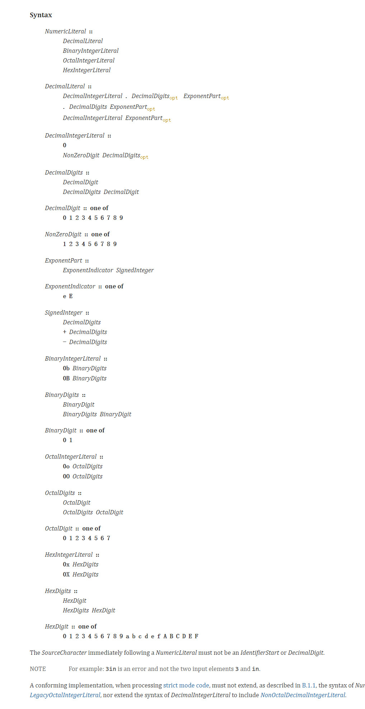
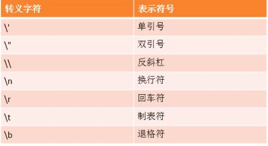
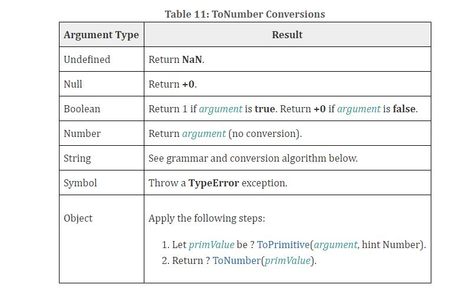

<!-- TOC -->

- [零 基础知识](#零-基础知识)
  - [1 单词](#1-单词)
  - [2 常见的语法名称的术语](#2-常见的语法名称的术语)
    - [2.1 Numeric Literals（数值语法）](#21-numeric-literals数值语法)
    - [重点掌握十进制的语法](#重点掌握十进制的语法)
    - [2.2 StringNumericLiteral](#22-stringnumericliteral)
  - [3 ES6中增加的内容](#3-es6中增加的内容)
    - [3.1 class](#31-class)
    - [3.2 浅拷贝和深拷贝](#32-浅拷贝和深拷贝)
    - [3.3 块级作用域](#33-块级作用域)
      - [3.3.1 let](#331-let)
        - [3.3.1.1 let 关键字的特点](#3311-let-关键字的特点)
        - [3.3.1.2 let 关键字与for](#3312-let-关键字与for)
      - [3.3.2 const](#332-const)
        - [3.3.2.1 特点](#3321-特点)
      - [3.3.3 块级作用域函数(有待查证)](#333-块级作用域函数有待查证)
    - [3.4 函数的参数的默认值](#34-函数的参数的默认值)
    - [3.5 对象字面量的扩展](#35-对象字面量的扩展)
      - [3.5.1 简洁属性(key值和value的变量名相同)](#351-简洁属性key值和value的变量名相同)
      - [3.5.2 简洁方法](#352-简洁方法)
      - [3.5.3 使用计算属性名](#353-使用计算属性名)
      - [3.5.4 关联原型](#354-关联原型)
    - [3.6 解构赋值](#36-解构赋值)
      - [3.6.1 数组解构](#361-数组解构)
      - [3.6.2 对象解构](#362-对象解构)
      - [3.6.3 解构赋值的两种写法](#363-解构赋值的两种写法)
        - [3.6.3.1 value变量未声明](#3631-value变量未声明)
        - [3.6.3.2 value变量已经声明(前面无需加声明类型)](#3632-value变量已经声明前面无需加声明类型)
      - [3.6.4 解构变量的数量](#364-解构变量的数量)
      - [3.6.5 重复赋值](#365-重复赋值)
      - [3.6.6 解构参数（当数组或对象的字面量作为形参）](#366-解构参数当数组或对象的字面量作为形参)
        - [3.6.6.1 解构的默认值和形参的默认值](#3661-解构的默认值和形参的默认值)
      - [3.6. 应用](#36-应用)
    - [3.6](#36)
    - [3.5 箭头函数](#35-箭头函数)
      - [3.5.1 箭头函数的特殊规则](#351-箭头函数的特殊规则)
        - [3.5.1.1 只有一个变量](#3511-只有一个变量)
        - [3.5.1.2 只有一行代码](#3512-只有一行代码)
      - [3.5.2 箭头this指向](#352-箭头this指向)
    - [3.6 展开运算符（...)](#36-展开运算符)
      - [3.6.1 ... 用于数组前](#361--用于数组前)
      - [3.6.2  ...用于函数的形参中](#362-用于函数的形参中)
    - [3.7 Array的扩展方法](#37-array的扩展方法)
      - [3.7.1 扩展运算符](#371-扩展运算符)
        - [3.7.1.1 扩展运算符可以讲数组拆分成以,分割的参数序列](#3711-扩展运算符可以讲数组拆分成以分割的参数序列)
        - [3.7.1.2 扩展运算符的应用](#3712-扩展运算符的应用)
          - [3.7.1.2.1 合并数组](#37121-合并数组)
          - [3.7.1.2.2 将伪数组或者可遍历对象转化为真正的数组](#37122-将伪数组或者可遍历对象转化为真正的数组)
      - [3.7.2 Array.from(arraylike,func?)](#372-arrayfromarraylikefunc)
      - [3.7.3 array.find(func(value, index, arr){})](#373-arrayfindfuncvalue-index-arr)
      - [3.7.4 array.findIndex(func(value, index, arr){})](#374-arrayfindindexfuncvalue-index-arr)
      - [3.7.5 array.includes(item)](#375-arrayincludesitem)
    - [3.8 String的扩展方法](#38-string的扩展方法)
      - [3.8.1 模板字符串](#381-模板字符串)
      - [3.8.1 string.startsWith(str), string.endsWith*(str)](#381-stringstartswithstr-stringendswithstr)
      - [3.8.2 string.repeat(n)](#382-stringrepeatn)
    - [3.9 Set数据结构](#39-set数据结构)
      - [3.9.1 Set数据结构的声明](#391-set数据结构的声明)
      - [3.9.2 Set数据结构的初始化](#392-set数据结构的初始化)
      - [3.9.3 Set数据结构的方法](#393-set数据结构的方法)
        - [3.9.3.1 set.size()](#3931-setsize)
        - [3.9.3.2 set.add(value)](#3932-setaddvalue)
        - [3.9.3.3 set.delete(value)](#3933-setdeletevalue)
        - [3.9.3.4 set.has(value)](#3934-sethasvalue)
        - [3.9.3.5 set.clear()](#3935-setclear)
      - [3.9.4 Set数据结构的遍历](#394-set数据结构的遍历)
      - [3.9.5 Set数据结构的简单应用](#395-set数据结构的简单应用)
        - [3.9.5.1 实现数组的去重](#3951-实现数组的去重)
  - [4 用于调试的一些函数](#4-用于调试的一些函数)
    - [4.1 console.log()与console.dir()](#41-consolelog与consoledir)
    - [4.2 instanceof](#42-instanceof)
  - [5 typeof,](#5-typeof)
- [一 认识javascript](#一-认识javascript)
  - [1 解释型语言](#1-解释型语言)
  - [2 动态类型语言](#2-动态类型语言)
  - [3 应用场景](#3-应用场景)
  - [4 编写位置](#4-编写位置)
    - [4.1 在HTML元素中直接执行js代码（不建议）](#41-在html元素中直接执行js代码不建议)
    - [4.2 书写到script标签中](#42-书写到script标签中)
    - [4.3 从外部引入js文件](#43-从外部引入js文件)
    - [4.4 注意事项](#44-注意事项)
  - [5 js代码的注释](#5-js代码的注释)
  - [6 js和浏览器的交互方式](#6-js和浏览器的交互方式)
  - [7 实现两个数字的交换](#7-实现两个数字的交换)
    - [7.1 使用临时变量temp](#71-使用临时变量temp)
    - [7.2 不使用临时变量（使用加减算法）](#72-不使用临时变量使用加减算法)
  - [8 数据类型](#8-数据类型)
    - [8.1 查看一个数据或变量的类型](#81-查看一个数据或变量的类型)
      - [8.2 typeof操作符](#82-typeof操作符)
    - [8.2 js的基本数字类型](#82-js的基本数字类型)
      - [8.2.1 数字型](#821-数字型)
          - [8.2.1.1 数字型的最大值和最小值](#8211-数字型的最大值和最小值)
          - [8.2.1.2 NAN](#8212-nan)
      - [8.2.2 字符串](#822-字符串)
      - [8.2.3 布尔型](#823-布尔型)
      - [8.2.4 未定义类型](#824-未定义类型)
      - [8.2.5 空类型 Null](#825-空类型-null)
        - [8.2.6 注意事项](#826-注意事项)
        - [8.2.7 变量存储的本质](#827-变量存储的本质)
  - [9 数据类型之间的转化](#9-数据类型之间的转化)
    - [9.1 转化为数字类型（ToNumber）](#91-转化为数字类型tonumber)
      - [9.1.1 Number(any)](#911-numberany)
      - [9.1.2 parseInt(s: string, radix?: number): number/parseFloat(string: string): number](#912-parseints-string-radix-number-numberparsefloatstring-string-number)
    - [9.2 转化成字符串串类型](#92-转化成字符串串类型)
      - [9.2.1 toString()](#921-tostring)
      - [9.2.2 string(any)](#922-stringany)
      - [9.2.3 和字符串进行拼接:变量+''（空字符串）](#923-和字符串进行拼接变量空字符串)
    - [9.3 转化成布尔类型](#93-转化成布尔类型)
      - [9.3.1 Boolean(any)](#931-booleanany)
  - [10 变量的自增和自减](#10-变量的自增和自减)
  - [11 关系运算赋全等和不全等](#11-关系运算赋全等和不全等)
    - [11.1 ===的比较（严格的相等）](#111-的比较严格的相等)
    - [11.2 !==的比较](#112-的比较)
    - [11.3 ==的比较（宽松的相等）](#113-的比较宽松的相等)
    - [11.4 !=的比较](#114-的比较)
  - [12 逻辑运算符的特别用法](#12-逻辑运算符的特别用法)
    - [12.1 与运算的特殊用法](#121-与运算的特殊用法)
    - [12.2 或运算的特殊用法](#122-或运算的特殊用法)
- [二 javascript的执行语句](#二-javascript的执行语句)
  - [1 代码块的理解](#1-代码块的理解)
  - [2 条件判断的隐式转化](#2-条件判断的隐式转化)
  - [3 断点调试](#3-断点调试)
  - [4 数组](#4-数组)
    - [4.1 创建数组](#41-创建数组)
      - [4.1.1 new创建数组](#411-new创建数组)
      - [4.1.2 利用数字字面量创建数组](#412-利用数字字面量创建数组)
    - [4.2 获取数组中的元素](#42-获取数组中的元素)
      - [4.2.1 数组的索引](#421-数组的索引)
    - [4.3 遍历数组](#43-遍历数组)
      - [4.3.1 通过循环遍历数组](#431-通过循环遍历数组)
      - [4.3.2](#432)
      - [4.3.3](#433)
    - [4.4 数组的属性](#44-数组的属性)
      - [4.4.1 length](#441-length)
    - [4.5 数组的方法](#45-数组的方法)
    - [4.5.1 新增数组元素](#451-新增数组元素)
      - [4.5.1.1 修改length值](#4511-修改length值)
      - [4.5.1.2 修改索引号，追加数组元素](#4512-修改索引号追加数组元素)
      - [4.5.1.2 修改索引号，追加数组元素](#4512-修改索引号追加数组元素-1)
    - [4.6 注意事项](#46-注意事项)
      - [4.6.1 数组名的赋值](#461-数组名的赋值)
  - [5 函数](#5-函数)
    - [5.1 函数的定义](#51-函数的定义)
      - [5.1.1 函数的命名写法（命名函数）](#511-函数的命名写法命名函数)
      - [5.1.2 函数的表达式写法（匿名函数）](#512-函数的表达式写法匿名函数)
      - [5.1.3 利用new Function()定义函数](#513-利用new-function定义函数)
      - [5.1.4 函数的三角关系](#514-函数的三角关系)
      - [5.1.5 函数的属性](#515-函数的属性)
    - [5.2 函数的参数传递](#52-函数的参数传递)
      - [5.2.1 形参](#521-形参)
      - [5.2.2 实参](#522-实参)
      - [5.2.3 形参变量个数和实参变量个数的关系](#523-形参变量个数和实参变量个数的关系)
      - [5.2.4 arguments对象](#524-arguments对象)
        - [5.2.4.1 特点1](#5241-特点1)
        - [5.2.4.2 特点2](#5242-特点2)
        - [5.2.4.3 特点3](#5243-特点3)
      - [5.2.5 参数的值传递和引用传递](#525-参数的值传递和引用传递)
        - [5.2.4.1 值传递](#5241-值传递)
        - [5.2.4.2 引用传递](#5242-引用传递)
    - [5.3 函数的调用](#53-函数的调用)
      - [5.3.1 函数的调用栈](#531-函数的调用栈)
      - [5.3.2 普通函数的调用](#532-普通函数的调用)
      - [5.3.2 对象函数的调用](#532-对象函数的调用)
      - [5.3.3 构造函数的调用](#533-构造函数的调用)
      - [5.3.4 绑定事件函数的调用](#534-绑定事件函数的调用)
      - [5.3.5 立即调用函数的写法](#535-立即调用函数的写法)
      - [5.3.5.1 函数声明的立即调用函数写法](#5351-函数声明的立即调用函数写法)
      - [5.3.5.2 函数的表达式写法可以在后面增加参数列表从而实现函数的立即实行](#5352-函数的表达式写法可以在后面增加参数列表从而实现函数的立即实行)
    - [5.4 函数的返回值](#54-函数的返回值)
    - [5.5 函数内this指针的指向问题](#55-函数内this指针的指向问题)
    - [5.6 改变函数内部的this指向](#56-改变函数内部的this指向)
      - [5.6.1 call()](#561-call)
      - [5.6.2 apply()](#562-apply)
      - [5.6.3 bind()](#563-bind)
- [三 javascript的高级](#三-javascript的高级)
  - [1 对象](#1-对象)
    - [1.1 面向对象的编程](#11-面向对象的编程)
      - [1.1.1 面向过程的编程(POP)(Process-oriented programming)](#111-面向过程的编程popprocess-oriented-programming)
      - [1.1.2 现象对象编程(OOP)(Oject-oriented programming)](#112-现象对象编程oopoject-oriented-programming)
    - [1.2 面向对象编程的思维特点](#12-面向对象编程的思维特点)
    - [1.3 对象的基本组成](#13-对象的基本组成)
      - [1.3.1 属性](#131-属性)
      - [1.3.2  方法](#132-方法)
    - [1.3 类的创建(实例对象)](#13-类的创建实例对象)
      - [1.3.1 在ES6中，使用class创建类](#131-在es6中使用class创建类)
      - [1.3.2 利用new Object()创建对象](#132-利用new-object创建对象)
      - [1.3.3 利用对象字面量创建对象](#133-利用对象字面量创建对象)
      - [1.3.4 利用构造函数创建对象（ES6之前构造函数的方法）](#134-利用构造函数创建对象es6之前构造函数的方法)
        - [1.3.4.1 注意事项](#1341-注意事项)
        - [1.3.4.2 构造函数构建类的成员类型(实例成员，静态成员)](#1342-构造函数构建类的成员类型实例成员静态成员)
        - [1.3.4.3 构造函数构建类存在的问题](#1343-构造函数构建类存在的问题)
        - [1.3.4.4 解决构造函数构建类造成内存浪费的问题-原型对象](#1344-解决构造函数构建类造成内存浪费的问题-原型对象)
        - [1.3.4.5 构造函数构建类的注意事项](#1345-构造函数构建类的注意事项)
        - [1.3.4.5 构造函数构建实例对象的原型对象](#1345-构造函数构建实例对象的原型对象)
        - [1.3.4.6 __proto__和prototype的构造函数(constructor)](#1346-__proto__和prototype的构造函数constructor)
        - [1.3.4.7 构造函数，原型对象，对象实例的关系](#1347-构造函数原型对象对象实例的关系)
      - [1.3.5 原型链](#135-原型链)
      - [1.3.6 this指针的指向](#136-this指针的指向)
        - [1.3.6.1 构造函数](#1361-构造函数)
        - [1.3.6.2 原型对象里面的this（利用原型对象共享方法）](#1362-原型对象里面的this利用原型对象共享方法)
      - [1.3.5 在类中添加方法](#135-在类中添加方法)
    - [1.4 类的继承](#14-类的继承)
      - [1.4.1 ES6中的extends继承](#141-es6中的extends继承)
        - [1.4.1.1 extends](#1411-extends)
        - [1.4.1.2 super()](#1412-super)
        - [1.4.1.3 就近原则](#1413-就近原则)
        - [1.4.1.4 子类继承父类的理解](#1414-子类继承父类的理解)
      - [1.4.2 通过构造函数+原型对象模拟实现继承](#142-通过构造函数原型对象模拟实现继承)
        - [1.4.2.1 call()](#1421-call)
        - [1.4.2.2 借用构造函数继承父类的属性](#1422-借用构造函数继承父类的属性)
        - [1.4.2.3 借用原型对象继承父类的方法](#1423-借用原型对象继承父类的方法)
          - [1.4.2.3.1 理解区别](#14231-理解区别)
    - [1.5 类的默认属性和方法](#15-类的默认属性和方法)
      - [1.5.1 constructor()](#151-constructor)
    - [1.6 对象的访问及修改](#16-对象的访问及修改)
      - [1.6.1 object.key](#161-objectkey)
      - [1.6.2 object[str];](#162-objectstr)
      - [1.6.3 对象的遍历](#163-对象的遍历)
        - [1.6.3.1 使用for...in...进行遍历](#1631-使用forin进行遍历)
    - [1.7 注意](#17-注意)
  - [2 ES5中新增的方法](#2-es5中新增的方法)
    - [2.1 数组中新增的方法](#21-数组中新增的方法)
        - [2.1.1 迭代遍历的方法](#211-迭代遍历的方法)
          - [2.1.1.1 forEach()方法](#2111-foreach方法)
          - [2.1.1.2 map()方法](#2112-map方法)
          - [2.1.1.3 filter()方法](#2113-filter方法)
          - [2.1.1.4 some()方法](#2114-some方法)
          - [2.1.1.5 every()方法](#2115-every方法)
    - [2.2 字符串中新增的方法](#22-字符串中新增的方法)
    - [2.2.1 trim()](#221-trim)
    - [2.3 对象新增的方法](#23-对象新增的方法)
    - [2.3.1 keys(obj)](#231-keysobj)
    - [2.3.2 Object.defineProperty(obj, prop, descriptor)](#232-objectdefinepropertyobj-prop-descriptor)
  - [3 js的严格模式](#3-js的严格模式)
    - [3.2 严格模式中的变化](#32-严格模式中的变化)
      - [3.2.1 变量的规定](#321-变量的规定)
      - [3.2.2 严格模式下this指向问题](#322-严格模式下this指向问题)
      - [3.2.3 函数的变化](#323-函数的变化)
  - [4 高阶函数](#4-高阶函数)
    - [5 闭包](#5-闭包)
      - [5.1 变量的作用域](#51-变量的作用域)
      - [5.2 闭包的定义（closure)](#52-闭包的定义closure)
      - [5.3 闭包的作用](#53-闭包的作用)
      - [5.4 闭包的案例](#54-闭包的案例)
      - [5.5 闭包的思考题](#55-闭包的思考题)
    - [6 递归函数](#6-递归函数)
    - [7 深复制和浅复制](#7-深复制和浅复制)
- [四 正则表达式](#四-正则表达式)
  - [1 正则表达式的定义](#1-正则表达式的定义)
  - [2 正则表达是的作用](#2-正则表达是的作用)
  - [3 正则表达式的特殊字符](#3-正则表达式的特殊字符)
    - [3.1 边界字符 ^ $](#31-边界字符--)
    - [3.2 字符类 []](#32-字符类-)
    - [3.3 量词符](#33-量词符)
    - [3.4 预定义类](#34-预定义类)
  - [4 正则表达式的创建](#4-正则表达式的创建)
    - [4.1 通过调用RegExp构造函数的创建](#41-通过调用regexp构造函数的创建)
    - [4.2 通过字面量创建](#42-通过字面量创建)
  - [5 正则表达式的使用](#5-正则表达式的使用)
    - [5.1 test()](#51-test)
    - [5.2 replace()](#52-replace)
    - [5.2 常用的正则表达式](#52-常用的正则表达式)
      - [5.2.1 用户名验证](#521-用户名验证)
- [五 js的dom操作](#五-js的dom操作)
  - [1 DOM(document Object Model)](#1-domdocument-object-model)
    - [1.1 DOM树](#11-dom树)
      - [1.1.1 节点(node)](#111-节点node)
        - [1.1.1.1 分类](#1111-分类)
          - [1.1.1.1.1 文档节点(document)](#11111-文档节点document)
        - [1.1.1.2 节点的属性](#1112-节点的属性)
    - [1.2 DOM的方法](#12-dom的方法)
      - [1.2.1 获取元素节点对象（对象的查询）](#121-获取元素节点对象对象的查询)
        - [1.2.1.1 document.getElementById(str)](#1211-documentgetelementbyidstr)
        - [1.2.1.2 document.getElementsByTagName(str)](#1212-documentgetelementsbytagnamestr)
        - [1.2.1.3 document.getElementsByName(str)](#1213-documentgetelementsbynamestr)
        - [1.2.1.4 document.body](#1214-documentbody)
        - [1.2.1.5 documnet.documentElement](#1215-documnetdocumentelement)
        - [1.2.1.6 document.all](#1216-documentall)
        - [1.2.1.7 document.getElementClassName(str)](#1217-documentgetelementclassnamestr)
        - [1.2.1.8 elementObject.getElementsByTagName(str)](#1218-elementobjectgetelementsbytagnamestr)
        - [1.2.1.9 elementObject.childNodes](#1219-elementobjectchildnodes)
        - [1.2.1.10 elementObject.firstChild](#12110-elementobjectfirstchild)
        - [1.2.1.11 elementObject.lastChild](#12111-elementobjectlastchild)
        - [1.2.1.12 elementObject.children](#12112-elementobjectchildren)
        - [1.2.1.13 elementObject.firstElementChild](#12113-elementobjectfirstelementchild)
        - [1.2.1.14 elementObjectNode.lastElementChild](#12114-elementobjectnodelastelementchild)
        - [1.2.1.15 elementObject.parentNode](#12115-elementobjectparentnode)
        - [1.2.1.16 elementObject.previousSibling](#12116-elementobjectprevioussibling)
        - [1.2.1.17 elementObject.nextSibling](#12117-elementobjectnextsibling)
        - [1.2.1.18 elementObject.previousElementSibling](#12118-elementobjectpreviouselementsibling)
        - [1.2.1.19 elementObject.nextElementSibling](#12119-elementobjectnextelementsibling)
        - [1.2.1.20 elementObject.querySelector(cssSelector) (常用)](#12120-elementobjectqueryselectorcssselector-常用)
        - [1.2.1.21 elementObject.querySelectorAll(cssSelector) (常用)](#12121-elementobjectqueryselectorallcssselector-常用)
      - [1.2.2 获取元素节点对象的文本内容](#122-获取元素节点对象的文本内容)
        - [1.2.2.1 元素对象.innerHTML](#1221-元素对象innerhtml)
        - [1.2.2.2 元素对象.innerText](#1222-元素对象innertext)
        - [1.2.2.3 元素对象.firstChild.nodeValue（少用）](#1223-元素对象firstchildnodevalue少用)
      - [1.2.3 获取元素节点对象的行内样式属性值](#123-获取元素节点对象的行内样式属性值)
        - [1.2.3.1 class属性值的获取](#1231-class属性值的获取)
        - [1.2.3.2 常见的元素节点行内样式属性值的获取](#1232-常见的元素节点行内样式属性值的获取)
          - [1.2.3.2.1 input输入框中的文本内容](#12321-input输入框中的文本内容)
          - [1.2.3.2 获取元素节点对象的内联样式](#1232-获取元素节点对象的内联样式)
        - [1.2.3.3 获取元素节点对象的样式表中的样式](#1233-获取元素节点对象的样式表中的样式)
          - [1.2.3.3.1 由于兼容性，需要自定义一个函数](#12331-由于兼容性需要自定义一个函数)
          - [1.2.3.3.2 getComputedStyle(elementObject, pseudoElements)](#12332-getcomputedstyleelementobject-pseudoelements)
          - [1.2.3.3.3 objectElement.currentStyle.样式名](#12333-objectelementcurrentstyle样式名)
      - [1.2.4 元素对象的增删改](#124-元素对象的增删改)
        - [1.2.4.1 以父元素为对象的操作](#1241-以父元素为对象的操作)
          - [1.2.4.1.1 document.createElement(tagStr)](#12411-documentcreateelementtagstr)
          - [1.2.4.1.2 document.createTextNode(str)](#12412-documentcreatetextnodestr)
          - [1.2.4.1.3 fatherNodeObject.appendChild(childNodeObject)](#12413-fathernodeobjectappendchildchildnodeobject)
          - [1.2.4.1.4 fatherNodeObject.insertBefore(newchildObject, oldchildObject)](#12414-fathernodeobjectinsertbeforenewchildobject-oldchildobject)
          - [1.2.4.1.5 fatherNodeObject.replaceChild(newchildObject, oldchildObject)](#12415-fathernodeobjectreplacechildnewchildobject-oldchildobject)
          - [1.2.4.1.6 fatherNodeObject.removeChild(childObject)](#12416-fathernodeobjectremovechildchildobject)
          - [1.2.4.1.7 元素对象的增加的步骤（使用createElement）](#12417-元素对象的增加的步骤使用createelement)
          - [1.2.4.1.8 使用innerHTML对元素进行增加](#12418-使用innerhtml对元素进行增加)
          - [1.2.4.1.9 两种方式结合对元素进行添加(推荐)](#12419-两种方式结合对元素进行添加推荐)
          - [1.2.4.1.10 元素对象的删除的步骤（经常使用的）](#124110-元素对象的删除的步骤经常使用的)
    - [1.3 常见的DOM元素的属性padding](#13-常见的dom元素的属性padding)
      - [1.3.1 elementObject.clientWidth, elementObject.clientHeight](#131-elementobjectclientwidth-elementobjectclientheight)
      - [1.3.2 elementObject.offsetWidth, elementObject.offsetHeight](#132-elementobjectoffsetwidth-elementobjectoffsetheight)
      - [1.3.3 elementObject.offsetParent](#133-elementobjectoffsetparent)
      - [1.3.4 elementObject.offset[Left,right], elementObject.offset[Top,buttom]](#134-elementobjectoffsetleftright-elementobjectoffsettopbuttom)
      - [1.3.5 elementObject.scrollWidth, elementObject.scrollHeight](#135-elementobjectscrollwidth-elementobjectscrollheight)
      - [1.3.6 elementObject.scrollLeft, elementObject.scrollTop](#136-elementobjectscrollleft-elementobjectscrolltop)
      - [1.3.7 elementObject.scrollHeight, elementObject.scrollTop和elementObject.clientHeight的结合使用](#137-elementobjectscrollheight-elementobjectscrolltop和elementobjectclientheight的结合使用)
    - [1.4 基础练习](#14-基础练习)
      - [1.3.1 全选择框的练习](#131-全选择框的练习)
  - [2 事件](#2-事件)
    - [2.1 事件的写法](#21-事件的写法)
      - [2.1.1 在html标签中加上相应的事件属性和js代码](#211-在html标签中加上相应的事件属性和js代码)
      - [2.1.2 在js中对相应的对象以绑定处理函数的形式来响应事件](#212-在js中对相应的对象以绑定处理函数的形式来响应事件)
    - [2.2 事件对象](#22-事件对象)
      - [2.2.1 事件定义和用法](#221-事件定义和用法)
      - [2.2.2 事件的属性](#222-事件的属性)
        - [2.2.2.1 event.clientX event.clientY](#2221-eventclientx-eventclienty)
        - [2.2.2.2 event.pageX event.pageY](#2222-eventpagex-eventpagey)
        - [2.2.2.3 event.cancelBubble](#2223-eventcancelbubble)
        - [2.2.2.4 event.target](#2224-eventtarget)
        - [2.2.2.5 event.wheelDelta](#2225-eventwheeldelta)
        - [2.2.2.6 event.[altKey, ctrlKey, shiftKey]](#2226-eventaltkey-ctrlkey-shiftkey)
        - [2.2.2.7 event.keyCode](#2227-eventkeycode)
      - [2.2.3 事件的冒泡(bubble)](#223-事件的冒泡bubble)
        - [2.2.3.1 event.cancelBubble = true;](#2231-eventcancelbubble--true)
        - [2.2.3.2 事件冒泡的应用--事件的委派](#2232-事件冒泡的应用--事件的委派)
    - [2.3 事件的绑定](#23-事件的绑定)
      - [2.3.1 elementObject.on[eventName] = function(?event) {}(触发函数)](#231-elementobjectoneventname--functionevent-触发函数)
      - [2.3.2 ElementObject.addEventListener(eventName:string, func, [true || false])](#232-elementobjectaddeventlistenereventnamestring-func-true--false)
      - [2.3.3 ElementObject.attachEvent(on[eventName]:string, func)](#233-elementobjectattacheventoneventnamestring-func)
      - [2.3.4 兼容浏览器写法](#234-兼容浏览器写法)
    - [2.5 事件的取消](#25-事件的取消)
      - [2.5.1 取消事件的绑定](#251-取消事件的绑定)
        - [2.5.1.1 elementObj.on[eventName] = null;](#2511-elementobjoneventname--null)
      - [2.5.2 取消事件中浏览器的默认行为](#252-取消事件中浏览器的默认行为)
        - [2.5.2.1 return false](#2521-return-false)
        - [2.5.2.2 event.preventDefault();](#2522-eventpreventdefault)
    - [2.6 事件的传播](#26-事件的传播)
      - [2.6.1 关于事件的传播的历史](#261-关于事件的传播的历史)
      - [2.6.2 事件的传播的理解](#262-事件的传播的理解)
      - [2.6.3 addEventListener的第三个参数](#263-addeventlistener的第三个参数)
    - [2.7 常用的事件](#27-常用的事件)
      - [2.7.1 elementObject.onmousedown](#271-elementobjectonmousedown)
      - [2.7.2 elementObject.onmousemove](#272-elementobjectonmousemove)
      - [2.7.3 elementObject.onmouseup](#273-elementobjectonmouseup)
      - [2.7.4 elementObject.onmousewheel](#274-elementobjectonmousewheel)
      - [2.7.6 elementObject.onkeydown](#276-elementobjectonkeydown)
      - [2.7.7 elementObject.onkeyup](#277-elementobjectonkeyup)
    - [2.8 事件的组合应用](#28-事件的组合应用)
      - [2.8.1 实现元素的拖拽](#281-实现元素的拖拽)
        - [2.8.1.1](#2811)
        - [2.8.1.2 拖拽时鼠标位于左上角](#2812-拖拽时鼠标位于左上角)
        - [2.8.1.3 拖拽位置位于鼠标位置刚开始点击的位置](#2813-拖拽位置位于鼠标位置刚开始点击的位置)
        - [2.8.1.4 取消浏览器的默认行为造成拖拽的bug](#2814-取消浏览器的默认行为造成拖拽的bug)
        - [2.8.1.5 总结一个拖拽函数](#2815-总结一个拖拽函数)
      - [2.8.2 滚轮事件的应用](#282-滚轮事件的应用)
      - [2.8.3 键盘事件的应用](#283-键盘事件的应用)
        - [2.8.3.1 实现两个按键的判断](#2831-实现两个按键的判断)
        - [2.8.3.2 限制input框的输入内容](#2832-限制input框的输入内容)
        - [2.8.3 div元素的移动](#283-div元素的移动)
  - [3 文档的加载](#3-文档的加载)
    - [3.1 浏览器加载页面的顺序](#31-浏览器加载页面的顺序)
      - [3.1.1 onload事件](#311-onload事件)
- [五 js的bom操作](#五-js的bom操作)
  - [1 BOM(brower Object Model)](#1-bombrower-object-model)
  - [2 BOM的对象](#2-bom的对象)
    - [2.1 Window](#21-window)
      - [2.1.1 Window方法](#211-window方法)
        - [2.1.1.1 alert(str)](#2111-alertstr)
        - [2.1.1.2 prompt(str)](#2112-promptstr)
        - [2.1.1.3 comfirm(str)</td>](#2113-comfirmstrtd)
        - [2.1.1.4 setInterval(callback, time)](#2114-setintervalcallback-time)
        - [2.1.1.5 clearInterval(intervalId)](#2115-clearintervalintervalid)
        - [2.1.1.6 setTimeout(callback, time)](#2116-settimeoutcallback-time)
        - [2.1.1.7 clearTimeout(timeoutId)](#2117-cleartimeouttimeoutid)
        - [2.1.1.8 延时调用和定时调用的关系](#2118-延时调用和定时调用的关系)
    - [2.2 Navigator](#22-navigator)
      - [2.2.3 Navigator的属性](#223-navigator的属性)
        - [2.2.3.1 navigator.userAgent](#2231-navigatoruseragent)
    - [2.3 Location](#23-location)
      - [2.3.1 localtion](#231-localtion)
        - [2.3.1.1 location实现元素对象的类似a标签的属性](#2311-location实现元素对象的类似a标签的属性)
      - [2.3.2 location的属性](#232-location的属性)
      - [2.3.3 Location的方法](#233-location的方法)
        - [2.3.3.1 location.assign(URL);](#2331-locationassignurl)
        - [2.3.3.2 location.reload();](#2332-locationreload)
        - [2.3.3.3 location.replace(URL)](#2333-locationreplaceurl)
    - [2.4 History](#24-history)
      - [2.5 History的属性](#25-history的属性)
        - [2.5.1 history.length](#251-historylength)
      - [2.6 History的方法](#26-history的方法)
        - [2.6.1 history.back()](#261-historyback)
        - [2.6.2 history.forward()](#262-historyforward)
        - [2.6.3 history.go(n)](#263-historygon)
    - [2.5 Screen](#25-screen)
    - [2.6 Bom的应用](#26-bom的应用)
      - [2.6.1 图片切换](#261-图片切换)
      - [2.6.2 解决div移动第一个键和第二个键之间的延迟问题（防误触）](#262-解决div移动第一个键和第二个键之间的延迟问题防误触)
      - [2.6.3 构造一个简单的动画函数](#263-构造一个简单的动画函数)
      - [2.6.4 轮播图效果的实现](#264-轮播图效果的实现)

<!-- /TOC -->

<style>
 table {
   border-collapse: collapse;
 }
 tr, td{
   border: 1px solid #000000;
 }
</style>

# 零 基础知识
## 1 单词
<table>
  <tr>
    <td>parse</td>
    <td>解析</td>
  </tr>
  <tr>
    <td>radix</td>
    <td>基数</td>
  </tr>
  <tr>
    <td>r</td>
    <td>radius 半径</td>
  </tr>
  <tr>
    <td>invoke</td>
    <td>调用</td>
  </tr>
  <tr>
    <td>orient</td>
    <td>朝向</td>
  </tr>
  <tr>
    <td>extend</td>
    <td>延伸，扩展</td>
  </tr>
  <tr>
    <td>derive</td>
    <td>源于，派生</td>
  </tr>
  <tr>
    <td>closure</td>
    <td>闭包</td>
  </tr>
  <tr>
    <td>Regular Expression</td>
    <td>正则表达式</td>
  </tr>
  <tr>
    <td>sibling</td>
    <td>兄弟姐妹</td>
  </tr>
  <tr>
    <td>previous</td>
    <td>以前的</td>
  </tr>
  <tr>
    <td>interval</td>
    <td>间隔</td>
  </tr>
  <tr>
    <td>navigator</td>
    <td>导航员(浏览器类型)</td>
  </tr>
</table>

## 2 常见的语法名称的术语
### 2.1 Numeric Literals（数值语法）
- <span id="numeraic-literal">了解什么形式的才是js中的数值语法</span>
- 
- 注意事项
  - DecimalIntegerLiteral
    - 0
    - 第一位非0的整数
  - DecimalDights
    - 由整数构成（没要求第一位非0）
  - DecimalDight
    - 差一个s
    - 0~9任意一个
  - ExpontPart
    - 指数部分
    - 科学计数法
### 重点掌握十进制的语法
- 
### 2.2 StringNumericLiteral
- strnumberliteral
- <span id="str_literal">了解什么是字符型的数值语法</span>
- 
- 注意事项（与正常的数值语法相比）
  - 左右可以包含任意数量的空格或者换行符，但转化的时候可以被忽略
  - 整数的左侧可以有任意数量的0，转化时会被忽略
  - 可以用\+、\-号表示符号
  - 若字符串为空或者只有空格，则会返回+0
  - 字符串型有Infinity和-Infinity，<a href="#numeraic-literal">Numeric Literals</a>
## 3 ES6中增加的内容
### 3.1 class
- ES6中增加了类的概念，可以使用class关键词声明一个类
- 对于类的继承，ES6提供了extends关键词来进行类的继承
### 3.2 浅拷贝和深拷贝
- 浅拷贝
  - Object.assign(target, ...source);
### 3.3 块级作用域
- {...}代表一个块级作用域
#### 3.3.1 let
##### 3.3.1.1 let 关键字的特点
- 块级作用域
- 不存在变量提升
- TDZ错误（暂时性死区错误）
```javascript
  {
    console.log(a); // 1
    var a = 2;
  }
  console.log(a)    // 2
  // undefined
  // 2
  // 1 说明a已经被声明，所以var有变量提升
  // 2 说明var不存在块级作用域
  {
    console.log(b);
    let b = 2;    // 3
  }
    console.log(b)  // 4
    // Reference Error
    // Reference Error
    // 3 说明let不存在变量提升，此时为TDZ错误
    // 4 说明let为块级作用域，块外无法访问块内的变量定义
```
##### 3.3.1.2 let 关键字与for
- 在ES6中，计数变量一般使用let
```javascript
  var arr = [];
  for(var i = 0;i < 2;i ++){
    arr[i] = function() {
      console.log(i);
    }
  }
  arr[0]();
  arr[1]();
  // 2 2
  var arr = [];
  for(let i = 0;i < 2;i ++){
    arr[i] = function() {
      console.log(i);
    }
  }
  arr[0]();
  arr[1]();
  // 0 1
```
#### 3.3.2 const
- 声明常量，常量就是值（内存的栈中）不能变化的量
##### 3.3.2.1 特点
- 具有块级作用域
- 没有变量提升
- 声明常量时必须赋值
- 常量赋值后，值不能修改
  - 基本数据类型
    - 字面值不能修改
  - 复合数据类型
    - 对应的存储地址不能改，但结构内的内容是可以改的
    - 理解
      - const指的是不能修改内存中对应栈的值，而复杂数据类型中对应栈的值存储的是对应堆中的数据的地址，即数据实际上是存在内存的堆中，所以可以修改，但是复杂数据类型不能重新赋值
#### 3.3.3 块级作用域函数(有待查证)
- 在ES6前，函数声明不存在块级作用域
- 在ES6后，函数的声明具有块级作用域，同时还有变量提升
```javascript
  {
    function foo() {
      console.log("A");
    }
    foo();
  }
  foo();
  // A
  // ReferenceError
```
### 3.4 函数的参数的默认值
- 在ES6前，函数的参数默认值需要通过||来使得参数取到默认值
- 使用参数值的注意事项
  - 当对应的实参为空或者是undefined时，使用默认的参数
  - 当对应的实参为null时，会强制转化为0
- 函数的参数可以作用一个作用域
```javascript
// ES6前
  function foo(x, y) {
    x = x != undefined ? x : 31;
    y = y != undefined ? y : 1;
    console.log(x + y); 
  }
  foo(undefined, 3);
  // 34
// ES6
  function foo(x = 31, y = 1) {
    console.log(x + y); 
  }
    foo(undefined, 3);
  // 34
```
### 3.5 对象字面量的扩展
#### 3.5.1 简洁属性(key值和value的变量名相同)
- 前提：key值和value的变量名相同
```javascript
  var x = 2, y = 3;
// 非简洁写法：
  var o = {
    x: x,
    y: y
  }
// 间接写法
  var o = {
    x, 
    y
  }

```
#### 3.5.2 简洁方法
- 注意：
  - 简洁方法对应的是未命名的方法，即x,y,z并不是它们函数的名称，而是它们的key值
    - 无法直接使用函数名称来进行调用，需要在前面增加对象名或者this进行调用
      - o.x()
      - this.x()
  - 如果要使用递归的方法，最好采用有有名称函数的调用。
```javascript
// 老方法
  var o = {
    x: function() {
      // ...
    },
    y: function() {
      // ...
    }
    z: *function() {
      // ...
    }
  }
// ES6
  var o = {
    x() {
      // ...
    },
    y() {
      // ...
    }
    * z() {
      // ...
    }//生成器
  }
```
```javascript
  var o = {
    x: function x(val) {
      if(val < 0) 
        return 0;
      else {
        return val + x(val - 1)
      }
    } 
  }
  // 函数内的x函数指的就是本身
```
#### 3.5.3 使用计算属性名
- 在ES6以前，若想要以一个计算属性名作为key，则需要单独累出
- ES6提供了可以在对象字面量内部使用定义计算属性名
  - []内部使用计算表达式作为属性值，也可以是计算属性值([ Symbol.iterator ])
```javascript
// ES6之前
  var prefix = "user_";
  var o = {
  baz: function(..){ .. }
  };
  o[ prefix + "foo" ] = function(..){ .. };
  o[ prefix + "bar" ] = function(..){ .. };
// ES6
  var prefix = "user_";
  var o = {
  baz: function(..){ .. },
    [ prefix + "foo" ]: function(..){ .. },
    [ prefix + "bar" ]: function(..){ .. }
  }; 
```
#### 3.5.4 关联原型
- Object.setPrototypeOf(son, father)
  - 使得son的原型为son
```javascript
  
```
### 3.6 解构赋值
- 方便从数组，对象中提取值
- 特点
  - 数组或对象的字面量写在赋值函数的前面（左边）
  - 数组或对象的字面量作为形参
#### 3.6.1 数组解构
- 变量的位置和数组值的位置一一对应
```javascript
  let arr = [1, 3, 4]
  let [a, b, c] = arr;
  // 1， 3，4
```
#### 3.6.2 对象解构
- 从被解构对象中找到与key值相匹配的value值，并进行赋值
```javascript
// 简洁属性的方法
  let person = {name: "bulumrcai", age: 23, height: 175}
  let {age, name, height} = person;
  //age 23 name bulumrcai height 175

// 正常匹配的方法
  let person = {name: "bulumrcai", age: 23, height: 175}
  let {name: myname} = person;
  // myname: bulumrcai
```
#### 3.6.3 解构赋值的两种写法
##### 3.6.3.1 value变量未声明
```javascript
  let arr = [1, 3, 4]
  let [a, b, c] = arr;

  let person = {name: "bulumrcai", age: 23, height: 175}
  let {age, name, height} = person;
```
##### 3.6.3.2 value变量已经声明(前面无需加声明类型)
```javascript
  let a, b,c;
  let arr =[1, 3, 4];
  [a, b, c] = arr;

  let myName;
  let person = {name: "bulumrcai", age: 23, height: 175};
  {name: myName} = person;
```
#### 3.6.4 解构变量的数量
- 太少
- 刚刚好
- 太多
  - 多出的变量会被赋值为undefined
#### 3.6.5 重复赋值
- 当对象出现复数个相同的key值，会对其value相应的赋值
```javascript
  var a = {b: 4};
  var {b: c, b: d} = a;
  console.log(c, d);
  // 4 4
```
#### 3.6.6 解构参数（当数组或对象的字面量作为形参）
```javascript
  function f3([ x, y, ...z], ...w) {
    console.log( x, y, z, w );
  }
  f3( [] ); // undefined undefined [] []
  f3( [1,2,3,4], 5, 6 ); // 1 2 [3,4] [5,6]
```
##### 3.6.6.1 解构的默认值和形参的默认值
- 学会区分
- 解构的默认值：
  - 当被解构的数组/对象没有相应值触发
- 形参的默认值：
  - 当形参为空或者为undefined触发
```javascript
  function f6({ x = 10 } = {}, { y } = { y: 10 }) {
    console.log( x, y );
  }
  f6(); 
  /**
    * 没有传入参数，则使用形参的默认值即
    * {x = 10} = {}, {y} = {y: 10}
    * 从{}无法找到x对应的value值，所以使用解构的默认值即x = 10
    * {y: 10}找到y对应的值，所以y=10
  */
  f6( {}, {} ); 
  /**
    * 传入参数{}，{}
    * {x = 10} = {}, {y} = {}
    * 从{}无法找到x对应的value值，所以使用解构的默认值即x = 10
    * {}无法找到y对应的值，又没有解构的默认值，所以y=undefined
  */

```
#### 3.6. 应用
- 使用实现不使用临时变量使两个变量的值交换
```javascript
  var x = 10, y = 20;
  [y, x] = [x, y];
  // 解释
  // 赋值表达式右边先执行，则有新构建一个数组[10, 20];
  // 左边为数组的形式，显然使用了数组的解构，所以对应位置被赋予对对应的值，即
  // y = 10, x = 20;
```
- 与扩展运算符结合实现截取数组
```javascript
  var a = [1,3,4,6,7]
  var [,,...b] = a;
  console.log(b);
  // [4, 6, 7]
```
- 与形参的默认值结合
  - 当对应的参数的值为undefined时，会使用默认的参数
```javascript
  var arr1 = [1, 2, 3, 12];
  var arr2 = [4, 5, 6];
  var [a = 3, b = 6, c = 9, d = 12 ] = arr1;
  var [ x = 5, y = 10, z = 15, w = 20] = arr2;
  console.log(a, b, c, d);
  console.log(x, y, z, w);
  //  1 2 3 12 
  // 4 5 6 20
```

### 3.6 
### 3.5 箭头函数
``` javascript
  (argv1, argv2...) => {};
  // 相当于
  function(argv1, argv2...) {};
```
- 通常会把箭头函数赋值给一个变量，然后再进行调用
- 特点
  - 当函数没有返回值的时候，会默认返回undefined
- 目的
  - 简化匿名函数定义的语法
#### 3.5.1 箭头函数的特殊规则
##### 3.5.1.1 只有一个变量
- 括号可以省略
```javascript
  let fn = value => {console.log(value)}
```
##### 3.5.1.2 只有一行代码
- 大括号可以省略
- 并默认返回对应表达式的执行结果：如布尔表达式则返回true或false
```javascript
  let = value => value > 100;
```
#### 3.5.2 箭头this指向
- 箭头函数不绑定this，this关键字将指向定义位置中的this
  - 能产生局部作用域的函数中定义
```javascript
  obj = {name: "bulumrcai"};
  function fn() {
    console.log(this);
    return () => console.log(this)
  }

  const fun = fn.call(obj);
  fun();
  // obj obj

```
  - 在不能产生局部作用域的对象定义(this并不是指向对象的this)
```javascript
  obj = {
          name: "bulumrcai"
          sayhello: () => console(this.age)
        };
  // undefined this指向的是window
```
### 3.6 展开运算符（...)
- rest/spread --> 展开/收集运算符
#### 3.6.1 ... 用于数组前
- 展开
- 实际上是iterable类型,作用是将变量展开为各个独立的值
  - ...[1,2,4] => 1, 2, 4
- 作用
  - 用于实参的输入
  - 用于合并数组(基本代替了concat函数的作用)
```javascript
// 用于合并数组
  var a = [2, 3, 4];
  var b = [1, ...a, 5];
  console.log(b);
  // [1, 2, 3 ,4 ,5]
```
#### 3.6.2  ...用于函数的形参中
- 剩余
- 这种参数被称为剩余参数
  - 用于替代arguments（类数组），而...后面的形参为真正的数组
```javascript
// 作为剩余参数，且剩余参数为真正的数组
  function sum(...args) {
    let res = args.reduce((preValue, value) => {
      return preValue + value;
    }, 0)
    return res;
  }

// 用于实参的输入
  const a = [1, 2, 3, 4, 5];
  console.log(sum(...a));
  // 15
``` 
- 允许我们讲一个不定数量的参数以数组的形式传递给函数
``` javascript
  function sum(...argv) {
    return argv.reduce((preValue, curValue) => preValue + curValue, 0);
  }
  console.log(sum(1,3))
  console.log(sum(1,2,4))
  // 4, 7
```
- 剩余参数和就够配合使用
```javascript
  const arr = [1, 3, 4, 5];
  const [arvg, ...list];
  console.log(arvg, list)
  // 1, [3, 4, 5]
```
### 3.7 Array的扩展方法
#### 3.7.1 扩展运算符
- 可以将数组或者对象转化为用,分隔的参数序列（注意不是变成str类型
##### 3.7.1.1 扩展运算符可以讲数组拆分成以,分割的参数序列
- 注意参数序列
```javascript
  const arr = [1, 2, 4]
  // arr... 1, 2, 4
  console.log(...arr)
  // 1 2 4 逗号被log转化为了空格，证明不是转化为str
```
##### 3.7.1.2 扩展运算符的应用
###### 3.7.1.2.1 合并数组
```javascript
  const arr1 = [1, 2, 3];
  const arr2 = [4, 5, 6];
  // 法一:
  const newArr = [...arr1, ...arr2];
  console.log(newArr);
  // 1, 2, 3, 4, 5, 6
  // 法2
  arr1.push(...arr2);
```
###### 3.7.1.2.2 将伪数组或者可遍历对象转化为真正的数组
- <span id="method-2">方法2</span>
```javascript
  let oDivs = document.getElementsByTagName('div');
  // 得到的是伪数组
  oDivs = [...oDivs];
```
#### 3.7.2 Array.from(arraylike,func?)
- 将伪函数或可遍历对象转化为真正的数组
  - 返回一个数组
- func可以对数组中的元素进行处理
  - 类似于forEach的func
```javascript
  let arraylike = {
    '0': 'a',
    '1': 'b',
    length: 2
  }
  let arr = Array.from(arrayLike);
  console.log(arr);
// [1, 2]
```
- <a href="#method-2">方法二</a>
#### 3.7.3 array.find(func(value, index, arr){})
- 找到第一个符合条件的数组成员，则返回该对象，若没有找到则返回undefined
- func的返回必须是布尔类型
#### 3.7.4 array.findIndex(func(value, index, arr){})
- 找到第一个符合条件的数组成员，则返回该对象的索引值，若没有找到则返回-1
- func的返回必须是布尔类型
#### 3.7.5 array.includes(item)
- 判断array中是否包含item，若包含则返回true，否则返回false 
### 3.8 String的扩展方法
#### 3.8.1 模板字符串
- 使用``来表示字符串
- 模板字符串中可以解析变量
  - 利用${变量名}
```javascript
  const name = "bulumrcai";
  console.log(`my name is ${name}`);
  // my name is bulumrcai
```
- 模板字符串中可以换行
- 模板字符串中可以调用函数，对应位置会显示函数的返回值
  - 利用${函数调用}
```javascript
  function fn() {
    return "hello_world";
  }
  console.log(`say ${fn()}`)
  // say hello_world
```
#### 3.8.1 string.startsWith(str), string.endsWith*(str)
- 判断string是否以str开头(结尾s)
#### 3.8.2 string.repeat(n)
- 返回一个string重复n次的字符串
### 3.9 Set数据结构
- 成员的值只有一种
#### 3.9.1 Set数据结构的声明
```javascript
  let set = new Set();
```
#### 3.9.2 Set数据结构的初始化
```javascript
  // 传递数组
  let set = new Set([1, 3, 4, 4])
```
#### 3.9.3 Set数据结构的方法
##### 3.9.3.1 set.size()
- 返回set的长度
##### 3.9.3.2 set.add(value)
- 添加value并返回结构本身
  - 因此可以用函数式编程
##### 3.9.3.3 set.delete(value)
- 删除value，如删除成功则返回true
##### 3.9.3.4 set.has(value)
- 判断set中是否有value值，有的话返回true
##### 3.9.3.5 set.clear()
- 清空set，没有返回值
#### 3.9.4 Set数据结构的遍历
- forEach()方法
#### 3.9.5 Set数据结构的简单应用
##### 3.9.5.1 实现数组的去重
- 利用扩展运算符进行解析
```javascript
  let arr = [1, 2, 3, 5, 1, 3, 4];
  let set = new Set(arr);

  arr = [...set];
  console.log(arr)
  // [1, 2, 3, 5, 4]

```
## 4 用于调试的一些函数
### 4.1 console.log()与console.dir()
- console.log()会在浏览器控制台打印出信息
- console.dir()可以显示一个对象的所有属性和方法
### 4.2 instanceof
- 用于判断前者是否是属于后者
## 5 typeof, 
# 一 认识javascript
## 1 解释型语言
- 编译型语言
  - C语言->编译成2进制代码（与操作系统有关）-> 执行
- 解释型语言
  - 一行一行读取，一行一行执行
## 2 动态类型语言
- 动态类型的语言
  - 不能确定一个变量的类型，所以可以在代码执行的过程中动态修改
- 静态类型的语言
  - 在代码执行之前可以确定一个变量（标识符）准确的类型，并且不能修改
## 3 应用场景
- 网页的交互
- 服务器开发(node.js)
- 命令行工具(node.js)
- 桌面程序，VSCode使用TypeScript开发
- App(React Native)
- 游戏开发(cocos2d-js)
- 小程序开发
## 4 编写位置
### 4.1 在HTML元素中直接执行js代码（不建议）
  - 事件触发属性的双引号内
```CSS
  <a href="" onclick="alert('hello_world')>我是a元素</a>
```
  - 非事件触发属性(需要指明javascript)
```CSS
 <a href="javascript: alert('hello_world')" >我是a元素</a>
```
### 4.2 书写到script标签中
- 一般位于body的最下面
### 4.3 从外部引入js文件
- 引入方法（仍放在body的最后面）
```html
  <script src="..."><script>
```
### 4.4 注意事项
- script是双标签
- 在外联js文件时，script标签中不能有js代码，且不用写type类型(text/javascript)
- 由于html文档加载的原因，推荐将js代码放在body子元素的最后一行
  - html元素加载后才能够与js代码进行关联
- js代码严格区分大小写
  - 但HTML和CSS代码不区分大小写
## 5 js代码的注释
- 单行注释
```javascript
 //hello_world
```
- 多行注释
```javascript
 /*
 hello_world
 */
```
- 文档注释
```javascript
  /*
  * test 函数
  */
```
## 6 js和浏览器的交互方式
- 浏览器弹窗
  - alert函数
- 在控制台打印一段内容
  - console.log函数
- DOM操作时
  - document.write("html代码")
    - 在页面显示
- 接收用户输入的一段内容
```javascript
  let age = prompt("请输入年龄")
```

## 7 实现两个数字的交换
### 7.1 使用临时变量temp
```javascript
  let num1 = value1, num2 = value2, temp;
  temp = num1;
  num1 = num2;
  num2 = temp;
```
### 7.2 不使用临时变量（使用加减算法）
```javascript
  let num1 = value1, num2 = value2;
  num1 = num1 + num2;
  num2 = num1 - num2;
  num1 = num1 - num2;
```

## 8 数据类型
### 8.1 查看一个数据或变量的类型
#### 8.2 typeof操作符
  - typeof + 数据
  - typeof(数据) 了解
### 8.2 js的基本数字类型
#### 8.2.1 数字型 
- Number
  - 
  - 基本使用：
    - 整数: Int
    - 小数: Float
  - 其他进制
    - 十六进制
      - 前面增加0x
    - 八进制
      - 前面增加0o
    - 二进制
      - 前面增加0b
###### 8.2.1.1 数字型的最大值和最小值
- Number.MAX_VALUE
- Number.MIN_VALUE
###### 8.2.1.2 NAN
- 即not a number, 非数值
- 是一个特殊的值，js中当对数值进行计算没有结果返回，则返回NAN
- isNAN用于判断是不是一个数字，不是数字返回true，是数字返回false
```javascript
```
#### 8.2.2 字符串
- String
- 单引号(''), 双引号(""), 斜(``)
- 转义字符
  - 用于将字符串中有特殊含义的字符的书写如""中还有"
  - \ \t \n
    - \t 制表符 tab
    - \n 进行换行
  - 常用转义字符
    - 
#### 8.2.3 布尔型 
- Boolean
- 取值true / false
#### 8.2.4 未定义类型 
- Undefined
- 取值只有一个值undefined
- 当一个变量进行了声明但没有赋值，这时它的值就是undefined

#### 8.2.5 空类型 Null
- 与内存管理相关
- 作用
  - 让对象变量指向Null，则垃圾回收会收回该对象变量指向的存储
```javascript
  let obj = {name: "bulumrcai", age: 23};
  obj = null;
```
##### 8.2.6 注意事项
- undefined值实际上是由null衍生出来的，所以比较undefined和null是否相等，则会返回true。
- 将undefined转化为数字时是NaN，而null为0
##### 8.2.7 变量存储的本质
- 内存的分类
  - 栈空间和堆空间
  - 
  - 代码存储到硬盘中
  - 当打开代码后，代码中的变量是运行在内存中
  - 基本数据类型的变量是直接存储在栈空间中，当变量的值改变时，是直接修改栈空间中对应位置的变量的值
  - 对象类型的内容是存储在堆空间中，但是是通过栈空间中存储的对应堆空间的内存地址来找到相应的存储位置
## 9 数据类型之间的转化
### 9.1 转化为数字类型（ToNumber）
- 
#### 9.1.1 Number(any)
- 按照上诉规则转化
#### 9.1.2 parseInt(s: string, radix?: number): number/parseFloat(string: string): number
- parseInt(s: string, radix?: number):number
  - 将字符串转化成整数类型，radix表示基数（即进制）
  - 解析过程
    - 如果第一个字符是数字，那么就开始解析，知道遇到非数字字符，停止解析并得到解析结果
    - 如果第一个字符是非数字，则不解析并得到结果NaN
- parseFloat(string: string): number
- 解析过程
  - 判断是否符合strNumerialLiteral标准
    - 不符合，返回NaN
``` javascript
  // 最左最右的换行符会被忽略
        console.log(parseFloat("  \n .14   "));
        // 可以使用科学计数法，即指数方法
        console.log(parseFloat("1.1e+10"));
        // 特有的无限类型，且+、-号可以表示对应的符号
        console.log(parseFloat("Infinity"), typeof parseFloat("Infinity"))
        console.log(parseFloat("-Infinity"), typeof parseFloat("-Infinity"))
        // 像上述的方法返回
        console.log(parseFloat("1.1abc"));
        // 返回NaN
        console.log(parseFloat("abc"));
        console.log(parseFloat(undefined));
        // 返回+0
        let num = null;
        console.log(parseFloat(num));
```
  - 
### 9.2 转化成字符串串类型
#### 9.2.1 toString()
- 调用变量对应的方法
  - toString()
- 只适用于number类型和布尔类型
- null和undefined类型会报错
#### 9.2.2 string(any)
- 所有基本数据类型都适用
#### 9.2.3 和字符串进行拼接:变量+''（空字符串）
- 隐式转换：
  - 在其他数据类型在和字符串进行\+运算符拼接时，会自动转化成string类型
- 所有基本类型都适用
- 其他字符串也会发生隐式转化
### 9.3 转化成布尔类型
#### 9.3.1 Boolean(any)
- <span id="boolean-false">常见的转化成类型为false</span>
<table>
  <tr>
    <td>''（空字符串）</td>
  </tr>
  <tr>
    <td>0（包括+0 ,-0）</td>
  </tr>
  <tr>
    <td>undefined</td>
  </tr>
  <tr>
    <td>null</td>
  </tr>
  <tr>
    <td>NaN</td>
  </tr>
</table>

- 在判断时，同样会有隐式转化，也符合以上的规则

## 10 变量的自增和自减
- ++i 先增加后使用
- i++ 先使用后增加
- 使用的含义：
  - 给第一次出现的位置赋值
```javascript
  let a = 10;
  let b = a++ + a++; //b: 21 a: 12
  //第一个a++： a会给第一次出现的位置赋值10，在进行++
```
## 11 关系运算赋全等和不全等
### 11.1 ===的比较（严格的相等）
- 不存在隐式转化
- 比较的过程
  - 比较类型
  - 比较对应的值
    - 特殊1：两个都是NaN，返回false
    - 特殊2：+0，-0返回true
### 11.2 !==的比较
- 不存在隐式转化

### 11.3 ==的比较（宽松的相等）
- 隐式转化（应该进行查表），再进行比较
  - 
  - 注意事项
    - 当A为布尔值true，B为string的'true'，则结果为
      - 通过查表知都转化成number进行比较
      - 而string的'true'转化为NaN,1和NaN不相等
### 11.4 !=的比较
- 先进行隐式转化，在进行比较
## 12 逻辑运算符的特别用法
### 12.1 与运算的特殊用法
- 用于判断对象中是否存在对应的key，以保证程序的正常运行
```javascript
  const obj = {
    name: "bulumrcai",
    age: 23, 
  }
  // 若不存在该key值，则会返回undefined，其对应布尔值为false
  // 法1：
  if(obj.eating){
    obj.eating()
  }
  // 法2
  // 与有短路的功能
  obj.eating && obj.eating()
```
### 12.2 或运算的特殊用法
- 在赋值运算中，可以利用或来实现当前面不存在时，赋值为后续其他的条件。
```javascript
  const obj = {
    name: "bulumrcai",
    age: 23, 
  }
  let message = obj.height || obj.name;  
```


# 二 javascript的执行语句
## 1 代码块的理解
- 代码块是多行执行的代码的集合，通过{}放到了一起
## 2 条件判断的隐式转化
- <a href="#boolean-false">特殊的false</a>
## 3 断点调试
- 在对应要断点的地方写上'debugger'
- 在浏览器上进行断点查看
## 4 数组
- 在js获取一个不存在的索引值，不会保存，结果为undefined
### 4.1 创建数组
#### 4.1.1 new创建数组
```javascript
  let arr = new Array();
```
#### 4.1.2 利用数字字面量创建数组
- 方括号是数组的字面量，使用最多
```javascript
// 创建空数组
  arr = [];
// 创建初始化的数组
  arr = [1,1,2,3]
  // ,隔开
```
### 4.2 获取数组中的元素
#### 4.2.1 数组的索引
- 数组名[索引号
### 4.3 遍历数组
#### 4.3.1 通过循环遍历数组
```javascript
  for(let i = 0;i < arr.length;i ++>){
    ...
  }
```
#### 4.3.2
#### 4.3.3
### 4.4 数组的属性
#### 4.4.1 length
- arr.length()
  - 动态得到数组的长度
  - 该属性是可以读写的
### 4.5 数组的方法
### 4.5.1 新增数组元素
#### 4.5.1.1 修改length值
- 可以通过修改length的值进行扩容
  - 新增的元素的数据类型是undefined
#### 4.5.1.2 修改索引号，追加数组元素
- 原本没有元素则是追加数组元素
- 有元素则是属于替换
```javascript
  let arr = [1, 3, 4]
  arr[3] = 5
  // 输出arr：1，3，4，5
```
- 利用索引号的追加元素的性质，可以很容易实现利用空间对一个数组进行处理
```javascript
  arr = [1,3,4,5]
  newArr = []
  for(let i = 0;i < arr.length;i ++){
    newArr[newArr.length] = arr[i];
  }
```
#### 4.5.1.2 修改索引号，追加数组元素
### 4.6 注意事项
#### 4.6.1 数组名的赋值
- 不要直接给数组名赋值，否则数组指向的堆的内存会被垃圾处理代码清空
## 5 函数
### 5.1 函数的定义
#### 5.1.1 函数的命名写法（命名函数）
```javascript
  function 函数名() {
    函数封装的代码
    ...
  }

  函数名()
```
#### 5.1.2 函数的表达式写法（匿名函数）
- 命名函数表达式
```javascript
  const foo = function 函数名() {
    函数封装代码
    ...
  }

  foo();
```
- 匿名函数表达式（没有函数名）
```javascript
  const foo = function() {
    函数封装代码
    ...
  }

  foo();
```
#### 5.1.3 利用new Function()定义函数
- f = new Function(参数1, 参数2, ..., 函数体) 
  - 参数:string
  - 函数体：string
- 所有的函数都是Function的实例对象(new)
```javascript
  const f = new Function('a', 'b', 'console.log(a + b)')
  f(1,2)
  // 输出3
```
#### 5.1.4 函数的三角关系
- 
#### 5.1.5 函数的属性
- name
  - 函数的声明写法：函数名
  - 函数的命名表达式： 函数名
  - 函数的匿名表达式： 赋值的变量名
### 5.2 函数的参数传递
#### 5.2.1 形参
  - 定义函数时，小括号中的参数，是用来接收参数用的，在函数的内部作为变量
#### 5.2.2 实参
  - 调用函数时，小括号中的参数，是用来把数据传递到函数的内部用的
#### 5.2.3 形参变量个数和实参变量个数的关系
- 形参变量个数>实参变量个数 没赋值的默认为undefined
- 形参变量个数<实参变量个数 用arguments对象进行处理
#### 5.2.4 arguments对象
##### 5.2.4.1 特点1
- 是一个object类型，而不是一个数组(Array类型)，但是和数组的用法类似
- 伪数组
  - 具有数组的length属性
  - 按照索引的方式进行存储的
  - 它没有真正数组的一些方法 pop() push()等等
##### 5.2.4.2 特点2
- 是所有非箭头函数中都可用的局部变量 
##### 5.2.4.3 特点3
- 存放着所有的调用者传递的参数，从0位置开始，依次存放
  - 如果调用者传入的参数多余函数接收的参数，可以通过arguments去获取所有的传入的参数
```javascript
  function print(val) {
    console.log(val);
    console.log(arguments)
  }

  print("hello", "world")
```
- 
- 实现多个数的相加
```javascript
  fuction sum() {
    arguments.reduce((prevalue, value) => prevalue + value, 0)
  }
```
#### 5.2.5 参数的值传递和引用传递
- 参数传递的本质
  - 实参将栈中的值赋给了函数中对应的形参，形参在函数的栈中开辟新的空间来存储该值
##### 5.2.4.1 值传递
- 适用：
  - 基本数据类型
- 特点：
  - 形参改变值不能使得实参的值改变
- 原因：基本类型的数值存储在栈中，开辟新空间来存储该值实际上就是就是对应的数值，所以值改变并不会导致对应的实参的值改变
- 
##### 5.2.4.2 引用传递
- 适用
  - 复合数据类型(数组(array), 对象(object))
- 特点：
  - 形参改变值的内容会使得实参的值改变
- 原因：复合数据类型存储在栈中的值是对应存储内容的堆的地址（即指针），参数传递实际上传的是地址，所以一旦形参改变了内容，则会导致实参指向的内容改变
- 
### 5.3 函数的调用
#### 5.3.1 函数的调用栈
- 函数的调用过程是一个压栈的过程
- 
- [视频地址](https://www.bilibili.com/video/BV1nJ411J7a2?p=87)
- 在开发中尽量避免使用递归
  - 递归如果没有写好约束条件，意味着会无限调用
  - 递归调用非常占用栈空间的内存
#### 5.3.2 普通函数的调用
```javascript
  fn();
  fn.call();
```
#### 5.3.2 对象函数的调用
```javascript
  obj.fn();
  obj.fn.call();
```
#### 5.3.3 构造函数的调用
```javascript
  function Star() {};
  new Star()
```
#### 5.3.4 绑定事件函数的调用
```javascript
  btn.onclick = function() {};
  // 触发相应的事件就可调用
```
#### 5.3.5 立即调用函数的写法
- 函数定义的同时立即实行函数
- 特点：执行完函数会立即销毁，对应的函数名在调用之后也会变得没有意义
- 作用
  - 创建一个独立的执行上下文环境，<font color="red">可以避免外界的访问修改内部的变量</font>
- 例子见笔记
#### 5.3.5.1 函数声明的立即调用函数写法
- 可以使用立即调用函数，只是需要在定义加上一个小括号后在加上参数列表
```javascript
  (function 函数名(arg1...) {
    函数封装代码
    ...
  } )(arg1...)
```
- 改进1：由于函数名没有意义，所以可以省略
```javascript
  (function (arg1...) {
    函数封装代码
    ...
  } )(arg1...)
```
- 改进2：在外层再加一个括号,内层的去掉
```javascript
  (function (arg1...) {
    函数封装代码
    ...
  }(arg1...) )
```
#### 5.3.5.2 函数的表达式写法可以在后面增加参数列表从而实现函数的立即实行
```javascript
   const foo = function 函数名(arg1...) {
    函数封装代码
    ...
  }(arg1...)

   const foo = function (arg1...) {
    函数封装代码
    ...
  }(arg1...)
```
- <font color="red">foo的结果不是一个函数，而是函数的返回值</font>
### 5.4 函数的返回值
- 如果函数中没有使用return语句，那么函数有默认返回值undefined
### 5.5 函数内this指针的指向问题
- 当我们调用函数的时候确定的，调用的方式不同巨顶了this的指向不同
- 一般指向我们的调用者
- 
  - 构造函数里的this指向的是实例对象，原型对象里面的this指向的也是实例对象
### 5.6 改变函数内部的this指向
- 调用函数的this被thisArgv所替代
#### 5.6.1 call()
- fun.call(thisArg, argv1, argv2 ...)
- 调用fun函数并改变fun中this指针的指向
- 作用
  - <a href="#call-function">实现对象的继承</a>
#### 5.6.2 apply()
- fun.apply(thisArg, [argsArray])
  - thisArg: 在fun函数运行时指定的this值
  - argsArray： 参数，必须包含在数组中
  - 返回值就是函数返回值
- 调用fun函数并改变fun中this指针的指向
- 作用
  - 可以利用apply借助于数学内置对象求最大值
```javascript
  const arr = [12,214,52]
  let max = Math.max.apply(Math, arr)
  // Math.max()本来应该传入一系列的数字(1,3,4...)，而利用apply，可以使其传入数组（其实是运用了apply的特性
```
#### 5.6.3 bind()
- fun.bind(thisArg, argv1,  argv2...)
  - thisArg: 在fun函数运行时指定的this值
  - argvn： 参数，必须包含在数组中
  - 返回值由指定的this和初始化参数改造后的对象
- 不会调用fun函数，只会改变其中this的指向
- 返回的是原函数改变this之后城市农行的新函数
- 作用
  - 如果有的函数我们不需要立即调用，但是又想改变这个函数内部的this指向
```javascript
  const o = {
    name: "andy";
  }
  function fn() {
    console.log(this);
  }
  const newFn = fn.bind(o);
  newFn()
  //返回的是o对象
```
  - 改变定时器中的this指向
```html
<!DOCTYPE html>
<html lang="en">
<head>
    <meta charset="UTF-8">
    <meta name="viewport" content="width=device-width, initial-scale=1.0">
    <title>Document</title>
</head>
<body>
    <div class="contrainer">
        <button class="btn1">按钮1</button>
        <button class="btn2">按钮2</button>
        <button class="btn3">按钮3</button>
        <button class="btn4">按钮4</button>
    </div>

    <script>
        // 法1
        let btn1 = document.querySelector(".contrainer .btn1");
        btn1.onclick = function() {
            this.disabled = true;
            setTimeout(function(){
                btn1.disabled = false;
            }, 3000)
            // 在定时器函数中，this指的是windows对象
            // function传递参数
            // 可以是使用全局变量
        }

        // 法2 使用一个that存储button的this变量
        let btn2 = document.querySelector(".contrainer .btn2");
        btn2.onclick = function() {
            this.disabled = true;
            let that = this;
            setTimeout(function(){
                that.disabled = false;
            }, 3000)
            // 使用一个变量来存储this
        }
        // 法3 定时器中的函数是没有立即实行的，只是定义而已
        // 如果想要传入参数，实际上相当于调用了函数
        // let btn2 = document.querySelector(".contrainer .btn2");
        // function start(btn) {
        //     btn.disabled = false;
        // }
        // 法4 改变定时函数function的this指向，使其指向btn
        let btn3 = document.querySelector(".contrainer .btn3");
        // function start() {
        //     this.disabled = false;
        // }
        // start.bind(btn3);
        // btn3.onclick = function() {
        //     this.disabled = true;
        //     setTimeout(start, 3000)
        //     // 定时器中的函数不能另外起一个函数
        // }
        btn3.onclick = function() {
            this.disabled = true;
            setTimeout(function() {
                this.disabled = false;
            }.bind(this), 3000)
        }
        // 法5：使用箭头函数
        let btn4 = document.querySelector(".contrainer .btn4");
        btn4.onclick = function() {
            this.disabled = true;
            setTimeout(() => this.disabled=false, 3000)
        }
        // 箭头函数this的指向

    </script>
</body>
</html> 
```
# 三 javascript的高级
## 1 对象
### 1.1 面向对象的编程
#### 1.1.1 面向过程的编程(POP)(Process-oriented programming)
- 分析出解决问题所需要的步骤，然后用函数把这些步骤一步一步实现，使用的时候在一个一个依次调用即可
#### 1.1.2 现象对象编程(OOP)(Oject-oriented programming)
- 把事务分解成一个个对象，然后对象之间分工与合作
- 特点  
  - 封装性
  - 继承性
  - 多态性
### 1.2 面向对象编程的思维特点
- 抽取（抽象）对象共用的属性和行为组成（封装）成一个类（模板）
- 对类进行实例化，获取类的对象
### 1.3 对象的基本组成
#### 1.3.1 属性
事物的特征，在对象中用属性来表示
#### 1.3.2  方法
对象的行为，在对象中用方法来表示
### 1.3 类的创建(实例对象)
#### 1.3.1 在ES6中，使用class创建类
```javascript
// 没有等号
  class 类名 {
    // 默认存在，但可以重写，注意返回的是类的实例对象
    contructor(参数1...) {

    }
  }
```
#### 1.3.2 利用new Object()创建对象
```javascript
  const obj = new Object();
```
#### 1.3.3 利用对象字面量创建对象
```javascript
  const obj = {}
```
#### 1.3.4 利用构造函数创建对象（ES6之前构造函数的方法）
- 构造函数是一个特殊的函数，主要用来初始化对象，即为对象成演员变量赋初始值，它总与new一起使用
- <font color="red">构造函数的方法只能用函数的匿名表达式写法</font>，不能用像class中的定义方法的形式,否则会报错
```javascript
  function 构造函数名(参数1...) {
    this.xx = 参数1;
    ...(类似于class的写法)
    this.function = function() {
      ...
    }
  }

  const obj = new 构造函数名(参数1...);
```
##### 1.3.4.1 注意事项
  - 构造函数用于创建某一类对象时，首字母要大侠
  - 构造函数要和new一起使用才有意义
- new在构造函数中会做的四件事情：
  - 在内存中创建一个新的空对象
  - 让this指向这个新的对象
  - 执行构造函数里面的代码，给这个新的对象添加属性和方法
  - 返回这个新的对象（所以在构造函数中不需要return
##### 1.3.4.2 构造函数构建类的成员类型(实例成员，静态成员)
- 构造函数中的属性和方法被称为成员
- 实例成员
  - 构造函数内部通过this添加的成员
  - <font color='red'>实例成员只能通过实例化的对象来访问，不可以通过构造函数来访问实例成员</font>
- 静态成员
  - 在构造函数本身上添加成员
  - <font color='red'>静态成员只能通过构造函数来访问，不能通过对象实例来访问</font>
- 例子
```javascript
  function Star(username, age) {
    this.username = username;
    this.age = age;
  }

  const star = new Star("bulumrcai", 23);
  // 实例成员
  console.log(star.username)
  // 可以输出bulumrcai
  console.log(Star.username)
  // 错误，不能通过构造函数来访问

  // 静态成员
  Star.sex = "男"
  console.log(Star.sex);
  // 可以输出男
  console.log(star.sex);
  // 不能通过实例对象来访问
```
##### 1.3.4.3 构造函数构建类存在的问题
- 存在内存浪费
  - 每一个对象实例中的函数会占用不同的空间内存
- 
##### 1.3.4.4 解决构造函数构建类造成内存浪费的问题-原型对象
- js规定，每个构造函数都有一个prototype属性，指向一个对象，该属性是一个对象，也被称为原型对象。
  - 这个对象所有的属性和方法，都会被构造函数所拥有
  - 理解函数原型
```javascript
  function Star(name) {
    this.name = name;
    this.sing = function() {
    console.log("《冰雨》");
    }
            
  }
  console.dir(Star)
```
  - ;
- 我们可以把一些不变的方法，直接定义在prototype对象上，这样所有对象的实例就可以共享这些方法了
  - 解决了构造函数浪费内存的问题
```javascript
  function Star(name) {
    this.name = name;
    this.sing = function() {
    console.log("《冰雨》");
    }     
  }
  const star1 = new Star("hello");
  const star2 = new Star("world");
  console.log(star1.sing === star2.sing)
  // 返回为false，证明占用了不同的内存空间
  function Star(name) {
    this.name = name;
  }
  Star.prototype.sing = function() {
    console.log("《冰雨》");
    }     
  const star1 = new Star("hello");
  const star2 = new Star("world");
  console.log(star1.sing === star2.sing)
  // 返回true，证明指向同一个函数，占用了同一块内存空间
```
- sing后面如果加上括号指的是调用该函数
- 原型对象的应用--扩展某些对象的函数
  - 只能使用.式的追加，而不能采用赋一个对象
  - 例：给数组追加一个求和的函数
```javascript
  Array.prototype.sum = function() {
    let sum = 0;
    for(let i = 0;i < this.lenght;i ++){
      sum += this[i];
    }
    return i;
  }

  const arr = new Array(11,22,33);
  console.log(arr.sum());
  // 输出66
```
##### 1.3.4.5 构造函数构建类的注意事项
- 类的声明类似于普通函数的声明，但如果内部想要用方法，则只能使用匿名表达式来定义函数
- 一般共用的属性定义在构造函数之中
- 一般共用的方法是定义在函数的原型对象之中，起到共享函数的作用，若直接将函数的对象赋值给prototype，则需要将prototype中的contructor重新指向构造函数
- 理解实例成员和静态成员
##### 1.3.4.5 构造函数构建实例对象的原型对象
- __proto__:实例对象的对象原型
  - 指向构造函数的prototype，从而使得该实例对象能够访问到其中的共享函数
  - __proto__只能读，不能写（即赋值）
  - 
```javascript
  function Star(name) {
      this.name = name;
  }
  Star.prototype.sing = function() {
      console.log("《冰雨》");
  }     
  const star1 = new Star("hello");
  console.log(star1.__proto__ === Star.prototype)
  // 返回true，证明两者指向同一个地方，也可以理解为__proto__指向prototype
```
- 方法的查询规则
  - 实例对象有没有对应的方法，如果有，则执行，否则查找__proto__中有没有对应的方法（即protype中有没有对应的方法）
##### 1.3.4.6 __proto__和prototype的构造函数(constructor)
- __proto和prototype的constructor指向的即是构造类时所使用的构造函数
- 作用
  - 记录对象引用了哪一个构造函数，可以让原型对象重新指向原来的构造函数
- 原因
  - 在构造共用的方法时，我们通常会直接给prototype赋值一个对象，此时prototype中的contructor就不是指向该构造函数了，所以需要将其重新指向
```javascript
  function Star(name) {
      this.name = name;
  }
  Star.prototype.sing = function() {
      console.log("《冰雨》");
  }  
  Star.prototype.movie = fucntion() {
    console.log("《海王》");
  } 
  // 由于是直接赋值，相当于直接添加key-value，所以不存在constructor重新指向
  function Star(name) {
      this.name = name;
  }
  const functionObj = {
    // 可以使用字面量的省略,sing() {...}
    sing: function() {
      console.log("《冰雨》");
    }
    movie: function() {
      console.log("《海王》")
    }
  }
  // 此时prototype中的contructor就不是指向原来的构造函数
  Star.prototype = functionObj;
  // 需要一步赋值操作来使其重新指向
  Star.prototype.constructor = Star;
```
##### 1.3.4.7 构造函数，原型对象，对象实例的关系
- 
#### 1.3.5 原型链
- 
- 对象实例有一个属性__proto__指向创建该对象的对象属性对象原型prototype;
- 每个对象的对象原型prototype都有属性__proto__，指向创建该对象的对象属性对象原型prototype
- 对象的对象原型prototype都有contructor，指向创建该对象的构造函数
#### 1.3.6 this指针的指向
- 调用的时候才确定this指向谁
##### 1.3.6.1 构造函数
- 在构造函数中，里面的this指向的是对象实例
##### 1.3.6.2 原型对象里面的this（利用原型对象共享方法）
- 在利用原型对象共享方法中，this指向的是对象实例
#### 1.3.5 在类中添加方法
- 由于省略，在类中，所有的函数可以不需要增加function，所以只需要加入函数名和函数体
- 多个函数和方法之间不需要用逗号进行分割
```javascript
  // 未省略时，现在基本不使用，但是需要会阅读
  // class obj {
  //   printHello: function() {
  //     console.log("hello");
  //   },

  //   printWorld: function() {
  //     console.log("world");
  //   }
  // }
  // 省略之后
  class obj {
    printHello() {
      console.log("hello");
    }

    printWorld() {
      console.log("world");
    }
  }

```
### 1.4 类的继承
#### 1.4.1 ES6中的extends继承
##### 1.4.1.1 extends
- 子类可以继承父类的一些属性和方法
- 关键词：extends
```javascript
  class Father {
    ...
  }
  class Son extends Father {
    ...
  }
  // 子类继承父类
```
##### 1.4.1.2 super()
- 调用父类的构造函数，为父类的this指向的参数赋值
  - <font color="red">super必须在this的前面，即放在子类构造函数的第一行</font>
```javascript
  class Father {
    contructor(x, y) {
      this.x = x;
      this.y = y;
    }

    sum() {
      return this.x + this.y;
    }
  }

  class Son {
    contructor(x, y){
      super(x, y);
      // 调用父类的构造函数
    }
  }

  const son = new Son(1, 2);
  son.sum()
```
- 调用父类的普通函数
```javascript
  class Father {
    say() {
      console("hello, I am father")
    }
  }

  class Son extends Father{
    say() {
      console("hello, I am son");
      super.say();
    }
  }

  const son = new Son(1, 2);
  son.say()
  // hello, I am son hello, I am father
```
##### 1.4.1.3 就近原则
##### 1.4.1.4 子类继承父类的理解
- 子类和父类this指向参数的差别
```javascript
  class Father {
    contructor(x, y) {
      this.x = x;
      this.y = y;
    }

    sum() {
      return this.x + this.y;
    }
  }

  class Son extends Father{
    contructor(x, y){
      this.x = x;
      this.y = y;
    }
  }

  const son = new Son(1, 2);
  son.sum()
  // 会报错，uncaught referenceError:Must call super constructor in derived class before accessing 'this' or returning from derived constructor
```
- sum的和的参数是父类中的this所指向的参数而不是子类中this所指向的参数，所以无法运行
- 解决方法：
  - 使用父类的构造函数，给父类的this的参数赋值
#### 1.4.2 通过构造函数+原型对象模拟实现继承
- 该种方式被称为组合继承
##### 1.4.2.1 call()
- 调用这个函数
- 并且修改函数运行时的this指向
- func.call(thisArg, arg1, arg2,...)
  - thisArg:当前调用函数this的指向对象
  - arg1, arg2, ...：传入的参数
```javascript
  // 调用函数
  function fn() {
    console.log("hello_world");
    console.log(this);
  }
  // 模拟调用该函数
  fn();
  fn.call();
  // hello_world window
  // call可以改变对应函数的指向
  const star = {
    name: "bulumrcai"
  }
  fn.call(star)
  // hello_world star
  // 会将函数中this指向相应的对象
```
##### 1.4.2.2 借用构造函数继承父类的属性
- <span id="call-function">核心原理：通过call()把父类型的this指向子类型的this。这样就可以实现子类型继承父类型的属性</span>
- Father.call(this, argv1, argv2...)的理解  
  - 调用了Father构造函数，并将Father构造函数中的this指向子类的this，使子类能通过this访问到Father的属性（已经将Father的属性添加到了this中了）
- 方法步骤
  - 写子类的构造函数
  - 在子类的构造函数内部，用call方法调用父类的构造函数，并将父类的this指针指向子类的this指针，并传入对应的参数。
```javascript
  function Father(name, age) {
    // this指向父构造函数的对象实例
    this.name = name;
    this.age = age;
  }
  function Son(name, age, height) {
    // this指向子构造函数的对象实例
    // 继承的原理是使父构造函数中的属性能够被子构造函数使用
    // 转化成的是父构造函数中的this应该指向的是子的实例对象，即父构造函数的属性已经变成子对象实例的属性
    Father.call(this, name, age);
    // 注意是this而不是Son，原因是应该指向的是实例对象
    this.height = height;
  }
  const son = new Son("bulumrcai", 23, 1.75);
  console.log(son)
```
##### 1.4.2.3 借用原型对象继承父类的方法
- 方法步骤
  - 将子类的原型对象指向一个空的父类实例
  - 将子类的原型对象中的constructor重新指回子类的构造函数
```javascript
    function Father(name, age) {
        this.name = name;
        this.age = age;
    }
    function Son(name, age, height) {
        Father.call(this, name, age);
        this.height = height;
    }
    Father.prototype.helloFather = function() {
        console.log("hello_Father");
    }
    
    Son.prototype = new Father();
    // 利用对象的形式修改原型对象，不要忘了将原型对象中的constructor指回原来的构造函数
    Son.prototype.contructor = Son;
    Son.prototype.helloSon = function(){
        console.log("hello_son");
    }
    const son = new Son("bulumrcai", 23, 1.75);
    son.helloFather();
    son.helloSon();
    console.dir(Father.prototype)
```
- 
###### 1.4.2.3.1 理解区别
- 通过原型对象赋值失败的原因理解
  - 如果修改了子原型对象，则对应的父原型对象也会跟着改变
```javascript
  Father.prototype.helloFather = function() {
    console.log("hello_Father");
  }
  Son.prototype = Father.prototype
  Son.prototype.hello = function(){
  console.log("hello_son");
  }
  console.dir(Father.prototype)
  // Father.prototype会出现对应的子元素才会有的函数
```
- 通过父类实例能够实现继承原型对象中共享方法的原因
  - 子类的原型对象指向父类的实例对象，当想要访问到父类prototype的方法时，可以通过父类实例对象的__proto__属性来对该方法进行访问
```javascript
  Father.prototype.helloFather = function() {
    console.log("hello_Father");
  }
  Son.prototype = new Father();
  Son.prototype.hello = function(){
  console.log("hello_son");
  }
  console.dir(Father.prototype)
  // Father.prototype没有出现相应的函数
```
  - 
### 1.5 类的默认属性和方法
#### 1.5.1 constructor()
- 类的构造函数（默认方法），<font color="red">用于传递参数和返回实例对象</font>
- <font color="red">在通过new命令生成对象实例时，会自动调用该种方法。</font>
- 如果没有显示定义，类内部会自动该我们创建一个构造函数
### 1.6 对象的访问及修改
- 当变量中存在相应key，则进行访问或修改
- <font color="red">当变量名中不存在相应的key值，则返回undefined或者进行增加。</font>
#### 1.6.1 object.key
- 使用.属性名访问对象属性的值
  - 注意只能为对应的key值，不能为具有该值的变量名
#### 1.6.2 object[str];
- 使用[]访问对象属性的值
  - 注意为str且可以使用具有该key值的变量
#### 1.6.3 对象的遍历
##### 1.6.3.1 使用for...in...进行遍历
``` javascript
  for(key in obj){
    console.log(obj[key])
    // 不能使用obj.key,因为key为str而不是对应的属性
  }
```
### 1.7 注意
- 在生成实例时，new不能够省略，后面的类名一定要加上小括号
- ES6类没有变量提升，必须先定义类，才能通过类实例化对象
- 类里面的共有的属性和方法一定要加this使用
- 类里面this指向的问题
  - 类的构造函数里面的this指向创建的实例
  - 类的函数方法中的this指向调用函数者（调用的时候才会给this赋值）
    - 如何实现类的函数方法中可以使用实例对象的属性
      - 使用一个全局变量将contructor的this赋值给它，并在后面使用该全局变量
- 对象的属性和value的访问方法：
  - 已知具体的属性key
    - obj.key
  - 属性attr是一个变量：一般是用keys进行遍历的时候
    - obj[key]

## 2 ES5中新增的方法
### 2.1 数组中新增的方法
##### 2.1.1 迭代遍历的方法
###### 2.1.1.1 forEach()方法
```javascript
  array.forEach(function(currentValue, index, arr){})
```
- 遍历整个数组
- 返回undefined
###### 2.1.1.2 map()方法
```javascript
  array.map(function(currentValue, index, arr){})
```
- 遍历整个数组，并可以在function中对数组的元素进行一些操作
- 返回被操作的新的数组
###### 2.1.1.3 filter()方法
```javascript
  array.filter(function(currentValue, index, arr){})
```
- 主要用于筛选数组中的元素
- 回调函数的返回值必须是布尔类型
- 返回一个新的数组，新数组的元素为在回调函数中结果返回true的currentValue
###### 2.1.1.4 some()方法
```javascript
  array.some(function(currentValue, index, arr){})
```
- 主要用于查找对应的元素是否存在
- 回调函数的返回值必须是布尔值
- 返回值是一个布尔值，如果找到第一个满足条件的元素，就停止循环并返回一个true，否则返回false
- 由于遇到正确的就会终止遍历，所以效率更高
###### 2.1.1.5 every()方法
### 2.2 字符串中新增的方法
### 2.2.1 trim()
- str.trim()
- 返回一个删除了两端空白字符的字符串
- 用于判断输入框中是否为空
```html
<!DOCTYPE html>
<html lang="en">
<head>
    <meta charset="UTF-8">
    <meta name="viewport" content="width=device-width, initial-scale=1.0">
    <title>Document</title>
</head>
<body>
    <div class="container">
        <input type="text">
    </div>
    <button>确认</button>
    <script>
        let container = document.querySelector('.container')
        let button = document.querySelector('button');
        button.onclick = function() {
          // 若只是采用text !== ""，则如果用户输入的是一连串空格，则不会提示为空
            let text = container.querySelector("input").value.trim();
            if(text !== "")
                container.innerHTML = text;
            else
                alert("内容为空")
        }
    </script>
</body>
</html>
```
- [源码](./JS/03.判断用户输入框是否为空.html)
### 2.3 对象新增的方法
### 2.3.1 keys(obj)
- Object.keys(obj)
- 用于获取对象自身的所有key，返回的是由属性名组成的数组
- 效果类似于for...in...
```javascript
  const obj = {
    name: 'bulumrcai',
    age: 23
  }
  const keys = Object.keys(obj);
  console.log(keys);
  // [name, age]
```
### 2.3.2 Object.defineProperty(obj, prop, descriptor)
- 定义新属性或者修改原有的属性
  - obj：必需，目标对象
  - prop：必需，string, 为要进行操作的属性
  - descriptor：为一个对象
  - ;
    - enumerable表示在使用keys()等遍历的时候不会出现
    - configurable不允许再修改特性：不能再重新设置configurable
```javascript
  const obj = {
    name: 'bulumrcai',
    age: 23
  }
  // 以前的添加和修改属性的方法
  // obj.name = "hello_world";
  // obj.height = 1.75;
  // 添加新属性
  Object.defineProperty(obj, "height",{
    value: 1.5;
  } )
  // 修改属性值
  Object.definePrpoerty(obj, "name",{
    value: "hello_world"
  } )
  // 设置不允许修改某个属性值（赋值后不会修改）
  Object.defineProperty(obj, "id", {
    // 如果为false，则不允许修改，true允许修改
    writable: false;
  })
```


## 3 js的严格模式
- ES5提供了严格模式
- 作用
  - 消除了javascript语法的一些不合理，不严谨之处
  - 消除代码运行的一些不安全之处
  - 提高了编译器的效率
- 严格模式可以应用到整个脚本或个别函数
  - 脚本开启严格模式
    - 在使用语句的时候最上面一行
```javascript
  'use strict';
  // 下面js代码就会按照严格模式执行
```
  - 为函数开启严格模式
    - 在函数的第一行加上
```javascript
  function fn() {
    'use strict'
  }
  function fn() {
    
  }
```
### 3.2 严格模式中的变化
#### 3.2.1 变量的规定
- 在正常模式中，如果一个变量没有声明就赋值，默认是全局变量
- 严格模式中
  - 禁止这种用法，变量都必须先用var命令声明，再使用
  - 严禁删除已经声明变量，如delete x语法是错误的
#### 3.2.2 严格模式下this指向问题
- 全局作用域的函数
  - 在非严格模式下全局作用域的函数this指向window
  - 在严格模式下全局作用域的函数this指向undefine
- 构造函数
  - 在非严格模式下直接调用构造函数，将会被当成普通函数的调用
  - 在严格模式下，如果构造函数不加new来调用this，则会报错
- 定时器函数中的this
  - 两种模式都指向的是window
- 事件对象都会指向调用者
#### 3.2.3 函数的变化
- 函数不能有重名的参数
- 不能在非函数的代码块中声明函数
```javascript
  for..{

  }
  if() {

  }
  while() {

  }
  // 例如以上代码块
```
## 4 高阶函数
- 对其他函数进行操作的函数
  - 接收函数作为参数
  - 将函数作为返回值输出
```javascript
  function fn(callback) {
    callback && callback();
  }
  fn(function() {alert('hi')})

  function fn() {
    return function();
  }
  fn();
```
### 5 闭包
#### 5.1 变量的作用域
- 全局变量，局部变量
  - 函数内部可以使用全局变量
  - 函数外部不能使用局部变量
  - 当函数执行完毕，本作用域内的局部变量会销毁 
#### 5.2 闭包的定义（closure)
- 指有权访问另一个函数租用与中变量的函数
- 闭包的简单理解
  - fun这个函数的作用域访问了另一个函数fn里面的局部变量num
  - 该局部变量所在作用域的函数就称为闭包函数
```javascript
  function fn() {
    const num = 10;
    function fun() {
      console.log(num);
    }
    fun();
  }

  fn();
  // 可以输出num值
```
#### 5.3 闭包的作用
- 可以使函数外的函数访问函数内部的局部变量
  - return一个函数
```javascript
  function fn() {
    const num = 10;
    function fun() {
      console.log(num);
    }
    return fun;
  }

  const f = fn();
  f();
  // 可以输出num值
```
#### 5.4 闭包的案例
- 循环注册点击事件
  - 点击某一个li，输出序列号
```html
<!DOCTYPE html>
<html lang="en">
<head>
    <meta charset="UTF-8">
    <meta name="viewport" content="width=device-width, initial-scale=1.0">
    <title>Document</title>
</head>
<body>
    <ul class="nav">
        <li>榴莲</li>
        <li>臭豆腐</li>
        <li>鲑鱼罐头</li>
        <li>大猪蹄子</li>
    </ul>

    <script>
        // 方法1：使用forEach
        const liElements = document.querySelectorAll(".nav li");
        liElements.forEach((value, index) => {
            value.onclick = function() {
                alert(index);
            }
        })
       
        // 错误示范
        // const liElements = document.querySelectorAll(".nav li");
        // for(var i = 0;i < liElements.length;i ++) {
        //     liElements[i].onclick = function() {
        //         alert(i); 
        //     }
        // }
        // 由于onclick是点击才执行函数，而此时的var i为4，所以会一直输出4
                // 解决方法1：liElements[i].index = i;
                //          alert(this.index)
                // 解决方法2：i用let
                // 解决方法3：使用闭包
        // 解决方法3 闭包+立即执行函数
        const liElements = document.querySelectorAll(".nav li");
        for(var i = 0;i < liElements.length;i ++){
            // 利用for循环创建了4个立即执行函数
            // 立即执行函数为闭包，因为立即执行函数中的函数都可以使用i
            (function(index){
                liElements[index].onclick = function() {
                    alert(index)
                }
            })(i)
        }
        // 解决了点击事件var i索引号的印象
    </script>
</body>
</html>
```
- 循环中的setTimeout
  - 三秒钟后答应li的内容
```html
<!DOCTYPE html>
<html lang="en">
<head>
    <meta charset="UTF-8">
    <meta name="viewport" content="width=device-width, initial-scale=1.0">
    <title>Document</title>
</head>
<body>
    <ul class="nav">
        <li>榴莲</li>
        <li>臭豆腐</li>
        <li>鲑鱼罐头</li>
        <li>大猪蹄子</li>
    </ul>
    <script>
        // 法1：forEach
        const liElements = document.querySelectorAll(".nav li");
        liElements.forEach(value => {
            setTimeout(function() {
                console.log(value.innerHTML);
            }, 3000)
        });
        // 错误示范
        // const liElements = document.querySelectorAll(".nav li");
        // for(var i = 0;i < liElements;i ++) {
        //     setTimeout(function(){
        //         console.log(liElements[i].innerHTML)
        //     })
        // }
        // for循环执行，导致i变成了4
        // 法2：使用闭包解决
        const liElements = document.querySelectorAll(".nav li");
        for(var i = 0;i < liElements.length;i ++){
            (function(index) {
                setTimeout(() => console.log(liElements[index].innerHTML), 3000)
            })(i)
        }
    </script>
</body>
</html>
```
#### 5.5 闭包的思考题
```javascript
  var name = "Window";
  var obj = {
    name: "Object",
    getNameFunc() {
      return function() {
        return this.name;
      }
    }
  }
  console.log(obj.getNameFunc()());
  //结果输出Window
  // 原因：obj.getNameFunc() === var f = obj.getNameFunc()；
  // f()此时为window进行调用
  var name = "Window";
  var obj = {
    name: "Object",
    getNameFunc() {
      var that = this;
      return function() {
        return that.name;
      }
    }
  }
  console.log(obj.getNameFunc()());
  // 输出Object
```
### 6 递归函数
- 利用递归函数遍历数据(有obj)
  - <a href="#deep-copy">利用递归实现深复制</a>
### 7 深复制和浅复制
- 浅拷贝
  - 只是拷贝了一层，更深层次对象级别只拷贝引用
  - 
  - age指向同一块地址
  - ES6中的方法
    - Object.assign(target, ...source)
```javascript
  const obj = {
    name: "bulumrcai",
    age: 23,
    resume: {
      message:"universty"
    }
  }
  // 浅拷贝
  let o = {};
  for(key in obj) {
    o[key] = obj[key];
  }

  Object.assign(obj, o)
  // 虽然赋值了，但是只复制了最外层，内层拷贝的是地址，而不是内容

```
- 深拷贝拷贝多层，每一级别的数据都会拷贝
  - 
  - <span id="deep-copy">利用递归实现深拷贝</span>
    - 分类进行判断
      - 数组
      - 对象
      - 基本数据类型
    - 数组一定要在前面判断，因为数组也是属于对象
```html
<!DOCTYPE html>
<html lang="en">
<head>
    <meta charset="UTF-8">
    <meta name="viewport" content="width=device-width, initial-scale=1.0">
    <title>Document</title>
</head>
<body>
    <script>
        function deepCopy_DFS(newobj, oldobj){
            for(key in oldobj) {
            // 获取对应的属性值
            let item = oldobj[key];
            // 分类
            // 1， 是否是数组，复杂数据类型
            // 数组也是属于Object，所以需要放在前面
            if(item instanceof Array){
                newobj[key] = [];
                deepCopy_DFS(newobj[key], item)
            }
            // 2. 是否是对象，复杂数据类型
            else if(item instanceof Object){
                newobj[key] = {};
                deepCopy_DFS(newobj[key], item);
            }
            // 3. 是否属于基本数据类型，直接赋值
            else{
                newobj[key] = item;
            }
            }
        }
        const obj = {
        father:{id:{jifie:'hello'}, name:{en:'bulu',ch:"布鲁"}, color: ['red', 'green', 'blue']},
        mother:{id:{jifie:'hello'}, name:{en:'bulu',ch:"布鲁"}, color: ['red', 'green', 'blue']}
        }
        let obj_copy = {}
        deepCopy_DFS(obj_copy, obj);
        console.log(obj_copy);
    </script>
</body>
</html>
```

# 四 正则表达式
## 1 正则表达式的定义
- 用于匹配字符串中字符组合的模式
  - 在js中，是对象
- <font color="red">正则表达式之中不需加引号</font>
## 2 正则表达是的作用
- 实现匹配字符串
- 实现字符串的过滤（替换）
- 实现字符串的提取
## 3 正则表达式的特殊字符
- 特殊字符又称为元字符
  - 在正则表达式中具有特殊意义的专用符号
### 3.1 边界字符 ^ $
<table>
  <tr>
    <td>^</td>
    <td>表示匹配行首字母</td>
  </tr>
  <tr>
    <td>$</td>
    <td>表示匹配行尾字母</td>
  </tr>
</table>

- ^和$在一起表示精确匹配
```javascript
  const reg = /abc/
```
- 只需要包含abc就是返回true
```javascript
  const reg = /^abc/
```
- 必须以abc开头
```javascript
  const reg = /abc$/
```
- 必须以abc结尾
```javascript
  const reg = /^abc$/
```
- 精确匹配，要求必须是abc字符才符合规范
### 3.2 字符类 []
<table>
  <tr>
    <td>[]</td>
    <td>表示可选内容</td>
  </tr>
  <tr>
    <td>[a-b]</td>
    <td>[a,b]的可选范围</td>
  </tr>
  <tr>
    <td>[a-bc-d]</td>
    <td>字符组合，表示[a,b],[c,d]都是可选范围</td>
  </tr>
  <tr>
    <td>[^]</td>
    <td>表示可选内容取反，注意和边界符区分开来</td>
  </tr>
</table>

- 字符组合类似于并集表达式
```javascript
  const reg = /[abc]/
```
- 只要包含有a,包含有b,包含有c都返回true
```javascript
  const reg = /^[abc]$/
```
- 只要是a或者b或者c都返回true

```javascript
  const reg = /^[a-z]$/
```
- 只有是小写的英文字母才返回true

```javascript
  const reg = /^[a-zA-Z0-9]$/
```
- 表示只有是26个字母以及数字才返回true

### 3.3 量词符
- 量词符若没有括号，只是指前面的一位字符的重复
<table>
  <tr>
    <td>a*</td>
    <td>前面的字符a可以出现0次或者无数次</td>
  </tr>
  <tr>
    <td>a+</td>
    <td>前面的字符a可以出现1次或者无数次</td>
  </tr>
  <tr>
    <td>a?</td>
    <td>前面的字符a可以出现0次或者1次</td>
  </tr>
  <tr>
    <td>a{n}</td>
    <td>前面的a一定要出现n次</td>
  </tr>
  <tr>
    <td>{m, n}</td>
    <td>前面的内容一定要出现[m,n]次</td>
  </tr>
</table>

### 3.4 预定义类
- 某些常见模式的简写方式

<table>
  <tr>
    <td>\d</td>
    <td>匹配0-9之间的任意数字，相当于[0-9]</td>
  </tr>
  <tr>
    <td>\D</td>
    <td>匹配0-9以外的字母，相当于[^0-9]</td>
  </tr>
  <tr>
    <td>\w</td>
    <td>匹配任意字母，数字和下划线，相当于[a-zA-Z0-9_]</td>
  </tr>
  <tr>
    <td>\W</td>
    <td>匹配任意字母，数字和下划线以外的字母，相当于[^a-zA-Z0-9_]</td>
  </tr>
  <tr>
    <td>\s</td>
    <td>匹配空格（包括换行符，制表符和空格符等），相当于[\r\t\n\v\f]</td>
  </tr>
  <tr>
    <td>\S</td>
    <td>匹配非空字符，相当于[\r\t\n\v\f]</td>
  </tr>
</table>

- 座机号码的验证
```html
<!DOCTYPE html>
<html lang="en">
<head>
    <meta charset="UTF-8">
    <meta name="viewport" content="width=device-width, initial-scale=1.0">
    <title>Document</title>
</head>
<body>
    <!-- 
        座机号码:
        两种格式
            010-12345678
            0537-1234567
     -->
     <script>
        //  正则符号的或者 |
        const reg1 = /^\d{3}-\d{8}$ | ^\d{4}-\d{7}$/;
        
     </script>
</body>
</html>
```
## 4 正则表达式的创建
### 4.1 通过调用RegExp构造函数的创建
```javascript
  const reg = new RegExp(/表达式/)
```
### 4.2 通过字面量创建
```javascript
  const reg = /表达式
```
## 5 正则表达式的使用
### 5.1 test()
- 格式：regObj.test(str)
- 检测str是否符合regObj的规范
```javascript
  const reg = /123/;
  console.log(reg.test('123')); //true
  console.log(reg.test('abc')); //false
```
### 5.2 replace()
- 格式：stringObj.replace(regexp/substr, replacement)
  - 第一个参数：被替换的字符串或正则表达式
    - 正则表达式的参数switch:regexp[switch]([]为正则表达式可选)
      - g:全局匹配
      - i:忽略大小写
      - gi:全局匹配并忽略大小写
  - 第二个参数：替换为的字符串
  - 返回替换后的字符串
```javascript
  let str = 'andy and red';
  let newStr = str.replace('and', 'baby');
  console.log(newStr);
  //输出babyy baby red


```

### 5.2 常用的正则表达式
#### 5.2.1 用户名验证
```javascript
  const reg = /^[a-zA-Z0-9-_]${6,16}/
```
- 规定用户只能输入6到16位大小写字母数字-以及下划线
```html
<!DOCTYPE html>
<html lang="en">
<head>
    <meta charset="UTF-8">
    <meta name="viewport" content="width=device-width, initial-scale=1.0">
    <title>Document</title>
</head>
<body>
    <!-- 
        用户名输入合法，则后面提示信息为：用户名合法，并且颜色为绿色
        不合法，则后面提示信息为用户名不和法，并且显示为红色
     -->
     <div class="account">
        <label for="user">用户名:</label>
        <input type="text" id="user">
        <span>请输入用户名</span>
     </div>
     
</body>
<script>
    const reg = /^[a-zA-Z0-9_-]{6,16}$/;
    
    let userSpan = document.querySelector('.account span')
    let userInput = document.querySelector('.account #user');
    userInput.onfocus = function() {
        userSpan.innerHTML = "请输入用户名";
        userSpan.style.color = "#000000";
    }
    userInput.onblur = function() {
        // 注意获取输入框获取value的位置 
        let userName = userInput.value;
        console.log(userName)
        if(reg.test(userName)){
            userSpan.innerHTML = "用户名输入正确";
            userSpan.style.color = "#00ff00";
        }
        else{
            userSpan.innerHTML = "用户名格式错误";
            userSpan.style.color = "#ff0000";
        }
    }

</script>
</html>
```

# 五 js的dom操作
## 1 DOM(document Object Model)
- 文档对象模型
- document
  - 表示整个html网页文档
- object
  - 表示将文档的每一个部分转化为一个对象
- model
  - 使用模型来表示对象之间的关系，以方便获取对象
    - 使用的是树的模型
### 1.1 DOM树
- DOM把一个文档表示为一棵家谱树
#### 1.1.1 节点(node)
- 构成网页的基本元素
##### 1.1.1.1 分类
###### 1.1.1.1.1 文档节点(document)
- 浏览器已经为我们提供了文档节点，可以在页面中直接使用
- 文档节点代表的是整个网页
- 文档节点的方法
  - document.write()
    - 
- 元素节点：html的标签
- 属性节点：元素的属性 
- 文本节点：HTML标签中的文本内容
##### 1.1.1.2 节点的属性
- 
- DOM定义了node的接口以及许多中节点类型来表示XML几点的多个贩方面
- 
  
### 1.2 DOM的方法
#### 1.2.1 获取元素节点对象（对象的查询）
- 节点是包含空白文本节点，所以遇到节点要注意
  - 元素内部的内容是元素的子节点而不是和该元素节点的兄弟节点，所有在计算child时不需要计算进去
- 通过document对象获取
##### 1.2.1.1 document.getElementById(str)
- 只能通过document对象
- 通过id获取一个元素节点的对象
##### 1.2.1.2 document.getElementsByTagName(str)
- 只能通过document对象
- 通过标签名获取一组元素节点的对象(以伪数组的形式存放)
##### 1.2.1.3 document.getElementsByName(str)
- 只能通过document对象
- 通过name属性获取一组元素节点的对象(以伪数组的形式存放)
- 通过具体的元素节点获取
##### 1.2.1.4 document.body
- 获取document的body标签对象
##### 1.2.1.5 documnet.documentElement
- 获取document的html标签对象
##### 1.2.1.6 document.all
- 获取document的所有元素(伪数组)
- document.getElementTagName('*');
##### 1.2.1.7 document.getElementClassName(str)
- 更具class的到对应的元素标签的对象组(伪数组)
- ie8及以下不支持
##### 1.2.1.8 elementObject.getElementsByTagName(str)
- 返回当前节点的指定标签名后代子节点对象
##### 1.2.1.9 elementObject.childNodes
- 属性，表示当前节点的所有子节点对象
- 注意
  - 子节点包括文本节点
    - 标签与标签之间的部分被当为一个节点（包括空白部分）
      - IE8及以下浏览器不会把空白部分当成子节点
- 常用于修改对应父元素的文本内容
##### 1.2.1.10 elementObject.firstChild
- 属性，表示当前节点的第一个子节点对象
##### 1.2.1.11 elementObject.lastChild
- 属性，表示当前节点的最后一个子节点对象
##### 1.2.1.12 elementObject.children
- 属性，获取当前元素的子元素对象
  - 由于是元素，所以不包含空白部分
##### 1.2.1.13 elementObject.firstElementChild
- 属性，获取当前元素的第一个子元素对象
  - IE8及以下浏览器不支持
##### 1.2.1.14 elementObjectNode.lastElementChild
- 属性，获取当前元素的最后一个子元素对象
  - IE8及以下浏览器不支持
##### 1.2.1.15 elementObject.parentNode
- 属性，获取当前节点的父节点对象
##### 1.2.1.16 elementObject.previousSibling
- 属性，获取当前节点的前一个兄弟节点对象
##### 1.2.1.17 elementObject.nextSibling
- 属性，获取当前节点的下一个兄弟节点对象
##### 1.2.1.18 elementObject.previousElementSibling
- 属性，获取当前元素的上一个兄弟元素
##### 1.2.1.19 elementObject.nextElementSibling
- 属性, 获取当前元素的下一个兄弟元素
##### 1.2.1.20 elementObject.querySelector(cssSelector) (常用)
- 根据css选择器来获取对应的元素对象
  - 使用该方法总会访问唯一一个
  - 若有多个，只会返回第一个
- IE8即以上支持
##### 1.2.1.21 elementObject.querySelectorAll(cssSelector) (常用)
- 根据css选择器来获取对应的元素对象组(伪数组)
- IE8即以上支持
  
#### 1.2.2 获取元素节点对象的文本内容
##### 1.2.2.1 元素对象.innerHTML
- 获取元素内的所有html内容（包括文本内容）
##### 1.2.2.2 元素对象.innerText
- 获取元素内的所有文本内容(包括子节点)
##### 1.2.2.3 元素对象.firstChild.nodeValue（少用）
- 同样可以获取文本内容，因为文本节点的nodeValue就是文本内容
#### 1.2.3 获取元素节点对象的行内样式属性值
- 元素节点对象.属性
- <font color="red">class属性不能使用这种方式</font>
##### 1.2.3.1 class属性值的获取
- 元素节点对象.className
##### 1.2.3.2 常见的元素节点行内样式属性值的获取
###### 1.2.3.2.1 input输入框中的文本内容
- 元素节点对象.vlaue
###### 1.2.3.2 获取元素节点对象的内联样式
- 元素节点对象.style.样式名
  - 通过.style读取的是内联样式，内联样式表中的样式不能读取
  - 对于CSS属性中background-color类似的用-连接的符号，要注意使用驼峰标识才能正确的进行访问
    - backgroundColor
  - 通过style修改的属性都是内联样式('style=""')中的内容，而内联样式具有最高的优先级，所以会优先使用
    - 若样式中有!important,则通过js无法对其进行修改
##### 1.2.3.3 获取元素节点对象的样式表中的样式
###### 1.2.3.3.1 由于兼容性，需要自定义一个函数
```javascript
  function getStyle(obj, name) {
    // 判断浏览器版本太麻烦，用什么进行判断？
    // 正常浏览器
    if(window.getComputedStyle)
      return getComputedStyle(obj, null)[name];
    else
      return obj.currentStyle[name];
    // ie8浏览器Style
    
  }
```
###### 1.2.3.3.2 getComputedStyle(elementObject, pseudoElements)
- window方法
- pseudoElements = null
  - 返回了存储elementObject当前的样式的对象
- pseudoElements 伪元素
  - 返回了存储elementObject伪元素当前的样式的对象
###### 1.2.3.3.3 objectElement.currentStyle.样式名
- 获取当前元素对象显示的样式而不仅仅是内联或样式
  - 只能ie
- 区别：ie返回的auto，则上面一个放回的是具体的数值
- 兼容ie8
#### 1.2.4 元素对象的增删改
##### 1.2.4.1 以父元素为对象的操作
###### 1.2.4.1.1 document.createElement(tagStr)
- 创建元素的标签对象
###### 1.2.4.1.2 document.createTextNode(str)
- 创建并初始化文本节点对象
###### 1.2.4.1.3 fatherNodeObject.appendChild(childNodeObject)
- 向父节点对象内部的最后面增加子节点对象
- 父节点为对象
###### 1.2.4.1.4 fatherNodeObject.insertBefore(newchildObject, oldchildObject)
- 向旧的子节点对象的前面添加新的子节点对象
- 父节点为对象
###### 1.2.4.1.5 fatherNodeObject.replaceChild(newchildObject, oldchildObject)
- 替换旧的子节点对象为新的子节点对象
###### 1.2.4.1.6 fatherNodeObject.removeChild(childObject)
- 删除子节点队形
###### 1.2.4.1.7 元素对象的增加的步骤（使用createElement）
```javascript
  /*
    1. 创建子元素对象
    2. 给子元素对象赋值
    3. 添加到父元素对象中
  */
  let childElement = createElement('div');

  let text = createTextNode('hello_world');
  childElement.appendChild(text);

  fatherElement.appendChild(childElement);
```
###### 1.2.4.1.8 使用innerHTML对元素进行增加
- 缺点:会把整一块替换
```
  fatherElement.innerHTML += childHTML
```
###### 1.2.4.1.9 两种方式结合对元素进行添加(推荐)
```javascript
  let childElement = createElement('div');
  childElement.innerHTML = 'hello_world'  //一般是比较固定的格式
  fatherElement.appendChild(childElement);
```
###### 1.2.4.1.10 元素对象的删除的步骤（经常使用的）
```javascript
// 找到父亲节点之后对其进行删除
  childObject.parentNode.removeChild(childObject);
```
### 1.3 常见的DOM元素的属性padding
#### 1.3.1 elementObject.clientWidth, elementObject.clientHeight
- 返回元素对象的可见宽度和可见高度
  - 即包括content和padding（包含滚动条）
  - 由于是计算过来的，所以readonly，不能够修改
- 只是返回相应的数字而不带px，可以直接用于计算
#### 1.3.2 elementObject.offsetWidth, elementObject.offsetHeight
- 返回元素对象的整个宽度和整个高度
  - 即包括content + padding + border
  - 由于计算来的，所以readonly
- 只是返回相应的数字
#### 1.3.3 elementObject.offsetParent
- 获取当前元素的定位父元素对象
  - 获取到的离当前元素最近的非static祖先元素
- 若没有，则默认为body
#### 1.3.4 elementObject.offset[Left,right], elementObject.offset[Top,buttom]
- 当前元素相对于其定位元素(offsetParent(非static))的水平偏移量/垂直偏移量
  - 包含父元素的padding+top/left
#### 1.3.5 elementObject.scrollWidth, elementObject.scrollHeight
- 在父元素有overflow:auto/scroll下
  - 获取滚动区域整个宽度/高度
#### 1.3.6 elementObject.scrollLeft, elementObject.scrollTop
- 在父元素有overflow:auto/scroll下
  - 获取滚动条滚动的距离（水平/垂直）
#### 1.3.7 elementObject.scrollHeight, elementObject.scrollTop和elementObject.clientHeight的结合使用
- 实现判断滚动条是否已经滚动到底
```javascript 
  // 当垂直滚动条滚动到底的时候有
  elementObject.clientHeight == elementObject.scrollHeight - elementObject.scrollTop
```
### 1.4 基础练习
#### 1.3.1 全选择框的练习
```html
<!DOCTYPE html>
<html lang="en">
<head>
    <meta charset="UTF-8">
    <meta name="viewport" content="width=device-width, initial-scale=1.0">
    <title>Document</title>
</head>
<body>
    <div id="option">
        <form action="https://www.baidu.com/s?" method="get" target="_blank">
            <span>你的爱好运动是?</span>
                <input type="checkbox" id="all-select"><label for="all-select">全选/全不选</label>
            <div class="hobbies">
                <input type="checkbox" id="football" name="wd" value="football"><label for="football">足球</label>
                <input type="checkbox" id="basketball" name="wd" value="basketball"><label for="basketball">篮球</label>
                <input type="checkbox" id="badminton" name="wd" value="badminton"><label for="badminton">羽毛球</label>
                <input type="checkbox" id="ping-pong" name="wd" value="ping-pong"><label for="ping-pong">乒乓球</label>
            </div>
            <div class="buttons">
                <button id="btnSelectAll" type="button">全选</button>
                <button id="btnSelectNone" type="button">全不选</button>
                <button id="btnSelectNot" type="button">反选</button>
                <button type="submit">提交</button>
            </div>
        </form>
    </div>
    <script>
        const btnSelectAll = document.querySelector('#option .buttons #btnSelectAll');
        const btnSelectNone = document.querySelector('#option .buttons #btnSelectNone');
        const btnSelectNot = document.querySelector('#option .buttons #btnSelectNot');
        const selectAll = document.querySelector('#option #all-select');
        const inputsHobbies = document.querySelectorAll('#option .hobbies input');
        // 思路
        /*
            1. 将各个按钮的功能和input选择框单项联系起来
            2. input选择框单项和各个按钮的功能联系起来
            3. 总结和提取相应的函数以简化代码
        */
        /*
        *给某一个按钮绑定一个点击事件，用于操作所有的选择框
        *button: 绑定的按钮
        *func： 操作选择框内容的函数
        */ 
        function btnClick(button, func) {
            button.onclick = function() {
                // 对input框进行操作
                inputsHobbies.forEach(func);
                // 判断上面的全选框的结果
                // flag用于判断是不是全选
                let flag = true;
                inputsHobbies.forEach(btn => flag = btn.checked && flag);
                selectAll.checked = flag;
            }
        }
        /*绑定三个按钮以及全选择框以及4个input*/
        btnClick(btnSelectAll, inputHobbies => inputHobbies.checked = true)
        btnClick(btnSelectNone, inputHobbies => inputHobbies.checked = false)
        btnClick(btnSelectNot, inputHobbies => inputHobbies.checked = !inputHobbies.checked)
        btnClick(selectAll, inputHobbies => inputHobbies.checked = selectAll.checked)

        /*由于不需要对每个input执行函数，所以使用了空的函数*/
        inputsHobbies.forEach(inputHobbies => btnClick(inputHobbies, ()=>{}))
        // 箭头函数的this是在定义外函数
    </script>
</body>
</html>
```
- [源码](JS/12.全选基础练习.html)
## 2 事件
- 文档或浏览器窗口中发生的一些特定交互的瞬间
### 2.1 事件的写法
#### 2.1.1 在html标签中加上相应的事件属性和js代码
- 不推荐，但推荐js为执行函数的形式
- 注意在事件属性加上on
```html
  <button onclick="alert('点击了')">按钮</button>
```
#### 2.1.2 在js中对相应的对象以绑定处理函数的形式来响应事件
```html
<!DOCTYPE html>
<html lang="en">
<head>
    <meta charset="UTF-8">
    <meta name="viewport" content="width=device-width, initial-scale=1.0">
    <title>Document</title>
</head>
<body>
    <button>按钮</button>
    <script>
       let btn = document.querySelector('button');
       btn.onclick = () => alert("点击了一下");
    </script>
</body>
</html>
```


### 2.2 事件对象
#### 2.2.1 事件定义和用法
- 当事件的相应函数被调用时，浏览器每次都会将一个事件对象作为实参传递给调用的函数
- 在事件对象中封装了当前事件的一切信息
- 注意
  - 在ie8中，当事件被触发时，不会自动给函数传递一个事件对象event
  - 在ie8及以下时，事件对象是作为window的属性
- 为了解决兼容性的问题，事件在事件函数中传递event常用以下形式
```javascript
  elenmentObject.onevent = function(event) {
    const event = event || window.event
  }
```
#### 2.2.2 事件的属性
##### 2.2.2.1 event.clientX event.clientY
- 事件属性，可以得到当前事件当前窗口中鼠标的x坐标和y坐标
  - 当页面存在滚动条时，只能表示当前窗口的位置，而不是整个页面的位置
- 显示的是数字(number类型)，可以直接进行计算
##### 2.2.2.2 event.pageX event.pageY
- 事件属性，可以得到当前事件在当前页面中鼠标的x坐标和y坐标
  - 要和clientX/Y区分开来，当具有滚动条时，表示的是整个页面的鼠标位置
- 对于ie8及以下不兼容
##### 2.2.2.3 event.cancelBubble
- 表示是否去除事件的冒泡
  - true表示去除
##### 2.2.2.4 event.target
- 表示触发事件的元素对象（即最开始触发的元素对象）
  - 常用于事件的委派
##### 2.2.2.5 event.wheelDelta
- 获取事件中滚轮滚动的方向
  - 正值：向上，与数值无关
  - 负值：向下,与数值无关
- 属性中火狐不支持
  - 使用event.detail
    - 正值，向下
    - 负值，向上
- 实现兼容判断方向
```javascript
  if(event.wheelDelta > 0 || event.detail < 0){
    ... //向上
  }
  else{
    向下
  }
```
##### 2.2.2.6 event.[altKey, ctrlKey, shiftKey]
- 用于判断对应的三个键是否被按下
  - 若被按下，则返回true
##### 2.2.2.7 event.keyCode
- 可以获取对应按键的编码，从而可以进行判断某个按键是否被按下
键是否被按下
#### 2.2.3 事件的冒泡(bubble)
- 事件冒泡指的是事件的向上传导，当后代元素上的事件被触发时，其他父辈的想相同事件会被触发
- 在开发中大部分冒泡是有用的，如果不希望发生事件冒泡。可以使用事件对象来取消冒泡
##### 2.2.3.1 event.cancelBubble = true;
- 在对应的子元素节点的事件触发中加上该表达式即可取消冒泡

##### 2.2.3.2 事件冒泡的应用--事件的委派
- 指将事件同意绑定给元素的共同祖先，这样当后代元素上的事件触发时，会已知冒泡到祖先元素相同的事件，从而通过祖先元素的响应函数来处理事件
- 优点
  - 利用了冒泡，通过委派可以减少绑定事件的次数，增加程序的性能

### 2.3 事件的绑定
#### 2.3.1 elementObject.on[eventName] = function(?event) {}(触发函数)
- 为元素对象绑定对应的触发函数（默认传event)
- 缺点：
  - 只能同时为一个元素的一个事件绑定一个响应函数
  - 不能绑定多个，若绑定了多个，则后面的会赋该前面的
#### 2.3.2 ElementObject.addEventListener(eventName:string, func, [true || false])
```javascript
  btn.addEventListener('click', function(){}, false);
```
- 参数
  - 1. 事件的字符串，不要on
  - 2. 回调函数，当事件触发
  - 3. <a href="#third-fucntion">是否在捕获阶段触发事件</a>，需要一个布尔值，默认是false
- 优点
  - 可以同时为一个元素对象的同一个事件绑定多个响应函数
    - 当事件被触发时，响应函数会按照绑定的顺序进行响应
- 缺点
  - 这种方法不支持ie8及以下
#### 2.3.3 ElementObject.attachEvent(on[eventName]:string, func)
- 适用于ie8及以下浏览器
```javascript
  btn.attachEvent('onclick', function(){});
```
- 参数
  - 1. 事件的字符串，要on
  - 2. 回调函数，当事件触发
- 优点
  - 可以同时为一个元素对象的同一个事件绑定多个响应函数
    - 当事件被触发时，响应函数会按照绑定的顺序的倒序进行响应（后绑定先执行）
#### 2.3.4 兼容浏览器写法
- 定义一个函数，用来为指定元素绑定响应函数
```javascript
  /*
  * 参数
  * 1. obj 要绑定的事件对象
  * 2. eventName：事件名称
  * 3. callback: 回调函数
  */
  // addEventListener()中的callback函数中的this，是绑定事件对象
  // attachEvent()中的allback函数中的this是window， 所以需要修改callback的this对象
  function bind(obj, eventName, callback){
    if(obj.addEventListener)
      obj.addEventListener( eventName, callback, false);
    else
      obj.attachEvent('on' + eventName,function() {
      callback.call(obj); //将call的this指向obj
    });
  }
  // callback.bind(obj)

```
### 2.5 事件的取消
#### 2.5.1 取消事件的绑定
##### 2.5.1.1 elementObj.on[eventName] = null;
#### 2.5.2 取消事件中浏览器的默认行为
##### 2.5.2.1 return false
- 在事件触发对应的响应函数return false，可以取消浏览器之后的默认行为，但只针对elementObject.onclick=function() {}
```javascript
  elementObject.onclick = function() {
    ...
    return false;
  }
```
##### 2.5.2.2 event.preventDefault();
- 在addEventListen()的响应函数中增加event.preventDefault()可以取消浏览器的默认行为
```javascript
  elementObject.addEventListener(eventName, function(event){
    ...
    event.preventDefault();
  }, false);
```
### 2.6 事件的传播
#### 2.6.1 关于事件的传播的历史
- 微软公司认为事件应该是由内往外传播。即冒泡阶段。
  - 应该触发当前元素上的事件，然后再向当前元素的祖先元素相同事件传播
- 网景公司认为事件应该是由外向内传播，即捕获阶段
  - 应该触发当前元素的祖先元素的相同事件，然后再向当前的元素传播
#### 2.6.2 事件的传播的理解
- ie8及以下没有捕获阶段
- 将事件分成三个阶段
  - 1. 捕获阶段
    - 在捕获阶段时，从外层的祖先元素，向目标元素进行事件捕获，但是默认此时不会触发事件
  - 2. 目标阶段
    - 捕获到目标元素，捕获结束，开始在目标元素上触发事件
  - 3. 冒泡阶段
    - 事件从目标元素向它的祖先元素传递，依次触发祖先元素的相同事件
- 
#### 2.6.3 addEventListener的第三个参数
- <span id="third-function">作用</span>
  - 使冒泡过程在捕获阶段执行
- 一般的冒泡都是在冒泡阶段执行，所以当前元素的事件会先触发，然后在触发其祖先元素的事件
- 若想要冒泡在捕获阶段执行，将第三个参数改为true
  - 导致祖先元素的事件先触发，然后在触发当前元素的相同事件

### 2.7 常用的事件
#### 2.7.1 elementObject.onmousedown
- 鼠标在该元素对象中按下时触发
  - 包含content+padding+border
#### 2.7.2 elementObject.onmousemove
- 鼠标在该元素对象上移动会触发
  - 包含content+padding+border
#### 2.7.3 elementObject.onmouseup
- 鼠标在该元素对象中松开时触发
#### 2.7.4 elementObject.onmousewheel
- 鼠标在该元素对象中的滚轮触发该事件
  - 火狐不兼容
  - 在火狐中，需要使用DMMMouseScroll来绑定事件
    - 必须使用addEventListener来进行绑定
    - 可以使用bind函数来实现绑定
```javascript
  elementObject.onmousewheel = function() {};
  bind(elementObject,'DOMMouseScroll', elementObject.onmousewheel);
```
#### 2.7.6 elementObject.onkeydown
- 键盘事件绑定的对象
  - 可以获取焦点的元素对象或者document元素对象
- 对于onkeydown而言，若是按下对应的按键不松手，则会连续触发
  - 连续触发的时候，第一次和第二次间隔会稍慢，其他会间隔很快，防止误操作
#### 2.7.7 elementObject.onkeyup
- 键盘事件绑定的对象
  - 可以获取焦点的元素对象或者document元素对象
### 2.8 事件的组合应用
#### 2.8.1 实现元素的拖拽
##### 2.8.1.1
- 1. 当鼠标在该拖拽元素按下时，开始拖拽(onmousedown)
- 2. 当鼠标移动时，被拖拽元素(onmousemove)
- 3. 当鼠标松开时，拖拽元素固定在当前位置(onmouseup)
##### 2.8.1.2 拖拽时鼠标位于左上角
```html
<!DOCTYPE html>
<html lang="en">
<head>
    <meta charset="UTF-8">
    <meta name="viewport" content="width=device-width, initial-scale=1.0">
    <title>Document</title>
    <style>
        .box1 {
            width: 100px;
            height: 100px;
            background-color: #ff0000;
            position: absolute;
        }
        .box2 {
            width: 100px;
            height: 100px;
            background-color: #00ff00;
            position: absolute;
            left: 200px;
            top: 200px;
        }
    </style>
</head>
<body>
    <div class="box1"></div>
    <div class="box2"></div>
    <!-- 相同的absolute的层叠现象，后面的覆盖先前的 -->
    <script>
        window.onload = function() {
            let box1 = document.querySelector('.box1');
            box1.onmousedown = function() {
                // alert('开始拖拽')
                // 不能给box1绑定，因为鼠标会脱离对应的边缘
                document.onmousemove = function(event) {
                    event = event || window.event;
                    const x = event.clientX
                    const y = event.clientY;
                    const scrollTop = document.body.scrollTop || document.documentElement.scrollTop;
                    box1.style.left = x + 'px';
                    box1.style.top = y + scrollTop + 'px';
                }
                // box1.onmouseup
                document.onmouseup = function() {
                   document.onmousemove = null;
                   document.onmoveup = null;
                } 
            }
        }
        /* 问题：
            1. 当拖拽元素移动到第二个非拖拽元素的位置时，由于层叠的原因会被覆盖。此时松开鼠标，并没有实现元素的位置固定
             原因：鼠标绑定的是box1，当移动到第二个元素时，松开时触发的是第二个元素mouseup的事件而不是box1，所以无效
             改box1 -> document
            2. 改成document要注意取消该事件。(没有存在意义的事件要取消)

*/
    </script>
</body>
</html>
```
##### 2.8.1.3 拖拽位置位于鼠标位置刚开始点击的位置
```html
<!DOCTYPE html>
<html lang="en">
<head>
    <meta charset="UTF-8">
    <meta name="viewport" content="width=device-width, initial-scale=1.0">
    <title>Document</title>
    <style>
        .box1 {
            width: 100px;
            height: 100px;
            background-color: #ff0000;
            position: absolute;
            /* 相对于body进行定位 */
        }
        .box2 {
            width: 100px;
            height: 100px;
            background-color: #00ff00;
            position: absolute;
            left: 200px;
            top: 200px;
        }
    </style>
</head>
<body>
    <div class="box1"></div>
    <div class="box2"></div>
    <!-- 相同的absolute的层叠现象，后面的覆盖先前的 -->
    <script>
        window.onload = function() {
            let box1 = document.querySelector('.box1');
            box1.onmousedown = function(event) {
                // alert('开始拖拽')
                // 不能给box1绑定，因为鼠标会脱离对应的边缘
                // offsetX， offsetY为元素和鼠标之间的相对距离
                // offsetLeft为定位元素相对于祖先非static的left，且返回一个数值
                // .style是用于设置元素的位置，进行计算时记得使用元素对象的属性而不是style的属性
                let offsetX = event.clientX - this.offsetLeft;
                let offsetY = event.clientY - this.offsetTop;

                document.onmousemove = function(event) {
                    event = event || window.event;
                    let x = event.clientX
                    let y = event.clientY;
                    let scrollTop = document.body.scrollTop || document.documentElement.scrollTop;
                    box1.style.left = x - offsetX + 'px';
                    box1.style.top = y + scrollTop - offsetY + 'px';
                }
                // box1.onmouseup
                document.onmouseup = function() {
                   document.onmousemove = null;
                   document.onmouseup = null;
                } 
            }
        }
    </script>
</body>
</html>
```
##### 2.8.1.4 取消浏览器的默认行为造成拖拽的bug
- 当我们拖拽一个网页的内容时，浏览器会默认去搜索引擎中搜索内容，这时回导致出现拖拽的bug
- 方法1: 利用return false取消浏览器的默认行为
  - 该方法对ie8及以下没有作用
```javascript
  box.onmousedown = function() {
    ...
    return false;
  }
```
- 方法2：利用elementObject.setCapture()和elementObject.releaseCapture();
- 当一个元素设置了setCapture(),这个元素会把下一次全部相同的事件捕获到自己的身上
- 当mousedown的时候设置，当mouseup时释放
```javascript
  box.onmousedown = function() {
    elementObject.setCapture && elementObject.setCapture();
    ...
    ...
    box.onmouseup = function() {
      ...
      elementObject.releaseCapture && elementObject.releaseCapture();
    }
  }
```
- 方法3： 兼容性写法(利用短路)
```javascript
  box.onmousedown = function() {
    elementObject.setCapture();
    ...
    ...
    box.onmouseup = function() {
      ...
      elementObject.releaseCapture();
    }
    return false;
  }
```
##### 2.8.1.5 总结一个拖拽函数
```javascript
function drag(obj) {
  obj.onmousedown = function(event) {
      // 解决浏览器默认搜索的bug
  obj.setCapture && obj.setCapture();
      // 实现浏览器兼容
  event = event || window.event;
      // 得到相对位置，注意在计算过程中是不用style中的值
  let offsetX = event.clientX - this.offsetLeft;
  let offsetY = event.clientY - this.offsetTop;
  document.onmousemove = function(event) {
      let mouseX = event.clientX;
      let mouseY = event.clientY;
      // 解决下方出现滚动条的问题
      let scrollTop = document.body.scrollTop || document.documentElement.scrollTop;
      obj.style.left = mouseX - offsetX + 'px';
      obj.style.top = mouseY + scrollTop - offsetY + 'px';
  }
  // document防止延迟时鼠标脱离范围导致无法触发
  document.onmouseup = function() {
      // 对于document的方法，在结束触发时要记得消除；
      document.onmousemove = null;
      obj.releaseCapture && obj.releaseCapture();
      document.onmouseup = null;
  }
  // 同样是取消浏览器的默认行为
  return false;
}
}
```
#### 2.8.2 滚轮事件的应用
```javascript
<!DOCTYPE html>
<html lang="en">
<head>
    <meta charset="UTF-8">
    <meta name="viewport" content="width=device-width, initial-scale=1.0">
    <title>Document</title>
    <style>
        .box {
            min-height: 50px;
            height: 100px;
            width: 100px;
            background-color: #ff0000;
        }
    </style>
</head>
<body>
    <!-- 鼠标向下滚动时，div高变大，向上滚动时变小 -->
    <div class="box"></div>
    <script>
        const box = document.querySelector('.box');
        
        function bind(obj, eventName, callback) {
            if(obj.addEventListener) {
                obj.addEventListener(obj, eventName, callback);
            }
            else {
                obj.attachEvent(eventName, function() {
                    callback.call(obj);
                })
            }
        }
        // onmousewheel中火狐并不支持，只能使用addEventListener进行绑定，且对应的事件名称为'DOMMouseScroll'
        box.onmousewheel = function (event) {
            // 火狐中并没有event.wheelDelta属性，只有event.detail；
            if(event.wheelDelta > 0 || event.detail < 0){
                box.style.height = box.clientHeight - 10 + 'px';
            }
            else {
                box.style.height = box.clientHeight + 10 + 'px';
            }
            // 当触发该响应函数时，取消滑动鼠标滚轮时浏览器滚动条的默认行为
            event.preventDefault && event.preventDefault();
            // ie浏览器并不支持这种方式来取消浏览器的默行为
            return false;
        }
        
        bind(box,'DOMMouseScroll', box.onmousewheel);
        
    </script>
</body>
</html>
```
- 注意
  - 取消浏览器的默认行为的两种方法
  - onmousewheel在两种浏览器的不同写法，以及共用写法。
#### 2.8.3 键盘事件的应用
- 利用event.keyCode获得对应键盘的编码
##### 2.8.3.1 实现两个按键的判断
```javascript
// ctrl+y的判断
  document.onkeydown = function(event) {
    if(event.ctrlKey && event.keyCode === 17) {
      ...
    }
  }
```
##### 2.8.3.2 限制input框的输入内容
```javascript
// 当input被取消浏览器的默认行为时，则输入的内容不会出现在文本框之中
  input.onkeydown = function(event) {
    ...
    return false;
  }
```
```html
<!DOCTYPE html>
<html lang="en">
<head>
    <meta charset="UTF-8">
    <meta name="viewport" content="width=device-width, initial-scale=1.0">
    <title>Document</title>
</head>
<body>
    <div>
        <input type="text">
    </div>
    <script>
        // 禁止input框输入数字
        let inputElement = document.querySelector('input');
        inputElement.onkeydown = function(event) {
            event = event || window.event;
            // 利用return false取消默认行为的方法
            if(event.keyCode >= 48 && event.keyCode <= 57)
                return false;
        }
    </script>
</body>
</html>
```
##### 2.8.3 div元素的移动
```html
<!DOCTYPE html>
<html lang="en">
<head>
    <meta charset="UTF-8">
    <meta name="viewport" content="width=device-width, initial-scale=1.0">
    <title>Document</title>
    <style>
        .box {
            width: 50px;
            height: 50px;
            background-color: #ff0000;
            position: absolute;
        }
    </style>
</head>
<body>
    <div class="box"></div>
    <script>
        let step = 5;
        window.onload = function() {
            const dir = {
                38: [0, -1],
                39: [1, 0],
                40: [0, 1],
                37: [-1, 0]
            }
            let box = document.querySelector('.box');
            document.onkeydown = function(event) {
                if (event.shiftKey && event.keyCode === 38) {
                    step += 5;
                    return;
                }
                if (event.shiftKey && event.keyCode === 40) {
                    step = step >= 10 ? step - 5 : 5;
                    return;
                }
                event = event || window.event;
                // 上：38 右：39 下：40 左：37
                console.log(box.offsetLeft)
                box.style.left = box.offsetLeft + step*dir[event.keyCode][0] + 'px';
                box.style.top = box.offsetTop + step*dir[event.keyCode][1] + 'px';
            }
        }
    </script>
</body>
</html>
```
## 3 文档的加载
### 3.1 浏览器加载页面的顺序
- 浏览器加载页面时，是按照自上向下的顺序加载的，读取到一行就运行一行
  - js代码写到页面下面的原因就是为了可以在页面加载完毕以后再执行js代码
#### 3.1.1 onload事件
- 一张图片或页面加载完成之后才执行
- window.onload = function() {...}
  - 页面加载完成之后才会执行对应的函数
```javascript
  window.onload = function() {
    btn.onclick = () => alert("点击了一下");
  }
```
# 五 js的bom操作
## 1 BOM(brower Object Model)
- 浏览器对象模型
  - BOM可以使我们通过js来操作浏览器
## 2 BOM的对象
- 在浏览器当中都是作为window的对象的属性保存的，可以直接使用window对象来使用，也可以直接使用
### 2.1 Window
- 代表的是整个浏览器的窗口，同时window也是网页的全局对象
#### 2.1.1 Window方法
##### 2.1.1.1 alert(str)
- 弹出对话框，提示str内容</td>
##### 2.1.1.2 prompt(str)
- 弹出对话框，提示str内容要求输入，并返回输入值
##### 2.1.1.3 comfirm(str)</td>
- 弹出对话框，显示str内容，并有确认和取消按钮，返回布尔值
##### 2.1.1.4 setInterval(callback, time)
- 定时函数
- 将一个函数每隔一段时间调用一次,time单位是毫秒（多次）
- 返回一个Number数据定时器id，这个数字作为定时器的唯一标识（id）
##### 2.1.1.5 clearInterval(intervalId)
- 用来关闭intervalId的定时器
- 内部可以添加任何类型的值，若所添加的不是intervalId则什么也不做
##### 2.1.1.6 setTimeout(callback, time)
- 延时调用一个函数不马上执行而是隔一段时间再执行，只能实行一次
##### 2.1.1.7 clearTimeout(timeoutId)
- 关闭一个演延时调用函数
##### 2.1.1.8 延时调用和定时调用的关系
- 延时调用和定时调用之间是可以相互替代的
### 2.2 Navigator
- 代表的当前浏览器的信息，通过该对象可以用来识别不同的浏览器
#### 2.2.3 Navigator的属性
- 由于历史原因，Navigator对象中的大部分属性都已经不能帮助我们识别浏览器
##### 2.2.3.1 navigator.userAgent
- 一般我们只会使用userAgent用来判断浏览器的信息
- 返回的是一个字符串，这个字符串中包含有用来秒速浏览器信息的内容，不同浏览器会有不同的userAgent
```javascript
// 适用于判断大部分浏览器名称
  const ua = navigator.userAgent;
  // i正则表达式忽略大小写
  if(/firefox/i.test(ua)) 
      alert("我是火狐");
  else if(/chrome/i.test(ua))
      alert("我是chrome")
  else if(/msie/i.test(ua))
      alert("我是ie10及以下")
  else if("ActiveXObject" in window) 
      console.log("你是ie11")

  // 如果无法通过UserAgent不能判断，可以通过一些浏览器中特有的对象来识别
  // 不如ActiveXobject
  if("ActiveXObject" in window) 
      console.log("你是ie")
  else
      console.log("你不是ie")
```
### 2.3 Location
- 代表当前浏览器的地址栏信息，通过locatino可以获取地址按信息或者操作浏览器跳转页面
#### 2.3.1 localtion
- 可以得到当前页面的完成路径
  - 给location赋值，则可以实现跳转
##### 2.3.1.1 location实现元素对象的类似a标签的属性
- 若给location赋值一个完整路径或者相对路径，则页面会自动跳转到该路径，并且生成了相应的历史记录
#### 2.3.2 location的属性
- ;
#### 2.3.3 Location的方法
##### 2.3.3.1 location.assign(URL);
- 跳转到URL，和直接赋值的作用相同
##### 2.3.3.2 location.reload();
- 刷新页面，和刷新页面的按钮作用相同，不清空缓存
- location.reload(true)
  - 强制清空缓存并刷新页面
##### 2.3.3.3 location.replace(URL)
- 跳转到URL。且不留下历史记录
### 2.4 History
- 代表浏览器的立是记录，可以通过该对象来操作浏览器的历史记录，由于隐私原因，只能操作浏览器向前或向后跳转，而且该操作只在当次访问时有效。
- 可以用来进行浏览器的向前向后翻页
#### 2.5 History的属性
##### 2.5.1 history.length
- 获取到当次访问页面的数量（关闭窗口就重新计数）
#### 2.6 History的方法
##### 2.6.1 history.back()
- 可以用来回退到上一个页面，作用和浏览器的回退效果一样
##### 2.6.2 history.forward()
- 可以用来前进到上一个页面，作用和浏览器的回退效果一样
##### 2.6.3 history.go(n)
- 可以用来跳转到指定的页面
  - n为正数，向前前进n个页面
  - n为负数，向后回退n个页面
### 2.5 Screen
- 代表用户的屏幕的信息，通过该对象可以获取到用户的显示器相关的信息
### 2.6 Bom的应用
#### 2.6.1 图片切换
```html
<!DOCTYPE html>
<html lang="en">
<head>
    <meta charset="UTF-8">
    <meta name="viewport" content="width=device-width, initial-scale=1.0">
    <title>Document</title>
    <style>
        body {
            text-align: center;
        }
        .box {
            width: 500px;
            height: 500px;
            padding: 20px;
            background: #eaeaea;
            margin: 0 auto;
        }
        .box img{
            width: 500px;
            height: 500px;

        }
    </style>
</head>
<body>
    <div class="box">
        
    </div>
    <button class="begin">开始图片的切换</button>
    <button class="end">终止图片的切换</button>
    <script>
        window.onload = function() {
            const imgUrl = [
                '../img/ex1.JPG',
                '../img/ex2.JPG',
                '../img/ex3.JPG',
                '../img/ex4.JPG',
                '../img/ex5.JPG',
                '../img/ex6.JPG',
                '../img/ex7.JPG',
                '../img/ex8.JPG'
            ]
            let index = 0;
            function imgChange(img, imgUrl) {
                img.src = imgUrl[index];
                index = (index + 1) % imgUrl.length;
            }
            const img = document.querySelector('.box img')
            let id;
            const btn1 = document.querySelector('button.begin');
            btn1.onclick = function() {
                clearInterval(id);
                id = setInterval(() => {
                    imgChange(img, imgUrl);
                }, 1000);
                // 点击多次之后会越来越快的原因：
                /*每点击一个按钮，就会添加一个定时器，所以会开很多个定时器，所以切换速度变快了*/
                // 无法停下来的原因：只能清除最后一个定时器
                // 解决方案：在同一个元素对象开启一个定时器之前先清除先前的定时器。
            }
            const btn2 = document.querySelector('button.end');
            btn2.onclick = function() {
                clearInterval(id);
            }
        }
    </script>
</body>
</html>
```
#### 2.6.2 解决div移动第一个键和第二个键之间的延迟问题（防误触）
- 触发机制使用一个定时器函数用于减少按键的间隔
- 方向由事件决定，速度由定时器决定
```html
<!DOCTYPE html>
<html lang="en">
<head>
    <meta charset="UTF-8">
    <meta name="viewport" content="width=device-width, initial-scale=1.0">
    <title>Document</title>
    <style>
        .box {
            width: 50px;
            height: 50px;
            background-color: #ff0000;
            position: absolute;
        }
    </style>
</head>
<body>
    <div class="box"></div>
    <script>
        let curValue = 0;
        let step = 5;
        let box = document.querySelector('.box');
        const dir = {
                38: [0, -1],
                39: [1, 0],
                40: [0, 1],
                37: [-1, 0]
            }
        window.onload = function() {
            function Operation(curValue) {
                if(!dir[curValue])
                    return;
                // 上：38 右：39 下：40 左：37
                box.style.left = box.offsetLeft + step*dir[curValue][0] + 'px';
                box.style.top = box.offsetTop + step*dir[curValue][1] + 'px';
                // return 0;
            }
            // 触发机制使用一个定时器函数用于减少按键的间隔
            // 方向由事件决定，速度由定时器决定
            setInterval(function(){
                Operation(curValue)
             }, 30)
            // 不能用清除interval，再重新建立一个interval会造成延迟的过程
            document.onkeydown = function(event) {
                event = event || window.event
                if (event.shiftKey && event.keyCode === 38) {
                    step += 5;
                    return;
                }
                if (event.shiftKey && event.keyCode === 40) {
                    step = step >= 10 ? step - 5 : 5;
                    return;
                }  
                curValue = event.keyCode;
            }
            document.onkeyup = function() {
                curValue = 0;
            }
        }
    </script>
</body>
</html>
```
#### 2.6.3 构造一个简单的动画函数
```html
<!DOCTYPE html>
<html lang="en">
<head>
    <meta charset="UTF-8">
    <meta name="viewport" content="width=device-width, initial-scale=1.0">
    <title>Document</title>
    <style>
        .box1 {
            position: absolute;
            width: 100px;
            height: 100px;
            background-color: #ff0000;
            left: 0px;
            top: 40px;
        }
    </style>
</head>
<body>
    <button class="btn1">点击往右走</button>
    <button class="btn2">点击往左走</button>
    <button class="btn3">点击往上走</button>
    <button class="btn4">点击往下走</button>
    <button class="btn5">增加宽度</button>
    <button class="btn6">增加高度</button>
    <button class="stop">暂停</button>
    <div class="box1"></div>
    <script>
        window.onload = function() {
            /*
            * 作用：以字符串的形式返回元素对象对应的cssStyle
            * 参数：
            *       obj:元素对象
            *       cssStyle:string 要取得的样式
            * 返回：对象元素样式的字符串表示(:string)
            * 注意：对应的属性一定要进行初始化，不然会返回auto
            */
            function getStyle(obj, cssStyle) {
                if(window.getComputedStyle)
                    return getComputedStyle(obj, null)[cssStyle];
                else //IE8及以下没有getComputedStyle方法
                    return obj.currentStyle[cssStyle];
            }
            function clearObjectInterval(obj) {
                clearInterval(obj.intervalId);
                obj.intervalId = undefined;
            }
            let box1 = document.querySelector('.box1');
            let btn1 = document.querySelector('.btn1');
            let btn2 = document.querySelector('.btn2');
            let btn3= document.querySelector('.btn3');
            let btn4 = document.querySelector('.btn4');
            let btn5 = document.querySelector('.btn5');
            let btn6 = document.querySelector('.btn6')
            let btnStop = document.querySelector('.stop');

            // let intervalId;
            // 利用在对象中单独定义一个intervalId，从而绑定对象的intervalId,从而可以进行复用
            // let speed = 10;
            /*
            *  可以执行简单动画的函数
            *  参数：
            *       obj: 要执行动画的对象
            *       speed: 运动的速度
            *       target:运动的终止目标   
            *       attr: 要执行运动的属性
            *       callback:动画执行完后调用的函数，可以利用该性质实现自动旋转等功能
            */
            function autoMove(obj, speed, target, attr, callback=function(){}) {
                // 清除定时器
                clearInterval(obj.intervalId)

                if(attr === 'left' || attr === 'right') {
                    if(attr === 'left') 
                        speed = -speed;
                    attr = 'left';
                }
                if(attr === 'top' || attr === 'buttom') {
                    if(attr === 'top') 
                        speed = -speed;
                    attr = 'top';
                }
                // 定义定时器
                obj.intervalId = setInterval(function() {
                    let currentPositon = parseInt(getStyle(obj, attr));
                    let nextPosition = currentPositon + speed;
                    obj.style[attr] = speed < 0 ? nextPosition < target ? target + 'px': nextPosition + 'px'
                                                         : nextPosition > target ? target + 'px': nextPosition + 'px';
                    if(nextPosition === target) {
                        clearObjectInterval(obj)
                        callback();
                    }
                }, 30)
                
                
            }
            btn1.onclick = function() {
                autoMove(box1, 10, 800, 'right',function(){alert("到底了")});
            }
            btn2.onclick = function() {
                autoMove(box1, 10, 0, 'left');
            }
            btn3.onclick = function() {
                autoMove(box1, 10, 40, 'top');
            }
            btn4.onclick = function() {
                autoMove(box1, 10, 800, 'buttom');
            }
            btn5.onclick = function() {
                autoMove(box1, 10, 800, 'width');
            }
            btn6.onclick = function() {
                autoMove(box1, 10, 800, 'height');
            }
            
            btnStop.onclick = function() {
                clearObjectInterval(box1);
            }
            
            // btn1.onclick = function() {
            //     // 关闭先前的定时器
            //     clearInterval(intervalId);
            //     // 打开新的定时器
            //     intervalId =  setInterval(function() {
            //         // 若直接使用offsetLeft, offsetTop无法和所要接收的style形成一一对应的关系，所以可以使用getStlye()的方法得到对应的样式
            //         let currentPosition = parseInt(getStyle(box1, 'left'));
            //         let nextPosition = currentPosition + speed;
            //         // box终止的位置
            //         if(nextPosition > 800)
            //             nextPosition = 800;
            //         box1.style.left = nextPosition + 'px';
            //     }, 30)
            // }
            // btn2.onclick = function() {
            //      // 关闭先前的定时器
            //     clearInterval(intervalId);
            //     // 打开新的定时器
            //     intervalId = setInterval(function() {
            //         // 若直接使用offsetLeft, offsetTop无法和所要接收的style形成一一对应的关系，所以可以使用getStlye()的方法得到对应的样式
            //         let currentPosition = parseInt(getStyle(box1, 'left'));
            //         let nextPosition = currentPosition +(-speed) ;
            //         // box终止的位置
            //         if(nextPosition < 0)
            //             nextPosition = 0;
            //         box1.style.left = nextPosition + 'px';
            //     }, 30)
            // }
            // 重复的部分有点多，可以提取成一个对象或者函数，注意到函数的共用变量intervalId，可以作为返回值
            
        }
    </script>
</body>
</html>
```
#### 2.6.4 轮播图效果的实现
- 原理
  - 
```html
```