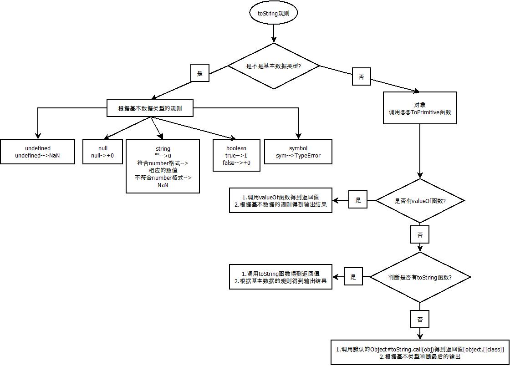
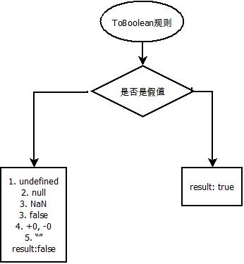
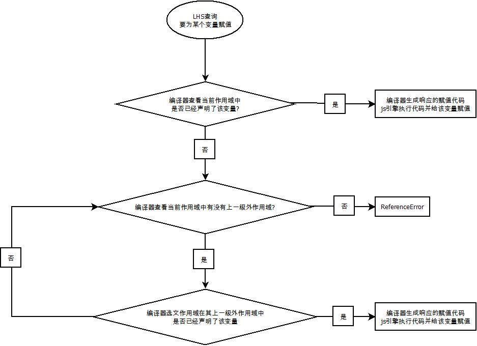

<!-- TOC -->

- [零 基础知识](#零-基础知识)
  - [1. 单词](#1-单词)
  - [2. 常见的语法名称的术语](#2-常见的语法名称的术语)
    - [1.2.1. Numeric Literals（数值语法）](#121-numeric-literals数值语法)
    - [1.2.2. 重点掌握十进制的语法](#122-重点掌握十进制的语法)
    - [1.2.3. StringNumericLiteral](#123-stringnumericliteral)
  - [3 typeof, instanceof](#3-typeof-instanceof)
  - [4. 用于调试的一些函数](#4-用于调试的一些函数)
    - [4.1. console.log()与console.dir()](#41-consolelog与consoledir)
  - [5 Object.prototype.toString.call(object)](#5-objectprototypetostringcallobject)
  - [6 理解这段话](#6-理解这段话)
  - [7 Object的一些常用函数](#7-object的一些常用函数)
    - [7.1 Object.prototype.toString](#71-objectprototypetostring)
    - [7.2 Object.keys(obj)](#72-objectkeysobj)
    - [7.3 Object.assign()](#73-objectassign)
  - [8 浮点数双精度的科学计数法](#8-浮点数双精度的科学计数法)
    - [5.1 将浮点数转化为二进制科学计数法遇到的问题](#51-将浮点数转化为二进制科学计数法遇到的问题)
    - [5.2 常见的解释原因问题](#52-常见的解释原因问题)
  - [9 一些js的简单表示](#9-一些js的简单表示)
  - [10 toString函数的一些易错点](#10-tostring函数的一些易错点)
  - [11 区别实例对象与函数对象](#11-区别实例对象与函数对象)
  - [12 看懂数据类型](#12-看懂数据类型)
  - [13 两种类型的回调函数](#13-两种类型的回调函数)
    - [2.1 同步回调函数](#21-同步回调函数)
    - [2.2 异步回调函数](#22-异步回调函数)
  - [14 js常见的内置类型之Error](#14-js常见的内置类型之error)
    - [14.1 Error的类型](#141-error的类型)
      - [14.1.1 ReferenceError](#1411-referenceerror)
      - [14.1.2 TypeError](#1412-typeerror)
      - [14.1.3 RangeError](#1413-rangeerror)
      - [14.1.4 SyntaxError](#1414-syntaxerror)
    - [14.2 错误处理](#142-错误处理)
      - [14.2.1 try{执行代码}catch(error){错误处理}](#1421-try执行代码catcherror错误处理)
      - [14.2.2 throw error](#1422-throw-error)
    - [14.3 错误对象的属性](#143-错误对象的属性)
      - [14.3.1 message](#1431-message)
      - [14.3.2 stack](#1432-stack)
  - [15 理解apply, call, bind](#15-理解apply-call-bind)
    - [15.1 func.apply(thisArg, [args])](#151-funcapplythisarg-args)
      - [15.1.1 理解apply的作用](#1511-理解apply的作用)
    - [15.2 bind(func1, func2)](#152-bindfunc1-func2)
      - [2.3.1 源码的理解](#231-源码的理解)
- [一 javascript的基础认识](#一-javascript的基础认识)
  - [1. 解释型语言](#1-解释型语言)
  - [2. 动态类型语言](#2-动态类型语言)
  - [3. 应用场景](#3-应用场景)
  - [4. 编写位置](#4-编写位置)
    - [4.1. 在HTML元素中属性直接执行js代码（不建议）](#41-在html元素中属性直接执行js代码不建议)
    - [4.2. 书写到script标签中](#42-书写到script标签中)
    - [4.3. 从外部引入js文件](#43-从外部引入js文件)
    - [4.4. 注意事项](#44-注意事项)
  - [5. js代码的注释](#5-js代码的注释)
  - [6. js的内置数据类型数据类型](#6-js的内置数据类型数据类型)
  - [7. 变量存储的本质](#7-变量存储的本质)
    - [7.1 内存的分类](#71-内存的分类)
    - [7.2 代码运行时，各部分存储的位置](#72-代码运行时各部分存储的位置)
- [二 js内置数据类型与语法解析](#二-js内置数据类型与语法解析)
  - [1 js的内置类型](#1-js的内置类型)
    - [1.1 使用typeof来分辨不同的内置类型](#11-使用typeof来分辨不同的内置类型)
    - [1.2 基本类型的理解](#12-基本类型的理解)
      - [1.2.1 undefined](#121-undefined)
      - [1.2.1.1 undefined和undeclared的区别](#1211-undefined和undeclared的区别)
    - [1.3 总结](#13-总结)
  - [2 js的内置值类型](#2-js的内置值类型)
    - [2.1 js的数组类型(Array)](#21-js的数组类型array)
      - [2.1.1 类数组转化为数组类型](#211-类数组转化为数组类型)
      - [2.1.1.1 Array#slice.call(arrayLike)](#2111-arrayslicecallarraylike)
      - [2.1.1.2 [].slice.call(arrayLike)](#2112-slicecallarraylike)
      - [2.1.1.3 Array.from(arrayLike[,func]);](#2113-arrayfromarraylikefunc)
    - [2.2 字符串类型(string)](#22-字符串类型string)
      - [2.2.1 区分字符串和字符数组](#221-区分字符串和字符数组)
      - [2.2.2 字符串借用数组类型的函数来实现功能](#222-字符串借用数组类型的函数来实现功能)
      - [2.2.2.1 Array.prototype.join.call(string, 中间插入的值)](#2221-arrayprototypejoincallstring-中间插入的值)
        - [2.2.2.2 Array.prototype.map.call(string, func).join("")](#2222-arrayprototypemapcallstring-funcjoin)
    - [2.3 数字类型(number)](#23-数字类型number)
      - [2.3.1 数字类型的较小值问题](#231-数字类型的较小值问题)
        - [2.3.1.1 二进制的误差](#2311-二进制的误差)
      - [2.3.1.2 Number.EPSILON](#2312-numberepsilon)
      - [2.3.2 Number常用的属性和方法](#232-number常用的属性和方法)
        - [2.3.2.1 Number.EPSILON](#2321-numberepsilon)
        - [2.3.2.2 Number.MAX_SAFE_INTEGER](#2322-numbermax_safe_integer)
        - [2.3.2.3 Number.MIN_SAFE_INTEGER](#2323-numbermin_safe_integer)
        - [2.3.2.4 Number#toExponential()](#2324-numbertoexponential)
        - [2.3.2.5 Number#toFixed(num)](#2325-numbertofixednum)
        - [2.3.2.6 Number#toPrecision(num)](#2326-numbertoprecisionnum)
        - [2.3.2.6 Number.isInteger(num)](#2326-numberisintegernum)
        - [2.3.2.7 Number.isSafeInteger(num)](#2327-numberissafeintegernum)
      - [2.3.3 实现32为有符号整数](#233-实现32为有符号整数)
      - [2.3.4 特殊数字(number)](#234-特殊数字number)
        - [2.3.4.1 不是数字的数字(NaN)](#2341-不是数字的数字nan)
          - [2.3.4.1.1 NaN与==、===](#23411-nan与)
          - [2.3.4.1.2 判断一个值是不是NaN的方法 -- Number.isNaN](#23412-判断一个值是不是nan的方法----numberisnan)
        - [2.3.4.2 无穷数](#2342-无穷数)
          - [2.3.4.2.1 js中除以0为无穷值](#23421-js中除以0为无穷值)
          - [2.3.4.2.2 js中当所表示的值超过Number.MAX_VALUE时，为无穷值](#23422-js中当所表示的值超过numbermax_value时为无穷值)
          - [2.3.4.2.3 js中无穷除以无穷为NaN](#23423-js中无穷除以无穷为nan)
        - [2.3.4.3 零值(+/-)](#2343-零值-)
          - [2.3.4.3.1 -0出现的场合](#23431--0出现的场合)
          - [2.3.4.3.2 常见函数对-0的处理](#23432-常见函数对-0的处理)
          - [2.3.4.3.3 -0与0之间的大小关系](#23433--0与0之间的大小关系)
          - [2.3.4.3.4 如何判断数值是-0](#23434-如何判断数值是-0)
        - [2.3.4.3 特殊等式Object.is(v1, v2)](#2343-特殊等式objectisv1-v2)
    - [2.4 不是值的值(undefined,null)](#24-不是值的值undefinednull)
      - [2.4.1 undefined和null的异同](#241-undefined和null的异同)
      - [2.4.2 作为标识符和变量的undefined](#242-作为标识符和变量的undefined)
  - [3 数据类型和赋值，引用](#3-数据类型和赋值引用)
    - [3.1 函数的参数的值传递方式](#31-函数的参数的值传递方式)
    - [3.2 函数的参数的传递封装对象（对基本类型进行封装）](#32-函数的参数的传递封装对象对基本类型进行封装)
    - [3.3 总结](#33-总结)
  - [4 原生函数](#4-原生函数)
    - [4.1 基本类型的封装对象](#41-基本类型的封装对象)
    - [4.2 拆封基本类型的封装对象](#42-拆封基本类型的封装对象)
    - [4.3 原生函数作为构造函数构建对象进行封装](#43-原生函数作为构造函数构建对象进行封装)
      - [4.3.1 Array作为构造函数](#431-array作为构造函数)
        - [4.3.1.1 为什么不能只用一个数字作为Array的构造参数](#4311-为什么不能只用一个数字作为array的构造参数)
      - [4.3.2 RegExp作为构造函数的情况](#432-regexp作为构造函数的情况)
      - [4.3.3 Date和Error作为构造函数](#433-date和error作为构造函数)
        - [4.3.3.1 Date用于根据时间创建随机数](#4331-date用于根据时间创建随机数)
        - [4.3.3.2 Error作为构造函数](#4332-error作为构造函数)
      - [4.3.4 Symbol作为构造函数](#434-symbol作为构造函数)
        - [4.3.4.1 Symbol类型作为属性名](#4341-symbol类型作为属性名)
          - [4.3.4.1.1 访问对象的Symbol属性](#43411-访问对象的symbol属性)
    - [4.4 Object#toString.call(obj)](#44-objecttostringcallobj)
    - [4.5 原生函数的原型](#45-原生函数的原型)
      - [4.5.1 有些原型对象并不一定是对象](#451-有些原型对象并不一定是对象)
    - [4.6 总结](#46-总结)
  - [5 类型转换](#5-类型转换)
    - [5.1 类型转换和强制类型转换](#51-类型转换和强制类型转换)
    - [5.2 数值，字符串，布尔值之间的类型转化规则](#52-数值字符串布尔值之间的类型转化规则)
      - [5.2.1 ToString规则](#521-tostring规则)
        - [5.2.1.1 JSON.stringify(obj)](#5211-jsonstringifyobj)
        - [5.2.1.1.1 JSON.stringify(obj)针对于对象](#52111-jsonstringifyobj针对于对象)
      - [5.2.2 ToNumber规则](#522-tonumber规则)
      - [5.2.3 ToBoolean规则](#523-toboolean规则)
        - [4.2.3.1 假值](#4231-假值)
    - [5.3 显式强制类型转换](#53-显式强制类型转换)
      - [5.3.1 其他类型转换为字符串](#531-其他类型转换为字符串)
        - [4.3.1.1 String(obj)](#4311-stringobj)
        - [4.3.1.2 obj.toString()](#4312-objtostring)
      - [5.3.2 其他类型转换为数值](#532-其他类型转换为数值)
        - [5.3.2.1 Number(obj)](#5321-numberobj)
        - [5.3.2.2 obj.toNumber()](#5322-objtonumber)
        - [5.3.2.3 parseInt(obj, radix), parseFloat(obj)](#5323-parseintobj-radix-parsefloatobj)
      - [5.3.3 其他类型转换为布尔类型](#533-其他类型转换为布尔类型)
        - [5.3.3.1 Boolean()](#5331-boolean)
        - [5.3.3.2 !!](#5332-)
      - [5.3.4 特殊符号的类型转化](#534-特殊符号的类型转化)
        - [5.3.4.1 +](#5341-)
          - [5.3.4.1.1 运用+号进行字符串的转化](#53411-运用号进行字符串的转化)
        - [5.3.4.2 ~ + 整数](#5342---整数)
    - [5.4 隐式强制类型转换](#54-隐式强制类型转换)
      - [5.4.1 常见的隐式转化](#541-常见的隐式转化)
        - [5.4.1.1 在有运算符+](#5411-在有运算符)
        - [5.4.1.2 在有运算符-](#5412-在有运算符-)
        - [5.4.1.3 隐式转化为Boolean类型](#5413-隐式转化为boolean类型)
        - [5.4.1.4 符号类型的隐式转化](#5414-符号类型的隐式转化)
    - [5.5 宽松相等和严格相等与隐式转化](#55-宽松相等和严格相等与隐式转化)
      - [5.5.1 ==隐式类型转化的一般规则](#551-隐式类型转化的一般规则)
        - [4.5.1.1 字符串和数字的宽松相等](#4511-字符串和数字的宽松相等)
        - [4.5.1.2 其他类型和布尔类型](#4512-其他类型和布尔类型)
        - [4.5.1.3 null和undefined的比较](#4513-null和undefined的比较)
        - [4.5.1.4 对象和非对象的比较](#4514-对象和非对象的比较)
        - [4.5.1.5 特殊情况](#4515-特殊情况)
      - [5.5.2 抽象关系比较](#552-抽象关系比较)
      - [5.5.3 == 使用的注意事项](#553--使用的注意事项)
    - [5.6 总结](#56-总结)
- [三 js的基础语法](#三-js的基础语法)
  - [1. 数组](#1-数组)
    - [1.1. 创建数组的两种方法](#11-创建数组的两种方法)
    - [1.2 数组元素的增删改查](#12-数组元素的增删改查)
      - [1.2.1 数组元素的添加](#121-数组元素的添加)
      - [1.2.1.1 利用索引直接添加](#1211-利用索引直接添加)
      - [1.2.1.2 Array#push(...val)](#1212-arraypushval)
      - [1.2.1.3 Array#unshift(...val)](#1213-arrayunshiftval)
      - [1.2.1.4 Array#fill(val[start[, end]]);](#1214-arrayfillvalstart-end)
      - [1.2.2 数组元素的删除](#122-数组元素的删除)
      - [1.2.1.2 Array#pop()](#1212-arraypop)
      - [1.2.1.3 Array#unshift()](#1213-arrayunshift)
      - [1.2.3 数组元素的修改](#123-数组元素的修改)
      - [1.2.4 数组元素的访问](#124-数组元素的访问)
        - [1.2.4.1 [index]](#1241-index)
        - [1.2.4.2 Array#indexOf（val)](#1242-arrayindexofval)
    - [1.3 数组的常用函数](#13-数组的常用函数)
      - [1.3.1 Array.length](#131-arraylength)
      - [1.3.2 Array#join([separator])](#132-arrayjoinseparator)
      - [1.3.3 Array#toString()](#133-arraytostring)
      - [1.3.4 Array#slice([begin, [end]])](#134-arrayslicebegin-end)
          - [1.3.4.1 使用Array#slice将类数组转化为数组](#1341-使用arrayslice将类数组转化为数组)
      - [1.3.5 Array#splice(start[, deleteCount[, item1[, item2[, ...]]]])](#135-arraysplicestart-deletecount-item1-item2-)
        - [1.3.5.1 Array#splice的应用](#1351-arraysplice的应用)
      - [1.3.6 Array#sort([func])](#136-arraysortfunc)
      - [1.3.7 Array#reverse()](#137-arrayreverse)
      - [1.3.8 Array#concat(value1[, value2[, ...[, valueN]]])](#138-arrayconcatvalue1-value2--valuen)
    - [1.4 数组的函数编程](#14-数组的函数编程)
      - [1.4.1 Array#forEach(callback(currentValue [, index [, array]])[, thisArg])](#141-arrayforeachcallbackcurrentvalue--index--array-thisarg)
      - [1.4.2 Array#map(callback(currentValue [, index [, array]])[, thisArg])](#142-arraymapcallbackcurrentvalue--index--array-thisarg)
      - [1.4.3 Array#filter(callback(currentValue [, index [, array]])[, thisArg])](#143-arrayfiltercallbackcurrentvalue--index--array-thisarg)
      - [1.4.4 Array#some(callback(element[, index[, array]])[, thisArg])](#144-arraysomecallbackelement-index-array-thisarg)
      - [1.4.5 Array#every(callback(element[, index[, array]])[, thisArg])](#145-arrayeverycallbackelement-index-array-thisarg)
      - [1.4.6 Array#reduce(callback(accumulator, currentValue[, index[, array]])[, initialValue])](#146-arrayreducecallbackaccumulator-currentvalue-index-array-initialvalue)
    - [1.5. 遍历数组](#15-遍历数组)
    - [1.6. 注意事项](#16-注意事项)
      - [1.6.1. 数组名的赋值](#161-数组名的赋值)
  - [2. 对象](#2-对象)
    - [2.1. 面向对象的编程](#21-面向对象的编程)
      - [2.1.1 面向过程的编程(POP)(Process-oriented programming)](#211-面向过程的编程popprocess-oriented-programming)
      - [2.1.2. 面向对象编程(OOP)(Oject-oriented programming)](#212-面向对象编程oopoject-oriented-programming)
    - [2.2. 面向对象编程的思维特点](#22-面向对象编程的思维特点)
    - [2.3. 对象的基本组成](#23-对象的基本组成)
      - [2.3.1. 属性](#231-属性)
      - [2.3.2. 方法](#232-方法)
    - [2.4 对象](#24-对象)
      - [2.4.1 对象的定义形式](#241-对象的定义形式)
      - [2.4.2 对象的分类](#242-对象的分类)
        - [2.4.2.1 普通对象](#2421-普通对象)
        - [2.4.2.2 类的实例对象](#2422-类的实例对象)
      - [2.4.3 对象的属性访问和修改](#243-对象的属性访问和修改)
        - [2.4.3.1 属性访问](#2431-属性访问)
        - [2.4.3.2 键值访问](#2432-键值访问)
      - [2.4.4 理解对象属性访问的默认操作](#244-理解对象属性访问的默认操作)
        - [2.4.4.1 [[ Get ]](用于属性的访问)](#2441--get-)
        - [2.4.4.2 [[ Put ]]（用于属性的新增和修改）](#2442--put-用于属性的新增和修改)
        - [2.4.4.3 如何判断是否具有某个属性](#2443-如何判断是否具有某个属性)
      - [2.4.5 对象的复制](#245-对象的复制)
        - [2.4.5.1 浅复制](#2451-浅复制)
        - [2.4.5.2 深复制](#2452-深复制)
      - [2.4.6 对象的属性描述符](#246-对象的属性描述符)
        - [2.4.6.1 对对象属性特性的操作](#2461-对对象属性特性的操作)
          - [2.4.6.1.1 Object.defineProperty()](#24611-objectdefineproperty)
        - [2.4.6.2 对象属性的不变性](#2462-对象属性的不变性)
          - [2.4.6.2.1 对象常量](#24621-对象常量)
        - [2.4.6.3 对象的不变性](#2463-对象的不变性)
          - [2.4.6.3.1 Object.preventExtensions(obj)](#24631-objectpreventextensionsobj)
          - [2.4.6.3.2 Object.seal(obj)](#24632-objectsealobj)
          - [2.4.6.3.3 Object.freeze(obj)](#24633-objectfreezeobj)
        - [2.4.6.4 不可枚举属性的问题](#2464-不可枚举属性的问题)
          - [2.4.6.4.1 obj.propertyIsEnumerable(prop)](#24641-objpropertyisenumerableprop)
          - [2.4.6.4.2 Object.getPropertySymbols(obj)](#24642-objectgetpropertysymbolsobj)
      - [2.4.7 对象的遍历](#247-对象的遍历)
        - [2.4.7.1 Object.keys(obj)](#2471-objectkeysobj)
        - [2.4.7.2 Object.getOwnPropertyNames(obj)](#2472-objectgetownpropertynamesobj)
        - [2.4.7.3 for...in...(key)](#2473-forinkey)
        - [2.4.7.4 for...of...(value)](#2474-forofvalue)
      - [2.4.8 总结](#248-总结)
    - [2.5 类](#25-类)
      - [2.5.1. 类的构造](#251-类的构造)
        - [2.5.1.1 通过函数构造类（构造函数）](#2511-通过函数构造类构造函数)
        - [2.5.1.2 通过class构造类](#2512-通过class构造类)
      - [2.5.2 类的实例对象（通过new构造的对象）](#252-类的实例对象通过new构造的对象)
        - [2.5.2.1. 类的实例对象的成员类型(实例成员，静态成员)](#2521-类的实例对象的成员类型实例成员静态成员)
      - [2.5.3 类的实例对象的实质](#253-类的实例对象的实质)
      - [2.5.4. 类的实例对象的方法查询规则](#254-类的实例对象的方法查询规则)
      - [2.5.5 类的继承](#255-类的继承)
        - [2.5.5.1. 原型链](#2551-原型链)
          - [2.5.5.1.1 实例对象是如何通过原型链来寻找相应的方法?](#25511-实例对象是如何通过原型链来寻找相应的方法)
        - [2.5.5.2 原型链引起的属性设置和屏蔽](#2552-原型链引起的属性设置和屏蔽)
          - [2.5.5.2.1 属性屏蔽](#25521-属性屏蔽)
          - [2.5.5.2.2 属性设置的过程（myObject.prop = value)](#25522-属性设置的过程myobjectprop--value)
          - [2.5.5.2.3 属性屏蔽和属性设置的易错点--隐式屏蔽](#25523-属性屏蔽和属性设置的易错点--隐式屏蔽)
        - [2.5.5.3 通过构造函数实现类的继承](#2553-通过构造函数实现类的继承)
          - [2.5.5.2.1 为什么不能使用Son.prototype.__proto__ = Father.prototype来实现原型链的继承](#25521-为什么不能使用sonprototypeproto--fatherprototype来实现原型链的继承)
          - [2.5.5.2.2 为什么不能使用Son.prototype = new Father()](#25522-为什么不能使用sonprototype--new-father)
          - [2.5.5.2.3 为什么不能使用Son.prototype = Father](#25523-为什么不能使用sonprototype--father)
          - [2.5.5.2.4 如何实现父类静态成员的继承？](#25524-如何实现父类静态成员的继承)
        - [2.5.5.4 通过class中的extends实现继承](#2554-通过class中的extends实现继承)
          - [2.5.5.3.1 class中的super对象](#25531-class中的super对象)
          - [2.5.5.3.2 class中的static函数](#25532-class中的static函数)
      - [2.5.6 类的基本认识](#256-类的基本认识)
      - [2.5.7 类的易混点](#257-类的易混点)
        - [2.5.7.1 类的实例对象和类的关系](#2571-类的实例对象和类的关系)
          - [2.5.7.1.1 类的实例的本质](#25711-类的实例的本质)
          - [2.5.7.1.2 原型继承](#25712-原型继承)
          - [2.5.7.1.3 类的实例对象的不可枚举属性constructor本质](#25713-类的实例对象的不可枚举属性constructor本质)
        - [2.5.7.2 构造函数的本质](#2572-构造函数的本质)
        - [2.5.7.3 instanceof判断的实质（对象与函数）](#2573-instanceof判断的实质对象与函数)
        - [2.5.7.4 判断某个对象是否出现在另一个对象的原型链之中](#2574-判断某个对象是否出现在另一个对象的原型链之中)
        - [2.5.7.5 获取某个对象的原型链](#2575-获取某个对象的原型链)
          - [2.5.7.5.1 Object.getPrototypeOf(obj)](#25751-objectgetprototypeofobj)
          - [2.5.7.5.2 obj.__proto__](#25752-objproto)
        - [2.5.7.6 总结](#2576-总结)
      - [2.5.8 注意](#258-注意)
        - [2.5.8.1 会检查所有在原型链上的属性](#2581-会检查所有在原型链上的属性)
  - [3 函数](#3-函数)
    - [3.1. 函数的定义](#31-函数的定义)
      - [3.1.1. 函数的命名写法（命名函数）](#311-函数的命名写法命名函数)
      - [3.1.2. 函数的表达式写法（匿名函数）](#312-函数的表达式写法匿名函数)
    - [3.2. 函数的参数传递](#32-函数的参数传递)
      - [3.2.1. 形参](#321-形参)
      - [3.2.2. 实参](#322-实参)
      - [3.2.3. 形参变量个数和实参变量个数的关系](#323-形参变量个数和实参变量个数的关系)
        - [3.2.3.1. arguments对象(现在很少用了)](#3231-arguments对象现在很少用了)
          - [3.2.3.1.1. 特点1](#32311-特点1)
          - [3.2.3.1.2. 特点2](#32312-特点2)
          - [3.2.3.1.3. 特点3](#32313-特点3)
      - [3.2.4. 函数参数的值传递和引用传递](#324-函数参数的值传递和引用传递)
        - [3.2.4.1. 值传递](#3241-值传递)
        - [3.2.4.2. 引用传递](#3242-引用传递)
    - [3.3. 函数的调用](#33-函数的调用)
      - [3.3.1. 函数的调用栈](#331-函数的调用栈)
      - [3.3.2. 普通函数的调用](#332-普通函数的调用)
      - [3.3.3 函数的特殊的调用形式](#333-函数的特殊的调用形式)
      - [3.3.4. 通过立即调用函数进行调（IIFE）](#334-通过立即调用函数进行调iife)
        - [3.3.4.1. 函数声明的立即调用函数规范](#3341-函数声明的立即调用函数规范)
          - [3.2.5.4.2. 函数的表达式写法可以在后面增加参数列表从而实现函数的立即实行](#32542-函数的表达式写法可以在后面增加参数列表从而实现函数的立即实行)
    - [3.4. 函数的返回值](#34-函数的返回值)
- [四 JS的知识补充](#四-js的知识补充)
  - [1 作用域](#1-作用域)
    - [1.1 理解作用域](#11-理解作用域)
      - [1.1.1 认识三个对话的部分](#111-认识三个对话的部分)
      - [1.1.2 对话的过程](#112-对话的过程)
      - [1.1.3 js引擎查询变量的方法](#113-js引擎查询变量的方法)
      - [1.1.4 理解变量的访问](#114-理解变量的访问)
    - [1.2 作用域嵌套](#12-作用域嵌套)
    - [1.3 总结](#13-总结-1)
    - [1.4 词法作用域](#14-词法作用域)
      - [1.4.1 欺骗词法](#141-欺骗词法)
        - [1.4.1.1 eval()](#1411-eval)
      - [1.4.2 总结](#142-总结)
    - [1.5 函数作用域](#15-函数作用域)
      - [1.5.1 作用1：隐藏内部实现](#151-作用1隐藏内部实现)
      - [1.5.2 作用2：规避冲突](#152-作用2规避冲突)
      - [1.5.3 作用3：全局命名空间](#153-作用3全局命名空间)
      - [1.5.4 函数声明和函数表达式](#154-函数声明和函数表达式)
      - [1.5.4 立即执行函数表达式](#154-立即执行函数表达式)
    - [1.6 块作用域](#16-块作用域)
      - [1.6.1 var声明的变量不具有块级作用域](#161-var声明的变量不具有块级作用域)
      - [1.6.2 try...catch的err具有块级作用域](#162-trycatch的err具有块级作用域)
      - [1.6.3 let/const声明的变量具有块级作用域](#163-letconst声明的变量具有块级作用域)
        - [1.6.3.1 在if语句中](#1631-在if语句中)
        - [1.6.3.2 垃圾回收中](#1632-垃圾回收中)
        - [1.6.3.3 let循环](#1633-let循环)
      - [1.6.4 总结](#164-总结)
    - [1.7 声明的提升](#17-声明的提升)
      - [1.7.1 编译器对代码的处理](#171-编译器对代码的处理)
      - [1.7.2 提升](#172-提升)
      - [1.7.3 函数声明和变量声明的优先级](#173-函数声明和变量声明的优先级)
      - [1.7.4 函数声明不具有块级作用域](#174-函数声明不具有块级作用域)
      - [1.7.5 总结](#175-总结)
    - [1.8 作用域的闭包](#18-作用域的闭包)
      - [1.8.1 理解闭包](#181-理解闭包)
      - [1.8.2 闭包的实质](#182-闭包的实质)
      - [1.8.3 闭包的通常形式](#183-闭包的通常形式)
      - [1.8.4 闭包的运用](#184-闭包的运用)
        - [1.8.4.1 循环和闭包](#1841-循环和闭包)
        - [1.8.4.2 实现模块](#1842-实现模块)
      - [1.8.5 总结](#185-总结)
  - [2 this的理解](#2-this的理解)
    - [2.1 this的实质](#21-this的实质)
    - [2.2 确定this所指的对象的方法](#22-确定this所指的对象的方法)
      - [2.2.1 第一步：寻找调用位置和当前的调用栈](#221-第一步寻找调用位置和当前的调用栈)
      - [2.2.2 第二步：根据this的绑定规则来确定绑定的对象](#222-第二步根据this的绑定规则来确定绑定的对象)
        - [2.2.2.1 默认绑定](#2221-默认绑定)
        - [2.2.2.2 隐式绑定](#2222-隐式绑定)
          - [2.2.2.2.1 隐式丢失](#22221-隐式丢失)
        - [2.2.2.3 显示绑定](#2223-显示绑定)
        - [2.2.2.4 new绑定](#2224-new绑定)
    - [2.3 this的绑定例外](#23-this的绑定例外)
      - [2.3.1 被忽略的this](#231-被忽略的this)
      - [2.3.2 间接引用(包括函数参数的传递)](#232-间接引用包括函数参数的传递)
      - [2.3.3 软绑定(obj.softBind(..))](#233-软绑定objsoftbind)
      - [2.3.4 箭头函数](#234-箭头函数)
    - [2.4 总结](#24-总结)
  - [3 有关类的三种不同设计模式](#3-有关类的三种不同设计模式)
    - [3.1 使用构造函数的模式](#31-使用构造函数的模式)
    - [3.2 使用class模式](#32-使用class模式)
    - [3.3 使用事件委派的模式](#33-使用事件委派的模式)
  - [4 语法](#4-语法)
    - [4.1 语句和表达式](#41-语句和表达式)
      - [4.1.1 语句的结果值的隐式返回](#411-语句的结果值的隐式返回)
  - [5 正则表达式](#5-正则表达式)
    - [5.1. 正则表达式的定义](#51-正则表达式的定义)
    - [5.2. 正则表达式的作用](#52-正则表达式的作用)
    - [5.3. 正则表达式的特殊字符](#53-正则表达式的特殊字符)
      - [5.3.1. 边界字符 ^ $](#531-边界字符--)
      - [5.3.2 字符类 []](#532-字符类-)
      - [5.3.3. 量词符](#533-量词符)
      - [5.3.4. 预定义类](#534-预定义类)
    - [5.4. 正则表达式的创建](#54-正则表达式的创建)
      - [5.4.1. 通过字面量创建(/reg/[flags])](#541-通过字面量创建regflags)
      - [5.4.2. 通过构造函数创建(new RegExp(reg[, flags]))](#542-通过构造函数创建new-regexpreg-flags)
      - [5.4.3 正则表达式标识](#543-正则表达式标识)
    - [5.5. 正则表达式的属性和方法](#55-正则表达式的属性和方法)
      - [5.5.1 RegExp#dotAll(只读)](#551-regexpdotall只读)
      - [5.5.2 RegExp#global(只读)](#552-regexpglobal只读)
      - [5.5.3 RegExp#ignoreCase(只读)](#553-regexpignorecase只读)
      - [5.5.4 RegExp#multiline(只读)](#554-regexpmultiline只读)
      - [5.5.5 RegExp#unicode(只读)](#555-regexpunicode只读)
      - [5.5.6 RegExp#source(只读)](#556-regexpsource只读)
      - [5.5.7 RegExp#flags(只读)](#557-regexpflags只读)
      - [5.5.8 RegExp#lastIndex](#558-regexplastindex)
      - [5.5.9 RegExp#exec(str)](#559-regexpexecstr)
        - [5.5.9.1 结果数组(result)](#5591-结果数组result)
        - [5.5.9.2 注意事项](#5592-注意事项)
        - [5.5.9.3 全局匹配与exec和lastIndex](#5593-全局匹配与exec和lastindex)
      - [5.5.10 RegExp#test(str)](#5510-regexpteststr)
      - [5.5.12 RegExp#toString()](#5512-regexptostring)
    - [5.6. 常用的正则表达式](#56-常用的正则表达式)
      - [5.6.1. 用户名验证](#561-用户名验证)
- [五 js的DOM操作](#五-js的dom操作)
  - [1. DOM(document Object Model)](#1-domdocument-object-model)
    - [1.2. DOM树](#12-dom树)
    - [1.3. 节点(node)](#13-节点node)
      - [1.3.1. 节点的分类](#131-节点的分类)
        - [1.3.1.1. 文档节点(document)](#1311-文档节点document)
        - [1.3.1.1. 元素节点](#1311-元素节点)
        - [1.3.1.1. 属性节点](#1311-属性节点)
        - [1.3.1.1. 文本节点](#1311-文本节点)
      - [1.3.2. 节点的属性](#132-节点的属性)
  - [2 DOM方法](#2-dom方法)
    - [2.1 DOM document属性和方法](#21-dom-document属性和方法)
      - [2.1.1 document获取元素对象的方法](#211-document获取元素对象的方法)
        - [2.1.1.1 document.getElementsByClassName(names)](#2111-documentgetelementsbyclassnamenames)
        - [2.1.1.2 document.getElementsByTagName(tagNames)](#2112-documentgetelementsbytagnametagnames)
        - [2.1.1.3 document.getElementById(id)](#2113-documentgetelementbyidid)
        - [2.1.1.4 document.getElementsByName(names)](#2114-documentgetelementsbynamenames)
        - [2.1.1.5 document.querySelector(cssSelector)](#2115-documentqueryselectorcssselector)
        - [2.1.1.6 document.querySelectorAll(cssSelector)](#2116-documentqueryselectorallcssselector)
      - [2.1.2 document常用的属性](#212-document常用的属性)
        - [2.1.2.1 document.body](#2121-documentbody)
        - [2.1.2.2 document.all](#2122-documentall)
        - [2.1.2.3 document.doucumentElement](#2123-documentdoucumentelement)
      - [2.1.3 doucment与增加元素对象相关的属性](#213-doucment与增加元素对象相关的属性)
        - [2.1.3.1 document.createElement(tagName)](#2131-documentcreateelementtagname)
    - [2.2 DOM Element方法](#22-dom-element方法)
      - [2.2.1 element获取元素对象的方法](#221-element获取元素对象的方法)
        - [2.2.1.1 element.getElementsByClassName(names)](#2211-elementgetelementsbyclassnamenames)
        - [2.2.1.2 element.getElementsByTagName(tagNames)](#2212-elementgetelementsbytagnametagnames)
        - [2.1.1.3 element.querySelector(cssSelector)](#2113-elementqueryselectorcssselector)
        - [2.1.1.4 element.matches(cssSelector)](#2114-elementmatchescssselector)
        - [2.1.1.4 element.querySelectorAll(cssSelector)](#2114-elementqueryselectorallcssselector)
      - [2.2.2 element与父元素对象，子元素对象，兄弟元素对象有关的属性和方法](#222-element与父元素对象子元素对象兄弟元素对象有关的属性和方法)
        - [2.2.2.1 element.parentNode](#2221-elementparentnode)
          - [2.2.2.1.1 parentNode.childElementCount](#22211-parentnodechildelementcount)
          - [2.2.2.1.2 parentNode.children](#22212-parentnodechildren)
          - [2.2.2.1.3 parentNode.firstElementChild](#22213-parentnodefirstelementchild)
          - [2.2.2.1.4 parentNode.lastElementChild](#22214-parentnodelastelementchild)
          - [2.2.2.1.5 parentNode.append(...node)](#22215-parentnodeappendnode)
          - [2.2.2.1.5 parentNode.prepend(node)](#22215-parentnodeprependnode)
        - [2.2.2.2 element.childNode](#2222-elementchildnode)
          - [2.2.2.2.1 childNode.remove()](#22221-childnoderemove)
        - [2.2.2.3 element.previousElementSibling（只读）](#2223-elementpreviouselementsibling只读)
        - [2.2.2.4 element.nextElementSibling（只读）](#2224-elementnextelementsibling只读)
        - [2.2.2.5 element.closest(selectors)](#2225-elementclosestselectors)
      - [2.2.3 element与增加元素对象相关的属性和方法](#223-element与增加元素对象相关的属性和方法)
        - [2.2.3.1 parentNode.append(...node)](#2231-parentnodeappendnode)
        - [2.2.3.2 parentNode.prepend(node)](#2232-parentnodeprependnode)
        - [2.2.3.3 parentNode.replaceChildren(newChild, oldChild)](#2233-parentnodereplacechildrennewchild-oldchild)
        - [2.2.3.4 childNode.replaceWith(...node)](#2234-childnodereplacewithnode)
        - [2.2.3.5 childNode.remove()](#2235-childnoderemove)
        - [2.2.3.6 element.insertAdjacentElement(position, newElement)](#2236-elementinsertadjacentelementposition-newelement)
        - [2.2.3.6 element.insertAdjacentHTML(position, text)](#2236-elementinsertadjacenthtmlposition-text)
      - [2.2.4 element与元素属性相关的属性及方法](#224-element与元素属性相关的属性及方法)
        - [2.2.4.1 element.nodeName/tagName](#2241-elementnodenametagname)
        - [2.2.4.2 element.id](#2242-elementid)
        - [2.2.4.3 element.attributes（只读）](#2243-elementattributes只读)
        - [2.2.4.4 element.innerHTML](#2244-elementinnerhtml)
        - [2.2.4.5 element.outerHTML](#2245-elementouterhtml)
          - [2.2.4.1.1 用于替换当前的元素对象](#22411-用于替换当前的元素对象)
        - [2.2.4.6 element.innerText](#2246-elementinnertext)
        - [2.2.4.7 element.className](#2247-elementclassname)
        - [2.2.4.8 element.classList（只读）](#2248-elementclasslist只读)
          - [2.2.4.3.1 classList.add(...classValue)](#22431-classlistaddclassvalue)
          - [2.2.4.3.2 classList.remove(...classValue)](#22432-classlistremoveclassvalue)
          - [2.2.4.3.3 classList.toggle(classValue)](#22433-classlisttoggleclassvalue)
        - [2.2.4.9 element.getAttribute(attrName:string)（只读）](#2249-elementgetattributeattrnamestring只读)
        - [2.2.4.10 element.getAttributeNames()](#22410-elementgetattributenames)
        - [2.2.4.11 element.hasAttribute(attrName:string)](#22411-elementhasattributeattrnamestring)
        - [2.2.4.11 element.removeAttribute(attrName:string)](#22411-elementremoveattributeattrnamestring)
        - [2.2.4.12 element.setAttribute(attrName:string, attrValue:string)](#22412-elementsetattributeattrnamestring-attrvaluestring)
        - [2.2.4.13 element.toggleAttribute(attrName[, force])](#22413-elementtoggleattributeattrname-force)
      - [2.2.5 element与样式相关的属性和方法](#225-element与样式相关的属性和方法)
        - [2.2.5.1 element.client[Height, Width]（只读）](#2251-elementclientheight-width只读)
        - [2.2.5.2 element.client[Left, Top]（只读）](#2252-elementclientleft-top只读)
        - [2.2.5.3 element.scroll[Height, Width]（只读）](#2253-elementscrollheight-width只读)
        - [2.2.5.4 element.scroll[Left, Top]](#2254-elementscrollleft-top)
        - [2.2.5.5 element.[attName] （获取内联样式属性）](#2255-elementattname-获取内联样式属性)
          - [2.2.5.5.1 element.value](#22551-elementvalue)
        - [2.2.5.6 element.style.[attrName]](#2256-elementstyleattrname)
          - [2.2.5.6.1 element.style.backgroundColor](#22561-elementstylebackgroundcolor)
        - [2.2.5.7 实现判断滚动条是否到底](#2257-实现判断滚动条是否到底)
      - [2.2.4.10](#22410)
    - [2.3 DOM的版本适应的问题](#23-dom的版本适应的问题)
      - [6.1.2.3. 获取元素节点对象的行内样式属性值](#6123-获取元素节点对象的行内样式属性值)
        - [6.1.2.3.3. 获取元素节点对象的样式表中的样式](#61233-获取元素节点对象的样式表中的样式)
          - [6.1.2.3.3.1. 由于兼容性，需要自定义一个函数](#612331-由于兼容性需要自定义一个函数)
          - [6.1.2.3.3.2. getComputedStyle(elementObject, pseudoElements)](#612332-getcomputedstyleelementobject-pseudoelements)
          - [6.1.2.3.3.3. objectElement.currentStyle.样式名](#612333-objectelementcurrentstyle样式名)
        - [6.1.2.4.1. 以父元素为对象的操作](#61241-以父元素为对象的操作)
          - [6.1.2.4.1.1. document.createElement(tagStr)](#612411-documentcreateelementtagstr)
          - [6.1.2.4.1.2. document.createTextNode(str)](#612412-documentcreatetextnodestr)
          - [6.1.2.4.1.3. fatherNodeObject.appendChild(childNodeObject)](#612413-fathernodeobjectappendchildchildnodeobject)
          - [6.1.2.4.1.4. fatherNodeObject.insertBefore(newchildObject, oldchildObject)](#612414-fathernodeobjectinsertbeforenewchildobject-oldchildobject)
          - [6.1.2.4.1.5. fatherNodeObject.replaceChild(newchildObject, oldchildObject)](#612415-fathernodeobjectreplacechildnewchildobject-oldchildobject)
          - [6.1.2.4.1.6. fatherNodeObject.removeChild(childObject)](#612416-fathernodeobjectremovechildchildobject)
          - [6.1.2.4.1.7. 元素对象的增加的步骤（使用createElement）](#612417-元素对象的增加的步骤使用createelement)
          - [6.1.2.4.1.8. 使用innerHTML对元素进行增加](#612418-使用innerhtml对元素进行增加)
          - [6.1.2.4.1.9. 两种方式结合对元素进行添加(推荐)](#612419-两种方式结合对元素进行添加推荐)
          - [6.1.2.4.1.10. 元素对象的删除的步骤（经常使用的）](#6124110-元素对象的删除的步骤经常使用的)
  - [3 DOM事件](#3-dom事件)
    - [3.0 事件的一些基本常识](#30-事件的一些基本常识)
      - [3.0.1 事件的公共属性和方法](#301-事件的公共属性和方法)
        - [3.0.1.1 event.target](#3011-eventtarget)
        - [3.0.1.2 event.currentTarget](#3012-eventcurrenttarget)
        - [3.0.1.3 event.bubbles](#3013-eventbubbles)
        - [3.0.1.4 event.cancelable](#3014-eventcancelable)
        - [3.0.1.5 event.type](#3015-eventtype)
        - [3.0.1.6 event.stopPropagation()](#3016-eventstoppropagation)
        - [3.0.1.7 event.preventDefault()](#3017-eventpreventdefault)
      - [3.0.2 事件与元素的绑定和取消的方法方法](#302-事件与元素的绑定和取消的方法方法)
        - [3.0.2.0 在内联样式中增加属性on[eventName] = "callback()"](#3020-在内联样式中增加属性oneventname--callback)
        - [3.0.2.1 element.on[eventName] = function() {}](#3021-elementoneventname--function-)
        - [3.0.2.2 element.on[eventName] = null](#3022-elementoneventname--null)
        - [3.0.2.3 element.addEventListener(eventName:string, func, [true || false])](#3023-elementaddeventlistenereventnamestring-func-true--false)
        - [3.0.2.4 element.removeEventListener(eventName:string, func, [true || false])](#3024-elementremoveeventlistenereventnamestring-func-true--false)
        - [3.0.2.5 element.attachEvent(on[eventName]:string, func)](#3025-elementattacheventoneventnamestring-func)
        - [3.0.2.5 通用的事件绑定函数](#3025-通用的事件绑定函数)
      - [3.0.3 事件的传播](#303-事件的传播)
        - [3.0.3.1 非冒泡事件](#3031-非冒泡事件)
        - [3.0.3.2 冒泡事件](#3032-冒泡事件)
          - [3.0.3.2.1 冒泡事件的传播](#30321-冒泡事件的传播)
          - [3.0.3.2.2 event.stopPropagation()的应用](#30322-eventstoppropagation的应用)
          - [3.0.3.2.3 利用冒泡事件实现事件委派](#30323-利用冒泡事件实现事件委派)
    - [3.1 剪贴版事件（ClipboardEvent）](#31-剪贴版事件clipboardevent)
      - [3.1.1 剪贴板事件的属性和方法(ClipboardEvent)](#311-剪贴板事件的属性和方法clipboardevent)
    - [3.2 焦点事件(FocusEvent)](#32-焦点事件focusevent)
      - [3.2.1 焦点事件的属性和方法(FocusEvent)](#321-焦点事件的属性和方法focusevent)
    - [3.3 键盘事件](#33-键盘事件)
      - [3.3.1 键盘事件的属性和方法(KeyboardEvent)](#331-键盘事件的属性和方法keyboardevent)
    - [3.4 鼠标事件](#34-鼠标事件)
      - [3.4.1 鼠标事件的属性和方法(MouseEvent)](#341-鼠标事件的属性和方法mouseevent)
    - [3.5 触摸事件](#35-触摸事件)
      - [3.4.0 触摸事件的类型](#340-触摸事件的类型)
      - [3.4.1 触摸事件的属性和方法(TouchEvent)](#341-触摸事件的属性和方法touchevent)
      - [3.4.2 触摸事件的注意事项](#342-触摸事件的注意事项)
    - [3.6 滚轮事件（WheelEvent)](#36-滚轮事件wheelevent)
      - [3.6.1 滚轮事件的属性和方法(WheelEvent)](#361-滚轮事件的属性和方法wheelevent)
      - [3.6.2 wheel的历史](#362-wheel的历史)
    - [3.7 事件的一些要学会的应用](#37-事件的一些要学会的应用)
      - [3.7.1 冒泡事件实现子盒和父盒的颜色变化](#371-冒泡事件实现子盒和父盒的颜色变化)
        - [3.7.1.1 利用event.stopPropagation()](#3711-利用eventstoppropagation)
        - [3.7.1.2 利用冒泡事件的出发元素的不同（即event.target的不同）](#3712-利用冒泡事件的出发元素的不同即eventtarget的不同)
      - [3.7.2 实现全选框](#372-实现全选框)
      - [3.7.3 实现元素的拖拽](#373-实现元素的拖拽)
        - [3.7.3.1 拖拽时鼠标位于左上角](#3731-拖拽时鼠标位于左上角)
        - [3.7.3.2 拖拽位置位于鼠标位置刚开始点击的位置](#3732-拖拽位置位于鼠标位置刚开始点击的位置)
        - [3.7.3.3 取消浏览器的默认行为造成拖拽的bug](#3733-取消浏览器的默认行为造成拖拽的bug)
        - [3.7.3.4 总结一个拖拽函数](#3734-总结一个拖拽函数)
      - [3.7.4 滚轮事件的运用](#374-滚轮事件的运用)
      - [3.7.5 键盘事件的运用](#375-键盘事件的运用)
        - [3.7.5.1 实现两个按键的判断](#3751-实现两个按键的判断)
        - [3.6.7.2 限制input框的输入内容](#3672-限制input框的输入内容)
        - [3.6.7.3 div元素的移动](#3673-div元素的移动)
    - [3.8 与事件相关的兼容性问题](#38-与事件相关的兼容性问题)
      - [3.8.1 获取样式表中属性值的兼容性问题](#381-获取样式表中属性值的兼容性问题)
      - [3.8.2 event参数的传递](#382-event参数的传递)
      - [3.8.3 绑定事件的兼容性写法](#383-绑定事件的兼容性写法)
      - [6.1.3.1. elementObject.clientWidth, elementObject.clientHeight](#6131-elementobjectclientwidth-elementobjectclientheight)
      - [6.1.3.2. elementObject.offsetWidth, elementObject.offsetHeight](#6132-elementobjectoffsetwidth-elementobjectoffsetheight)
      - [6.1.3.3. elementObject.offsetParent](#6133-elementobjectoffsetparent)
      - [6.1.3.4. elementObject.offset[Left,right], elementObject.offset[Top,buttom]](#6134-elementobjectoffsetleftright-elementobjectoffsettopbuttom)
      - [6.1.3.5. elementObject.scrollWidth, elementObject.scrollHeight](#6135-elementobjectscrollwidth-elementobjectscrollheight)
      - [6.1.3.6. elementObject.scrollLeft, elementObject.scrollTop](#6136-elementobjectscrollleft-elementobjectscrolltop)
      - [6.1.3.7. elementObject.scrollHeight, elementObject.scrollTop和elementObject.clientHeight的结合使用](#6137-elementobjectscrollheight-elementobjectscrolltop和elementobjectclientheight的结合使用)
      - [6.2.6.4. elementObject.onmousewheel](#6264-elementobjectonmousewheel)
    - [3.8. 文档的加载](#38-文档的加载)
      - [3.8.1 浏览器加载页面的顺序](#381-浏览器加载页面的顺序)
      - [3.8.2 onload事件](#382-onload事件)
- [六 js的BOM操作](#六-js的bom操作)
  - [6.1. BOM(brower Object Model)](#61-bombrower-object-model)
  - [6.2. BOM的对象](#62-bom的对象)
    - [6.2.1. Window](#621-window)
      - [6.2.1.1. Window方法](#6211-window方法)
        - [6.2.1.1.1. alert(str)](#62111-alertstr)
        - [6.2.1.1.2. prompt(str)](#62112-promptstr)
        - [6.2.1.1.3. comfirm(str)](#62113-comfirmstr)
        - [6.2.1.1.4. setInterval(callback, time)](#62114-setintervalcallback-time)
        - [6.2.1.1.5. clearInterval(intervalId)](#62115-clearintervalintervalid)
        - [6.2.1.1.6. setTimeout(callback, time)](#62116-settimeoutcallback-time)
        - [6.2.1.1.7. clearTimeout(timeoutId)](#62117-cleartimeouttimeoutid)
        - [6.2.1.1.8. 延时调用和定时调用的关系](#62118-延时调用和定时调用的关系)
    - [6.2.2. Navigator](#622-navigator)
      - [6.2.2.1. Navigator的属性](#6221-navigator的属性)
        - [7.2.2.1.1. navigator.userAgent](#72211-navigatoruseragent)
    - [6.2.3. Location](#623-location)
      - [6.2.3.1. localtion](#6231-localtion)
        - [7.2.3.1.1. location实现元素对象的类似a标签的属性](#72311-location实现元素对象的类似a标签的属性)
      - [6.2.3.2. location的属性](#6232-location的属性)
      - [6.2.3.3. Location的方法](#6233-location的方法)
        - [6.2.3.3.1. location.assign(URL);](#62331-locationassignurl)
        - [6.2.3.3.2. location.reload();](#62332-locationreload)
        - [6.2.3.3.3. location.replace(URL)](#62333-locationreplaceurl)
    - [6.2.4. History](#624-history)
      - [6.2.4.1. History的属性](#6241-history的属性)
        - [6.2.4.1.1. history.length](#62411-historylength)
      - [6.2.4.2. History的方法](#6242-history的方法)
        - [6.2.4.2.1. history.back()](#62421-historyback)
        - [6.2.4.2.2. history.forward()](#62422-historyforward)
        - [6.2.4.2.3. history.go(n)](#62423-historygon)
    - [6.2.5. Screen](#625-screen)
    - [6.2.6. Bom的应用](#626-bom的应用)
      - [6.2.6.1. 图片切换](#6261-图片切换)
      - [6.2.6.2. 解决div移动第一个键和第二个键之间的延迟问题（防误触）](#6262-解决div移动第一个键和第二个键之间的延迟问题防误触)
      - [6.2.6.3. 构造一个简单的动画函数](#6263-构造一个简单的动画函数)
      - [6.2.6.4. 轮播图效果的实现](#6264-轮播图效果的实现)
- [七 js的迭代器（Iterator)](#七-js的迭代器iterator)
  - [1 迭代器的创建](#1-迭代器的创建)
    - [1.1 通过Iterator(object[, keyOnly])来构建](#11-通过iteratorobject-keyonly来构建)
    - [1.2 通过生成器来构建](#12-通过生成器来构建)
      - [1.2.1 利用内置函数自身的生成器(Symbol.iterator)](#121-利用内置函数自身的生成器symboliterator)
    - [1.3 自定义构建迭代器](#13-自定义构建迭代器)
  - [2 迭代器的属性和方法](#2-迭代器的属性和方法)
    - [2.1 Iterator#next()](#21-iteratornext)
      - [2.1.1 返回对象的属性](#211-返回对象的属性)
    - [2.2 for...of...与迭代器](#22-forof与迭代器)
      - [2.2.1 与for...of等价的代码](#221-与forof等价的代码)
  - [3 iterable](#3-iterable)
- [八 生成器(Generator)](#八-生成器generator)
  - [1 生成器的实质](#1-生成器的实质)
  - [2 生成器的关键词](#2-生成器的关键词)
    - [2.1 function *funcName() {}](#21-function-funcname-)
    - [2.2 yield关键词](#22-yield关键词)
      - [2.2.1 yield关键词的作用](#221-yield关键词的作用)
        - [2.2.1.1 使生成器函数在yield所在语句暂停运行](#2211-使生成器函数在yield所在语句暂停运行)
        - [2.2.1.2 给迭代器返回对象的value赋值为yield后面表达式的返回值](#2212-给迭代器返回对象的value赋值为yield后面表达式的返回值)
        - [2.2.1.3 接收next函数传入的参数](#2213-接收next函数传入的参数)
    - [2.3 try...finally](#23-tryfinally)
  - [3 生成器返回的迭代器返回对象的value赋值](#3-生成器返回的迭代器返回对象的value赋值)
  - [4 生成器函数的参数](#4-生成器函数的参数)
    - [4.1 通过函数的参数进行传递](#41-通过函数的参数进行传递)
    - [4.2 通过next对参数进行传递](#42-通过next对参数进行传递)
  - [5 生成器的构造](#5-生成器的构造)
    - [4.1 通过生成器函数构造](#41-通过生成器函数构造)
    - [4.2 通过生成器表达式构造(匿名)](#42-通过生成器表达式构造匿名)
    - [4.3 在对象中构造(简便写法)](#43-在对象中构造简便写法)
    - [4.4 例子](#44-例子)
  - [6 终止无限循环迭代器](#6-终止无限循环迭代器)
    - [6.1 无限循环迭代器](#61-无限循环迭代器)
    - [6.2 终止无限循迭代器的方法](#62-终止无限循迭代器的方法)
      - [6.2.1 在for...of中调用break](#621-在forof中调用break)
      - [6.2.2 iterator.return([str])函数的调用](#622-iteratorreturnstr函数的调用)
  - [7 生成器函数的应用](#7-生成器函数的应用)
    - [7.1 异步迭代生成器](#71-异步迭代生成器)
    - [7.2 生成器 + Promise](#72-生成器--promise)
      - [7.2.1 run函数](#721-run函数)
      - [7.2.2 例子](#722-例子)
      - [7.2.3 async和await运用的是这种原理](#723-async和await运用的是这种原理)
    - [7.3 生成器中的 Promise 并发](#73-生成器中的-promise-并发)
    - [7.4 生成器委托(后面再进行补充)](#74-生成器委托后面再进行补充)
- [九 Promise](#九-promise)
  - [1 Promised的基本理解](#1-promised的基本理解)
    - [1.1 promise的理解](#11-promise的理解)
    - [1.2 promise的状态](#12-promise的状态)
    - [1.3. promise的基本使用流程](#13-promise的基本使用流程)
    - [1.4. 为什么使用promise](#14-为什么使用promise)
      - [1.4.1 指定回调函数的方式更加灵活](#141-指定回调函数的方式更加灵活)
      - [1.4.2 支持链式调用,可以解决回调地狱的问题](#142-支持链式调用可以解决回调地狱的问题)
        - [1.4.2.1 回调地狱](#1421-回调地狱)
        - [1.4.2.2 利用Promise的链式调用解决回调地狱的问题](#1422-利用promise的链式调用解决回调地狱的问题)
        - [1.4.2.3 解决回调地狱的最终方案](#1423-解决回调地狱的最终方案)
    - [1.5 promise的API](#15-promise的api)
      - [5.1 基本语法](#51-基本语法)
      - [5.2 函数对象的方法](#52-函数对象的方法)
        - [5.2.1 Promise.all(iterable))](#521-promisealliterable)
        - [5.2.2 Promise.race(iterable)](#522-promiseraceiterable)
        - [5.2.3 Promise.resolve(value)](#523-promiseresolvevalue)
        - [5.2.4 Promise.reject(reason)](#524-promiserejectreason)
      - [5.3 实例对象的方法](#53-实例对象的方法)
        - [5.3.1 Promise.prototype.then(onFulfilled[, onRejected])](#531-promiseprototypethenonfulfilled-onrejected)
        - [5.3.2 Promise.prototype.catch(onRejected)](#532-promiseprototypecatchonrejected)
    - [1.6 promise的几个关键问题](#16-promise的几个关键问题)
      - [1.6.1 如何改变promise的状态](#161-如何改变promise的状态)
      - [1.6.2 什么时候可以得到数据?](#162-什么时候可以得到数据)
      - [1.6.3 理解promise中的同步异步](#163-理解promise中的同步异步)
      - [1.6.4 promise.then()返回新的promise的结果状态由什么决定的](#164-promisethen返回新的promise的结果状态由什么决定的)
      - [1.6.5 promise如何串联多个异步任务](#165-promise如何串联多个异步任务)
      - [1.6.6 promise的异常穿透](#166-promise的异常穿透)
      - [1.6.7 中断promise链](#167-中断promise链)
  - [2 手写promise](#2-手写promise)
    - [2.1 定义整体结构](#21-定义整体结构)
    - [2.2. 定义构造函数](#22-定义构造函数)
  - [3 async和await使用](#3-async和await使用)
    - [3.1 async 函数](#31-async-函数)
    - [3.2 await 表达式](#32-await-表达式)
    - [3.3 注意](#33-注意)
  - [4 宏队列和微队列](#4-宏队列和微队列)
    - [4.1 原理图](#41-原理图)
    - [4.2 js的异步任务的触发函数什么时候放入了对应的异步执行队列？](#42-js的异步任务的触发函数什么时候放入了对应的异步执行队列)
    - [4.3 js的异步执行流程](#43-js的异步执行流程)
  - [5 常见面试题](#5-常见面试题)
    - [5.1 认清楚哪些是异步回调函数,哪些是同步代码](#51-认清楚哪些是异步回调函数哪些是同步代码)
- [十 axios](#十-axios)
  - [1 http的理解](#1-http的理解)
    - [1.1 http请求交互的基本过程](#11-http请求交互的基本过程)
    - [1.2 http请求报文](#12-http请求报文)
      - [1.2.1 请求报文的组成](#121-请求报文的组成)
        - [1.2.1.1 请求行](#1211-请求行)
          - [1.1.1.1.1 method(请求方法)](#11111-method请求方法)
          - [1.1.1.1.2 URL](#11112-url)
          - [1.1.1.1.3 协议版本](#11113-协议版本)
        - [1.2.1.2 请求头](#1212-请求头)
          - [1.2.1.2.1 User-Agent](#12121-user-agent)
          - [1.2.1.2.2 Accipt](#12122-accipt)
          - [1.2.1.2.3 Accept-Language](#12123-accept-language)
          - [1.2.1.2.4 Accept-Encoding](#12124-accept-encoding)
          - [1.2.1.2.5 Accept-Charset](#12125-accept-charset)
          - [1.2.1.2.6 Host](#12126-host)
          - [1.2.1.2.7 connection](#12127-connection)
          - [1.2.1.2.8 Cookie](#12128-cookie)
        - [1.2.1.3 空行](#1213-空行)
        - [1.2.1.4 请求包体](#1214-请求包体)
      - [1.2.2 请求方法与请求包体Content-type以及axios的config的关系](#122-请求方法与请求包体content-type以及axios的config的关系)
    - [1.3 http响应报文](#13-http响应报文)
      - [1.3.1 响应报文的组成](#131-响应报文的组成)
        - [1.3.1.1 状态行](#1311-状态行)
          - [1.3.1.1.1 http协议字段](#13111-http协议字段)
          - [1.3.1.1.2 状态码](#13112-状态码)
          - [1.3.1.1.3 状态码描述文本](#13113-状态码描述文本)
        - [1.3.1.2 响应头部](#1312-响应头部)
          - [1.3.1.2.1 Location](#13121-location)
          - [1.3.1.2.2 Server](#13122-server)
          - [1.3.1.2.3 Vary](#13123-vary)
          - [1.3.1.2.4 Vary](#13124-vary)
          - [1.3.1.2.5 Connection](#13125-connection)
        - [1.3.1.3 空行](#1313-空行)
        - [1.3.1.4 响应包体](#1314-响应包体)
    - [1.4 基础知识补充](#14-基础知识补充)
      - [1.4.1 Connection在不同报文中的作用](#141-connection在不同报文中的作用)
  - [2 服务器提供给客户端的API分类](#2-服务器提供给客户端的api分类)
    - [2.1 分类依据](#21-分类依据)
    - [2.2 类型](#22-类型)
      - [2.2.1 REST API（restful）](#221-rest-apirestful)
      - [2.2.2 非 REST API(restless)](#222-非-rest-apirestless)
  - [3 搭建具有REST API的简单服务器用于测试](#3-搭建具有rest-api的简单服务器用于测试)
  - [4 AJAX编程的基础--XHR](#4-ajax编程的基础--xhr)
    - [4.1. XHR的基本定义](#41-xhr的基本定义)
    - [4.2 XHR的基本使用](#42-xhr的基本使用)
      - [4.2.1 XHR的构造函数](#421-xhr的构造函数)
      - [4.2.3 XHR实例对象从建立到接收到数据状态以及变化](#423-xhr实例对象从建立到接收到数据状态以及变化)
      - [4.2.2 XHR实例对象接收数据时事件](#422-xhr实例对象接收数据时事件)
      - [4.2.3 XHR的属性和方法](#423-xhr的属性和方法)
        - [4.2.3.1 与接收到响应结果相关的属性](#4231-与接收到响应结果相关的属性)
          - [4.2.3.1.1 XmlHttpRequest#responseType(只读)](#42311-xmlhttprequestresponsetype只读)
          - [4.2.3.1.2 XmlHttpRequest#response(只读)](#42312-xmlhttprequestresponse只读)
          - [4.2.3.1.3 XmlHttpRequest#status / statusText（只读）](#42313-xmlhttprequeststatus--statustext只读)
          - [4.2.3.1.4 XmlHttpRequest#responseURL(只读)](#42314-xmlhttprequestresponseurl只读)
          - [4.2.3.1.5 XmlHttpRequest#responseText(只读)](#42315-xmlhttprequestresponsetext只读)
          - [4.2.3.1.6 XmlHttpRequest#responseXML(只读)](#42316-xmlhttprequestresponsexml只读)
          - [4.2.3.1.7 XmlHttpRequest#getAllResponseHeaders()](#42317-xmlhttprequestgetallresponseheaders)
          - [4.2.3.1.8 XmlHttpRequest#getResponseHeader(name)](#42318-xmlhttprequestgetresponseheadername)
        - [4.2.3.2 与状态相关的属性](#4232-与状态相关的属性)
          - [4.2.3.2.1 XmlHttpRequest#readyState(只读)](#42321-xmlhttprequestreadystate只读)
          - [4.2.3.2.2 XmlHttpRequest#onreadystatechange = callback](#42322-xmlhttprequestonreadystatechange--callback)
        - [4.2.3.3 与请求超时相关的属性和方法](#4233-与请求超时相关的属性和方法)
          - [4.2.3.3.1 XmlHttpRequest#timeout](#42331-xmlhttprequesttimeout)
          - [4.2.3.3.2 XmlHttpRequest#ontimeout = callback](#42332-xmlhttprequestontimeout--callback)
        - [4.2.3.4 特殊的事件触发有关方法](#4234-特殊的事件触发有关方法)
          - [4.2.3.4.1 XmlHttpRequest#abort()](#42341-xmlhttprequestabort)
        - [4.2.3.5 发送请求有关的属性和方法](#4235-发送请求有关的属性和方法)
          - [4.2.3.5.1 XmlHttpRequest#open(method, url[, async[, user[, password]]])](#42351-xmlhttprequestopenmethod-url-async-user-password)
          - [4.2.3.5.2 XmlHttpRequest#setRequestHeader(headerName, value)](#42352-xmlhttprequestsetrequestheaderheadername-value)
          - [4.2.3.5.3 XmlHttpRequest#send(body)](#42353-xmlhttprequestsendbody)
  - [5 利用XHR简单实现axios](#5-利用xhr简单实现axios)
  - [6 axios的使用](#6-axios的使用)
    - [6.1 axios的基本定义](#61-axios的基本定义)
    - [6.2 axios的特征](#62-axios的特征)
    - [6.3 axios的基本使用](#63-axios的基本使用)
      - [6.3.0 ajax请求和普通的http请求的区别](#630-ajax请求和普通的http请求的区别)
      - [6.3.1 axios的config对应的参数和含义](#631-axios的config对应的参数和含义)
      - [6.3.2 axios发送请求的三种不同方式](#632-axios发送请求的三种不同方式)
        - [6.3.2.1 将axios视为一个对象去向服务器端发送请求](#6321-将axios视为一个对象去向服务器端发送请求)
          - [6.3.2.1 axios.get(url[,config])](#6321-axiosgeturlconfig)
          - [6.3.2.2 axios.post(url ,data)](#6322-axiosposturl-data)
          - [6.3.2.3 axios.put(url ,data)](#6323-axiosputurl-data)
        - [6.3.2.2 将axios视为一个函数去向服务器端发送请求](#6322-将axios视为一个函数去向服务器端发送请求)
          - [6.3.3.1 axios(config)](#6331-axiosconfig)
        - [6.3.2.3 将axios视为一个构造函数去向服务器端发送请求](#6323-将axios视为一个构造函数去向服务器端发送请求)
          - [6.3.2.3.1 axios.create(config)](#63231-axioscreateconfig)
          - [6.3.2.3.2 axios实例的方法](#63232-axios实例的方法)
      - [6.3.3 axios的全局配置](#633-axios的全局配置)
        - [6.3.3.1 axios.defaults.configKey = value](#6331-axiosdefaultsconfigkey--value)
      - [6.3.4 axios的拦截器](#634-axios的拦截器)
        - [6.3.4.1 axios.interceptors.request.use(func(config) {}, function(error) {})](#6341-axiosinterceptorsrequestusefuncconfig--functionerror-)
        - [6.3.4.2 axios.interceptors.response.use(func(response) {}, function(error) {})](#6342-axiosinterceptorsresponseusefuncresponse--functionerror-)
        - [6.3.4.3 拦截器的运行流程](#6343-拦截器的运行流程)
      - [6.3.5 axios的reponse](#635-axios的reponse)
      - [6.3.6 axios的取消](#636-axios的取消)
        - [6.3.6.1 方法1 使用内部的函数](#6361-方法1-使用内部的函数)
        - [6.3.6.2 方法2：创建一个对象](#6362-方法2创建一个对象)
        - [6.3.6.3 应用](#6363-应用)
          - [6.3.6.3.1 用于请求当前的请求](#63631-用于请求当前的请求)
          - [6.3.6.3.2 用于请求上一个请求](#63632-用于请求上一个请求)
  - [7 axios源码分析](#7-axios源码分析)
    - [7.1 axios与Axios的关系](#71-axios与axios的关系)
    - [7.2 axios与instance的区别](#72-axios与instance的区别)
    - [7.3 axios执行的流程图](#73-axios执行的流程图)
    - [7.4 axios如何把interceptor和request串联起来](#74-axios如何把interceptor和request串联起来)
    - [7.5 axios是如何取消request的请求的](#75-axios是如何取消request的请求的)
- [十一 JS的模块化](#十一-js的模块化)
  - [1 模块化](#1-模块化)
    - [1.1 定义](#11-定义)
    - [1.2 原因](#12-原因)
    - [1.3 用script引入多个js文件为什么效率不高](#13-用script引入多个js文件为什么效率不高)
  - [2 HTML引入js模块的模块化的标准](#2-html引入js模块的模块化的标准)
    - [2.1 在html中引入JS模块的方法](#21-在html中引入js模块的方法)
      - [2.1.1 全局function模式（不能实现模块化）](#211-全局function模式不能实现模块化)
      - [2.1.2 namespace模式（通过对象进行模块化）](#212-namespace模式通过对象进行模块化)
      - [2.1.3 IIFE模式(将要暴露的内容出入一个对象并变成window的一个属性值)](#213-iife模式将要暴露的内容出入一个对象并变成window的一个属性值)
      - [2.1.4 IIFE增强模式](#214-iife增强模式)
  - [3 JS和JS文件之间实现js模块化标准](#3-js和js文件之间实现js模块化标准)
    - [3.1 commonJS模块化的规范(node.js模块化的标准)](#31-commonjs模块化的规范nodejs模块化的标准)
      - [3.1.1 commonJS模块化的规范的基本语法](#311-commonjs模块化的规范的基本语法)
        - [3.1.1.1 暴露语法(只能二选一,不能同时使用)](#3111-暴露语法只能二选一不能同时使用)
          - [3.1.1.1.1 module.exports = value](#31111-moduleexports--value)
          - [3.1.1.1.2 exports.xxx = value](#31112-exportsxxx--value)
        - [3.1.1.2 引入语法](#3112-引入语法)
          - [3.1.1.2.1 const xxx = require(xxx)](#31121-const-xxx--requirexxx)
      - [3.1.2 commonJS在服务器端和浏览器端的不同](#312-commonjs在服务器端和浏览器端的不同)
        - [3.1.2.1 在服务器端（node.js)](#3121-在服务器端nodejs)
          - [3.1.2.1.1 基于服务器端的模块化过程](#31211-基于服务器端的模块化过程)
          - [3.1.2.1.2 基于服务器端的模块化的目录结构](#31212-基于服务器端的模块化的目录结构)
        - [3.1.2.2 在浏览器端](#3122-在浏览器端)
          - [3.1.2.2.1 基于浏览器端的模块化过程](#31221-基于浏览器端的模块化过程)
          - [3.1.2.2.2 基于浏览器端的模块化的目录结构](#31222-基于浏览器端的模块化的目录结构)
    - [3.2 AMD模块化的规范](#32-amd模块化的规范)
      - [3.2.1 基本语法](#321-基本语法)
        - [3.2.1.1 暴露用法](#3211-暴露用法)
          - [3.2.1.1.1 定义没有依赖的模块](#32111-定义没有依赖的模块)
          - [3.2.1.1.2 定义有依赖的模块](#32112-定义有依赖的模块)
        - [3.2.1.2 引入使用模块](#3212-引入使用模块)
          - [3.2.1.2.1 配置模块id与路径的对应](#32121-配置模块id与路径的对应)
          - [3.2.1.2.2 引入使用模块](#32122-引入使用模块)
      - [3.2.2 AMD引入模块的基本过程](#322-amd引入模块的基本过程)
      - [3.2.3 AMD引入模块的目录结构](#323-amd引入模块的目录结构)
      - [3.2.4 注意事项](#324-注意事项)
    - [3.3 ES6的模块化](#33-es6的模块化)
      - [3.3.1 基本语法](#331-基本语法)
        - [3.3.1.1 暴露模块(export)](#3311-暴露模块export)
          - [3.3.1.1.1 单独导出变量或者函数](#33111-单独导出变量或者函数)
          - [3.3.1.1.2 导出一个对象(推荐)](#33112-导出一个对象推荐)
          - [3.3.1.1.3 export default](#33113-export-default)
        - [3.3.1.2 导入模块(import)](#3312-导入模块import)
          - [3.3.1.2.1 普通的导入(使用对象字面量)](#33121-普通的导入使用对象字面量)
          - [3.3.1.2.2 使用*导入整个模块对象](#33122-使用导入整个模块对象)
          - [3.3.1.2.3 export default的导入](#33123-export-default的导入)
      - [3.3.2 注意事项](#332-注意事项)
- [十二 ES6增加的内容总结](#十二-es6增加的内容总结)
  - [1. 类的新的定义方式](#1-类的新的定义方式)
    - [1.1. class](#11-class)
      - [1.1.1. extends和super](#111-extends和super)
        - [1.1.1.1 extends](#1111-extends)
        - [1.1.1.2 super](#1112-super)
      - [1.1.2 new.target](#112-newtarget)
      - [1.1.3 static](#113-static)
  - [2 块级作用域](#2-块级作用域)
    - [2.1 let](#21-let)
      - [2.1.1. let 关键字的特点](#211-let-关键字的特点)
      - [2.1.2 let 关键字与for](#212-let-关键字与for)
    - [2.2 const](#22-const)
      - [2.2.1 特点](#221-特点)
    - [2.3 块级作用域函数(有待查证)](#23-块级作用域函数有待查证)
  - [3 函数的参数的默认值](#3-函数的参数的默认值)
  - [4 对象字面量的扩展](#4-对象字面量的扩展)
    - [4.1 简洁属性(key值和value的变量名相同)](#41-简洁属性key值和value的变量名相同)
    - [4.2 简洁方法](#42-简洁方法)
    - [4.3 使用计算属性名](#43-使用计算属性名)
    - [4.4 关联原型](#44-关联原型)
    - [4.5 super对象](#45-super对象)
  - [5 解构赋值](#5-解构赋值)
    - [5.1 数组解构](#51-数组解构)
    - [5.2 对象解构](#52-对象解构)
    - [5.3 解构赋值的两种写法](#53-解构赋值的两种写法)
      - [5.3.1 用于解构的变量未声明变量未声明](#531-用于解构的变量未声明变量未声明)
      - [5.3.2 用于解构的变量已经声明(前面无需加声明类型)](#532-用于解构的变量已经声明前面无需加声明类型)
    - [5.4 用于解构变量的数量](#54-用于解构变量的数量)
    - [5.5 重复赋值](#55-重复赋值)
    - [5.6 解构参数（当数组或对象的字面量作为形参）](#56-解构参数当数组或对象的字面量作为形参)
    - [5.7 用于解构变量的默认值](#57-用于解构变量的默认值)
      - [5.7.1 解构的默认值和形参的默认值（难点）](#571-解构的默认值和形参的默认值难点)
    - [5.8 与其他用法的结合应用](#58-与其他用法的结合应用)
  - [6 展开运算符（...)](#6-展开运算符)
    - [6.1 ... 用于iteratble前(展开运算符)](#61--用于iteratble前展开运算符)
    - [6.2 ...用于函数的形参中（剩余参数）](#62-用于函数的形参中剩余参数)
  - [7 模板字面量](#7-模板字面量)
    - [7.1 插入字符串字面量](#71-插入字符串字面量)
    - [7.2. 标签模板字面量](#72-标签模板字面量)
    - [7.3. raw字符串](#73-raw字符串)
  - [8  箭头函数](#8-箭头函数)
    - [8.1 箭头函数的特殊规则](#81-箭头函数的特殊规则)
      - [8.1.1 只有一个变量](#811-只有一个变量)
      - [8.1.2. 只有一行代码](#812-只有一行代码)
    - [8.2 箭头this指向](#82-箭头this指向)
    - [8.3 箭头函数的应用注意事项](#83-箭头函数的应用注意事项)
  - [9 for...of...循环](#9-forof循环)
    - [9.1 for...of和for...in...的区别](#91-forof和forin的区别)
  - [10 数字字面量的拓展](#10-数字字面量的拓展)
  - [11 Unicode编码（后面再补充）](#11-unicode编码后面再补充)
  - [12 符号（symbol）](#12-符号symbol)
    - [12.1 symbol的创建(自定义)](#121-symbol的创建自定义)
    - [12.2 symbol常用的方法](#122-symbol常用的方法)
      - [12.2.1 typeof](#1221-typeof)
      - [12.2.2 instanceof](#1222-instanceof)
      - [12.2.3 valueOf](#1223-valueof)
      - [12.2.4 Symbol#toString](#1224-symboltostring)
      - [12.2.5 Symbol.for(desc)](#1225-symbolfordesc)
      - [12.2.6 Symbol.keyFor(symbol)](#1226-symbolkeyforsymbol)
    - [12.3 符号的应用](#123-符号的应用)
      - [12.2.3.1 符号的注册](#12231-符号的注册)
      - [12.2.3.2 作为对象属性的符号](#12232-作为对象属性的符号)
      - [12.2.3.3 内置符号](#12233-内置符号)
  - [13 Map数据结构](#13-map数据结构)
    - [13.1 Map的构造](#131-map的构造)
    - [13.2 Map的方法](#132-map的方法)
      - [13.2.1 增删改查](#1321-增删改查)
        - [13.2.1.1 Map#set(key, value)](#13211-mapsetkey-value)
        - [13.2.1.2 Map#delete(key)](#13212-mapdeletekey)
        - [13.2.1.3 Map#clear(key)](#13213-mapclearkey)
        - [13.2.1.4 Map#has(key)](#13214-maphaskey)
        - [13.2.1.5 Map#get(key)](#13215-mapgetkey)
      - [13.2.2 Map#size()](#1322-mapsize)
      - [13.2.3 Map#entries()](#1323-mapentries)
      - [13.2.4 Map#values()](#1324-mapvalues)
      - [13.2.5 Map#keys()](#1325-mapkeys)
    - [13.3 WeakMap方法](#133-weakmap方法)
  - [14 Set数据结构](#14-set数据结构)
    - [14.1. Set的构造](#141-set的构造)
    - [14.2. Set的方法](#142-set的方法)
      - [14.2.1 增删改查](#1421-增删改查)
        - [14.2.1.1 Set#add(key, value)](#14211-setaddkey-value)
        - [14.2.1.2 Set#delete(key)](#14212-setdeletekey)
        - [14.2.1.3 Set#clear(key)](#14213-setclearkey)
        - [14.2.1.4 Set#has(key)](#14214-sethaskey)
      - [14.2.2 Set#size()](#1422-setsize)
      - [14.2.3 Set#entries()](#1423-setentries)
      - [14.2.4 Set#keys()](#1424-setkeys)
      - [14.2.5 Set#values()](#1425-setvalues)
  - [15 Array的扩展方法](#15-array的扩展方法)
    - [15.1. Array.of()](#151-arrayof)
    - [15.2. Array.from(arraylike,func?)](#152-arrayfromarraylikefunc)
    - [15.3. Array.from和Array.of对于子类的影响](#153-arrayfrom和arrayof对于子类的影响)
    - [15.4. Array#copyWithin(target, start[, end])](#154-arraycopywithintarget-start-end)
    - [15.5. Array#fill(value[, start, end])](#155-arrayfillvalue-start-end)
    - [15.6. Array#find(func)](#156-arrayfindfunc)
    - [15.7. Array#findIndex(func)](#157-arrayfindindexfunc)
    - [15.8. Array#entries()](#158-arrayentries)
    - [15.9. Array#keys()](#159-arraykeys)
    - [15.10. Array#values()](#1510-arrayvalues)
  - [16. Object的扩展方法](#16-object的扩展方法)
    - [16.1. Object.is()](#161-objectis)
    - [16.2. Object.getPropertySymbols(obj)](#162-objectgetpropertysymbolsobj)
    - [16.3. Object.setPrototypeOf(son, father)](#163-objectsetprototypeofson-father)
    - [16.4. Object.assign(target, ...source)](#164-objectassigntarget-source)
  - [17. Number的扩展方法](#17-number的扩展方法)
    - [17.1 Number.EPSILON](#171-numberepsilon)
    - [17.2 Number.MAX_SAFE_INTEGER](#172-numbermax_safe_integer)
    - [17.3 Number.MIN_SAFE_INTEGER](#173-numbermin_safe_integer)
    - [17.4 Number.isNaN(val)](#174-numberisnanval)
    - [17.5 Number.isFinite(val)](#175-numberisfiniteval)
    - [17.6 Number.isInteger(val)](#176-numberisintegerval)
    - [17.7 Number.isSafeInteger(val)](#177-numberissafeintegerval)
  - [18. String的扩展方法](#18-string的扩展方法)
    - [18.1 针对Unicode的函数（之后补充）](#181-针对unicode的函数之后补充)
      - [18.1.1 String.fromCodePoint()](#1811-stringfromcodepoint)
      - [18.1.2 String#codePointAt()](#1812-stringcodepointat)
      - [18.1.3 String.nomalize()](#1813-stringnomalize)
    - [18.2 String.raw()](#182-stringraw)
    - [18.3 String#repeat(n)](#183-stringrepeatn)
    - [18.4 新的索引方法](#184-新的索引方法)
        - [18.4.1 String#startsWith(str[, index])](#1841-stringstartswithstr-index)
        - [18.4.2 String#endsWith(str[, index])](#1842-stringendswithstr-index)
        - [18.4.3 String#includes(str[, index])](#1843-stringincludesstr-index)
- [JQuery](#jquery)
  - [1 了解jQuery](#1-了解jquery)
  - [2 jQuery的基本方法](#2-jquery的基本方法)
    - [1 jQuery的入口函数](#1-jquery的入口函数)
    - [2 jQuery的顶级对象$](#2-jquery的顶级对象)
        - [2.1 DOM对象和jQuery对象的区别](#21-dom对象和jquery对象的区别)
        - [2.1.1 DOM对象](#211-dom对象)
        - [2.1.2 jQuery对象](#212-jquery对象)
      - [2.2 DOM对象和jQuery对象的相互转化](#22-dom对象和jquery对象的相互转化)
        - [2.2.1 DOM对象转化为jQuery对象](#221-dom对象转化为jquery对象)
        - [2.2.2 jQuery转化为DOM对象](#222-jquery转化为dom对象)
    - [3 jQuery常用API](#3-jquery常用api)
      - [3.1 jQuery的选择器(获取元素对象)](#31-jquery的选择器获取元素对象)
      - [3.2 jQuery筛选方法](#32-jquery筛选方法)
      - [3.3 jQuery是设置样式](#33-jquery是设置样式)
        - [3.3.1 .css(attr)****](#331-cssattr)
        - [3.3.2 .css(attr, style)](#332-cssattr-style)
        - [3.3.3 .css({attr: style...})](#333-cssattr-style)
      - [3.4 jQuery的动画效果](#34-jquery的动画效果)
        - [3.4.1 显示隐藏](#341-显示隐藏)
          - [3.4.1.1 show([speed], [easing], [fn]])](#3411-showspeed-easing-fn)
          - [3.4.1.2 hide([speed], [easing], [fn])](#3412-hidespeed-easing-fn)
          - [3.4.1.3 toggle([speed], [easing], [fn])](#3413-togglespeed-easing-fn)
        - [3.4.2 滑动效果](#342-滑动效果)
          - [3.4.2.1 slideDown([speed],[easing],[fn])](#3421-slidedownspeedeasingfn)
          - [3.4.2.2 slideUp([speed],[easing],[fn])](#3422-slideupspeedeasingfn)
          - [3.4.2.2 slideToggle([speed],[easing],[fn])](#3422-slidetogglespeedeasingfn)
        - [3.4.3 淡入淡出效果](#343-淡入淡出效果)
          - [3.4.2.1 fadeIn([speed],[easing],[fn])](#3421-fadeinspeedeasingfn)
          - [3.4.2.2 fadeout([speed],[easing],[fn])](#3422-fadeoutspeedeasingfn)
          - [3.4.2.3 fade([speed],[easing],[fn])](#3423-fadespeedeasingfn)
          - [3.4.2.4 fadeTo([speed], opacity, [easing],[fn])](#3424-fadetospeed-opacity-easingfn)
          - [3.4.2.5 高亮显示的思路](#3425-高亮显示的思路)
        - [3.4.3 自定义动画animate](#343-自定义动画animate)
          - [3.4.3.1 animate(params, [speed], [easing], [fn])](#3431-animateparams-speed-easing-fn)
          - [3.4.3.2 手风琴效果的实现](#3432-手风琴效果的实现)
      - [3.5 jQuery的元素固有属性的操作](#35-jquery的元素固有属性的操作)
        - [3.5.1 获取元素的固有属性](#351-获取元素的固有属性)
        - [3.5.2 设置元素的固有属性](#352-设置元素的固有属性)
        - [3.5.3 获取自定义属性](#353-获取自定义属性)
        - [3.5.4 添加自定义属性](#354-添加自定义属性)
        - [3.5.5 获取元素内存的属性](#355-获取元素内存的属性)
        - [3.5.6 在元素内存中添加属性](#356-在元素内存中添加属性)
        - [3.5.6 全选框的实现](#356-全选框的实现)
      - [3.6 jQuery的对象元素的内容](#36-jquery的对象元素的内容)
        - [3.6.1 获取对象元素的内容](#361-获取对象元素的内容)
        - [3.6.2 修改对象元素的内容](#362-修改对象元素的内容)
        - [3.6.3 获取对象元素的文本](#363-获取对象元素的文本)
        - [3.6.4 修改对象元素的文本](#364-修改对象元素的文本)
        - [3.6.5 获取对象元素的value值](#365-获取对象元素的value值)
        - [3.6.6 修改对象元素的value值](#366-修改对象元素的value值)
      - [3.7 jQuery的对象元素的操作](#37-jquery的对象元素的操作)
        - [3.7.1 元素的遍历](#371-元素的遍历)
          - [3.7.1.1 each(function(index, domEle) {})](#3711-eachfunctionindex-domele-)
          - [3.7.1.2 $.each(jqueryObject, function(index, domEle) {})](#3712-eachjqueryobject-functionindex-domele-)
        - [3.7.2 元素的创建](#372-元素的创建)
          - [3.7.2.1 $(content)](#3721-content)
        - [3.7.3 元素的添加](#373-元素的添加)
          - [3.7.3.1 fatherObject.append(sonObject)](#3731-fatherobjectappendsonobject)
          - [3.7.3.2 fatherObject.prepend(sonObject)](#3732-fatherobjectprependsonobject)
          - [3.7.3.3 brotherObject.before(jqueryObject)](#3733-brotherobjectbeforejqueryobject)
        - [3.7.4 元素的删除](#374-元素的删除)
          - [3.7.4.1 juqueryObject.remove()](#3741-juqueryobjectremove)
          - [3.7.4.2 fatherObject.empty()](#3742-fatherobjectempty)
          - [3.7.4.3 brotherObject.after(jqueryObject)](#3743-brotherobjectafterjqueryobject)
      - [3.8 jQuery的对象方法总结](#38-jquery的对象方法总结)
        - [3.8.0 length](#380-length)
        - [3.8.1 $(this)](#381-this)
        - [3.8.2 index()](#382-index)
        - [3.8.3 show()](#383-show)
        - [3.8.4 hide()](#384-hide)
        - [3.8.5 addClass(className)](#385-addclassclassname)
        - [3.8.6 removeClass(className)](#386-removeclassclassname)
        - [3.8.6 toggleClass(className)](#386-toggleclassclassname)
        - [3.8.7 hover(inFunc,[outFunc])](#387-hoverinfuncoutfunc)
      - [3.10 jQuery的常见触发事件](#310-jquery的常见触发事件)
      - [change(func)](#changefunc)
    - [4 jQuery的隐式迭代](#4-jquery的隐式迭代)
- [四 jquery的事件相关的操作](#四-jquery的事件相关的操作)
  - [1 jquery事件注册](#1-jquery事件注册)
    - [1.1 单个事件的注册](#11-单个事件的注册)
      - [1.1.1 jqueryObject.eventName(function() {})](#111-jqueryobjecteventnamefunction-)
    - [1.2 多个事件的注册](#12-多个事件的注册)
      - [1.2.1 jqueryObject.once(events, [selector], fn)](#121-jqueryobjectonceevents-selector-fn)
      - [1.2.2 jqueryObject.on(events, [selector], fn)](#122-jqueryobjectonevents-selector-fn)
      - [1.2.3 微博发布页(重点关注事件委派的作用)](#123-微博发布页重点关注事件委派的作用)
  - [2 jquery事件的解绑](#2-jquery事件的解绑)
    - [2.1 jqueryObject.off()](#21-jqueryobjectoff)
    - [2.2 jqueryObject.off(eventName, [selector])](#22-jqueryobjectoffeventname-selector)
  - [3 jquery自动触发事件](#3-jquery自动触发事件)
    - [3.1 jqueryObject.eventName()](#31-jqueryobjecteventname)
    - [3.2 jqueryObject.trigger(eventName)](#32-jqueryobjecttriggereventname)
    - [3.3 jqueryObject.triggerHandler(eventName)](#33-jqueryobjecttriggerhandlereventname)
  - [3 jquery事件对象](#3-jquery事件对象)
  - [4 jquery的对象拷贝](#4-jquery的对象拷贝)
    - [4.1 $.extend([deep], target, ...object)](#41-extenddeep-target-object)
  - [5 jquery多库共存](#5-jquery多库共存)
    - [5.1 方法一](#51-方法一)
    - [5.2 方法二](#52-方法二)

<!-- /TOC -->

<style>
 table {
   border-collapse: collapse;
 }
 tr, td{
   border: 1px solid #000000;
 }
</style>

# 零 基础知识
## 1. 单词
<table>
  <tr>
    <td>abort</td>
    <td>终止</td>
  </tr>
  <tr>
    <td>interceptor</td>
    <td>拦截器</td>
  </tr>
  <tr>
      <td>pending</td>
      <td>未确定的</td>
  </tr>
  <tr>
      <td>resolved</td>
      <td>已解决的</td>
  </tr>
  <tr>
      <td>rejected</td>
      <td>拒绝的</td>
  </tr>
  <tr>
      <td>iterable</td>
      <td>可迭代的</td>
  </tr>
  <tr>
    <td>parse</td>
    <td>解析</td>
  </tr>
  <tr>
    <td>radix</td>
    <td>基数</td>
  </tr>
  <tr>
    <td>r</td>
    <td>radius 半径</td>
  </tr>
  <tr>
    <td>invoke</td>
    <td>调用</td>
  </tr>
  <tr>
    <td>orient</td>
    <td>朝向</td>
  </tr>
  <tr>
    <td>extend</td>
    <td>延伸，扩展</td>
  </tr>
  <tr>
    <td>derive</td>
    <td>源于，派生</td>
  </tr>
  <tr>
    <td>closure</td>
    <td>闭包</td>
  </tr>
  <tr>
    <td>Regular Expression</td>
    <td>正则表达式</td>
  </tr>
  <tr>
    <td>sibling</td>
    <td>兄弟姐妹</td>
  </tr>
  <tr>
    <td>previous</td>
    <td>以前的</td>
  </tr>
  <tr>
    <td>interval</td>
    <td>间隔</td>
  </tr>
  <tr>
    <td>navigator</td>
    <td>导航员(浏览器类型)</td>
  </tr>
  <tr>
      <td>property</td>
      <td>特性</td>
  </tr>
  <tr>
      <td>extension</td>
      <td>扩展</td>
  </tr>
  <tr>
      <td>configurable</td>
      <td>可配置的</td>
  </tr>
  <tr>
      <td>writable</td>
      <td>可写的</td>
  </tr>
  <tr>
      <td>enumrable</td>
      <td>可枚举的</td>
  </tr>
  <tr>
      <td>seal</td>
      <td>密封</td>
  </tr>
  <tr>
      <td>exponent</td>
      <td>指数</td>
  </tr>
   <tr>
      <td>fraction</td>
      <td>小数</td>
  </tr>
  <tr>
      <td>epsilon</td>
      <td>希腊字母中表示极小值的那个</td>
  </tr>
</table>

## 2. 常见的语法名称的术语
### 1.2.1. Numeric Literals（数值语法）
- <span id="numeraic-literal">了解什么形式的才是js中的数值语法</span>
- 
- 注意事项
  - DecimalIntegerLiteral
    - 0
    - 第一位非0的整数
  - DecimalDights
    - 由整数构成（没要求第一位非0）
  - DecimalDight
    - 差一个s
    - 0~9任意一个
  - ExpontPart
    - 指数部分
    - 科学计数法
### 1.2.2. 重点掌握十进制的语法
- 
### 1.2.3. StringNumericLiteral
- strnumberliteral
- <span id="str_literal">了解什么是字符型的数值语法</span>
- 
- 注意事项（与正常的数值语法相比）
  - 左右可以包含任意数量的空格或者换行符，但转化的时候可以被忽略
  - 整数的左侧可以有任意数量的0，转化时会被忽略
  - 可以用\+、\-号表示符号
  - 若字符串为空或者只有空格，则会返回+0
  - 字符串型有Infinity和-Infinity，<a href="#numeraic-literal">Numeric Literals</a>
## 3 typeof, instanceof
- typeof只能分辨基本数据类型和object
- instanceof可以用于判断对象类型，即某个对象是不是某个构造对象的实例

## 4. 用于调试的一些函数
### 4.1. console.log()与console.dir()
- console.log()会在浏览器控制台打印出信息
- console.dir()可以显示一个对象的所有属性和方法
## 5 Object.prototype.toString.call(object)
- <font color="red">每个对象</font>都默认有toString方法
- 如果此方法在自定义对象中未被覆盖，toString() 返回 "[object type]"，其中 type 是对象的类型，返回的类型是string类型
- 应用
- 判断对象类型
```javascript
	// 获取strObject的构造函数类型
	var objectType = Object.prototype.toString.call(strObject);
	console.log(objectType.substring(8, objectType.length - 1));
```
## 6 理解这段话
- 有些函数具有 this 引用，有时候这些 this 确实会指向调用位置的对象引用。但是这种用法从本质上来说并没有把一个函数变成一个“方法”，因为 this 是在运行时根据调用位置动态绑定的，所以函数和对象的关系最多也只能说是间接关系。
- 函数并不是在定义时成为方法，而是在被调用时根据调用位置的不同成为方法（不太准确但可以作为理解）
- 即使你在对象的文字形式中声明一个函数表达式，这个函数也不会“属于”这个对象——它们只是对于相同函数对象的多个引用
- 结论
    - 函数是某个对象的方法并不是在定义时决定的，而是在调用时确定的（隐式绑定的时候）
## 7 Object的一些常用函数
### 7.1 Object.prototype.toString
- <font color="red">每个对象</font>都默认有toString方法
- 如果此方法在自定义对象中未被覆盖，toString() 返回 "[object type]"，其中 type 是对象的类型，返回的类型是string类型
- 应用
- 判断对象类型
```javascript
	// 获取strObject的构造函数类型
	var objectType = Object.prototype.toString.call(strObject);
	console.log(objectType.substring(8, objectType.length - 1));
```
### 7.2 Object.keys(obj)
- ES6新增的方法
```javascript
    Object.keys(obj)
```
- 参数
    - obj: 要返回其枚举自身属性的对象
- 返回值
    - 一个表示给定对象的所有可枚举属性的字符串数组
### 7.3 Object.assign()
```javascript
    Object.assign(target, ...sources)
```
- 参数
    - target: 目标对象
    - soures：源对象
- 返回值
    - 目标对象
- 浅拷贝
    - bject.assign()拷贝的是（可枚举）属性值。假如源值是一个对象的引用，它仅仅会复制其引用值。
```javascript
    const newObj = Object.assign({}, oldObj);
```
## 8 浮点数双精度的科学计数法
- 浮点数是用二进制的科学计数法来表示，由于js采用的是双精度的浮点数，以下就以双精度浮点数及64位二进制数来说明
- <font color=red>双精度浮点数的10进制的精确有效位</font>
    - 所以只能保证前15位是精确数字，第16位只是部分精确。
        - 大于等于5：不精确，会被舍弃掉
        - 小于5：精确，保留
- 
- sign(63): 符号位
- exponent(52~62): 指数位
    - 取值范围
        - 原本表示的区间为[0, 2047]
        - 计算最后结果时结果的区间[0-1023, 2047 - 1023]
            - 去掉c = 0且c为最大值: [-1022, 1023]
    - 为什么要计算最后结果时减去指数偏移量
        - 为了使得改指数形式可以表示出负数
    - 为什么减去的偏移量为1023
        - 使得最高为可以类似表示为符号位
- fraction(0~51):小数点后的尾数
    - 由于是小数部分，所以2的平方根
    - 取值范围:
        - 原本表示的区间：
            - $$ [ 0, 1- 2^{-52} ]$$
        - 计算结果表示的范围
            - $$ [ 1, 2- 2^{-52} ]$$
    - 为什么在计算最后的小数部分的时候结果要加1
        - 在使用二进制科学计算法表示该数时，要保证二进制形式的小数的整数部分为1，所以实际上fraction表示的只是尾数部分
- 表示正数最大值：
    - $$ exponent=2046，fraction=1 - 2^{-52} $$ 
    - 用10进制表示约为
        - $$ 2 \times 10^{308} $$
- 表示正数最小值
    - $$ exponent=1，fraction= 0$$
    - 用10进制表示约为
        - $$ 2 \times 10^{-308} $$ 
- 当exponent=0和exponent=2047的特殊含义
<table>
    <thead>
        <tr>
            <th>exponent</th>
            <th>fraction</th>
            <th>result</th>
        </tr>
    </thead>
    <tbody>
        <tr>
            <td>=0</td>
            <td>=0</td>
            <td>(+/-)0</td>
        </tr>
        <tr>
            <td>=0</td>
            <td>!=0</td>
            <td>denormalized number 非规格化数</td>
        </tr>
        <tr>
            <td>=2047</td>
            <td>=0</td>
            <td>(+/-)无穷</td>
        </tr>
        <tr>
            <td>=2047</td>
            <td>=0</td>
            <td>NAN</td>
        </tr>
    <tbody>
</table> 

### 5.1 将浮点数转化为二进制科学计数法遇到的问题
- 一些小数的尾数部分无法使用小数的二进制进行表示，只能近似的进行表示
- 规格化成浮点数的步骤：
    - 将整数部分和小数部分分别格式化成二进制数
    - 整数部分只保留1
    - 根据计算公式求得对应的exponent和fraction
```javascript   
    类型1：
    10.25
    第一步：用二进制形式表示
    // 小数部分可以用有限的二进制数表示
    1010.01
    第二步：整数部分只保留1
    1.01001 * 2 ^ 3;
    第三步：根据公式计算
    exponent = 3 + 1023 = 1026
    fraction = 01001

    类型2：
    10.4
    第一步：用二进制形式表示
    // 小数部分无法使用有限的二进制数表示，则要用近似的表示方法，二进制至少要保留52位
    1010.01100 01100 ...(保留52位)
    第二步：整数部分只保留1
    1.010 01100 01100 ...(保留52位) * 2 ^ 3
    第三步：根据公式计算
    exponent = 3 + 1023 = 1026
    fraction = 010 01100 01100 ...(保留52位)
```
- 由于有些小数并不能用一一对应的二进制形式表示，所以会导致这些小数在表达式的计算中会出现误差，该误差的数量级为
    - $$ 2^{-52} = 2.2 \times 10^{-16}$$
    - 导致10进制小数只能保证15位有效数字，第16位就开使为部分精确
### 5.2 常见的解释原因问题
```javascript
例1：
>>> 1.4 - 1.1
0.2999999999999998
为什么不是0.3？
/*
1.4和1.1两个数都不能被精确表示，用[4]的链接可以将浮点数字面量转换成真实存储的值，可以看到1.4被近似成了1.399999999999999，1.1被近似成了1.10000000000000008所以两数相减得到的不是0.3而是0.2999999999999998。
*/
例2：
4.0 + 1e+16 - 1e+16
>>> 4.0
没错。
5.0 + 1e+16 - 1e+16
>>> 4.0
为什么5变成了4？
/*
所以在例2中 ，恰巧第16位有效数字是部分精确的，4可以被精确表示，因为最后一位并不能表示5，所以出现了浮点数误差。
*/
4.0 + 1e+17 - 1e+17
>>> 0.0
为什么结果是0.0？ 4去哪了？
/*
4已经在第17位，超出了双精度浮点数的最大有效位数，就被忽略了，所以有[公式] 。
*/
```
## 9 一些js的简单表示
- Object.prototype.func ==> Object#func
## 10 toString函数的一些易错点
- 基本数据类型
    - null, undefined, NaN -- "null", "undefined", "NaN"
    - boolean -- true: "true", false: "false"
    - number, symbol: 为对应的字符串形式
- 符合数据类型
    - <font color="red">数组</font>
        - [null] --> ""(空数组)
        - [undefined] --> ""（空数组)
        - [NaN] --> NaN
        - 其他为对应的字符串形式
    - 其他仍然遵照ToString类型
## 11 区别实例对象与函数对象
- 实例对象（简称xx对象）：通过new创建一个新的实例对象
- 函数对象：将函数当作一个对象使用（函数既可以当作一个函数使用，也可以看作一个对象使用）
- 如何分析一个语句角度
  - 从语法：判断是函数还是对象
  - 从功能
```javascript
    function Fn() {

    }
    const fn = new Fn() 
    // 构造函数的确定，是由后面调用决定的，即后面有没有new
    console.log(Fn.prototype)
    // 从这可以将Fn理解为一个对象
    // 如何看出它的对象特点
    // 该函数有属性和方法时，可以看作为对象
    Fn.bind({})
    // 所有的函数当时Function的实例，所以对应有bind方法
    $("#test")
    // 此时$是一个函数
    $.get("/test")
    // 此时$是一个对象
```
## 12 看懂数据类型
```javascript
    a.b.c()
    // 括号前面的必然是函数即a.b.c为函数
    // 其中a,b为对象
```
## 13 两种类型的回调函数
- 特征
  - 自己拟定
  - 没有调用但是会执行
### 2.1 同步回调函数
- 程序会按照顺序来调用
```javascript
    const arr = [1, 2, 3];
    arr.forEach(item => {
        console.log(item)
    })
    console.log(arr)
    // 先输出item，在输出arr
```
### 2.2 异步回调函数
- 会根据代码启动异步，将回调函数放入队列之中
  - 等触发了异步后再调用
```javascript
    setTimeout(() => {
        ...
    }, 0)
    // 执行完后面的函数再执行该异步
```
## 14 js常见的内置类型之Error
```javascript
    new Error(content)
    // 显示content的错误
```
### 14.1 Error的类型
#### 14.1.1 ReferenceError
- 引用变量不存在
#### 14.1.2 TypeError
- 数据类型不正确的错误
#### 14.1.3 RangeError
- 数据值不再所允许的范围内
#### 14.1.4 SyntaxError
- 语法错误
### 14.2 错误处理
#### 14.2.1 try{执行代码}catch(error){错误处理}
- 捕获错误,即被动进行错误处理
```javascript
try {
    let d;
    console.log(d.xxx)
}
catch(error) {
    console.log(error.message);
    // console.log(error.stack)
}
console.log("hello_world");
// 仍能正常的运行

```
#### 14.2.2 throw error
- 抛出错误, 主动进行错误处理,并显示自己的语段
```javascript
    if(Date.now() % 2 === 0) 
        alert("执行完毕")
    else{
       throw new Error("不能执行")
    }
```
### 14.3 错误对象的属性
#### 14.3.1 message
- 错误相关的信息
#### 14.3.2 stack
- 函数调用栈的记录信息
## 15 理解apply, call, bind
### 15.1 func.apply(thisArg, [args])
#### 15.1.1 理解apply的作用
- 将func中this所指的属性和方法添加到thisArg的this所指的属性和方法之中，并执行func
  - 注意：此时的func所用的this就是thisArg的this即可以理解为thisArg在运行func的内容
```javascript
function fn1() {
  this.name = "hello"
}

function fn2() {
  this.word = "world";
}
fn2Object = new fn2();
fn1.apply(fn2Object)
// 执行fn1的代码，并将fn1的this所指的属性和方法加入到fn2Object
// 
console.dir(fn2Object)
console.dir(fn2)
```
### 15.2 bind(func1, func2)
- 返回值是一个函数wrap
#### 2.3.1 源码的理解
```javascript
// bind函数的理解
// 语法上：返回一个函数wrap
// 功能上：若是调用warp函数并传入参数
//         fn根据传递的参数执行并且thisArg将继承fn的属性和方法
//         之后返回值：undefine
function bind(fn, thisArg) {
  return function wrap() {
    //根据传入的参数来调用fn
    var args = new Array(arguments.length);
    console.log(args);
    for (var i = 0; i < args.length; i++) {
      args[i] = arguments[i];
    }
    //用apply来实现绑定
    return fn.apply(thisArg, args);
  };
};

function fn1(name) {
  this.name = name
}

function fn2() {
  this.word = "world";
}
fn2Object = new fn2();
console.log(bind(fn1, fn2Object)("hello"))
console.dir(fn2)
/*
undefined
fn2
 name: "hello"word: "world" 
*/
```

# 一 javascript的基础认识
## 1. 解释型语言
- 编译型语言
  - C语言->编译成2进制代码（与操作系统有关）-> 执行
- 解释型语言
  - 一行一行读取，一行一行执行
## 2. 动态类型语言
- 动态类型的语言
  - 不能确定一个变量的类型，所以可以在代码执行的过程中动态修改
- 静态类型的语言
  - 在代码执行之前可以确定一个变量（标识符）准确的类型，并且不能修改
## 3. 应用场景
- 网页的交互
- 服务器开发(node.js)
- 命令行工具(node.js)
- 桌面程序，VSCode使用TypeScript开发
- App(React Native)
- 游戏开发(cocos2d-js)
- 小程序开发
## 4. 编写位置
### 4.1. 在HTML元素中属性直接执行js代码（不建议）
- 事件触发属性的双引号内
```CSS
  <a href="" onclick="alert('hello_world')>我是a元素</a>
```
- 非事件触发属性(需要指明javascript)
```CSS
 <a href="javascript: alert('hello_world')" >我是a元素</a>
```
### 4.2. 书写到script标签中
- 一般位于body的最下面
### 4.3. 从外部引入js文件
- 引入方法（仍放在body的最后面）
```html
  <script src="..."><script>
```
### 4.4. 注意事项
- 在外联js文件时，script标签中不能有js代码，且不用写type类型(text/javascript)
- 由于html文档加载顺序的原因，推荐将js代码放在body子元素的最后一行
  - html元素加载后才能够与js代码进行关联
- js代码严格区分大小写
  - 但HTML和CSS代码不区分大小写
## 5. js代码的注释
- 单行注释
```javascript
 //hello_world
```
- 多行注释
```javascript
 /*
 hello_world
 */
```
- 文档注释
```javascript
  /*
  * test 函数
  */
```
## 6. js的内置数据类型数据类型
- 基本数据类型
  - number
  - string
  - boolean
  - undefined
  - null
  - symbol
- 复合数据类型
  - object
## 7. 变量存储的本质
### 7.1 内存的分类
- 栈空间
- 堆空间
- 
### 7.2 代码运行时，各部分存储的位置
- 代码存储到硬盘中
- 代码运行时，其中定义的变量是存储在内存中
- 基本数据类型的变量所对应的值是直接存储在内存栈空间中，当变量的值改变时，是直接修改栈空间中对应位置的变量的值
- 复合数据类型的变量所对应的值是存储在内存栈空间中，但是存储的变量的值是所在堆空间的地址
    - 变量的获取实际上是通过栈空间中存储的对应堆空间的内存地址来找到相应的存储位置
# 二 js内置数据类型与语法解析
## 1 js的内置类型
- 一般认为有七种内置类型
    - null, undefined, boolean, number, string, symbol(符号类型，ES6新增的), object, 
### 1.1 使用typeof来分辨不同的内置类型
- typeof的实质
    - <font color="red">得到的不是变量的类型，而是变量所持值的类型</font>
    - js的变量是没有类型的
- 结果：返回一个string数据的值
```javascript
    typeof undefined === "undefined"; // true
    typeof true === "boolean"; // true
    typeof 42 === "number"; // true
    typeof "42" === "string"; // true
    typeof { life: 42 } === "object"; // true
    // ES6中新加入的类型
    typeof Symbol() === "symbol"; // true

    // 特殊
    function foo() {
        // ...
    }
    typeof foo === "function" // true
    // null比较特殊
    typeof null === "object"  //true
    // typeof对于只声明而没有赋值的变量返回undefined，对于没有声明的变量也是返回undefined且不报错
    var a;
    typeof a === "undefined"  //true
    typeof b === "undefined" //true
```
- 注意
    - typeof还可以用于分辨function，虽然只是object的子类型
    - null比较特殊，由于历史遗留的原因被typeof认为是object，应该使用以下的方法来判断一个值是否是null
```javascript
    !a && typeof a === "object" 
    // 若a=null, 返回true
```
### 1.2 基本类型的理解
#### 1.2.1 undefined
- 已在作用域中声明但没有赋值的变量，值是undefined
#### 1.2.1.1 undefined和undeclared的区别
- undeclared是连声明都没有的变量,js错误描述是
```javacript
     ReferenceError: b is not defined
```
### 1.3 总结
- JavaScript 有 七 种 内 置 类 型：null、undefined、boolean、number、string、object 和symbol，可以使用 typeof 运算符来查看。
- 变量没有类型，但它们持有的值有类型。类型定义了值的行为特征。
- undefined 是值的一种。undeclared 则表示变量还没有被声明过。
- JavaScript 却将它们混为一谈，在我们试图访问 "undeclared" 变量时这样报错：ReferenceError: a is not defined，并且 typeof 对 undefined 和 undeclared 变量都返回"undefined"。

## 2 js的内置值类型
### 2.1 js的数组类型(Array)
- 实质上也是一种对象，只是键值为十进制数字类型而已
    - 如果一个[]类型变量的键值能转化为十进制，则其会被视为数组
- 在 JavaScript 中，数组可以容纳任何类型的值，可以是字符串、数字、对象（object），甚至是其他数组
- 对数组声明后即可向其中加入值，<font color="red">不需要预先设定大小</font>
- “稀疏”数组的空白部分
    - 区别于空白部分被赋值为undefined
    - 对象执行Get操作时没有从中找到对应的属性，因此返回一个undefined，而并不是空白部分被赋值为undefined
```javascript
    var a = [];
    a[1] = 2;
    a[4] = 4;
    console.log( a[2] ) // undefined
```
#### 2.1.1 类数组转化为数组类型
- 类数组
    - 有length属性
    - 一组通过数字索引的值
    - 例子
        - <font color="red">一些 DOM 查询操作会返回 DOM 元素列表</font>
        - 通过 arguments 对象（类数组）将函数的参数当作列表来访问（ES6废除）
#### 2.1.1.1 Array#slice.call(arrayLike)
- 将类数组强制转化为数组类型，并将数组作为返回值
#### 2.1.1.2 [].slice.call(arrayLike)
- 将类数组强制转化为数组类型,并将数组作为返回值
```javascript
    function foo() {
        var arr = Array.prototype.slice.call(arguments);
        console.log(arr);
        console.log(arr instanceof Array)
    }
    foo("a", "b", "c");
    // ["a", "b", "c"]
    // true
```
#### 2.1.1.3 Array.from(arrayLike[,func]);
- 将类数组强制转化为数组类型,并将数组作为返回值
- ES6新增的方法
```javascript
    function foo() {
        var arr = Array.from(arguments);
        console.log(arr);
        console.log(arr instanceof Array)
    }
    foo("a", "b", "c");
    // ["a", "b", "c"]
    // true
```
### 2.2 字符串类型(string)
- string类型的数值在调用String的方法时，会先自动被初始化String对象，再调用对应的函数
- string类型使用String对象进行包装
#### 2.2.1 区分字符串和字符数组
- 都具有length属性, indexOf和concat方法
```javascript
   var a = "hello";
   var b = ["h", "e", "l", "l", "o"];

   console.log(a.length);   // 5
   console.log(b.length);   // 5

   console.log(a.indexOf("o")); // 4
   console.log(b.indexOf("o")); //4

   a = a.concat(" world");
   b = b.concat([" ", "w", "o", "r", "l", "d"]);

   console.log(a)   // "hello world"
   console.log(b)
```
- 但是区别
    - 以前访问对应的字符应该使用charAt(index)来进行访问
    - <font color="red">js中字符串中的值是不可变的</font>
        - 字符串不可变是无法对字符串内部的值进行修改
            - 需要通过字符串的成员函数对字符串进行修改，但是实质上为创建并返回一个新的字符��，而不是在原字符串上进行修改。
    - 字符数组中的值是可变的
```javascript
    var a = "hello"
    var b = ["h", "e", "l", "l", "o"];

    a[0] = "H";
    b[0] = "H"

    console.log(a)  //"hello"
    console.log(b)  //["H", "e", "l", "l", "o"]
```
#### 2.2.2 字符串借用数组类型的函数来实现功能
- 各个字母中间插进其他字符
#### 2.2.2.1 Array.prototype.join.call(string, 中间插入的值)
- 返回一个中间加入值的新的字符串
##### 2.2.2.2 Array.prototype.map.call(string, func).join("")
- 返回一个中间加入值的新的字符串
```javascript
    var c = Array.prototype.join.call( a, "-" );
    var d = Array.prototype.map.call( a, function(v){
    return v.toUpperCase() + ".";
    } ).join( "" );
    c; // "f-o-o"
    d; // "F.O.O."
```
- 实现字符串的reserve
    - reverve函数是将本身颠倒，而不仅仅是返回一个颠倒的字符串
    - 字符串中没有reserve函数
    - 数组的reserver函数是将本身颠倒，当使用call让字符串调用时，由于字符串本身的值时不变的，所以不能这种方法
- 可以使用以下步骤
    - 将字符串转化称字符数组
    - 将字符数组颠倒
    - 再转化为字符串
```javascript
    var a = a.split("")
             .reserve()
             .join("")
    // 但对简单的字符串却完全适用
```
### 2.3 数字类型(number)
- js只有一个数字类型number
    - js没有真正意义上的整数，实际上是没有小数点的小数
    - <font color="red">使用双精度的格式来表示number</font>
        - 以10进制的形式
            - 前15位为精确位
            - 第16位为部分精确位
- number类型的数值在调用Number的方法时，会先自动被初始化Number对象，再调用对应的函数
- 常见的数字表示法
    - 科学计数法: 1.23e-10
    - 二进制: 0b
    - 八进制: 0o
    - 十六进制：0x
#### 2.3.1 数字类型的较小值问题
```javascript
    console.log( 0.1 + 0.2 === 0.3) // false
    // 原因：0.1和0.2都无法规范为有限的浮点数形式
    // 前15位为精确的，第16位部分精确
```
- 使表达式与实际数值相等的判断方法
##### 2.3.1.1 二进制的误差
- $$ 2^{-52} = 2.2 \times 10^{-16} $$
```javascript
    var a = 0.1 + 0.2;
    var b = 0.3;
    console.log(Math.abs(b - a) < Math.pow(2, -52))
```
#### 2.3.1.2 Number.EPSILON
- ES6将上述误差值保存在Number.EPSILON
- 应用：判断是技术和表达式之间的大小
```javascript
    var a = 0.1 + 0.2;
    var b = 0.3;
    console.log(Math.abs(b - a) < Number.EPSLION)
```
#### 2.3.2 Number常用的属性和方法
##### 2.3.2.1 Number.EPSILON
- 表达式和实际数之间的最大误差
##### 2.3.2.2 Number.MAX_SAFE_INTEGER
- 被安全呈现的最大整数(正)
##### 2.3.2.3 Number.MIN_SAFE_INTEGER
- 被安全呈现的最小整数（负）
- 与上面一起构成了整数的安全范围
##### 2.3.2.4 Number#toExponential()
- 返回对应数值的科学计数法的表示
##### 2.3.2.5 Number#toFixed(num)
- 返回保留num位小数的值
##### 2.3.2.6 Number#toPrecision(num)
- 返回保留num位有效数字的值
##### 2.3.2.6 Number.isInteger(num)
- 判断某个数是不是整数
##### 2.3.2.7 Number.isSafeInteger(num)
- 判断某个数是不是在安全的整数
#### 2.3.3 实现32为有符号整数
```javascrit
    number | 0
```
- 因为位运算符只适用于32位数
#### 2.3.4 特殊数字(number)
##### 2.3.4.1 不是数字的数字(NaN)
- NaN是指“不是一个数字”，但是仍是一种number类型
- 实质上是一个警戒值，用于指出数字类型中的错误
    - 无效数值
    - 失败数值
    - 坏数值
###### 2.3.4.1.1 NaN与==、===
- <font color="red">数值NaN是唯一一个非自反</font>
    - x === x不成立
```javascript
    console.log(NaN == NaN) //false
    console.log(NaN === NaN) //false
```
###### 2.3.4.1.2 判断一个值是不是NaN的方法 -- Number.isNaN
- 运用isNaN，舍弃
- 只适用于ES6
```javascript
    var a = NaN;
    console.log(Number.isNaN(a))
```
- 内部实现的步骤（利用自反的性质）
```javascript
    if(!Number.isNaN) {
        Number.isNaN = function(n) {
            return n !== n
        }
    }
```
##### 2.3.4.2 无穷数
- Infinity -Infinity
- js中有固定的属性进行定义
    - Number.INFINITY
    - Number.NAGATIVE_INFINITY
###### 2.3.4.2.1 js中除以0为无穷值
```javascript
    console.log(1 / 0) // Infinity
    console.log(-1 / 0) // -Infinity
```
- 可以用于分辨(+/-)0
###### 2.3.4.2.2 js中当所表示的值超过Number.MAX_VALUE时，为无穷值
###### 2.3.4.2.3 js中无穷除以无穷为NaN
##### 2.3.4.3 零值(+/-)
- 包含+0和-0
###### 2.3.4.3.1 -0出现的场合
- 自己赋值
- 在一些运算中 0 * 负数  | 0 / 负数
    - 加减法不会得到-0
###### 2.3.4.3.2 常见函数对-0的处理
- -0转化为字符串(不保留符号)
```javascript   
    var a = -0;
    a.toString(); // "0"
    a + ""; // "0"
    String( a ); // "0"

    JSON.stringify( a ); // "0"
```
- 字符串-0转化为数值
```javascript
    +"-0"; // -0
    Number( "-0" ); // -0
    JSON.parse( "-0" ); // -0
```
###### 2.3.4.3.3 -0与0之间的大小关系
- ==、===结果都返回true
###### 2.3.4.3.4 如何判断数值是-0
- 法一：构建函数
    - 利用-0与-Inifity的关系
```javascript
    function isNegZero(n) {
        n = Number(n);
        return n === 0 && 1 / n === -Inifity
    }
```
##### 2.3.4.3 特殊等式Object.is(v1, v2)
- 经常用于判断-0以及NaN，其他一般用==或者===
- 源码
```javascript
    if (!Object.is) {
        Object.is = function(v1, v2) {
            // 判断是否是-0
            if (v1 === 0 && v2 === 0) {
                return 1 / v1 === 1 / v2;
                }
            // 判断是否是NaN
            if (v1 !== v1) {
                return v2 !== v2;
            }
            // 其他情况
            return v1 === v2;
        };
    }
```
### 2.4 不是值的值(undefined,null)
#### 2.4.1 undefined和null的异同
- 相同
    - undefined和null：类型只有一个值，即是undefined/null,既是类型也是值
- 不同
    - null表示空值(empty value)，undefined表示没有值（missing value）
        - 空值表示赋过值，但此时值为空
        - 没有值表示没有赋过值
    - null是一个特殊的关键字，不能进行赋值,<font color="red">undefined可以作为标识符，当作变量来使用和赋值</font>
#### 2.4.2 作为标识符和变量的undefined
- 在非严格模式下可以把undefined作为标识符进行赋值，而严格模式下会报TypeError的错误
- 在非严格和严格模式下可以声明一个局部变量undefined,用它进行计算
- <font color="red">虽然undefined可以作为标识符或者变量，但是永远不要重新定义undefined</font>
```javascript
    function foo() {
        undefined = 2; 
        console.log(undefined)
    }
    foo();
    // 2
    function foo() {
        "use strict";
        undefined = 2; // TypeError!
    }
    foo();
    function foo() {
        "use strict";
        var undefined = 2;
        console.log( undefined ); // 2
    }
    foo();
```
- 与undefined相关的运算符--void
- void运算符可以得到undefined标识符的返回值
    - void + 表达式
        - 返回值为内置undefined的值即undefined
            - 作用：使得表达式的返回值为undefined
```javascript
    var a = 42;
    console.log( void a, a ); // undefined 42
```

## 3 数据类型和赋值，引用
- 变量的赋值和参数的传递两种形式
    - 值赋值
        - 重新申请一块存储区域，并将值变为和赋的值相同
    - 引用复制
        - 只将存储值的地址赋给变量
- 规则
    - 简单值（即标量基本类型值，scalar primitive）总是通过值复制的方式来赋值 / 传递，包括null、undefined、字符串、数字、布尔和 ES6 中的 symbol。
    - 复合值（compound value）——对象（包括数组和封装对象）和函数，则总是通过引用复制的方式来赋值 / 传递。
### 3.1 函数的参数的值传递方式
- 函数参数的传递方式仍然符合上面的规则，但是有要注意的地方
- <font color="red">对引用复制的参数执行赋值操作</font>
    - 函数内的参数由于赋值之后指向其他存储地址，但是原来的参数指向的地址并没有改变
    - 
    - 若想要让函数参数指向的是相应的地址，<font color="red">在函数操作的时候不能对传入的参数执行赋值操作</font>
```javascript
    function foo(x) {
        x.push( 4 );
        x; // [1,2,3,4]
        // 然后
        x = [4,5,6];
        x.push( 7 );
        x; // [4,5,6,7]
    }
    var a = [1,2,3];
    foo( a );
    a; // 是[1,2,3,4]，不是[4,5,6,7]
```
- 数组可以采用arr.slice()使得传递的是另一个地址，从而不改变原地址的数组
    - 即可以通过传递副本的方法使得不改变原本的值
### 3.2 函数的参数的传递封装对象（对基本类型进行封装）
- 进行表达式的运算时，结果会返回对应的封装对象而不是基本类型
- 同样不能进行赋值操作，否则会指向新的内存地址
```javascript
    function foo(x) {
        x = x + 1;
        x; // 3
    }
    var a = 2;
    var b = new Number( a ); // Object(a)也一样
    foo( b );
    console.log( b ); // 是2，不是3
```
### 3.3 总结
- JavaScript 中的数组是通过数字索引的一组任意类型的值。字符串和数组类似，但是它们的行为特征不同，在将字符作为数组来处理时需要特别小心。
- JavaScript 中的数字包括“整数”和“浮点型”。
- null 类型只有一个值 null，undefined 类型也只有一个值 undefined。所有变量在赋值之前默认值都是 undefined。void 运算符返回 undefined。
- 数 字 类 型 有 几 个 特 殊 值， 包 括 NaN（ 意 指“not a number”， 更 确 切 地 说 是“invalid number”）、+Infinity、-Infinity 和 -0。
- 简单标量基本类型值（字符串和数字等）通过值复制来赋值 / 传递，而复合值（对象等）通过引用复制来赋值 / 传递。
- JavaScript 中的引用和其他语言中的引用 / 指针不同，它们不能指向别的变量 / 引用，只能指向值。

## 4 原生函数
- 常见的原生函数 --- 用于构造封装对象
    - String()
    - Number()
    - Boolean()
    - Array()
    - Object()
    - Function()
    - RegExp()
    - Date()
    - Error()
    - Symbol()——ES6 中新加入的！
### 4.1 基本类型的封装对象
- 我们可以先对基本类型封装成对象以来调用对应的方法，但是js并不这样建议，直接使用封装对象来“提前优化”代码反而会降低执行效率。因为返回值都是基本类型，你这样又要进行封装
- 基本类型在调用相应的函数时，
    - js会自动对基本数据类型进行封装后再调用相应的函数
### 4.2 拆封基本类型的封装对象
- obj.valueOf()z
    - 返回相应的基本类型
- 隐式拆封
    - 在表达式中，有时候需要进行隐式拆分
### 4.3 原生函数作为构造函数构建对象进行封装
- 一般情况下，我们采用的是字面量对数据类型进行定义（包括复杂基本类型）
- 利用new 原生函数构建的是一个对象而不是对应的值
#### 4.3.1 Array作为构造函数
- <font color="red">不要只用一个数字最为Array的构造参数</font>
- Array可以带不带new都可以
```javascript
    var a = new Array( 1, 2, 3 );
    // 参数列表， arr
    a; // [1, 2, 3]
    var b = [1, 2, 3];
    b; // [1, 2, 3]
```
##### 4.3.1.1 为什么不能只用一个数字作为Array的构造参数
- 该参数会作为该Array的预设长度
    - 创建出的数组是空数组，但是有长度
- 如若一个数组没有任何单元，但它的 length 属性中却显示有单元数量，这样奇特的数据结构会导致一些怪异的行为, 可以用以下的方法来解决这种行为
```javascript
    var a = Array.apply( null, { length: 3 } );
    // 通过该方法来构建长度为3的参数
    // 相当于Array(undefined, undefined, undefined)
```
#### 4.3.2 RegExp作为构造函数的情况
- 强烈建议使用常量形式（如 /^a*b+/g）来定义正则表达式
- 但是定义动态正则表达式时
    - RegExp("pattern","flags")
      - pattern可以是string，reg类型
      - flags
        - g: 全局匹配
        - i：忽略大小写
```javascript
    var name = "Kyle";
    var namePattern = new RegExp( "\\b(?:" + name + ")+\\b", "ig" );
    var matches = someText.match( namePattern );
```
#### 4.3.3 Date和Error作为构造函数
- 由于没有对应的常量形式作为体代，所以经常作为构造函数。
- 创建日期对象必须使用 new Date()。Date(..) 可以带参数，用来指定日期和时间.
##### 4.3.3.1 Date用于根据时间创建随机数
- Date获取从1970年到现在的毫秒数
    - Date.now()
    - new Date() .getTime()
```javascript
    console.log(Date.now)

    if(!Date.now) {
        Date.now = function() {
            return new Date().getTime();
        }
    }
```
##### 4.3.3.2 Error作为构造函数
- 带不带new都可以
- 创建错误对象（error object）主要是为了获得当前运行栈的上下文
    - 栈上下文信息包括函数调用栈信息和产生错误的代码行号，以便于调试（debug）。
#### 4.3.4 Symbol作为构造函数
- 可以自定义Symbol
    - 在自定义Symbol属性时，<font color="red">千万不要用new符号</font>
- 可以使用一些已经预定好的symbol
    - Symbol.create
    - Symbol.iterator
- ES6 中新加入了一个基本数据类型 ——符号（Symbol）。
- 作用
    - 符号是具有唯一性的特殊值（并非绝对），用它来命名对象属性不容易导致重名。
##### 4.3.4.1 Symbol类型作为属性名
- 符号可以用作属性名，但无论是在代码还是开发控制台中都无法查看和访问它的值，只会显示为诸如 Symbol(Symbol.create) 这样的值。它却主要用于私有或特殊属性。<font color="red">属于无法枚举的属性</font>
    - 无法通过Object.keys()获得对应的属性
- 自定义
    - 虽然然符号实际上并非私有属性（通过 Object.getOwnPropertySymbols(..) 便可以公开获得对象中的所有符号）
```javascript
    var mysym = Symbol( "my own symbol" );
    mysym; // Symbol(my own symbol)
    mysym.toString(); // "Symbol(my own symbol)"
    typeof mysym; // "symbol"
```
- 使用已经定义好的Symbol
```javascript
    obj[Symbol.iterator] = function(){ /*..*/ };
```
###### 4.3.4.1.1 访问对象的Symbol属性
- 无法使用Object.keys()得到Symbol属性值，但可以用
    - 通过 Object.getOwnPropertySymbols(..) 便可以公开获得对象中的所有符号
- 访问属性值只能用[]的形式
```javascript
    var mysym = Symbol( "my own symbol" );
    mysym; // Symbol(my own symbol)
    mysym.toString(); // "Symbol(my own symbol)"
    typeof mysym; // "symbol"

    var a = { };
    a[mysym] = "foobar";
    Object.getOwnPropertySymbols( a );
    // [ Symbol(my own symbol) ]
```
### 4.4 Object#toString.call(obj)
- 所有 typeof 返回值为 "object" 的对象（如数组）都包含一个内部属性 [[Class]]（我们可以把它看作一个内部的分类，而非传统的面向对象意义上的类）。
- 返回值为字符串[object, 内部类]
- obj为基本类型
    - null和undefined
        - 虽然没有对应的内部类，但仍然会返回[object, null] [object, undefined]
    - 其他基本类型
        - 得到一个对象的内部属性[object [ Class ]]
            - 即会先将用new进行自动封装
- obj为符合类型
    - 得到一个对象的内部属性[object [ Class ]]
    - Class: 构造函数的名称
```javascript
    // 1. undefined和null
    Object.prototype.toString.call( null );
    // "[object Null]"
    Object.prototype.toString.call( undefined );
    // "[object Undefined]"
    // 2. 基本类型
    Object.prototype.toString.call( "abc" );
    // "[object String]"
    Object.prototype.toString.call( 42 );
    // "[object Number]"
    Object.prototype.toString.call( true );
    // "[object Boolean]"

    // 3. 复合类型
    Object.prototype.toString.call( [1,2,3] );
    // "[object Array]"
    Object.prototype.toString.call( /regex-literal/i );
    // "[object RegExp]"
```
### 4.5 原生函数的原型
- 原生构造函数有自己的 .prototype 对象，如 Array.prototype、String.prototype
    - 字符串值封装为字符串对象之后，就能访问 String.prototype 中定义的方法
- 所有的函数都可以调用 Function.prototype 中的 apply(..)、call(..) 和 bind(..),来时实现对具体的对象调用对应的方法
- 原生函数的原型对象只能由其实例来进行调用
```javascript    
    String#indexOf(..)
    在字符串中找到指定子字符串的位置。
    String#charAt(..)
    获得字符串指定位置上的字符。
    String#substr(..)、String#substring(..) 和 String#slice(..)
    获得字符串的指定部分。
    String#toUpperCase() 和 String#toLowerCase()
    将字符串转换为大写或小写。
    String#trim()
    去掉字符串前后的空格，返回新的字符串。

    // 以上方法并不改变原字符串的值，而是返回一个新字符串
```
#### 4.5.1 有些原型对象并不一定是对象
- 对应类型的空值
    - Function.prototype
        - 函数类型，且为空函数
    - Array.prototype
        - Array类型，且为空数组
    - RegExp.prototype
        - RegExp类型，且为空正则表达式
- 可以用于作为默认值
    - 从 ES6 开始，我们不再需要使用 vals = vals || .. 这样的方式来设置默认
值（参见第 4 章），因为默认值可以通过函数声明中的内置语法来设置
```javascript
    var vals = Array.prototype;
    var fn = Function.prototype;
    var rx = RegExp.prototype;
```
### 4.6 总结
- JavaScript 为基本数据类型值提供了封装对象，称为原生函数（如 String、Number、Boolean等）。它们为基本数据类型值提供了该子类型所特有的方法和属性（如：String#trim() 和Array#concat(..)）
- 对于简单标量基本类型值，比如 "abc"，如果要访问它的 length 属性或 String.prototype
方法，JavaScript 引擎会自动对该值进行封装（即用相应类型的封装对象来包装它）来实现对这些属性和方法的访问。

## 5 类型转换
- JavaScript 中的强制类型转换总是返回标量基本类型值
### 5.1 类型转换和强制类型转换
- 类型转换
    - 显示类型转换
    - 发生在静态类型语言的编译阶段
- 强制类型转换
    - 隐式类型转换
    - 动态类型语言的运行时
### 5.2 数值，字符串，布尔值之间的类型转化规则
#### 5.2.1 ToString规则
- 非字符串到字符串的类型转换
- 
- 规则：
    - 基本数据类型：
        - null, undefined
            - null --> "null"，undefined --> "undefined"
        - boolean
            - true --> "true", false --> "false"
        - number
            - n --> "n"
            - NaN --> "NaN"
            - 极大数和极小数-->转化为科学计数法
        - symbol    
            - sym --> "Symbol(sym)"
    - 对象
        - 调用抽象函数ToPrimitive()，是否有valueOf()
            - 有valueOf（封装对象）：放回对应的valueOf的值，然后按照基本数据类型的规则进行转化
            - 没有valueOf（非封装对象），是否有toString函数
                - 返回toString的值
                - 若没有toString函数，则默认调用有Object.prototype.toString.call(obj), 返回"[ object, [[ Class ]]]"
```javascript
    var a = {};
    console.log(String(a));
        // [object Object]
    var b = {
        c: 2,
        d: 3,
        toString() {
            var str = "";
            Object.keys(this).forEach(key => {
                if(typeof this[key] !== "function")
                    str = str + key + ": " + this[key] + " ";
            })
            return str;
        }
    }
    console.log(String(b));
        // c: 2 d: 3 
```
- 注意：
  - \[null\] --> ""（空字符串）
  - \[undefined\] --> ""（空字符串）
##### 5.2.1.1 JSON.stringify(obj)
- 不属于强制转换类型，但是结果是返回一个string类型  
- (1) string，number，null，boolean的 JSON.stringify(..) 规则与 ToString 基本相同。
- (2) 若要转化的是对象时
  - 判断是否有toJSON函数，调用toJSON函数得到结果
```javascript
    JSON.stringify( 42 ); // "42"
    JSON.stringify( "42" ); // ""42"" （含有双引号的字符串）
    JSON.stringify( null ); // "null"
    JSON.stringify( true ); // "true"
```
- 不安全的JSON值
    - undefined、function、symbol（ES6+）和包含循环引用（对象之间相互引用，形成一个无限循环）的对象都不符合 JSON结构标准
        - 在对象中遇到 undefined、function 和 symbol 时会自动将其忽略
        - 在数组中遇到 undefined、function 和 symbol 时则会返回 null
```javascript
    JSON.stringify( undefined ); // undefined
    JSON.stringify( function(){} ); // undefined
    JSON.stringify(
        [1,undefined,function(){},4]
    ); // "[1,null,null,4]"
    JSON.stringify(
        { a:2, b:function(){} }
    ); // "{"a":2}"
```
##### 5.2.1.1.1 JSON.stringify(obj)针对于对象
- 自定义JSON的输出
    - 条件
        - 如果要对含有非法 JSON 值的对象做字符串化，或者对象中的某些值无法被序列化时，就需要定义 toJSON() 方法来返回一个安全的 JSON 值(不会报错)
        - 某些属性不想被JSON化
- 定义obj.toJSON()函数
    - 返回一个能够被字符串化的安全的 JSON 值，再由 JSON.stringify(..) 对其进行字符串化
        - 返回的可以是安全的JSON值，即任何类型
```javascript
    var a = {
        b: 5,
        c: 4
    }
    // 只JSON化对象和对应的b属性
    a.toJSON = function() {
        return {
            b: this.b
        }
    }
    console.log(JSON.stringify(a))
    // 

```
- 使用JSON.stringify(obj[, replacer[, space]])
    - 参数replacer
        - 如果 replacer 是一个数组，那么它必须是一个字符串数组，其中包含序列化要处理的对象的属性名称，除此之外其他的属性则被忽略。
        - 如果 replacer 是一个函数，它会对对象本身调用一次，然后对对象中的每个属性各调用一次，每次传递两个参数，键和值
    - 参数space(string/number)
        - 键值前面个的空格的值
```javascript
    var a = {
        b: 42,
        c: "42",
        d: [1,2,3]
    };
    JSON.stringify( a, ["b","c"] ); // "{"b":42,"c":"42"}"
    JSON.stringify( a, function(k,v){
        if (k !== "c") return v;
    } );
    // "{"b":42,"d":[1,2,3]}"
```
```javascript
    var a = {
        b: 42,
        c: "42",
        d: [1,2,3]
    };
    JSON.stringify( a, null, "-----" );
    // "{
    // -----"b": 42,
    // -----"c": "42",
    // -----"d": [
    // ----------1,
    // ----------2,
    // ----------3
    // -----]
    // }"
```
#### 5.2.2 ToNumber规则
- 非数字类型到数字类型的转化
- ;
- 规则
    - 基本数据类型
        - true 转换为 1，false 转换为 0。
        - undefined 转换为 NaN，null 转换为 0
        - string
            - 符合Number语法规则的string，转化为对应的数字
            - 不符合语法规则返回NaN
            - 空字符串，返回0
    - 对象
        - 调用抽象操作 ToPrimitive, 检查是否有valueOf()
            - 封装对象(有valueOf函数)
                - 被转换为相应的基本类型值，如果返回的是非数字的基本类型值，遵循基本数据类型转化
            - 非封装对象（无valueOf函数），检查是否有toString()函数
                - 如果有，返回toString函数的值，并且调用string的转化规则
                - 如果没有，则返回TypeError
```javascript
    var a = [1, 3, 4]
    console.log(Number(a)) // NaN
    /**
    *   无valueOf函数
    *   有toString函数："1,3,4"
    *   string不符合Number语法：返回NaN
    */
    var b = {a: 1, b: 2}   // NaN
    /**
    *   无valueOf函数
    *   有toString函数:Object#toString.call(a) [object, object]
    *   string不符合Number语法：返回NaN
    */
    var c = "134"
    console.log(console.log(c)) // 134

    var d = []
    /**
    *   无valueOf函数
    *   有toString函数：""
    *   string为空，返回0
    */
```
#### 5.2.3 ToBoolean规则
- 
```javascript
    var a = new Boolean(false);
    console.log(Boolean(a));
    // true
    var b = [];
    console.log(Boolean(b))
    // true
```
##### 4.2.3.1 假值
- 假值对象（对以下的情况进行封装的对象）
- undefined
- null
- false
- +0、-0 和 NaN
- ""
### 5.3 显式强制类型转换
#### 5.3.1 其他类型转换为字符串
##### 4.3.1.1 String(obj)
- 运用了ToString规则进行转换为string
##### 4.3.1.2 obj.toString()
- 若obj本身有toString函数，则可以用这种形式，返回相应的string
- 若没有，则采用Object#toString.call(obj)，结果返回\[object, \[\[Class\]\]\]
#### 5.3.2 其他类型转换为数值
##### 5.3.2.1 Number(obj)
- 运用了ToNumber规则进行转换为number
##### 5.3.2.2 obj.toNumber()
- 若obj本身有toString函数，则可以用这种形式，返回相应的string
##### 5.3.2.3 parseInt(obj, radix), parseFloat(obj)
- 注意ES5以前要注意写radix
- 和Number以及obj.toNumber要区别开来
- 其他过程和toNumber规则类似
- 区别在于对于string基本类型的处理
    - 解析允许字符串中含有非数字字符，解析按从左到右的顺序，如果遇到非数字字符就停止。而转换不允许出现非数字字符，否则会失败并返回 NaN
```javascript
    var a = [1,4,5]
    console.log(Number(a));
    // NaN
    console.log(parseInt(a));
    // 1
```
- 特殊例子
```javascript
    parseInt( 0.000008 ); // 0 ("0" 来自于 "0.000008")
    parseInt( 0.0000008 ); // 8 ("8" 来自于 "8e-7")
    parseInt( false, 16 ); // 250 ("fa" 来自于 "false")
    parseInt( parseInt, 16 ); // 15 ("f" 来自于 "function..")
    parseInt( "0x10" ); // 16
    parseInt( "103", 2 ); // 2
```
#### 5.3.3 其他类型转换为布尔类型
##### 5.3.3.1 Boolean()
- 运用ToBoolean规则(不常用)
##### 5.3.3.2 !!
- 运用ToBoolean规则，将其他类型转化为boolean，实际上已经是隐式转化了
#### 5.3.4 特殊符号的类型转化
##### 5.3.4.1 +
- 若+的左右运算数中都是number类型，则正常进行加法运算
- 若+的左右运算数中存在string类型，则非string类型会进行隐式转化，再进行拼接
- 若+的左右运算数中除了上述的两种情况，则两个运算数都会隐式转化为string类型，再进行拼接。
###### 5.3.4.1.1 运用+号进行字符串的转化
```javascript
  console.log(typeof 123 + '')
  // string
```
##### 5.3.4.2 ~ + 整数
- ~符号的隐含操作（补码）
    - 转换为32为有符号的整数
    - -(x + 1)
- 应用，在查找是否有对应的index过程中, 可以将这样形式的判断转化为真假值的判断
    - 如果有，则返回相应的index
    - 没有，则返回-1
```javascript
    function foo(a, value) {
        if(~a.indexOf(value)) {
            console.log(value + " in a");
        }
        else {
            console.log("Not in");
        }
    }  
    var a = [1,3,4]

    foo(a, 3);
    foo(a, 5);
    // 3 in a
    // Not in

```
### 5.4 隐式强制类型转换
#### 5.4.1 常见的隐式转化
##### 5.4.1.1 在有运算符+
- 隐式和显示是相对的，不是绝对的
- +的操作符有一个是字符串类型
    - 其他类型会先运用toString规则隐式转化为对应的string类型，再进行拼接
```javascript
    var a = []
    console.log([] + "")
    // ""
    var b = {};
    console.log(b + "")
    // [object, Object]
```
##### 5.4.1.2 在有运算符-
- -的操作符有一个是Number类型
    - 其他类型会先运用toNumber规则隐式转化为对应的number，再进行计算
```javascript
  console.log(100 - "95");
  // 5
  console.log(100 - 'abc');
  // NaN
```
##### 5.4.1.3 隐式转化为Boolean类型
- (1) if (..) 语句中的条件判断表达式。
- (2) for ( .. ; .. ; .. ) 语句中的条件判断表达式（第二个）。
- (3) while (..) 和 do..while(..) 循环中的条件判断表达式。
- (4) ? : 中的条件判断表达式。
- (5) 逻辑运算符 ||（逻辑或）和 &&（逻辑与）左边的操作数（作为条件判断表达式）。
- (6) ||
    - 注意不是返回true或者false，而是true变量的返回值
    - 短路操作
    - 返回值是第一个true的对应的值
        - 即先转化为boolean类型判断真假，再返回相应的值
- && 
    - 短路操作
    - 常用于判断是否存在某个属性，从而能执行相应的函数
##### 5.4.1.4 符号类型的隐式转化
- 不符合规范
```javascript
    var a = Symbol("hello")
    console.log(String(a))
    // "Symbol(hello)"
    console.log(a + "") 
    // TypeError
```
### 5.5 宽松相等和严格相等与隐式转化
- 区别
    - == 允许在相等比较中进行强制类型转换，而 === 不允许
#### 5.5.1 ==隐式类型转化的一般规则
- 方法（判断两侧的数据类型）
  - 第一步：左右两侧都是对象类型，则判断对象 === 对象
  - 第二步（以下方法存在优先级）
    - 1. 存在对象类型，调用toString(obj)
    - 2. 存在字符串类型，调用toNumebr(str)
    - 3. 存在布尔类型，调用toNumber(boolean)
  - 第三步
    - 若左右两侧的基本类型相同，则判断左 === 右
    - 若存在undefine，null，NaN则根据特殊规则进行判断          
  - 第四步：循环步骤第二步，第三步知道左右两端的类型相同为止
  - 采用查表的方式
    - 
```javascript   
    2 == [2]; // true
    /**
    * 数值 == 对象
    * 2 == ToString([2]) --> "2"
    * 数值 == 字符串
    * 2 == ToNumber("2") --> 2
    *    true
    */
    "" == [null]; // true
    /**
    * 字符串 == 对象
    * "" == ToString([null]) --> ""
    *    true
    */

    42 == "43"; // false
    /**
    * 数值 == 字符串
    * 42 == ToNumber("43") --> 43s
    *    false
    */
    42 == "foo"; // false
    /**
    * 数值 == 字符串
    * 42 == ToNumber("foo") --> NaN
    *    false
    */
    "true" == true; // false
    /**
    *  字符串 == 布尔值
    * ToNumber("true") --> NaN == ToNumber(true) --> 1
    *    false
    */
    "foo" == [ "foo" ]; // true
    /**
    *  字符串 == 对象
    * "foo" == ToString(["foo"]) --> "foo"
    *    true
    */
    
```
##### 4.5.1.1 字符串和数字的宽松相等
(1) 如果 Type(x) 是数字，Type(y) 是字符串，则返回 x == ToNumber(y) 的结果。
(2) 如果 Type(x) 是字符串，Type(y) 是数字，则返回 ToNumber(x) == y 的结果。
- 利用ToNumber规则将字符串转化为数字进行判断相等
##### 4.5.1.2 其他类型和布尔类型
(1) 如果 Type(x) 是布尔类型，则返回 ToNumber(x) == y 的结果；
(2) 如果 Type(y) 是布尔类型，则返回 x == ToNumber(y) 的结果。
- 利用ToNumber将布尔类型转化为数字进行判断（可能还需要再接着转化）
- 千万不要出现a == true, b == false的形式，而是
```javascript
    // 这样的显式用法没问题：
    if (a) {
    // ..
    }
    // 这样的显式用法更好：
    if (!!a) {
    // ..
    }
    // 这样的显式用法也很好：
    if (Boolean( a )) {
    // ..
    }
```
##### 4.5.1.3 null和undefined的比较
(1) 如果 x 为 null，y 为 undefined，则结果为 true。
(2) 如果 x 为 undefined，y 为 null，则结果为 true。
- 条件判断 a == null 仅在 doSomething() 返回非 null 和 undefined 时才成立
```javascript
    var a = doSomething();
    if (a == null) {
    // ..
    }
    // 相当于
    var a = doSomething();
    if (a === undefined || a === null) {
        // ..
    }
```
##### 4.5.1.4 对象和非对象的比较
(1) 如果 Type(x) 是字符串或数字，Type(y) 是对象，则返回 x == ToPrimitive(y) 的结果；
(2) 如果 Type(x) 是对象，Type(y) 是字符串或数字，则返回 ToPromitive(x) == y 的结果。
- 即将对象转化为基本类型再进行比较
##### 4.5.1.5 特殊情况
```javascript
    "0" == null; // false
    /**
    *   字符串 == null
    *   ToNumber("0")--> 0 == null
    *   false
    */
    "0" == undefined; // false
    /**
    *   字符串 == undefined
    *   ToNumber("0")--> 0 == undefined
    *   false
    */
    "0" == false; // true -- 晕！
    /**
    *   字符串 == 布尔
    *   "0" == ToNumber(false) -> 0
    *   字符串 == 数值
    *   ToNumber("0")--> 0 == 0
    *   True
    */
    "0" == NaN; // false
    /**
    *   字符串 == NaN
    *   ToNumber("0")--> 0 == NaN
    *   false
    */
    "0" == 0; // true
    /**
    *   字符串 ==数值
    *   ToNumber("0")--> 0 == 0
    *   true
    */
    "0" == ""; // false
    /**
    *   字符串 == 字符串
    *   false
    */

    false == null; // false
    /**
    *   布尔值 == null
    *   ToNumber(false)--> 0 == null
    *   false
    */
    false == undefined; // false
    /**
    *   布尔值 == undefined
    *   ToNumber(false)--> 0 == undefined
    *   false
    */
    false == NaN; // false
    /**
    *   布尔值 == NaN
    *   ToNumber(false)--> 0 == NaN
    *   false
    */
    false == 0; // true -- 晕！
    /**
    *   布尔值 == 数值
    *   ToNumber(false)--> 0 == 0
    *   true
    */
    false == ""; // true -- 晕！
    /**
    *   布尔值 == 字符串
    *   ToNumber(false)--> 0 == ""
    *   数值 == 字符串
    *   0 == ToNumber("") --> 0
    *   true
    */
    false == []; // true -- 晕！
    /**
    *   布尔值 == 对象
    *   ToNumber(false)--> 0 == []
    *   数值 == 字符串
    *   0 == ToNumber([]) --> 0
    *   true
    */
    false == {}; // false
    /**
    *   布尔值 == 对象
    *   ToNumber(false)--> 0 == {}
    *   数值 == 字符串
    *   0 == ToNumber([]) --> [object, Object] --> NaN
    *   false
    */

    "" == null; // false
    "" == undefined; // false
    "" == NaN; // false
    "" == 0; // true -- 晕！
    // toNumber("") -> 0
    "" == []; // true -- 晕！
    // toNumber("") -> 0 toNumber([]) == 0
    "" == {}; // false
    // toNumber("") -> 0 toNumber([])

    0 == null; // false
    0 == undefined; // false
    0 == NaN; // false
    0 == []; // true -- 晕！
    /**
    *   数值 == 对象
    *   0 == ToNumber([]) --> 0
    *   true
    */
    0 == {}; // false
    /**
    *   数值 == 对象
    *   0 == ToNumber({}) --> [object, Object] --> NaN
    *   false
    */

    [] == ![] // true
    // !先执行，将其转化为对应的相反的布尔值：false, [] == false
    // 都ToNumber([]) --> 0 == ToNumber(false) == 0

```
#### 5.5.2 抽象关系比较
- === 是没有对应的抽象关系比较的
- a </> b额隐式强制转化
    - 比较双方都是字符串类型
        - 如果比较双方都是字符串，则按字母顺序来进行比较
    - 其他情况
        - 双方首先调用 ToPrimitive，如果结果出现非字符串，就根据 ToNumber 规则将双方强制类型转换为数字来进行比较
- />=, <=的在js中的处理方式
- a >= b 的result为 !(a < b)
- a <= b 的result为 !(a > b)
```javascript
    var a = { b: 42 };
    var b = { b: 43 };

    a < b; // false
    a == b; // false
    a > b; // false

    a <= b; // true
    /*
    *  因为a>b为false，所以取反为true
    */
    a >= b; // true
```
#### 5.5.3 == 使用的注意事项
- 如果两边的值中有true或false，千万不要使用==
- 如果两边的值中有[],""或者0, 尽量不要使用==
### 5.6 总结
- 强制类型转换：包括显式和隐式
- 显式强制类型转换明确告诉我们哪里发生了类型转换，有助于提高代码可读性和可维护性。
- 隐式强制类型转换则没有那么明显，是其他操作的副作用。感觉上好像是显式强制类型转换的反面，实际上隐式强制类型转换也有助于提高代码的可读性。


# 三 js的基础语法
## 1. 数组
- 在js获取一个不存在的索引值，不会保存，结果为undefined
### 1.1. 创建数组的两种方法
- 方法1 new Array(obj) / Array(obj)
  - obj
    - 参数列表
      - 不推荐只有一个参数,因为该参数是长度，不符合规则
    - array
- 方法2 Array.of(obj) --- ES6
  - obj
    - 参数列表
    - 只有一个参数，该参数指的是第一个元素
  - array
- 方法3：字面量
```javascript
  let arr1 = new Array(1, 2, 3);
  let arr2 = Array.of(3);
  let arr3 = [1, 2, 4];

  console.log(arr1);
  console.log(arr2);
  console.log(arr3);

  // [1, 2, 3]
  // [3]
  // [1, 2, 4]
```

### 1.2 数组元素的增删改查
#### 1.2.1 数组元素的添加
#### 1.2.1.1 利用索引直接添加
- js数组可以直接通过索引添加数组，其他没有被添加的数组则默认为undefined
#### 1.2.1.2 Array#push(...val)
- 向数组的后面添加val元素，返回undefined
#### 1.2.1.3 Array#unshift(...val)
- 向数组的前面添加val元素，返回undefined
#### 1.2.1.4 Array#fill(val[start[, end]]);
- 填充[start, end)的元素为val
  - 若没有start，则填充全部
  - 若没有end，则从start开始填充到最后
#### 1.2.2 数组元素的删除
#### 1.2.1.2 Array#pop()
- 删除数组的最后一个元素，返回该元素，若数组为空，则返回undefined
#### 1.2.1.3 Array#unshift()
- 删除数组的最前面一个元素，返回该元素，若数组为空，则返回undefined
#### 1.2.3 数组元素的修改
#### 1.2.4 数组元素的访问
##### 1.2.4.1 [index]
- 通过索引访问第index元素
##### 1.2.4.2 Array#indexOf（val)
- 返回值为val的元素的序列
  - 若不存在，则返回-1


### 1.3 数组的常用函数
#### 1.3.1 Array.length
- 返回数组当前的长度
#### 1.3.2 Array#join([separator])
- 参数
  - sparator: 指定一个字符串来分隔数组的每个元素
    - 默认值为','
- 返回用其分割的字符串
#### 1.3.3 Array#toString()
- 返回以逗号分割的字符串
#### 1.3.4 Array#slice([begin, [end]])
- 参数
  - 没有begin：截取整一个数组
  - begin: 从begin开始截取该数组
    - 若没有end
      - begin为正数，从begin开始到最后
      - begin为负数，从倒数第i个到最后一个
  - end
    - 到end结束，不包括end
- 返回[start,end)截取的数组
###### 1.3.4.1 使用Array#slice将类数组转化为数组
```javascript
  function list() {
    return Array.prototype.slice.call(arguments);
    // return [].slice.call(arguments)
  }

  var list1 = list(1, 2, 3); // [1, 2, 3]
```
#### 1.3.5 Array#splice(start[, deleteCount[, item1[, item2[, ...]]]])
- 通过删除或替换现有元素或者原地添加新的元素来修改数组
- 返回
  - 数组形式返回原数组中被修改的内容。
- 参数
  - start：开始的index
  - deletCounet：删除的数量
  - item[1-n]:添入的元素
##### 1.3.5.1 Array#splice的应用
```javascript
  // 1. 用于替换数组中的第index元素
  // Array#splice(index, 1, replacement)
  let arr = [1, 2, 4];
  console.log("arr: ", arr);
  arr.splice(1, 1, 3);
  console.log("arr: ", arr);
// [1, 2, 4]  [1, 3, 4]

  // 2. 用于向index插入元素
  // Array#splice(index, 0, addition)
  let arr1 = [1, 2, 4];
  console.log("arr1: ", arr1);
  arr1.splice(1, 0, 3);
  console.log("arr1: ", arr1);
// [1, 2, 4]  [1, 5]

  // 3. 删除index之后(包含index）的元素
  // Array#splice(index, Array.lenght - index)
  let arr2 = [1, 2, 4];
  console.log("arr2: ", arr2);
  arr2.splice(1, arr2.lenght - 1);
  console.log("arr2: ", arr2);
// [1, 2, 4]  [1]

```
#### 1.3.6 Array#sort([func])
- 排序后的数组。请注意，数组已原地排序，并且不进行复制。
- func(ele1, ele2)  
  - 按照func函数进行排列
    - return 1 -- ele1,ele2的位置需要改变
    - return -1 -- ele1,ele2的位置是不需要改变
```javascript
  class Foo {
    constructor(value) {
      this.value = value;
    }
  }
  const arr = [new Foo(3), new Foo(5), new Foo(4)];
  /*无法进行排序
  arr.sort();
  console.log(arr);
  */
  arr.sort((ele1, ele2) => {
    if(ele1.value < ele2.value)
      return -1;
    else
      return 1;
  });
  console.log(arr);

  // 3，4，5
```
#### 1.3.7 Array#reverse()
- 返回颠倒后的数组
#### 1.3.8 Array#concat(value1[, value2[, ...[, valueN]]])
- 参数
  - value[1-n]: 值或者数组
- 返回连接后的数组
  - 使用的是浅拷贝
### 1.4 数组的函数编程
#### 1.4.1 Array#forEach(callback(currentValue [, index [, array]])[, thisArg])
- 遍历数组对象
- 返回undefined
  - 里面的修改会影响原arr
- 参数
  - callback
    - 遍历的回调函数
    - 注意三者的顺序
  - thisArg
    - 回调函数中this的指向

#### 1.4.2 Array#map(callback(currentValue [, index [, array]])[, thisArg])
- 遍历数组对象并返回经过回调函数筛选（即结果为true）的数组
  - 里面的修改不会影响原arr
- 参数
  - callback
    - 遍历的回调函数
    - 注意三者的顺序
  - thisArg
    - 回调函数中this的指向
#### 1.4.3 Array#filter(callback(currentValue [, index [, array]])[, thisArg])
- 遍历数组对象并返回经过回调函数筛选后的数组
  - 里面的修改不会影响原arr
- 参数
  - callback
    - 遍历的回调函数，必须返回布尔值
    - 注意三者的顺序
  - thisArg
    - 回调函数中this的指向

#### 1.4.4 Array#some(callback(element[, index[, array]])[, thisArg])
- 遍历数组对象并返回经过回调函数后的布尔值
  - 若里面每一个都满足回调函数的条件，则返回true
  - 里面的修改不会影响原arr
- 参数
  - callback
    - 遍历的回调函数，必须返回布尔值
    - 注意三者的顺序
  - thisArg
    - 回调函数中this的指向
#### 1.4.5 Array#every(callback(element[, index[, array]])[, thisArg])
- 遍历数组对象并返回经过回调函数后的布尔值
  - 若里面存在满足回调函数的条件，则返回true
  - 里面的修改不会影响原arr
- 参数
  - callback
    - 遍历的回调函数，必须返回布尔值
    - 注意三者的顺序
  - thisArg
    - 回调函数中this的指向
#### 1.4.6 Array#reduce(callback(accumulator, currentValue[, index[, array]])[, initialValue])
- 遍历数组对象并归约数组，并返回最后的结果
  - 里面的修改不会影响原arr
- 参数
  - callback
    - 遍历的回调函数，必须返回布尔值
    - 第一个参数为preValue
  - initialValue
    - 初始值，默认为0
```javascript
  function sum(...argv) {
    return argv.reduce((preValue, currentValue) => preValue + currentValue, 0);
  }

  function mul(...argv) {
    return argv.reduce((preValue, currentValue) => preValue * currentValue, 1);
  }
  const arr = [1, 2, 3, 4, 5];
  console.log(sum(...arr));
  console.log(mul(...arr));
  //   15 120
```
### 1.5. 遍历数组
- 方法1：
  - Array#forEach((value, index) => {...})
- 方法2：
  - for...in...
    - 遍历index
- 方法3：
  - for...of...
    - 遍历value
- 方法4
  - for(let i = 0;i < arr.length;i ++)


### 1.6. 注意事项
#### 1.6.1. 数组名的赋值
- 不要直接给数组名赋值，否则数组指向的堆的内存会被垃圾处理代码清空

## 2. 对象
### 2.1. 面向对象的编程
#### 2.1.1 面向过程的编程(POP)(Process-oriented programming)
- 分析出解决问题所需要的步骤，然后用函数把这些步骤一步一步实现，使用的时候在一个一个依次调用即可
#### 2.1.2. 面向对象编程(OOP)(Oject-oriented programming)
- 把事务分解成一个个对象，然后对象之间分工与合作
- 特点  
  - 封装性
  - 继承性
  - 多态性
### 2.2. 面向对象编程的思维特点
- 抽取（抽象）对象共用的属性和行为组成（封装）成一个类（模板）
- 对类进行实例化，获取类的对象
### 2.3. 对象的基本组成
#### 2.3.1. 属性
事物的特征，在对象中用属性来表示
#### 2.3.2. 方法
对象的行为，在对象中用方法来表示
### 2.4 对象
#### 2.4.1 对象的定义形式
- 声明/文字形式
    - 添加多个键值对
- 构造形式
    - 逐个添加属性
```javascript
    // 文字形式
    var obj = {
        // ...
    }
    // 构造形式
    var obj = new Object();
    myObj.key = value;
```
#### 2.4.2 对象的分类
- 根据对象的定义形式，可以分为两类
##### 2.4.2.1 普通对象
- 方法1：直接通过字面量进行定义
- 方法2：通过new Object()来进行定义
  - 实际上也可以成为Object的实例对象，但这里暂且不这么认为
```javascript
  let obj = {
    a: 4;
  }

  let obj1 = new Object();
```
##### 2.4.2.2 类的实例对象
- 方法1：通过new和构造函数创建对象
- 方法2：对象委派
  - Object.create(o)
```javascript
  let obj = new Foo();

  let obj = Object.create(Foo.prototype)
  // 实例对象的__proto__指向类的原型对象
```
#### 2.4.3 对象的属性访问和修改
- 在对象中，<font color="red">属性名永远都是字符串</font>。如果你使用 string（字面量）以外的其他值作为属性名，那<font color="red">它首先会被转换为一个字符串</font>,即使是数字也不例外
##### 2.4.3.1 属性访问
- 只能使用对应的属性值才能进行访问
- 若不是访问而是赋值
    - 可以用于添加新的属性和值（必须有两者）
```javascript
    var myObject - {
        a: 2
    }
    console.log(myObject.a)
```
##### 2.4.3.2 键值访问
- 要求键值的规范
    - 而 [".."] 语法可以接受任意 UTF-8/Unicode 字符串作为属性名
    - 可以使用字符串的变量来进行访问
    - ES6增加了可计算属性名，即可以使用表达式来作为[]内的字符串
- 若不是访问而是赋值
    - 可以用于添加新的属性和值（必须有两者）
```javascript
    var myObject - {
        a: 2
    }
    console.log(myObject["a"])
```
#### 2.4.4 理解对象属性访问的默认操作
##### 2.4.4.1 [[ Get ]](用于属性的访问)
- myObject.a 在 myObject 上实际上是实现了 [[ Get ]] 操作
    - 对象默认的内置 [[Get]] 操作首先在当前对象中查找是否有名称相同的属性，如果找到就会返回这个属性的值。
    - 如果没有找到遍历可能存在的 [[Prototype]] 链，也就是原型链
    - 还是没有找到，放回undefined
- 这种方法和访问变量时是不一样的。如果你引用了一个当前词法作用域中不存在的变量，并不会像对象属性一样返回 undefined，而是会抛出一个 ReferenceError 异常：
##### 2.4.4.2 [[ Put ]]（用于属性的新增和修改）
- [[Put]] 算法大致会检查下面这些内容。
  - 1. 属性是否是访问描述符？如果是并且存在 setter 就调用 setter。
  - 2. 属性的数据描述符中 writable 是否是 false ？如果是，在非严格模式下静默失败，在严格模式下抛出 TypeError 异常。
  - 3. 如果都不是，将该值设置为属性的值。
##### 2.4.4.3 如何判断是否具有某个属性
- 方法一：使用属性访问，若<font color="red">实例对象和原型链中</font>没有该属性，则返回undefined
```javascript
    obj.a //返回undefined
```
- 使用
- 方法二：使用in，若<font color="red">实例对象和原型链中</font>没有该属性，则返回false
```javascript
    prop in obj
```
- 方法3 若<font color="red">实例对象中</font>没有该属性，则返回false
  - 注意不检查原型链
  - Object.prototype.hasOwnProperty.call(obj, prop) 或者
  - obj.hasOwnProperty(prop)
```javascript   
    obj.hasOwnProperty(prop)
```
#### 2.4.5 对象的复制
- 对象的存储
    - obj[key]即对应的value
        - 基本类型：存储该值
        - 复杂类型：存储该复杂类型数据所在堆中的地址
##### 2.4.5.1 浅复制
- 基本数据类型有进行复制
    - Object.assign(target, ...sources)
- 复杂数据类型只是指向对应的堆的地址，没有对其进行赋值
##### 2.4.5.2 深复制
```javascript
    const newObj = {}
    function deepCopy(oldObj, newObj) {
        Object.keys(oldObj).forEach((key, index) => {
            let value = oldObj[key];
            if(value instanceof Array) {
                newObject[key] = [];
                deepCopy(value, newObject[key]);
            }
            else if(value instanceof Object) {
                newObject[key] = {};
                deepCopy(value, newObject[key]);
            }
            else {
                newObject[key] = value;
            }
        })
    }
```
#### 2.4.6 对象的属性描述符
- 对象属性对应的值实际上是一个对象
    - value
        - 该属性对应的值。可以是任何有效的 JavaScript 值（数值，对象，函数等）。
        - 默认为undefined
    - 后面三个对应了该属性的一些特性（即属性描述符）
        - writable
            - 当且仅当该属性的 writable 键值为 true 时，属性的值，也就是上面的 value，才能被赋值运算符改变。
            - 默认值为false
        - configurable
            - 当且仅当该属性的 configurable 键值为 true 时，该属性的描述符才能够被改变，同时该属性也能从对应的对象上被删除。
            - 默认值为false
        - enumerable
            - 当且仅当该属性的 enumerable 键值为 true 时，该属性才会出现在对象的枚举属性中。
            - 默认值为false
        - get
            - 属性的 getter 函数。当访问该属性时，会调用此函数。执行时不传入任何参数，但是会传入 this 对象（由于继承关系，这里的this并不一定是定义该属性的对象）。该函数的返回值会被用作属性的值。
            - 默认为undefined
        - set 
            - 属性的 setter 函数。当属性值被修改时，会调用此函数。该方法接受一个参数（也就是被赋予的新值），会传入赋值时的 this 对象。
            - 默认为undefined
- 若在不允许的情况下对相应的属性描述符或者属性值进行修改，则会返回TypeError
```javascript
    {
        value: 2,
        writable: true/false;
        configurable: true/false;
        enumerable: true/false;
        // 在访问该属性时调用
        get() {
            // ...
            return 
        }
        // 在修改该属性时调用
        set() {
            // ...
        }
    }
```
##### 2.4.6.1 对对象属性特性的操作
###### 2.4.6.1.1 Object.defineProperty()
- 给obj添加/修改一个普通的属性并显式指定/修改了一些特性
```javascript
    Object.defineProperty(obj, prop, descriptor)
```
- 参数
    - obj：要定义属性的对象
    - prop: 要定义或修改的属性的名称或 Symbol
    - descriptor: 要定义或修改的属性描述符。(使用对象)
- 返回值
    - 被传递给函数的对象。
```javascript
    var obj = {};
    Object.definePropety(obj, "a", {
        value: 2,
        writable: false,
        configurable: true,
        enumerable: true
    })
```
##### 2.4.6.2 对象属性的不变性
###### 2.4.6.2.1 对象常量
- 将对象属性特性
    - writable: false
    - configurable: false
##### 2.4.6.3 对象的不变性
###### 2.4.6.3.1 Object.preventExtensions(obj)
- 禁止对一个对象增添新的属性并且保存已有的属性
    - Object.preventExtensions()仅阻止添加自身的属性。但其对象类型的原型依然可以添加新的属性。
```javascript
    Object.preventExtensions(obj);
    Object.isExtensions(obj)
    // 判断一个对象是否是不可扩展的对象
```
- 参数
    - obj：将要变得不可扩展的对象。
- 返回值
    - 已经不可扩展的对象。
###### 2.4.6.3.2 Object.seal(obj)
- __proto__ (  ) 属性的值也会不能修改。
- Object.preventExtensions(obj) + configurable: false
```javascript
    Object.seal(obj);
```
- 参数
    - obj：将要变得不可扩展的对象。
- 返回值
    - 已经不可扩展的对象。
###### 2.4.6.3.3 Object.freeze(obj)
- __proto__ (  ) 属性的值也会不能修改。
- Object.seal(obj) + wriable: false
```javascript
    Object.freeze(obj);
```
- 参数
    - obj：将要变得不可扩展的对象。
- 返回值
    - 已经不可扩展的对象。
##### 2.4.6.4 不可枚举属性的问题
- 常见的不可枚举的属性
  - symbol属性
  - constructor属性
  - __proto__, prototype
  - 可枚举属性值为false
###### 2.4.6.4.1 obj.propertyIsEnumerable(prop)
- 会检查给定的属性名是否直接存在于对象中
```javascript
    obj.propertyIsEnumerable(prop);
```
###### 2.4.6.4.2 Object.getPropertySymbols(obj)
- 以数组形式返回对象中的symbol属性
```javascript
    Object.getPropertySymbols(obj)
```
#### 2.4.7 对象的遍历
- 利用枚举函数
##### 2.4.7.1 Object.keys(obj)
- 会返回一个数组，包含所有可枚举属性
- 属性只是当前对象的属性，不包含原型链
##### 2.4.7.2 Object.getOwnPropertyNames(obj)
- 会查找对象直接包含的属性(包括不可枚举类型)
- 属性只是当前对象的属性，不包含原型链
##### 2.4.7.3 for...in...(key)
- 可以用来遍历对象的可枚举属性列表（包括 [[Prototype]] 链）
##### 2.4.7.4 for...of...(value)
- 遍历属性的值
- 本质
    - 循环首先会向被访问对象请求一个迭代器对象，然后通过调用迭代器对象的next() 方法来遍历所有返回值
#### 2.4.8 总结
- JavaScript 中的对象有字面形式（比如 var a = { .. }）和构造形式（比如 var a = new Array(..)）。字面形式更常用
- 对象是 6 个（或者是 7 个，取决于你的观点）基础类型之一。对象有包括 function 在内的子类型，不同子类型具有不同的行为，比如内部标签 [object Array] 表示这是对象的子类型数组。
- 对象就是键 / 值对的集合。可以通过 .propName 或者 ["propName"] 语法来获取属性值。访问属性时，引擎实际上会调用内部的默认 [[sGet]] 操作（在设置属性值时是 [[Put]]），[[Get]] 操作会检查对象本身是否包含这个属性，如果没找到的话还会查找 [[Prototype]]链
- 属性的特性可以通过属性描述符来控制，比如 writable 和 configurable。此外，可以使用Object.preventExtensions(..)、Object.seal(..) 和 Object.freeze(..) 来设置对象（及其属性）的不可变性级别。
- 属性不一定包含值——它们可能是具备 getter/setter 的“访问描述符”。此外，属性可以是可枚举或者不可枚举的，这决定了它们是否会出现在 for..in 循环中。
- 你可以使用 ES6 的 for..of 语法来遍历数据结构（数组、对象，等等）中的值，for..of会寻找内置或者自定义的 @@iterator 对象并调用它的 next() 方法来遍历数据值。

### 2.5 类
#### 2.5.1. 类的构造
##### 2.5.1.1 通过函数构造类（构造函数）
- 对象属性
  - 定义
    - this.attrName = ...
    - 子类会创建一个新的内存空间来存储这些属性 
- 类的原型对象方法
  - 定义：
    className.prototype.funcName = function(argv) {...}
  - 置于原型链之中, 在定义时，可以通过this调用其他函数
  - 通过实例对象才能调用的方法（实际上是通过原型链进行调用）
    - classObj.funcName(argv)
- 类方法
  - 定义：
    - className.funcName = function(argv) {...}
  - 通过类名能够调用的方法, 不能被实例对象所调用
    - className.funcName(argv)
```javascript
  function Foo(name) {
      this.name = name;  
  }
  Foo.sayKeyWord = function() {
    console.log("hello world");
  }
  Foo.prototype.sayName = function() {
    console.log(this.name)
  }

  const obj = new Foo("bulumrcai");
  obj.sayName();
  Foo.sayKeyWord();

  console.log("sayKeyWord can be excuted by obj :", obj.sayKeyWord);
  console.log("sayName can be excuted by Foo :", Foo.sayName);
  /*
  bulumrcai
  hello world
  sayKeyWord can be excuted by obj : undefined
  sayName can be excuted by Foo : undefined
  */
```
##### 2.5.1.2 通过class构造类
- 对象属性（在构造函数constructor中定义）
  - 定义
    - this.attrName = ...
    - 子类会创建一个新的内存空间来存储这些属性 
- 类的原型对象方法
  - 直接在class内部定义：
    - funcName(argv) {...}
  - 置于原型链之中, 在定义时，可以通过this调用其他函数
  - 通过实例对象才能调用的方法（实际上是通过原型链进行调用）
    - classObj.funcName(argv)
- 类方法
  - 定义(通过static进行定义）：
    - static funcName(argv) {...}
  - 通过类名能够调用的方法, 不能被实例对象所调用
    - className.funcName(argv)
```javascript
  function Foo {
    constructor() {
      this.name = name; 
    }
    static sayKeyWord() {
      console.log("hello world");
    }
    sayName() {
      console.log(this.name);
    }
  }

  const obj = new Foo("bulumrcai");
  obj.sayName();
  Foo.sayKeyWord();

  console.log("sayKeyWord can be excuted by obj :", obj.sayKeyWord);
  console.log("sayName can be excuted by Foo :", Foo.sayName);
  /*
  bulumrcai
  hello world
  sayKeyWord can be excuted by obj : undefined
  sayName can be excuted by Foo : undefined
  */
```
#### 2.5.2 类的实例对象（通过new构造的对象）
- 通过new + 构造函数（class）创建原型对象
  - new使构造函数中会做的四件事情：
    - 创建一个新的空的对象
    - 这个新对象会执行原型链接
      - obj.__proto__ = Object.create(funcName.prototype)
    - 这个新的对象会绑定到函数调用的this
    - 如果函数没有返回其他对象，那么表达式中的函数调用会自动返回这个新的对象
##### 2.5.2.1. 类的实例对象的成员类型(实例成员，静态成员)
- 构造函数中的属性和方法被称为成员
- 实例成员
  - 构造函数内部通过this添加的成员（this.sayName = functino(){})或这通过原型对象添加的成员
    - 通过this创建的成员在新的实例对象创建时会再存储一次
    - 通过原型对象添加的成员只需存储一次，可以通过原型链进行访问
  - <font color='red'>实例成员只能通过实例化的对象来访问，不可以通过函数来访问实例成员</font>
- 静态成员
  - 在构造函数本身上添加成员
  - <font color='red'>静态成员只能通过函数来访问，不能通过对象实例来访问</font>
#### 2.5.3 类的实例对象的实质
- 创建新的存储空间来存储构造函数中的this指向的成员
- 将实例对象的__proto__对象指向构造函数的prototype构成原型链
#### 2.5.4. 类的实例对象的方法查询规则
- 在实例对象查找对应的方法
- 若没有找到，通过原型链查找对应的方法
#### 2.5.5 类的继承
- 类的继承的实质
  - 子类构造函数继承了父类构造函数的this指向的静态成员
  - 子类构造函数的prototype对象的__proto__指向父类构造函数的prototype
- 创建的子类实例对象的特点
  - 子类实例对象会为构造函数中的this分配新的存储空间以及赋相应的值
  - 子类实例对象的__proto__会指向Son.prototype,其中Son.prototype的__proto__属性则会指向Father.prototype（父类的原型对象）以及Son.prototype的新增的原型对象的方法
##### 2.5.5.1. 原型链
- 所有普通的原型链最终都会指向内置的 Object.prototype
- 每个对象都有__proto__属性
- 当对象是通过构造函数的形式来进行构建的时候，实质上构建的过程包括将对象的__proto__指向构造函数的原型对象（funcName.prototype)
- 构造函数和构造函数之间的继承关系
  - 作为子类的构造函数的原型对象的__proto__属性会指向作为父类的构造函数的原型对象，一般通过以下的方法进行构建
```javascript
  Son.prototype = Object.create(Father.prototype);
  Son.constructor = Son;
```
###### 2.5.5.1.1 实例对象是如何通过原型链来寻找相应的方法?
- 从实例对象开始的__proto__指向的原型对象
- 第一类：实例对象
  - 实例对象的__proto__属性指向构造函数的原型对象
```javascript
实例对象
  {
    // ...其他成员
    __proto__: { //构造函数的原型对象
      __proto__: 父类原型对象，
      constructor: 构造函数的名字,
      ...
      // ......该构造函数原型的方法
    }
  }
  
```
- 第二类：构造函数的原型对象
  - 构造函数的原型对象的__proto__属性指向父类的原型对象
- 第三类：父类的原型对象
  - 父类原型对象的__proto__属性指向其父类的原型对象
```javascript
// 父类原型对象
  {
    __proto__: 父类原型对象，
    constructor: 构造函数的名字,
      ...
    // ......该构造函数原型的方法
  }
```
- 后面的都是第三类的循环
- 2.7.1.1.2 实例对象的原型链查询 
- 第一步：实例对象会先在属性__proto__对象中寻找相应的方法
- 第二步：若没有找到相应的方法，则会寻找该__proto__对象中属性__proto__所指向的另一个对象中寻找方法
- 第三步：循环第二步直至找到为止
- 这一个过程即形成了原型链查询
- 
##### 2.5.5.2 原型链引起的属性设置和屏蔽
###### 2.5.5.2.1 属性屏蔽
- 若当前对象myObject有属性prop，其原型链上也有属性prop
    - 在访问属性prop的时候，访问的是myObject上的属性值而不是原型链上的属性
- 此时称该prop为屏蔽属性

###### 2.5.5.2.2 属性设置的过程（myObject.prop = value)
- 遍历myObject的属性，
    - 若该属性在myObject在遍历的属性中，则修改myObject的属性值（要考虑是否writable）
    - 若不在myObject的属性，则往其原型链寻找
        - 遍历原型链的属性
            - 若该属性不在原型链上，则向myObject添加该属性以及对应的属性值
            - 若该属性在原型链上
                - 若该属性在原型链上不是只读的类型，则在myObject上添加该属性以及对应的属性值，<font color="red">此时该属性起到了屏蔽的作用</font>
                - 若该属性在原型链上且是只读类型，由于继承的原因，myObject的属性也是只读类型，返回TypeError
                - 如果在原型链上存在该属性并且它是一个 setter。foo 不会被添加到（或者说屏蔽于）myObject，也不会重新定义该属性这个 setter。
- [属性设置的过程](./img/ex2.jpeg)

###### 2.5.5.2.3 属性屏蔽和属性设置的易错点--隐式屏蔽
- 在属性值进行++的过程，会有一个属性设置的过程，即给当前对象新增一个属性
```javascript
    var obj = {
        a: 2
    }
    var newObj = Object.create(obj)

    console.log(newObj.a)

    newObj.a ++;
    // newObj.a = newObj.a + 1 相当于一个设置属性的过程
    console.log(obj.a)
    console.log(newObj.a)
    // 2
    // 2
    // 3
```
- 若想要使obj的2增加，必须使用obj.a++
##### 2.5.5.3 通过构造函数实现类的继承
- 称为组合继承
- 类的继承的实质
  - 子类构造函数继承了父类构造函数的this指向的静态成员，<font color="red">借用call来实现显示地改变函数中this指向的对象</font>
  - 子类构造函数的prototype对象的__proto__指向父类构造函数的prototype，<font color="red">通过Object.create(Father.prototype)来构建__proto__属性指向Father.prototype的对象</font>
```javascript
  function Father(name) {
    this.name = name;
  }
  Father.welcome = function() {
    console.log("welcome");
  }
  Father.prototype.sayName = function() {
    console.log(this.name);
  }

  function Son(name, label) {
    Father.call(this, name);
    this.label = label;
  }
  Son.prototype = Object.create(Father.prototype);
  // Object.create(Father.prototype)
  // 创建了一个对象，该对象的__proto__属性指向Father.prototype
  Son.prototype.constructor = Son;

  Son.prototype.sayLabel = function() {
    console.log(this.label);
  }
  console.dir(Son);

  const son = new Son("bulumrcai", "hello world");
  console.dir(son);
  son.sayLabel();
  son.sayName();
  // Son.welcome(); // TypeError
  // 若要正常使用静态成员，则需要加上
  Son.prototype.constructor.__proto__ = Father;
  Son.welcome();
```
- ;
###### 2.5.5.2.1 为什么不能使用Son.prototype.__proto__ = Father.prototype来实现原型链的继承
###### 2.5.5.2.2 为什么不能使用Son.prototype = new Father()
- new Father()会创建一个Father的实例对象
```javascript
  {
    // ...Father中this指向的属性
    __proto__: Father.prototype
  }
```
- 会发现该对象的__proto__确是指向Father.prototype,但是会引入Father的其他一些属性，可能会造成意想不到的错误
###### 2.5.5.2.3 为什么不能使用Son.prototype = Father
- Father是一个函数而不是一个对象
- Father中的__proto__属性指向的是Object.prototype而不是Father.prototype
###### 2.5.5.2.4 如何实现父类静态成员的继承？
- 为什么通过原型链不能继承
  - 静态成员并不位于原型对象之中，因此不能使用原型链继承
- 经过研究，我发现该静态成员实际上位于构造函数原型对象的constructor的__proto__属性之中，因此用一下的方法来时实现静态成员的继承
```javascript
   Son.prototype.constructor.__proto__ = Father;
```
##### 2.5.5.4 通过class中的extends实现继承
```javascript
  class Father {
    constructor(name) {
      this.name = name;
    }
    sayName() {
      console.log(this.name);
    }
    static welcome() {
      console.log("welcome");
    }
  }

  class Son extends Father {
    constructor(name, label) {
      super(name);
      this.label = label;
    }
    sayLabel() {
      console.log(this.label);
    }
  }
  console.dir(Son);

  const son = new Son("bulumrcai", "hello world");
  console.dir(son);
  son.sayLabel();
  son.sayName();
  Son.welcome(); // 能够正常的使用
```
- ;
###### 2.5.5.3.1 class中的super对象
- 在子类的构造函数中，super指的是父类的constuctor函数
  - 调用的时候必须在前面，通过super()进行调用
- 在子类的其他函数中，super指的是原型链上的对象
  - 通过super.funcName()进行调用
###### 2.5.5.3.2 class中的static函数
- 即静态成员，只能通过函数名进行调用，且不位于原型链之中。
- 实际上是位于constructor的__proto__属性之中
#### 2.5.6 类的基本认识
- JavaScript 中实际上没有类，由于类是一种设计模式，所以你可以用一些方法（本章之后会介绍）近似实现类的功能。
- 构造函数
    - 类实例是由一个特殊的类方法构造的，这个方法名通常和类名相同，被称为构造函数
    - 类构造函数属于类，而且通常和类同名，构造函数大多需要用 new 来调
- 类的继承
    - 父类
    - 子类
    - 父母的基因特性会被复制给孩子
    - 子类会包含父类行为的原始副本，但是也可以重写所有继承的行为甚至定义新行为。
- 多态
    - 子类可以重写父类中名字相同的方法，且可以进行调用
    - 在继承链的不同层次中一个方法名可以被多次定义，当调用方法时会自动选择合适的定义
        - 会使用实例化对象的方法
- 混入
#### 2.5.7 类的易混点
- js中并没有所谓的类，只有对象，而是一种类似类的形式
- 所有的函数都会有一个名为prototype的公有并且不可枚举的属性，该属性的值是一个对象，该对象的__proto__属性的值会指向另一个对象
- 所有的对象都具有一个名为__proto__的不可枚举的属性，且该属性指向另一个对象
##### 2.5.7.1 类的实例对象和类的关系
###### 2.5.7.1.1 类的实例的本质
- 若根据类的构造函数创建一个实例时,该实例对象的__proto__会指向该构造函数的prototype
```javascript
    function Foo() {
        // ...
    }

    var obj = new Foo();

    console.log(obj.__proto__ === Foo.prototype)
    console.log(Object.getPrototypeOf(obj) === Foo.prototype)
    // true true
```
###### 2.5.7.1.2 原型继承
- 该实例对象的__proto__会指向该构造函数的prototype，这即是原型继承
- 对于js中的类的实例，只是通过原型相互关联，而形成了该类的实例，但本质上是一个对象
###### 2.5.7.1.3 类的实例对象的不可枚举属性constructor本质
- 在类/构造函数进行声明的时候，就会有默认的.prototype.constructor的不可枚举属性，该属性指向本身
```javascript
    function Foo() {
        // ...
    }
    console.log(Foo === Foo.prototype.constructor)
    // true
```
- 在通过new创建实例时，由于原型继承，所以实例中的不可枚举属性constructor实际上就是通过Get方法寻找的原型链上的constructor
```javascript
    function Foo() {
        // ...
    }
    Foo.prototype.constructor = {};
    var obj = new Foo();
    console.log(obj.constructor === Foo)
    // false
```
##### 2.5.7.2 构造函数的本质
- js中的构造函数实质上是带有new的函数调用，即原本的函数不是构造函数，当且仅当使用new时，函数调用才会变成构造函数的调用
- 调用的时候函数才能称为构造函数

##### 2.5.7.3 instanceof判断的实质（对象与函数）
- 实际上判断的是对象的原型链中是不是有指向函数的原型对象的对象，而不能判断对象与对象之间的关联
```javascript 
    console.log(obj instanceof Father)
    // obj的原型链中是否有指向Fahter.prototype
```
##### 2.5.7.4 判断某个对象是否出现在另一个对象的原型链之中
```javascript
    c.isPrototypeOf(b)
    // c对象是否出现在b对象的原型链中

    var obj = {};
    var newObj = Object.create(obj);
    /*
        {
            __proto__: obj
        }
    */
    console.log(obj.isPrototypeOf(newObj))
    // true
```
##### 2.5.7.5 获取某个对象的原型链
###### 2.5.7.5.1 Object.getPrototypeOf(obj)
- 标准的方法
###### 2.5.7.5.2 obj.__proto__
- 在某些浏览器上并不适用
- 对象__proto__的实质：
```javascript
Object.defineProperty( Object.prototype, "__proto__", {
    get: function() {
    return Object.getPrototypeOf( this );
    },
    set: function(o) {
    // ES6 中的 setPrototypeOf(..)
    Object.setPrototypeOf( this, o );
    return o;
    }
    } );
```
##### 2.5.7.6 总结
- 如果要访问对象中并不存在的一个属性，[[Get]] 操作（参见第 3 章）就会查找对象内部原型链关联的对象
- 关联两个对象最常用的方法是使用 new 关键词进行函数调用，即使类和实例的关系
#### 2.5.8 注意
- 在生成实例时，new不能够省略，后面的类名一定要加上小括号
- ES6类没有变量提升，必须先定义类，才能通过类实例化对象
- 对象的属性和value的访问方法：
  - 已知具体的属性key
    - obj.key
  - 属性attr是一个变量：一般是用keys进行遍历的时候
    - obj[key]
##### 2.5.8.1 会检查所有在原型链上的属性
- ...in..
  - for let key in obj
  - prop in obj


## 3 函数
### 3.1. 函数的定义
#### 3.1.1. 函数的命名写法（命名函数）
```javascript
  function 函数名() {
    函数封装的代码
    ...
  }

  函数名()
```
#### 3.1.2. 函数的表达式写法（匿名函数）
- 命名函数表达式
```javascript
  const foo = function 函数名() {
    函数封装代码
    ...
  }

  foo();
```
- 匿名函数表达式（没有函数名）
```javascript
  const foo = function() {
    函数封装代码
    ...
  }

  foo();
```
### 3.2. 函数的参数传递
#### 3.2.1. 形参
  - 定义函数时，小括号中的参数，是用来接收参数用的，在函数的内部作为变量
#### 3.2.2. 实参
  - 调用函数时，小括号中的参数，是用来把数据传递到函数的内部用的
#### 3.2.3. 形参变量个数和实参变量个数的关系
- 形参变量个数>实参变量个数 没赋值的默认为undefined
- 形参变量个数<实参变量个数 用arguments对象进行处理
##### 3.2.3.1. arguments对象(现在很少用了)
###### 3.2.3.1.1. 特点1
- 是一个object类型，而不是一个数组(Array类型)，但是和数组的用法类似
- 伪数组
  - 具有数组的length属性
  - 按照索引的方式进行存储的
  - 它没有真正数组的一些方法 pop() push()等等
###### 3.2.3.1.2. 特点2
- 是所有非箭头函数中都可用的局部变量 
###### 3.2.3.1.3. 特点3
- 存放着所有的调用者传递的参数，从0位置开始，依次存放
  - 如果调用者传入的参数多余函数接收的参数，可以通过arguments去获取所有的传入的参数
```javascript
  function print(val) {
    console.log(val);
    console.log(arguments)
  }

  print("hello", "world")
```
- 
- 实现多个数的相加
```javascript
  fuction sum() {
    arguments.reduce((prevalue, value) => prevalue + value, 0)
  }
```
#### 3.2.4. 函数参数的值传递和引用传递
- 参数传递的本质
  - 实参将栈中的值赋给了函数中对应的形参，形参在函数的栈中开辟新的空间来存储该值
##### 3.2.4.1. 值传递
- 适用：
  - 基本数据类型
- 特点：
  - 形参改变值不能使得实参的值改变
- 原因：基本类型的数值存储在栈中，开辟新空间来存储该值实际上就是就是对应的数值，所以值改变并不会导致对应的实参的值改变
- 
##### 3.2.4.2. 引用传递
- 适用
  - 复合数据类型(object)
- 特点：
  - 形参改变值的内容会使得实参的值改变
- 原因：复合数据类型存储在栈中的值是对应存储内容的堆的地址（即指针），参数传递实际上传的是地址，所以一旦形参改变了内容，则会导致实参指向的内容改变
- 
### 3.3. 函数的调用
#### 3.3.1. 函数的调用栈
- 函数的调用过程是一个压栈的过程
- 
- [视频地址](https://www.bilibili.com/video/BV1nJ411J7a2?p=87)
- 在开发中尽量避免使用递归
  - 递归如果没有写好约束条件，意味着会无限调用
  - 递归调用非常占用栈空间的内存
#### 3.3.2. 普通函数的调用
- funcName();
- funcName.call();
#### 3.3.3 函数的特殊的调用形式
- <a href='#template-call' >标签模板字面量的调用</a>
#### 3.3.4. 通过立即调用函数进行调（IIFE）
- 函数定义的同时立即实行函数
- 特点：执行完函数会立即销毁，对应的函数名在调用之后也会变得没有意义
- 作用
  - 创建一个独立的执行上下文环境，<font color="red">可以避免外界的访问修改内部的变量</font>
- 例子见笔记
##### 3.3.4.1. 函数声明的立即调用函数规范
- 可以使用立即调用函数，只是需要在定义加上一个小括号后在加上参数列表
- 立即调用函数的写法1：
```javascript
  (function (arg1...) {
    函数封装代码
    ...
  } )(arg1...)
```
- 立即调用函数的写法2
```javascript
  (function (arg1...) {
    函数封装代码
    ...
  }(arg1...) )
```
###### 3.2.5.4.2. 函数的表达式写法可以在后面增加参数列表从而实现函数的立即实行
- 返回的是函数执行的最终结果
```javascript
   const foo = function 函数名(arg1...) {
    函数封装代码
    ...
  }(arg1...)

   const foo = function (arg1...) {
    函数封装代码
    ...
  }(arg1...)
```
- <font color="red">foo的结果不是一个函数，而是函数的返回值</font>
### 3.4. 函数的返回值
- 如果函数中没有使用return语句，那么函数有默认返回值undefined


# 四 JS的知识补充
## 1 作用域
### 1.1 理解作用域
#### 1.1.1 认识三个对话的部分
- 引擎
    - 从头到尾负责整个js程序的编译及执行过程
- 编译器
    - 负责语法分析即代码生成等等
- 作用域
    - 负责收集并维护所有声明的表示符组成的一系列查询，并实施一套非常严格的规则，确定当前执行的代码对这些标识符的访问权限
#### 1.1.2 对话的过程
- var a = 2的三个部分的对话
  - 第一步：编译器查看当前作用域中是否有声明a
    - 若有声明，则忽略声明变量过程
    - 若没有声明，在当前作用域下声明该变量
  - 第二步：编译器生成相应的赋值代码，JS引擎执行赋值代码给a赋值
#### 1.1.3 js引擎查询变量的方法
- LHS查询
    - 查询变量是否已经声明后并给它赋值
- 
- RHS查询
    - 变量已经赋值，查询变量的值
- 
```javascript 
    function foo(a) {
        console.log(a)
    }

    foo(2);
    // a = 2 为LHS查询，参数的传递
    // console.log(a) 为RHS查询
```

- 练习
``` javascript
    function foo(a) {
      var b = a;
      return a + b;
    }
    var c = foo(2)
    /**
    * 三次LHS查询
    *   1 调用函数时，a需要进行LHS引用
    *   2 b需要进行LHS引用
    *   3 c需要进行LHS引用
    * 四次RHS查询
    *   1 调用foo函数：js引擎询问在该作用域当中有没有foo函数
    *   2 赋值b时，js询问a的值
    *   3 在return时，询问a,b的值
    *   4 赋值c时，js询问函数的返回值
    */
```

- 认清语法LHS和RHS的重要性
```javascript
    function foo(a) {
        console.log(a + b);
        b = a;
    }

    foo(2)
    /*
    *b是一个未声明的变量，所以进行RHS查询时无法找到，是一个undefined类型，抛出ReferenceError
    *若RHS查询对变量进行不符合规范的引用，如变量不是函数全被调用成函数, 抛出TypeError
    * 对b进行LHS查询，由于b没有声明，若在非严格模式下，js引擎会自动帮你创建一个全局变量
    *若严格模式下, js引擎会抛出ReferenceError
    */
```
#### 1.1.4 理解变量的访问
- 要分清楚是LHS还是RHS从而确认变量的访问作用域
### 1.2 作用域嵌套
- 当一个块或函数嵌套在另一个块或函数中时，就发生了作用域的嵌套。
    - 以{}符号作为一个块
- 遍历作用域链的过程
    - 在当前作用域中无法找到某个变量时，引擎就会在外层嵌套的作用域中继续查找，直到找到该变量，或抵达最外层的作用域（也就是全局作用域）为止
- 注意：
- var的特殊特性；非块级作用域
  - 对于var而言，只有函数的嵌套才存在错用于的嵌套
- 内部的作用域能够访问外部作用域变量，而外部作用域不能访问内部作用域的变量
### 1.3 总结
- 作用域是一套规则，用于确定在何处以及如何查找变量（标识符）
- 如果查找的目的是对变量进行赋值，那么就会使用 LHS 查询；如果目的是获取变量的值，就会使用 RHS 查询。
- JavaScript 引擎首先会在代码执行前对其进行编译，在这个过程中，像 var a = 2 这样的声明会被分解成两个独立的步骤：
    - 首先，var a 在其作用域中声明新变量。这会在最开始的阶段，也就是代码执行前进行。
    - 接下来，a = 2 会查询（LHS 查询）变量 a 并对其进行赋值。
- 遍历作用域链
    - LHS 和 RHS 查询都会在当前执行作用域中开始，如果有需要（也就是说它们没有找到所需的标识符），就会向上级作用域继续查找目标标识符，这样每次上升一级作用域（一层楼），最后抵达全局作用域（顶层），无论找到或没找到都将停止。
- 异常抛出
    - 不成功的 RHS 引用会导致抛出 ReferenceError 异常。（没有进行声明）
    - 不成功的 LHS 引用会导致自动隐式地创建一个全局变量（非严格模式下），该变量使用 LHS 引用的目标作为标识符，或者抛出 ReferenceError 异常（严格模式下）。
### 1.4 词法作用域
- 词法作用域是一种静态作用域，即某个变量在声明的时候就已经确定了其作用域范围，该变量的作用域即是该变量的词法作用域
#### 1.4.1 欺骗词法
##### 1.4.1.1 eval()
```javascript
    function foo(str, a) {
        eval(str); // 欺骗
        console.log(a, b);
    }
    var b = 2;
    foo("var b = 3;", 1) // 1, 3
    // 当 console.log(..) 被执行时，会在 foo(..) 的内部同时找到 a 和 b，但是永远也无法找到外部的 b
```
- 默认情况下，如果 eval(..) 中所执行的代码包含有一个或多个声明（无论是变量还是函数），就会对 eval(..) 所处的词法作用域进行修改。
- 严格模式下,eval(..) 在运行时有其自己的词法作用域，意味着其中的声明无法修改所在的作用域。
```javascript
    function foo(str) {
        "use strict"
        eval(str)
        console.log(a);
    }
    foo("var a = 2");
    // ReferenceError: a is not defined
```
#### 1.4.2 总结
- 词法作用域意味着作用域是由书写代码时函数声明的位置来决定的。编译的词法分析阶段基本能够知道全部标识符在哪里以及是如何声明的，从而能够预测在执行过程中如何对它们进行查找。
### 1.5 函数作用域
- 函数作用域的含义是指，属于这个函数的全部变量都可以在整个函数范围内使用及复用
- 气泡：在某个作用域下的所有变量
```javascript
    function foo(a) {
        var b = 2;

        function bar() {
            // ...
        }
        var c = 3;
    }
    // 全局作用域气泡：foo
    // foo函数作用域气泡：a, b, bar, c
    // 所以全局无法访问a, b, bar, c
```
#### 1.5.1 作用1：隐藏内部实现
```javascript
    function doSomething(a) {
        b = a + doSomethingElse(a * 2);
        console.log(b * 3);
    }
    function doSomethingElse(a) { 
        return a - 1;
    }

    var b;
    doSomething(2);
    // 在这个代码片段中，变量 b 和函数 doSomethingElse(..) 应该是 doSomething(..) 内部具体实现的“私有”内容
    // 由于b在外部没有用到，所以最好是作为函数作用域内的变量，而不是放在外面
```
#### 1.5.2 作用2：规避冲突
```javascript
    function foo() {
        function bar(a) {
            i = 3;
            console.log(a + i);
        }

        for(var i = 0;i < 10;i ++) {
            bar(i * 2);
        }
    }
    // 会陷入无限的循环
    // bar(..) 内部的赋值表达式 i = 3 意外地覆盖了声明在 foo(..) 内部 for 循环中的 i
    // 解决方法：在bar函数内部内部声明一个i变量或者其他变量
    // 内部作用域的声明的变量由于嵌套的访问的原因会被优先采用，且不会影响外部同名变量的值
```
#### 1.5.3 作用3：全局命名空间
- 声明一个对象，在对象内部声明变量和函数，该对象就被称为命名空间
#### 1.5.4 函数声明和函数表达式
- 区分函数表达式和函数声明
    - 函数的声明必须用具名函数
    - 有LRS的引用就可以称之为函数表达式，此时可以用匿名函数或者具名函数
```javascript
    // 赋值表达式
    const a = function() {
        // ...
    }
    // 函数的参数
    function foo(def) {
        def();
    }
    foo(function() {
        // ...
    })
    // 立即执行函数表达式
    (function(args){
        // ...
    })(args)
    (function(args) {
        // ...
    }(args))
```
#### 1.5.4 立即执行函数表达式
- IIFE(Immediately Invoked Function Expression)
```javascript
// 法1
    (function(args){
        // ...
    })(args)
// 法2
    (function(args) {
        // ...
    }(args))
```
### 1.6 块作用域
#### 1.6.1 var声明的变量不具有块级作用域
- 在用var声明变量的时候，var并不具有块级作用域
```javascript
    {
        var a = 10;
    }
    console.log(a);
    // 10
    // 函数及作用域
    function foo() {
        var a = 10;
    }
    console.log(a);
    // undefined referenceError
```
#### 1.6.2 try...catch的err具有块级作用域
```javascript
    try{
        // ...
    }
    catch(err) {
        console.log(err)
    }
    console.log(err);
    // undefined referenceError
```
#### 1.6.3 let/const声明的变量具有块级作用域
- let/const具有块级作用域
- 使用 let 进行的声明不会在块作用域中进行提升。声明的代码被运行之前，声明并不“存在”
##### 1.6.3.1 在if语句中
```javascript
    var foo = true;
    if(foo) {
        let bar = foo * 2;
        console.log(bar);
    }
    console.log(bar);
    // 2
    // undefined referenceError
```
##### 1.6.3.2 垃圾回收中
(看书补充)
##### 1.6.3.3 let循环
- for 循环头部的 let 不仅将 i 绑定到了 for 循环的块中，事实上它将其重新绑定到了循环的每一个迭代中，确保使用上一个循环迭代结束时的值重新进行赋值。
```javascript
    for(let i = 0;i < 10;i ++) {
        console.log(i);
    }
    console.log(i) 
    // undefined referenceError
```
- for循环的转化理解
```javascript
    {
        let j;
        for(j = 0;j < 10;j ++) {
            let i = j;
            console.log(i);
        }
    }
```
#### 1.6.4 总结
- 函数是 JavaScript 中最常见的作用域单元。本质上，声明在一个函数内部的变量或函数会在所处的作用域中“隐藏”起来，这是有意为之的良好软件的设计原则。
- 块作用域指的是变量和函数不仅可以属于所处的作用域，也可以属于某个代码块（通常指 { .. } 内部）。
-  ES3 开始，try/catch 结构在 catch 分句中具有块作用域。
- 在 ES6 中引入了 let 关键字（var 关键字的表亲），用来在任意代码块中声明变量。if(..) { let a = 2; } 会声明一个劫持了 if 的 { .. } 块的变量，并且将变量添加到这个块中。
### 1.7 声明的提升
- 任何声明在某个作用域内的变量，都将附属于这个作用域。
- <font color="red">包括变量和函数在内的所有声明都会在任何代码被执行前</font>首先被处理。
#### 1.7.1 编译器对代码的处理
- 声明和代码执行的先后关系
```javascript
    var a = 2;
    // 实际上执行的过程
    var a; // 声明阶段
    a = 2; // 执行阶段
```
- 练习
```javascript
// 练习一
    a = 2;
    var a;
    console.log(a);

    // 等价于:
    var a;
    a = 2;
    console.log(a);
    // 2
```
```javascript
// 练习二
    console.log(a);
    var a = 2;
    // 等价于
    var a;
    console.log(a);
    a = 2;
    // undefine;
    // 2
``` 
#### 1.7.2 提升
- <font color="red">当执行的变量在代码执行的时候还没有被声明时,要想到变量提升</font>
- 无论作用域中的声明出现在什么地方，都将在代码本身被执行前首先进行处理。
- 将这个过程形象地想象成所有的声明（变量和函数）都会被“移动”到各自作用域的最顶端，这个过程被称为提升
```javascript
    foo();
    function foo() {
        console.log( a );
        var a = 2;
    }
    // 等价于
    function foo() {
        var a;
        console.log( a );
        a = 2;
    }
    foo();
    // undefined;
```
- 注意
    - 只有声明本身会被提升，而赋值或其他运行逻辑会留在原地。
    - 只有函数声明会被提升,<font color="red">函数表达式无法进行提升, 包含具名表达式也无法进行提升</font>
```javascript
    foo();
    var foo = function() {
        // ...
    }
    // TypeError 
    // 等价于
    var foo;
    foo();
    foo = function() {
        // ...
    }
```
```javascript
    foo();
    bar(); 
    var foo = function bar() {
        // ...
    }
    // TypeError 
    // ReferenceError 没有声明bar()
```
#### 1.7.3 函数声明和变量声明的优先级
- 变量和函数声明同时提升时, 函数声明优先级比较高。
```javascript
    foo();
    var foo = 2;
    function foo() {
        console.log(1);
    }
// 1
```
#### 1.7.4 函数声明不具有块级作用域
- 一个普通块内部的函数声明通常会被提升到所在作用域的顶部
  - 函数的声明并不具有块级作用域的作用
```javascript
    foo();
    var a = true;
    if(a) {
        function foo() {
            console.log( "a" );
        }
    }
    else{
        function foo() {
            console.log( "b" );
        }
    }
    // b
```
#### 1.7.5 总结
- 我们习惯将 var a = 2; 看作一个声明，而实际上 JavaScript 引擎并不这么认为。它将 var a和 a = 2 当作两个单独的声明，第一个是编译阶段的任务，而第二个则是执行阶段的任务。
- 无论作用域中的声明出现在什么地方，都将在代码本身被执行前首先进行处理。可以将这个过程形象地想象成所有的声明（变量和函数）都会被“移动”到各自作用域的最顶端，这个过程被称为提升。
- 声明本身会被提升，而包括函数表达式的赋值在内的赋值操作并不会提升
- 要注意避免重复声明，特别是当普通的 var 声明和函数声明混合在一起的时候，否则会引起很多危险的问题！
### 1.8 作用域的闭包
- 某个函数在其他作用域(不是本身的词法作用域)被调用时,仍然可以访问其词法作用域内的变量(相应变量的值被缓存了下来),即仍然可以引用其所在的词法作用域,该词法作用域就称为闭包.
#### 1.8.1 理解闭包
- 非闭包
```javascript
    function foo() {
        var a = 2;
        function bar() {
            console.log( a );
        }
        bar();
    }

    foo();
```
- 由于bar在foo作用域中被执行,不存在闭包的效果
```javascript
    function foo() {
        var a = 2;
        function bar() {
            console.log( a );
        }
        return bar;
    }

    var baz = foo();
    baz(); // 根据调用的位置，该baz应该访问的是baz内部定义的变量，但是它仍可以访问foo内部的变量
```
- 由于bar在foo中定义,即bar是foo的作用域气泡,即bar正常情况下只能在foo的作用域范围内被执行
- 但是,在该例子中bar在自己定义的词法作用域以外的地方执行。
    - 原因: 由于闭包的原因,bar仍然可以访问它定义时的作用域
#### 1.8.2 闭包的实质
-  foo() 执行后，通常会期待 foo() 的整个内部作用域都被销毁, 但闭包阻止了该内部作用域被销毁, 即该作用域仍然被bar所使用, 即bar() 依然持有对该作用域的引用，而这个引用就叫作闭包。
- 某个函数被执行的时候，本来只能访问该函数本身的作用域内部的声明的变量或者全部变量，但是实质上，其可以访问声明位置的作用域内部的变量（声明位置的作用域会被缓存起来）
- 闭包起效果的条件是，该函数声明位置的函数又被执行
#### 1.8.3 闭包的通常形式
- 通过return返回对应的函数
```javascript
    function foo() {
        var a = 2;
        function bar() {
            console.log( a );
        }
        return bar;
    }

    var baz = foo();
    baz();    
    // 2
```
- 通过参数传递的形式
```javascript
function foo() {
    var a = 2;
    function bar() {
        console.log( a );
    }
    baz(bar);
}
function baz(fn) {
    fn();
}
foo();
// 2
// bar在baz函数作用域执行,仍然调用其词法作用域的内容
function wait(args) {
    setTimeout(function timer() {
    // ...有用到args
    }, 1000)
}
// 在其他作用域调用了timer函数,但仍然可以访问到args
```
- 通过外部变量传递
```javascript
var baz;
function foo() {
    var a = 2;
    function bar() {
        console.log( a );
    }
    baz = bar;
}
foo();
baz();
// 2
// bar在全局作用域执行,仍然调用其词法作用域的内容
```
#### 1.8.4 闭包的运用
##### 1.8.4.1 循环和闭包
```javascript
    for(var i = 0;i <= 5;i ++) {
        setTimeout(function() {
            console.log(i);
        }, 1000)
    }
//  6 6 6 6 6 6
```
- 原因:在执行完同步代码之后,此时的i为6,而异步执行的setTimeout的回调函数满足条件后被调用时,显然是输出6
- 解决方法
    - 法1: 运用立即函数作用域的闭包给每个循环创建一个新的作用域
    - 法2: 利用块级作用域
```javascript
    for(var i = 0;i <= 5;i ++) {
        (function() {
            var j = i;
            setTimeout(function() {
            console.log(j);
            }, 1000)
        })()
    }
```
```javascript
    for(var i = 0;i <= 5;i ++) {
        (function(j) {
            setTimeout(function() {
            console.log(j);
            }, 1000)
        })(i)
    }
``` 
```javascript
    for(let i = 0;i <= 5;i ++) {
        setTimeout(function() {
            console.log(i);
        }, 1000)
    }
```
##### 1.8.4.2 实现模块
- 必须有<font color="red">外部的封闭函数</font>，该函数必须至少被调用一次（每次调用都会建一个新的模块实例）。
- 封闭函数必须返回至少一个内部函数，这样内部函数才能在私有作用域中形成闭包，并且可以访问或者修改私有的状态。
- 模块的基本形式
```javascript   
    function foo() {
        var something = "cool";
        var another = [1, 2, 3];
        function doSomething() {
            console.log(something);
        }
        function doAnother() {
            console.log(another);
        }
        return {
            doSomething: doSomething,
            doAnother: doAnother
        }
    }

    var CoolModule = foo();
    CoolModule.doSomething();
    CoolModule.doAnther();
```
- doSomething() 和 doAnother() 函数具有涵盖模块实例内部作用域的闭包
- IIFE模块
```javascript
    var args = undefined;
    var module1 = (function(args) {
        var something = "cool";
        var another = [1, 2, 3];
        function doSomething() {
            console.log(something);
        }
        function doAnother() {
            console.log(another);
        }
        return {
            doSomething: doSomething,
            doAnother: doAnother
        }
    })(args)
    module1.doSomething();
    module1.doAnother();
```
#### 1.8.5 总结
- 当函数可以记住并访问所在的词法作用域，即使函数是在当前词法作用域之外执行，这时就产生了闭包。
- 模块有两个主要特征：
    - （1）为创建内部作用域而调用了一个包装函数；
    - （2）包装函数的返回值必须至少包括一个对内部函数的引用，这样就会创建涵盖整个包装函数内部作用域的闭包。

## 2 this的理解
- this是在<font color="red">运行时进行绑定,而不是编写时绑定</font>,它的上下文取决于函数调用时的各种条件.
- this的绑定和函数声明的位置没有任何关系,只取决于函数的调用方式
### 2.1 this的实质
- 当一个函数被调用时,会创建一个活动记录(有时候被称为执行上下文).这个记录会包含在调用栈中,函数调用栈中有函数的调用方法,传入的参数等信息.this就是记录其中一个属性,会在函数执行的过程中用到.
### 2.2 确定this所指的对象的方法
#### 2.2.1 第一步：寻找调用位置和当前的调用栈
- 调用位置:函数在代码中被调用的位置
```javascript
    function baz() {
        /*
         * 第二步
         * 当前的调用栈是:baz
         * 当前的调用位置是全局作用域
        */
        console.log("baz");
        bar(); // 第三步: bar的调用位置
    }
    function bar() {
        /*
         * 第四步
         * 当前的调用栈是:baz -> bar
         * 当前的调用位置是baz中
        */
        console.log("bar");
        foo(); // 第五步: foo的调用位置
    }
    function foo() {
        /*
         * 第六步
         * 当前的调用栈是:baz -> bar -> foo
         * 当前的调用位置是bar中
        */
        console.log("foo");
    }

    baz();  // 第一步:baz的调用位置
```
- 调用栈的倒数第二个即为调用位置
#### 2.2.2 第二步：根据this的绑定规则来确定绑定的对象
- <font color="red">this的绑定规则</font>
  - 函数是否在 new 中调用（new 绑定）？如果是的话 this 绑定的是新创建的对象。
      - var bar = new foo()
  - 函数是否通过 call、apply（显式绑定）或者硬绑定调用？如果是的话，this 绑定的是指定的对象。
      - var bar = foo.call(obj2)
  - 函数是否在某个上下文对象中调用（隐式绑定）？如果是的话，this 绑定的是那个上下文对象。
      - var bar = obj1.foo()
  - 如果都不是的话，使用默认绑定。如果在严格模式下，就绑定到 undefined，否则绑定到全局对象。
      - var bar = foo()
- 
##### 2.2.2.1 默认绑定
- 默认this指向全局对象(window)
- 常见于独立函数的调用
    - 直接使用不带任何修饰的函数引用进行调用的，因此只能使用默认绑定
```javascript
    function foo() {
        console.log(this.a);
    }
    var a = 2;
    foo();

    // 2
```
- 注意
    - <font color="red">在严格模式下,this是没有指向全局对象的,而是绑定到undefined</font>
```javascript
    function foo() {
        "use strict";
        console.log(this.a);
    }
    var a = 2;
    foo();
    // TypeError: this is undefined
```
##### 2.2.2.2 隐式绑定
- 是<font color="red">调用位置</font>是否有上下文对象，或者说是否被某个对象拥有或者包含，隐式绑定规则会把函数调用中的 this 绑定到这个上下文对象
- 指向调用的对象
```javascript
    function foo() {
        console.log(this.a);
    }
    var obj2 = {
        a: 42,
        foo: foo
    }
    var obj1 = {
        a:2,
        obj2:obj2
    }
    obj1.obj2.foo() 
    // 42
```
###### 2.2.2.2.1 隐式丢失
- <font color="red">使用函数别名进行调用</font>
    - 虽然 bar 是 obj.foo 的一个引用，但是实际上，它引用的是 foo 函数本身，因此此时的bar() 其实是一个不带任何修饰的函数调用，因此应用了默认绑定。
```javascript
// 相当于这种形式
    function foo() {
        console.log(this === window);
        console.log(this.a);
    }
    var obj1 = {
        a: 2,
        foo: foo
    }
    var a = "hello world"
    var bar = obj1.foo;
    bar();
    //true "hello world"
```
```javascript
    var obj1 = {
        a: 2,
        foo: function() {
            console.log(this === window);
            console.log(this.a);
        }
    }
    var a = "hello world"
    var bar = obj1.foo;
    bar();
    //true "hello world"
```
- 传入回调函数的参数
    - 参数传递其实就是一种隐式赋值，因此我们传入函数时也会被隐式赋值，与上面的结果一样
```javascript
    function foo() {
        console.log(this === window);
        console.log(this.a);
    }
    var obj1 = {
        a: 2,
        foo: foo
    }
    function doFunc(fn) {
        fn();
    }
    var a = "hello world"
    doFunc(obj1.foo);
    //true "hello world"
    // setTimeout的回调函数也有类似的作用
```
##### 2.2.2.3 显示绑定
- 方法1：使用call, apply进行显示调用
- 方法2：<font color="red">使用bind进行硬绑定</font>
    - 使得obj1中的this指向foo的this,
        - 若foo中有this的属性,方法,则都变成了obj1的方法
        - foo的this是obj1的this
    - 解决使用函数别名进行调用
- 方法3：API调用的上下文
    - 第三方库的许多函数，以及 JavaScript 语言和宿主环境中许多新的内置函数，都提供了一个可选的参数，通常被称为“上下文”（context），其作用和 bind(..) 一样，确保你的回调函数使用指定的 this
```javascript
    function foo() {
        console.log(this === window);
        console.log(this.a);
    }
    var obj1 = {
        a: 2,
        foo: foo
    }
    var a = "hello world"
    var bar = foo.bind(obj1);
    bar();
    // false 2
```

```javascript
    var obj = {
        id: "awesome"
    };
    [1, 2, 3].forEach( function(el) {
        console.log( el, this.id );
    }, obj );
    /*
    1 awesome
    2 awesome
    3 awesome
    */
```
##### 2.2.2.4 new绑定
- 四步走
    - 创建一个新的空的对象
    - 这个新对象会执行原型链接
      - obj.__proto__ = Object.create(funcName.prototype)
    - 这个新的对象会绑定到函数调用的this
    - 如果函数没有返回其他对象，那么表达式中的函数调用会自动返回这个新的对象
### 2.3 this的绑定例外
#### 2.3.1 被忽略的this
- 如果你把 null 或者 undefined 作为 this 的绑定对象传入 call、apply 或者 bind，这些值在调用时会被忽略，实际应用的是默认绑定规则
- 在使用call,apply,bind有时候只需要运用传输参数,此时的this应该指向一个空的对象,使用以下的方法更加安全
    - 创建一个“DMZ”（demilitarized-zone，非军事区）对象——它就是一个空的非委托的对象
```javascript
    function foo(a,b) {
        console.log( "a:" + a + ", b:" + b );
    }
    var ø = Object.create(null);
    // 把数组展开成参数
    foo.apply( ø, [2, 3] ); // a:2, b:3
    // 使用 bind(..) 进行柯里化
    var bar = foo.bind( ø, 2 );
    ar( 3 );   
```
#### 2.3.2 间接引用(包括函数参数的传递)
- <font color="red">创建一个函数的“间接引用”，在这种情况下，调用这个函数会应用默认绑定规则。</font>
```javascript
    function foo() {
        console.log(this.a);
    }
    var a = 2;
    var o = {
        a: 3,
        foo: foo
    }
    var p = {
        a: 4
    }
    o.foo()
    (p.foo = o.foo) ()
    // 间接引用是默认绑定
    // 3
    // 2
```
```javascript
  const obj = {
    foo() {
      console.log(this);
    }
  }
  function baz(func){
    func();
  }
  obj.foo();
  baz(obj.foo);
  // obj
  // window
```
- 解决方法
  - 运用硬绑定
  - 运用软绑定
#### 2.3.3 软绑定(obj.softBind(..))
- 硬绑定会大大降低函数的灵活性，使用硬绑定之后就无法使用隐式绑定或者显式绑定来修改 this
- 可以给默认绑定指定一个全局对象和 undefined 以外的值，那就可以实现和硬绑定相同的效果，同时保留隐式绑定或者显式绑定修改 this 的能力。
- obj.softBind(..) 
    - 会对指定的函数进行封装，首先检查调用时的 this，<font color="red">如果 this 绑定到全局对象或者 undefined，那就把指定的默认对象 obj 绑定到 this，否则不会修改 this</font>。
```javascript
    function foo() {
        console.log("name: " + this.name);
    }
    var obj = { name: "obj" },
    obj2 = { name: "obj2" },
    obj3 = { name: "obj3" };
    var fooOBJ = foo.softBind( obj );
    fooOBJ(); // name: obj
    obj2.foo = foo.softBind(obj);
    // 此时为默认绑定
    obj2.foo(); // name: obj2 <---- 看！！！
    fooOBJ.call( obj3 ); // name: obj3 <---- 看！
    setTimeout( obj2.foo, 10 );
    // name: obj <---- 应用了软绑定
```
#### 2.3.4 箭头函数
- 箭头函数会继承外层函数调用的 this 绑定（无论 this 绑定到什么）
### 2.4 总结
- 如果要判断一个运行中函数的 this 绑定，就需要找到这个函数的直接调用位置,然后再运用规则
- this的规则
1. 由 new 调用？绑定到新创建的对象。
2. 由 call 或者 apply（或者 bind）调用？绑定到指定的对象。
3. 由上下文对象调用？绑定到那个上下文对象。
4. 默认：在严格模式下绑定到 undefined，否则绑定到全局对象。
- 一定要注意，有些调用可能在无意中使用默认绑定规则。如果想“更安全”地忽略 this 绑定，你可以使用一个 DMZ 对象，比如 ø = Object.create(null)，以保护全局对象。
- ES6 中的箭头函数并不会使用四条标准的绑定规则，而是根据当前的词法作用域来决定this，具体来说，箭头函数会继承外层函数调用的 this 绑定（无论 this 绑定到什么）

## 3 有关类的三种不同设计模式
### 3.1 使用构造函数的模式
```javascript
    function Father(name) {
        this.name = name;
    }
    Father.prototype.getName = function() {
        return this.name;
    }

    // 继承
    function Son(name, label) {
        this.label = label;
        Father.call(this, name);
    }
    Son.prototype = Object.create(Father.prototype);
    Son.prototype.getLabel = function() {
        return this.label;
    }
    Son.prototype.printAll = function() {
        console.log(this.getName(), this.label)
    }

    var son = new Son("hello world", 2);
    son.printAll();
    console.log(son.getName());
    console.dir(son);
```
### 3.2 使用class模式
```javascript
    class Father {
        constructor(name) {
            this.name = name;
        }
        getName() {
            return this.name;
        }
    }
    class Son extends Father {
        constructor(name, label) {
        	super(name);
        	// super指的是同名的父类函数
            this.label = label;
        }
        getLabel() {
            return this.label;
        }
        printAll() {
            console.log(this.getName(), this.label)
        }
    }
    var son = new Son("hello world", 2);
    son.printAll();
    console.log(son.getName());
    console.dir(son)
```
### 3.3 使用事件委派的模式
```javascript
    var Father = {
        fatherInit(name) {
            this.name = name;
        },
        getName() {
            return this.name;
        }
    }
    var Son = Object.create(Father);
    Son.sonInit = function(name, label) {
        this.label = label;
        this.fatherInit(name);
    }
    Son.getLabel = function() {
        return this.label;
    }
    Son.printAll = function() {
        console.log(this.getName(), this.label);
    }
    var son = Object.create(Son);
    son.sonInit("hello world", 2)
    son.printAll();
    console.log(son.getName());
```
```javascript
    var Father = {
        fatherInit(name) {
            this.name = name;
        },
        getName() {
            return this.name;
        }
    }
    var Son = {
        sonInit(name, label) {
            this.label = label;
            this.fatherInit(name);
        },
        getLabel() {
            return this.label;
        },
        printAll() {
            console.log(this.getName(), this.label);
        }
    }
    Object.setPrototypeOf(Son, Father)
    var son = Object.create(Son);
    son.sonInit("hello world", 2)
    son.printAll();
    console.log(son.getName());
```
```javascript
    	// new创建实例的本质
    	function fun(name) {
    		this.name = name;
    	}
    	// 第一步：创建一个原型指向构造函数原型对象的对象
    	var obj = Object.create(fun.prototype);
    	// 第二步：将构造函数的this指向该原型对象
    				// 由于此时执行了一次构造函数，所以会创建一个新的作用域，该作用域中的this指向该原型对象
 		fun.call(obj, "hello");
 		// 第三步：
 		console.log(obj)

 		var newObj = new fun("hello");
 		console.log(newObj)
 		// 继承 
 		function Father(name) {
 			this.name = name;
 		}
 		function Son(name, label) {
 			this.label = label;
 			Father.call(this, name);
 			// 继承Father的this指向的属性
 		} 
 		// 子类的原型对象是指的原型是指向父类原型的对象
 		Son.prototype = Object.create(Father.prototype)
```
## 4 语法
### 4.1 语句和表达式
- “句子”（sentence）是完整表达某个意思的一组词，由一个或多个“短语”（phrase）组成，
它们之间由标点符号或连接词（and 和 or 等）连接起来。短语可以由更小的短语组成。有
些短语是不完整的，不能独立表达意思；有些短语则相对完整，并且能够独立表达某个意
思。
    - 语句相当于句子，表达式相当于短语，运算符则相当于标点符号和连接词。
```javascript
    var a = 3 * 6;
    var b = a;
    b;
    /*
    *  这三行代码都是包含表达式的语句。var a = 3 * 6 和 var b = a 称为“声明语句”
（declaration statement），因为它们声明了变量（还可以为其赋值）。
    *   a = 3 * 6 和 b = a（不带 var）叫作“赋值表达式”。
    *   b既是语句有时表达式，称为表达式语句
    */
```
#### 4.1.1 语句的结果值的隐式返回
- 每一个语句都默认有返回值，一般为undefine
    - 赋值语句(赋值表达式）的返回值为被赋值的数的值
- 对于代码块，也默认有返回值
    - 最后一个执行语句的返回值
    - 但是由于语法规则规定不允许我们获得语句的结果值并将其赋值给另一个变量
    -  ES7规定可以使用do关键词实现
```javascript
    var a;
    console.log(a = 42);
    // 42

    console.log(var b = 42);
    // undefined

    var c = do {
        if(false) {
            var d;
            d = 100;
        }
    }
    console.log(c)
```
## 5 正则表达式
### 5.1. 正则表达式的定义
- 用于匹配字符串中字符组合的模式
  - 在js中，是对象
- <font color="red">正则表达式之中不需加引号</font>
### 5.2. 正则表达式的作用
- 实现匹配字符串
- 实现字符串的过滤（替换）
- 实现字符串的提取
### 5.3. 正则表达式的特殊字符
- 特殊字符又称为元字符
  - 在正则表达式中具有特殊意义的专用符号
#### 5.3.1. 边界字符 ^ $
<table>
  <tr>
    <td>^</td>
    <td>表示匹配行首字母</td>
  </tr>
  <tr>
    <td>$</td>
    <td>表示匹配行尾字母</td>
  </tr>
</table>

- ^和$在一起表示精确匹配
```javascript
  const reg = /abc/
```
- 只需要包含abc就是返回true
```javascript
  const reg = /^abc/
```
- 必须以abc开头
```javascript
  const reg = /abc$/
```
- 必须以abc结尾
```javascript
  const reg = /^abc$/
```
- 精确匹配，要求必须是abc字符才符合规范
#### 5.3.2 字符类 []
<table>
  <tr>
    <td>[]</td>
    <td>表示可选内容</td>
  </tr>
  <tr>
    <td>[a-b]</td>
    <td>[a,b]的可选范围</td>
  </tr>
  <tr>
    <td>[a-bc-d]</td>
    <td>字符组合，表示[a,b],[c,d]都是可选范围</td>
  </tr>
  <tr>
    <td>[^]</td>
    <td>表示可选内容取反，注意和边界符区分开来</td>
  </tr>
</table>

- 字符组合类似于并集表达式
```javascript
  const reg = /[abc]/
```
- 只要包含有a,包含有b,包含有c都返回true
```javascript
  const reg = /^[abc]$/
```
- 只要是a或者b或者c都返回true

```javascript
  const reg = /^[a-z]$/
```
- 只有是小写的英文字母才返回true

```javascript
  const reg = /^[a-zA-Z0-9]$/
```
- 表示只有是26个字母以及数字才返回true

#### 5.3.3. 量词符
- 量词符若没有括号，只是指前面的一位字符的重复
<table>
  <tr>
    <td>a*</td>
    <td>前面的字符a可以出现0次或者无数次</td>
  </tr>
  <tr>
    <td>a+</td>
    <td>前面的字符a可以出现1次或者无数次</td>
  </tr>
  <tr>
    <td>a?</td>
    <td>前面的字符a可以出现0次或者1次</td>
  </tr>
  <tr>
    <td>a{n}</td>
    <td>前面的a一定要出现n次</td>
  </tr>
  <tr>
    <td>{m, n}</td>
    <td>前面的内容一定要出现[m,n]次</td>
  </tr>
</table>

#### 5.3.4. 预定义类
- 某些常见模式的简写方式

<table>
  <tr>
    <td>\d</td>
    <td>匹配0-9之间的任意数字，相当于[0-9]</td>
  </tr>
  <tr>
    <td>\D</td>
    <td>匹配0-9以外的字母，相当于[^0-9]</td>
  </tr>
  <tr>
    <td>\w</td>
    <td>匹配任意字母，数字和下划线，相当于[a-zA-Z0-9_]</td>
  </tr>
  <tr>
    <td>\W</td>
    <td>匹配任意字母，数字和下划线以外的字母，相当于[^a-zA-Z0-9_]</td>
  </tr>
  <tr>
    <td>\s</td>
    <td>匹配空格（包括换行符，制表符和空格符等），相当于[\r\t\n\v\f]</td>
  </tr>
  <tr>
    <td>\S</td>
    <td>匹配非空字符，相当于[\r\t\n\v\f]</td>
  </tr>
</table>

- 座机号码的验证
```html
<!DOCTYPE html>
<html lang="en">
<head>
    <meta charset="UTF-8">
    <meta name="viewport" content="width=device-width, initial-scale=1.0">
    <title>Document</title>
</head>
<body>
    <!-- 
        座机号码:
        两种格式
            010-12345678
            0537-1234567
     -->
     <script>
        //  正则符号的或者 |
        const reg1 = /^\d{3}-\d{8}$ | ^\d{4}-\d{7}$/;
        
     </script>
</body>
</html>
```
### 5.4. 正则表达式的创建
#### 5.4.1. 通过字面量创建(/reg/[flags])
- 参数
  - reg：是一个js的表达式
  - flags:正则表达式标志
```javascript
  const reg = /js表达式/
```
#### 5.4.2. 通过构造函数创建(new RegExp(reg[, flags]))
- <font color="red">new可以省略</font>
- 参数
  - reg
    - string
    - reg的字面量
  - flags: 正则表达式标识
#### 5.4.3 正则表达式标识
<table>
  <thead>
    <tr>
      <th>标志</th>
      <th>描述</th>
    </tr>
  </thead>
  <tbody>
    <tr>
      <td>g</td>
      <td>全局搜索(若没有该标志，正则表达式只是匹配一次)</td>
    </tr>
    <tr>
      <td>i</td>
      <td>不区分大小写搜索</td>
    </tr>
    <tr>
      <td>m</td>
      <td>多行搜索</td>
    </tr>
    <tr>
      <td>s</td>
      <td>允许.匹配换行符</td>
    </tr>
    <tr>
      <td>u</td>
      <td>使用unicode码的匹配模式</td>
    </tr>
    <tr>
      <td>u</td>
      <td>执行"粘性"搜索，匹配从目标字符串的当前位置开始</td>
    </tr>
  </tbody>
</table>

### 5.5. 正则表达式的属性和方法
#### 5.5.1 RegExp#dotAll(只读)
- 表明正则表达式是否使用"s"修饰符
#### 5.5.2 RegExp#global(只读)
- 表明正则表达式是否使用了 "g" 标志
#### 5.5.3 RegExp#ignoreCase(只读)
- 表明正则表达式是否使用了 "i" 标志
#### 5.5.4 RegExp#multiline(只读)
- 表明正则表达式是否使用了 "m" 标志
#### 5.5.5 RegExp#unicode(只读)
- 表明正则表达式是否使用了 "u" 标志
#### 5.5.6 RegExp#source(只读)
- 返回一个值为当前正则表达式对象的模式文本的字符串
```javascript
  var regex = /fooBar/ig;
  console.log(regex.source); // "fooBar"，不包含 /.../ 和 "ig"。
```
#### 5.5.7 RegExp#flags(只读)
- 返回正则表达式标志字符串
  - 以字典序排序（从左到右，即"gimuy"）。
#### 5.5.8 RegExp#lastIndex
- 表示实例对象的状态，意思是下一次字符串匹配exec的起始位置（即匹配字符的下一位）
- 用于全局匹配和exec函数中
  - 当lastIndex的值等于字符串的长度时，表示匹配已经结束
```javascript
  var re = /hi/g;
  console.log(re.exec("hi ejijfihi")[0]);
  console.log(re.lastIndex);
  // hi 2
  console.log(re.exec("hi ejijfhihi")[0]);
  console.log(re.lastIndex);
  // hi 10
```
#### 5.5.9 RegExp#exec(str)
- 在一个指定字符串中执行一个搜索匹配(即只执行一次匹配而不是多次)
- 返回一个结果数组(类似于对象）或 null
- 参数
  - str: 要匹配正则表达式的字符串。
##### 5.5.9.1 结果数组(result)
- result[0]: 返回匹配的字符串
- result[1~n]: 括号中的分组捕获
- result.input: 返回要匹配的字符串
- result.index: 返回匹配字符串的起始下标
##### 5.5.9.2 注意事项
- 在设置了 global 或 sticky 标志位的情况下（如 /foo/g or /foo/y），对应的实例对象是有状态的
  - 会将上次成功匹配后的位置记录在 lastIndex 属性中
    - 可用来对单个字符串中的多次匹配结果进行逐条的遍历（包括捕获到的匹配）
##### 5.5.9.3 全局匹配与exec和lastIndex
- lastIndex表示在全局匹配中执行一次exec函数时实例对象的状态
  - 表示实例对象的状态，意思是下一次字符串匹配exec的起始位置（即匹配字符的下一位）
```javascript
  const regex1 = RegExp('foo*', 'g');
  const str1 = 'table football, foosball';
  let array1;

  while ((array1 = regex1.exec(str1)) !== null) {
    console.log(`Found ${array1[0]}. Next starts at ${regex1.lastIndex}.`);
  }
  // expected output: "Found foo. Next starts at 9."
  // expected output: "Found foo. Next starts at 19."
```

#### 5.5.10 RegExp#test(str)
- boolean，如果正则表达式与指定的字符匹配，则返回true
- 参数
  - str：用来与正则表达式匹配的字符
#### 5.5.12 RegExp#toString()
- 返回一个表示该正则表达式的字符串
  - 覆盖了Object的方法，并不是继承
### 5.6. 常用的正则表达式
#### 5.6.1. 用户名验证
```javascript
  const reg = /^[a-zA-Z0-9-_]${6,16}/
```
- 规定用户只能输入6到16位大小写字母数字-以及下划线
```html
<!DOCTYPE html>
<html lang="en">
<head>
    <meta charset="UTF-8">
    <meta name="viewport" content="width=device-width, initial-scale=1.0">
    <title>Document</title>
</head>
<body>
    <!-- 
        用户名输入合法，则后面提示信息为：用户名合法，并且颜色为绿色
        不合法，则后面提示信息为用户名不和法，并且显示为红色
     -->
     <div class="account">
        <label for="user">用户名:</label>
        <input type="text" id="user">
        <span>请输入用户名</span>
     </div>
     
</body>
<script>
    const reg = /^[a-zA-Z0-9_-]{6,16}$/;
    
    let userSpan = document.querySelector('.account span')
    let userInput = document.querySelector('.account #user');
    userInput.onfocus = function() {
        userSpan.innerHTML = "请输入用户名";
        userSpan.style.color = "#000000";
    }
    userInput.onblur = function() {
        // 注意获取输入框获取value的位置 
        let userName = userInput.value;
        console.log(userName)
        if(reg.test(userName)){
            userSpan.innerHTML = "用户名输入正确";
            userSpan.style.color = "#00ff00";
        }
        else{
            userSpan.innerHTML = "用户名格式错误";
            userSpan.style.color = "#ff0000";
        }
    }

</script>
</html>
```


# 五 js的DOM操作
## 1. DOM(document Object Model)
- 文档对象模型(DOM树)
- document
  - 表示整个html网页文档
- object
  - 表示将文档的每一个部分转化为一个对象
- model
  - 使用模型来表示对象之间的关系，以方便获取对象
    - 使用的是树的模型
### 1.2. DOM树
- DOM把一个文档表示为一棵家谱树，树是由节点构成的
### 1.3. 节点(node)
- 构成网页的基本元素
#### 1.3.1. 节点的分类
##### 1.3.1.1. 文档节点(document)
- 浏览器已经为我们提供了文档节点，可以在页面中直接使用
- 文档节点代表的是整个网页
##### 1.3.1.1. 元素节点
- 元素标签
##### 1.3.1.1. 属性节点
- 元素的属性 
##### 1.3.1.1. 文本节点
- 标签内部的文本内容
#### 1.3.2. 节点的属性
- 
- DOM定义了node的接口以及许多中节点类型来表示XML几点的多个方面
- 
## 2 DOM方法
### 2.1 DOM document属性和方法
#### 2.1.1 document获取元素对象的方法
##### 2.1.1.1 document.getElementsByClassName(names)
- 返回类名names元素对象的类数组
- 参数
  - names：类名，是一个字符串
- ie8及以下不支持
##### 2.1.1.2 document.getElementsByTagName(tagNames)
- 返回类名tagNames元素对象的类数组
- 参数
  - tagNames：标签名，是一个字符串
##### 2.1.1.3 document.getElementById(id)
- 返回一个id的元素对象
- 参数
  - id：id名，是一个字符串
##### 2.1.1.4 document.getElementsByName(names)
- 返回属性name值为names元素对象的类数组
- 参数
  - names：name属性的值，是一个字符串
##### 2.1.1.5 document.querySelector(cssSelector)
- 返回与指定的选择器组匹配的元素的后代的第一个元素对象。
##### 2.1.1.6 document.querySelectorAll(cssSelector)
- 返回与指定的选择器组匹配的元素的后代的所有元素对象组成的类数组。

#### 2.1.2 document常用的属性
##### 2.1.2.1 document.body
- 返回标签名为body的元素对象
##### 2.1.2.2 document.all
- 以类数组的形式返回整个文档的元素对象
##### 2.1.2.3 document.doucumentElement
- 返回标签名为html的元素对象
#### 2.1.3 doucment与增加元素对象相关的属性
##### 2.1.3.1 document.createElement(tagName)
- 创建一个标签名为tagName的元素对象

### 2.2 DOM Element方法
#### 2.2.1 element获取元素对象的方法
##### 2.2.1.1 element.getElementsByClassName(names)
- 返回类名names元素对象的类数组
- 参数
  - names：类名，是一个字符串
##### 2.2.1.2 element.getElementsByTagName(tagNames)
- 返回类名tagNames元素对象的类数组
- 参数
  - tagNames：标签名，是一个字符串
##### 2.1.1.3 element.querySelector(cssSelector)
- 返回与指定的选择器组匹配的元素的后代的第一个元素对象。
- IE8及以下浏览器不支持
##### 2.1.1.4 element.matches(cssSelector)
- 判断当前元素对象是否与cssSelector匹配
##### 2.1.1.4 element.querySelectorAll(cssSelector)
- 返回与指定的选择器组匹配的元素的后代的所有元素对象组成的类数组。
- IE8及以下浏览器不支持
#### 2.2.2 element与父元素对象，子元素对象，兄弟元素对象有关的属性和方法
##### 2.2.2.1 element.parentNode
###### 2.2.2.1.1 parentNode.childElementCount
- 返回一个当前 ParentNode 所含有的后代数量。
###### 2.2.2.1.2 parentNode.children
- 返回一个包含 ParentNode 所有后代元素对象的类数组，忽略所有非元素子节点。
###### 2.2.2.1.3 parentNode.firstElementChild
- 返回第一个后代元素对象
- IE8及以下浏览器不支持
###### 2.2.2.1.4 parentNode.lastElementChild
- 返回最后一个后代元素对象
- IE8及以下浏览器不支持
###### 2.2.2.1.5 parentNode.append(...node)
- 在子元素对象的最后插入一个节点
- 参数
  - node 
    - 元素对象
###### 2.2.2.1.5 parentNode.prepend(node)
- 在子元素对象的最钱买你插入一个节点
- 参数
  - node 
    - 元素对象

##### 2.2.2.2 element.childNode
###### 2.2.2.2.1 childNode.remove()
- 删除当前元素对象
##### 2.2.2.3 element.previousElementSibling（只读）
- 该元素的上一个兄弟元素对象，若返回null，则说明不存在
##### 2.2.2.4 element.nextElementSibling（只读）
- 该元素的下一个兄弟元素对象，若返回null，则说明不存在
##### 2.2.2.5 element.closest(selectors)
- 获取离当前元素对象最近的具有能够匹配selectors的祖先元素
#### 2.2.3 element与增加元素对象相关的属性和方法
##### 2.2.3.1 parentNode.append(...node)
- 在子元素对象的最后插入一个节点
- 参数
  - node 
    - 元素对象
##### 2.2.3.2 parentNode.prepend(node)
- 在子元素对象的最钱买你插入一个节点
- 参数
  - node 
    - 元素对象
##### 2.2.3.3 parentNode.replaceChildren(newChild, oldChild)
- 用新的子类对象来代替旧的子类对象
##### 2.2.3.4 childNode.replaceWith(...node)
- 用node来代替当前的childNode
##### 2.2.3.5 childNode.remove()
- 删除当前的childNode元素对象
##### 2.2.3.6 element.insertAdjacentElement(position, newElement)
- 将newElement插入相当于当前元素对象某个位置
- 参数
  - position（理解：begin可以看成当前元素对象的开始标签，end可以看成当前元素对戏那的结束标签）
    - "beforebegin": 在当前元素对象本身的前面
    - "afterbegin": 在当前元素对象中，第一个子元素对象的前面
    - "beforeend": 在当前元素对象中，最后一个子元素对象的后面
    - "afterend": 在当前元素对象本身的后面
  - newElement
    - 新插入的元素
##### 2.2.3.6 element.insertAdjacentHTML(position, text)
- 将text解析成一个新的元素对象，将该对象插入相当于当前元素对象某个位置
- 参数
  - position（理解：begin可以看成当前元素对象的开始标签，end可以看成当前元素对戏那的结束标签）
    - "beforebegin": 在当前元素对象本身的前面
    - "afterbegin": 在当前元素对象中，第一个子元素对象的前面
    - "beforeend": 在当前元素对象中，最后一个子元素对象的后面
    - "afterend": 在当前元素对象本身的后面
  - text
    - 以字符串形式表示的HTML
#### 2.2.4 element与元素属性相关的属性及方法
##### 2.2.4.1 element.nodeName/tagName
##### 2.2.4.2 element.id
##### 2.2.4.3 element.attributes（只读）
- 返回一个与该元素相关的所有属性的类数组
##### 2.2.4.4 element.innerHTML
- 仅获取元素内容的HTML表示形式或替换元素的内容
##### 2.2.4.5 element.outerHTML
- 获取描述元素（包括其后代）的序列化HTML片段。（包括自身的标签）
###### 2.2.4.1.1 用于替换当前的元素对象
##### 2.2.4.6 element.innerText
- 返回当前元素及其后代的“渲染”文本内容
  - 显示最终渲染完的内容，display:none无法获取
##### 2.2.4.7 element.className
- 返回标签的类名值，以空格的形式分开
##### 2.2.4.8 element.classList（只读）
- 相比将 element.className 作为以空格分隔的字符串来使用，classList 是一种更方便的访问元素的类列表的方法。
- 虽然是只读属性，但是可以使用以下的方法来进行修改
###### 2.2.4.3.1 classList.add(...classValue)
- 类值增加
###### 2.2.4.3.2 classList.remove(...classValue)
- 类值删除
###### 2.2.4.3.3 classList.toggle(classValue)
- 类值的切换
  - 有则删去
  - 没有则添加


##### 2.2.4.9 element.getAttribute(attrName:string)（只读）
- 返回当前元素指定属性名的值
##### 2.2.4.10 element.getAttributeNames()
- <font color="red">以数组的形式</font>返回所有具有的属性名称
- 将 getAttributeNames() 与 getAttribute() 组合使用， 是一种有效替代 Element.attributes 的使用方法.
```javascript
  // 遍历elements的元素
  for(let name of element.getAttributeNames())
  {
    let value = element.getAttribute(name);
    console.log(name, value);
  }
```
##### 2.2.4.11 element.hasAttribute(attrName:string)
- 判断是否具有attrName属性，返回一个布尔值
##### 2.2.4.11 element.removeAttribute(attrName:string)
- 删去attrName属性，不存在也不会报错
##### 2.2.4.12 element.setAttribute(attrName:string, attrValue:string)
- 设置当前属性的值
##### 2.2.4.13 element.toggleAttribute(attrName[, force])
- 存在某个属性则增加，不存在则删除

#### 2.2.5 element与样式相关的属性和方法
##### 2.2.5.1 element.client[Height, Width]（只读）
- 该元素对象的宽度/高度，返回的是<font color="red">number类型</font>
- 
  - 组成包括content和padding
##### 2.2.5.2 element.client[Left, Top]（只读）
- element为非静态元素对象，获取其Left和Top的偏移量
  - 子: 以border为边界
  - 父: 以content为边界
##### 2.2.5.3 element.scroll[Height, Width]（只读）
- 一个元素内容高度的度量，包括由于溢出导致的视图中不可见内容。
  - 若没有滚动条，则值与element.client[Height, Width]相同
- 包括content, padding, ::before, ::after
##### 2.2.5.4 element.scroll[Left, Top]
- <font color="red">读取或设置</font>当前元素滚动条到元素左边/上边的距离
  - 如果元素不能滚动（比如：元素没有溢出），那么scroll[Left, Top] 的值是0。
  - 如果给scroll[Left, Top] 设置的值小于0，那么scroll[Left, Top] 的值将变为0。
  - 如果给scroll[Left, Top] 设置的值大于元素内容最大宽度，那么scroll[Left, Top]的值将被设为元素最大宽度。
##### 2.2.5.5 element.[attName] （获取内联样式属性）
- 以字符串的形式返回attrName的属性值
  - 导致相应的单位也会返回
###### 2.2.5.5.1 element.value
- 一般用于获取或设置input的value
##### 2.2.5.6 element.style.[attrName]
- <font color="red">用于设置内联样式的style属性</font>
  - 若在样式表中有以-连接，则应该<font color="red">采取驼峰的形式</font>
  - 注意是有单位的字符串
- 该样式的设置优先级为内联样式的优先级
###### 2.2.5.6.1 element.style.backgroundColor
- 用于设置背景的颜色
##### 2.2.5.7 实现判断滚动条是否到底
```javascript
  // 当垂直滚动条滚动到底的时候有
  element.clientHeight === element.scrollHeight - element.scrollTop
```
#### 2.2.4.10  
### 2.3 DOM的版本适应的问题

  
#### 6.1.2.3. 获取元素节点对象的行内样式属性值
- 元素节点对象.属性
- <font color="red">class属性不能使用这种方式</font>


##### 6.1.2.3.3. 获取元素节点对象的样式表中的样式
###### 6.1.2.3.3.1. 由于兼容性，需要自定义一个函数
```javascript
  function getStyle(obj, name) {
    // 判断浏览器版本太麻烦，用什么进行判断？
    // 正常浏览器
    if(window.getComputedStyle)
      return getComputedStyle(obj, null)[name];
    else
      return obj.currentStyle[name];
    // ie8浏览器Style
    
  }
```
###### 6.1.2.3.3.2. getComputedStyle(elementObject, pseudoElements)
- window方法
- pseudoElements = null
  - 返回了存储elementObject当前的样式的对象
- pseudoElements 伪元素
  - 返回了存储elementObject伪元素当前的样式的对象
###### 6.1.2.3.3.3. objectElement.currentStyle.样式名
- 获取当前元素对象显示的样式而不仅仅是内联或样式
  - 只能ie
- 区别：ie返回的auto，则上面一个放回的是具体的数值
- 兼容ie8


##### 6.1.2.4.1. 以父元素为对象的操作
###### 6.1.2.4.1.1. document.createElement(tagStr)
- 创建元素的标签对象
###### 6.1.2.4.1.2. document.createTextNode(str)
- 创建并初始化文本节点对象
###### 6.1.2.4.1.3. fatherNodeObject.appendChild(childNodeObject)
- 向父节点对象内部的最后面增加子节点对象
- 父节点为对象
###### 6.1.2.4.1.4. fatherNodeObject.insertBefore(newchildObject, oldchildObject)
- 向旧的子节点对象的前面添加新的子节点对象
- 父节点为对象
###### 6.1.2.4.1.5. fatherNodeObject.replaceChild(newchildObject, oldchildObject)
- 替换旧的子节点对象为新的子节点对象
###### 6.1.2.4.1.6. fatherNodeObject.removeChild(childObject)
- 删除子节点队形
###### 6.1.2.4.1.7. 元素对象的增加的步骤（使用createElement）
```javascript
  /*
    1. 创建子元素对象
    2. 给子元素对象赋值
    3. 添加到父元素对象中
  */
  let childElement = createElement('div');

  let text = createTextNode('hello_world');
  childElement.appendChild(text);

  fatherElement.appendChild(childElement);
```
###### 6.1.2.4.1.8. 使用innerHTML对元素进行增加
- 缺点:会把整一块替换
```
  fatherElement.innerHTML += childHTML
```
###### 6.1.2.4.1.9. 两种方式结合对元素进行添加(推荐)
```javascript
  let childElement = createElement('div');
  childElement.innerHTML = 'hello_world'  //一般是比较固定的格式
  fatherElement.appendChild(childElement);
```
###### 6.1.2.4.1.10. 元素对象的删除的步骤（经常使用的）
```javascript
// 找到父亲节点之后对其进行删除
  childObject.parentNode.removeChild(childObject);
```

## 3 DOM事件
- 文档或浏览器窗口中发生的一些特定交互的瞬间
### 3.0 事件的一些基本常识
#### 3.0.1 事件的公共属性和方法
##### 3.0.1.1 event.target
- event.target返回的是一个元素对象
  - 若该事件不是冒泡事件，则event.target会捕获到当前绑定的元素对象
  - 若该事件是冒泡事件，则event.target会捕获到最底层的触发该事件的元素对象
##### 3.0.1.2 event.currentTarget
- 与是不是冒泡事件无关，只是返回当前触发的元素
##### 3.0.1.3 event.bubbles
- 表明当前事件是否会向DOM树上层元素冒泡
  - event.stopPropagation()
##### 3.0.1.4 event.cancelable
- 表明该事件是否可以被取消
  - event.preventDefault()
##### 3.0.1.5 event.type
##### 3.0.1.6 event.stopPropagation()
- 以前是用event.cancelBubble = true,现在用这个进行代替
- 阻止捕获和冒泡阶段中在该元素的当前事件中的进一步传播。
##### 3.0.1.7 event.preventDefault()
- 取消当前元素触发事件的默认行为
  - <font color="red">在on[ eventName ]的表达式形式定义的回调函数中，可以使用return false来取消事件的默认行为</font>
```javascript
  elementObject.onclick = function() {
    ...
    return false;
  }
```
#### 3.0.2 事件与元素的绑定和取消的方法方法
##### 3.0.2.0 在内联样式中增加属性on[eventName] = "callback()" 
##### 3.0.2.1 element.on[eventName] = function() {}
- 表达式的形式的事件绑定
- 缺点：
  - 只能同时为一个元素的一个事件绑定一个响应函数
  - 不能绑定多个，若绑定了多个，则后面的会覆盖前面的
##### 3.0.2.2 element.on[eventName] = null
- 表达式形式的事件取消绑定
##### 3.0.2.3 element.addEventListener(eventName:string, func, [true || false])
- 参数
  - 事件的字符串，不要on
  - 回调函数，当事件触发
  - <a href="#addEventListener">是否在捕获阶段触发事件</a>，需要一个布尔值，默认是false
- 优点
  - 可以同时为一个元素对象的同一个事件绑定多个响应函数
    - 当事件被触发时，响应函数会按照绑定的顺序进行响应
- 缺点
  - 这种方法不支持ie8及以下
##### 3.0.2.4 element.removeEventListener(eventName:string, func, [true || false])
##### 3.0.2.5 element.attachEvent(on[eventName]:string, func)
- 适用于ie8及以下浏览器
- 参数
  - 事件的字符串，要on
  - 回调函数，当事件触发
- 优点
  - 可以同时为一个元素对象的同一个事件绑定多个响应函数
    - 当事件被触发时，响应函数会按照绑定的顺序的倒序进行响应（后绑定先执行）
##### 3.0.2.5 通用的事件绑定函数
```javascript
  /*
  * 参数
  * 1. obj 要绑定的事件对象
  * 2. eventName：事件名称
  * 3. callback: 回调函数
  */
  // addEventListener()中的callback函数中的this，是绑定事件对象
  // attachEvent()中的allback函数中的this是window， 所以需要修改callback的this对象
  function bind(obj, eventName, callback){
    if(obj.addEventListener)
      obj.addEventListener( eventName, callback, false);
    else
      obj.attachEvent('on' + eventName,function() {
      callback.call(obj); //将call的this指向obj
    });
  }
  // callback.bind(obj)
```
#### 3.0.3 事件的传播
- 事件的传播途径有两种
  - 以非冒泡的形式实现事件的传播
  - 以冒泡的形式实现事件的传播
##### 3.0.3.1 非冒泡事件
- 假设当前绑定事件的元素有子元素，且此时事件触发
- 非冒泡事件执行
  - 并不会向其子元素传播触发的事件
  - 该元素触发了事件
##### 3.0.3.2 冒泡事件
- 假设当前绑定事件的元素有子元素，且此时事件触发
- 冒泡事件的执行过程
  - 该元素检查是否触发事件的回调函数
  - 向其子元素传递该事件，导致其子元素都会检查是否触发事件的回调函数（捕获事件）
  - 执行一次该事件触发的回调函数
    - 若子元素满足回调函数的条件，则执行该子元素的事件触发回调函数，其父元素的回调函数不能再执行
    - 若子元素都不满足回调函数的条件，则执行该元素的回调函数
###### 3.0.3.2.1 冒泡事件的传播
- ie8及以下没有捕获阶段
- 将冒泡事件分成三个阶段
  - 捕获阶段
    - 在捕获阶段时，从外层的祖先元素，向目标元素进行事件捕获，但是默认此时不会触发事件
  - 目标阶段
    - 捕获到目标元素，捕获结束，开始在目标元素上触发事件
  - 冒泡阶段
    - 事件从目标元素向它的祖先元素传递，只会触发一次相应的事件
- 
- <span id="addEventListener">addEventListener的第三个参数</span>
  - 默认值为false 
    - 即事件的回调函数在冒泡阶段才会被触发，即子元素触发优先于祖先元素触发
  - 若设置为true
    - 即事件的回调函数在捕获阶段被触发，即祖先元素触发优先于子元素的触发
###### 3.0.3.2.2 event.stopPropagation()的应用
- 阻止捕获和冒泡阶段中在该元素的当前事件中的进一步传播。
- 解释
  - 若其父元素触发的事件是一个冒泡事件，当该冒泡事件被触发时，会向子元素传播
  - 在向子元素传播时，会根据子元素触发事件中是否有event.stopPropagation()以及是否触发了相同事件决定是否往下传播
    - 若存在，则不传播且不触发任何回调函数
    - 若不存在，则继续往下传播，直至底层再冒泡起来执行
- 使用event.stopPropagation()实现冒泡事件click父元素后不向子元素传播
- <a href="#stopPropagation">例子见下面</a>
###### 3.0.3.2.3 利用冒泡事件实现事件委派
- 指将冒泡事件统一绑定给元素的共同祖先，当冒泡事件被触发，会通过事件冒泡传递给子元素且触发相应的回调函数
  - 减少事件的绑定从而提高性能
### 3.1 剪贴版事件（ClipboardEvent）
<table>
  <thead>
    <tr>
      <th>事件名称</th>
      <th>事件基本信息</th>
      <th>事件触发条件</th>
    </tr>
  </thead>
  <tbody>
    <tr>
      <td>copy</td>
      <td>
        Bubbles: Yes <br/>
        Cancelable: Yes <br/>
        Target: 获得焦点的元素（即是能够编辑内容的元素)<br/>
        返回的接口类型(eventType):keyboardEvent 
      </td>
      <td>当用户通过浏览器UI（例如，使用 Ctrl/⌘+C  键盘快捷方式或从菜单中选择“复制”）</td>
    </tr>
    <tr>
      <td>cut</td>
      <td>
        Bubbles: Yes <br/>
        Cancelable: Yes <br/>
        Target: element <br/>
        返回的接口类型(eventType):keyboardEvent 
      </td>
      <td>在将选中内容从文档中删除并将其添加到剪贴板后触发。</td>
    </tr>
    <tr>
      <td>paste</td>
      <td>
        Bubbles: Yes <br/>
        Cancelable: Yes <br/>
        Target: element <br/>
        返回的接口类型(eventType):keyboardEvent 
      </td>
      <td>当用户在浏览器用户界面发起“粘贴”操作时，会触发paste事件。</td>
    </tr>
  </tbody>
</table>

#### 3.1.1 剪贴板事件的属性和方法(ClipboardEvent)
<table>
  <thead>
    <tr>
      <th>事件属性</th>
      <th>属性的功能</th>
    </tr>
  </thead>
  <tbody>
    <tr>
      <td>ClipboardEvent.clipboardData</td>
      <td>是一个 DataTransfer 对象，它包含了由用户发起的 cut  、 copy  和 paste  操作影响的数据,可以通过.getData(fomat)方法得到数据(fomat: "text/plain"，text/"uri-list")</td>
    </tr>
  </tbody>
</table>

### 3.2 焦点事件(FocusEvent)
- 你点击某个input的时候,页面中的输入框就会变成可以输入的样子,这就叫做获取焦点
<table>
  <thead>
    <tr>
      <th>事件名称</th>
      <th>事件基本信息</th>
      <th>事件触发条件</th>
    </tr>
  </thead>
  <tbody>
    <tr>
      <td>blur</td>
      <td>
        Bubbles: No <br/>
        Cancelable: No <br/>
        Target: element<br/>
        返回的接口类型(eventType):FocusEvent 
      </td>
      <td>当一个元素失去焦点的时候 blur 事件被触发</td>
    </tr>
    <tr>
      <td>focus</td>
      <td>
        Bubbles: No <br/>
        Cancelable: No <br/>
        Target: element <br/>
        返回的接口类型(eventType):FocusEvent 
      </td>
      <td>focus事件在元素获取焦点时触发</td>
    </tr>
    <tr>
      <td>focusout</td>
      <td>
        Bubbles: Yes <br/>
        Cancelable: No <br/>
        Target: element <br/>
        返回的接口类型(eventType):FocusEvent  
      </td>
      <td>当元素即将失去焦点时，focusout 事件被触发</td>
    </tr>
    <tr>
      <td>focusin</td>
      <td>
        Bubbles: Yes <br/>
        Cancelable: No <br/>
        Target: element <br/>
        返回的接口类型(eventType):FocusEvent 
      </td>
      <td>focusin事件在元素获取焦点时触发</td>
    </tr>
  </tbody>
</table>

#### 3.2.1 焦点事件的属性和方法(FocusEvent)
<table>
  <thead>
    <tr>
      <th>事件属性</th>
      <th>属性的功能</th>
    </tr>
  </thead>
  <tbody>
    <tr>
      <td>FocusEvent.relatedTarget</td>
      <td>补充</td>
    </tr>
  </tbody>
</table>

- focus/blur 和 focusin/focusout区别
  - 前两个不触发冒泡事件，而后两个触发冒泡事件

### 3.3 键盘事件
<table>
  <thead>
    <tr>
      <th>事件名称</th>
      <th>事件基本信息</th>
      <th>事件触发条件</th>
    </tr>
  </thead>
  <tbody>
    <tr>
      <td>keyup</td>
      <td>
        Bubbles: Yes <br/>
        Cancelable: Yes <br/>
        Target: 键盘 <br/>
        返回的接口类型(eventType):KeyboardEvent </br> 
      </td>
      <td>当一个按钮按下后被释放时触发</td>
    </tr>
    <tr>
      <td>keydown</td>
      <td>
        Bubbles: Yes <br/>
        Cancelable: Yes <br/>
        Target: 元素 <br/>
        返回的接口类型(eventType):KeyboardEvent 
      </td>
      <td>当一个按钮被按下时触发</td>
    </tr>
  </tbody>
</table>

#### 3.3.1 键盘事件的属性和方法(KeyboardEvent)
<table>
  <thead>
    <tr>
      <th>事件属性</th>
      <th>属性的功能</th>
    </tr>
  </thead>
  <tbody>
    <tr>
      <td>KeyboardEvent.ctrlKey（只读）</td>
      <td>返回一个Boolean, 如果按键事件ctrl被按下，则为true</td>
    </tr>
    <tr>
      <td>KeyboardEvent.ctrlKey（只读）</td>
      <td>返回一个Boolean, 如果按键事件产生ctrl被按下，则为true</td>
    </tr>
    <tr>
      <td>KeyboardEvent.AltKey（只读）</td>
      <td>返回一个Boolean, 如果按键事件产生Alt被按下，则为true</td>
    </tr>
    <tr>
      <td>KeyboardEvent.shiftKey（只读）</td>
      <td>返回一个Boolean, 如果按键事件产生shift被按下，则为true</td>
    </tr>
    <tr>
      <td>KeyboardEvent.metaKey（只读）</td>
      <td>返回一个Boolean, 如果按键事件产生窗口按钮被按下，则为true</td>
    </tr>
    <tr>
      <td>KeyboardEvent.code（只读）</td>
      <td>返回一个DOMString, code代表事件触发的物理按键</td>
    </tr>
    <tr>
      <td>KeyboardEvent.repeat（只读）</td>
      <td>返回一个Boolean, 如果按键一直被按住，则返回true</td>
    </tr>
  </tbody>
</table>

### 3.4 鼠标事件
<table>
  <thead>
    <tr>
      <th>事件名称</th>
      <th>事件基本信息</th>
      <th>事件触发条件</th>
    </tr>
  </thead>
  <tbody>
    <tr>
      <td>click</td>
      <td>
        Bubbles: Yes <br/>
        Cancelable: Yes <br/>
        Target: Element <br/>
        返回的接口类型(eventType):MouseEvent </br> 
      </td>
      <td>当定点设备的按钮在一个元素对象上按下和放开时触发</td>
    </tr>
    <tr>
      <td>dblclick</td>
      <td>
        Bubbles: Yes <br/>
        Cancelable: Yes <br/>
        Target: Element <br/>
        返回的接口类型(eventType):MouseEvent </br> 
      </td>
      <td>当定点设备的按钮在一个元素对象上短时间内两次按下和放开时触发</td>
    </tr>
    <tr>
      <td>mousedown</td>
      <td>
        Bubbles: Yes <br/>
        Cancelable: Yes <br/>
        Target: Element <br/>
        返回的接口类型(eventType):MouseEvent </br> 
      </td>
      <td>当定点设备的按钮在一个元素对象上被（连续）按下时触发</td>
    </tr>
    <tr>
      <td>mouseup</td>
      <td>
        Bubbles: Yes <br/>
        Cancelable: Yes <br/>
        Target: Element <br/>
        返回的接口类型(eventType):MouseEvent </br> 
      </td>
      <td>当定点设备的按钮在一个元素对象上被松开时触发</td>
    </tr>
    <tr>
      <td>mouseenter</td>
      <td>
        Bubbles: No <br/>
        Cancelable: Yes <br/>
        Target: Element <br/>
        返回的接口类型(eventType):MouseEvent </br> 
      </td>
      <td>当定点设备的按钮进入一个元素对象的区域时触发</td>
    </tr>
    <tr>
      <td>mouseleave</td>
      <td>
        Bubbles: No <br/>
        Cancelable: Yes <br/>
        Target: Element <br/>
        返回的接口类型(eventType):MouseEvent </br> 
      </td>
      <td>当定点设备的按钮离开一个元素对象的区域时触发</td>
    </tr>
    <tr>
      <td>mouseover</td>
      <td>
        Bubbles: Yes <br/>
        Cancelable: Yes <br/>
        Target: Element <br/>
        返回的接口类型(eventType):MouseEvent </br> 
      </td>
      <td>当定点设备的按钮进入一个元素对象的区域时触发</td>
    </tr>
    <tr>
      <td>mouseout</td>
      <td>
        Bubbles: Yes <br/>
        Cancelable: Yes <br/>
        Target: Element <br/>
        返回的接口类型(eventType):MouseEvent </br> 
      </td>
      <td>当定点设备的按钮离开一个元素对象的区域时触发</td>
    </tr>
    <tr>
      <td>mousemove</td>
      <td>
        Bubbles: Yes <br/>
        Cancelable: Yes <br/>
        Target: Element <br/>
        返回的接口类型(eventType):MouseEvent </br> 
      </td>
      <td>当定点设备的按钮在一个元素对象上移动时触发</td>
    </tr>
  </tbody>
</table>

- mouseenter和mouseover的区别
 - mouseenter不能产生冒泡事件
 - mouseover有冒泡事件
#### 3.4.1 鼠标事件的属性和方法(MouseEvent)
- <span id="MouseEvent">鼠标事件</span>
<table>
  <thead>
    <tr>
      <th>事件属性</th>
      <th>属性的功能</th>
    </tr>
  </thead>
  <tbody>
    <tr>
      <td>MouseEvent.ctrlKey（只读）</td>
      <td>返回一个Boolean, 如果鼠标事件ctrl被按下，则为true</td>
    </tr>
    <tr>
      <td>MouseEvent.ctrlKey（只读）</td>
      <td>返回一个Boolean, 如果鼠标事件产生ctrl被按下，则为true</td>
    </tr>
    <tr>
      <td>MouseEvent.AltKey（只读）</td>
      <td>返回一个Boolean, 如果鼠标事件产生Alt被按下，则为true</td>
    </tr>
    <tr>
      <td>MouseEvent.shiftKey（只读）</td>
      <td>返回一个Boolean, 如果鼠标事件产生shift被按下，则为true</td>
    </tr>
    <tr>
      <td>MouseEvent.metaKey（只读）</td>
      <td>返回一个Boolean, 如果鼠标事件产生窗口按钮被按下，则为true</td>
    </tr>
    <tr>
      <td>MouseEvent.detail（只读）</td>
      <td>返回在短时间内元素对象被连续点击的次数（long)</td>
    </tr>
    <tr>
      <td>MouseEvent.screenX（只读）</td>
      <td>返回点击位置对应屏幕的x轴坐标</td>
    </tr>
    <tr>
      <td>MouseEvent.screenY（只读）</td>
      <td>返回点击位置对应屏幕的y轴坐标</td>
    </tr>
    <tr>
      <td>MouseEvent.clientX（只读）</td>
      <td>返回点击位置对应浏览器窗口的x轴坐标，当存在滚动条时，只表示在当前窗口的位置</td>
    </tr>
    <tr>
      <td>MouseEvent.clientY（只读）</td>
      <td>返回点击位置对应浏览器窗口的y轴坐标，当存在滚动条时，只表示在当前窗口的位置</td>
    </tr>
    <tr>
      <td>MouseEvent.movementX（只读）</td>
      <td>它提供了当前事件和上一个mousemove事件之间鼠标在水平方向上的移动值。相当于currentEvent.movementX = currentEvent.screenX - previousEvent.screenX</td>
    </tr>
    <tr>
      <td>MouseEvent.movementY（只读）</td>
      <td>它提供了当前事件和上一个mousemove事件之间鼠标在垂直方向上的移动值。相当于currentEvent.movementY = currentEvent.screenY - previousEvent.screenY</td>
    </tr>
    <tr>
      <td>MouseEvent.pageX（只读）</td>
      <td>返回的相对于整个文档的x（水平）坐标，要和clientX区分开来，当具有滚动条时，表示的是整个页面的鼠标位置，对于ie8及以下不兼容</td>
    </tr>
    <tr>
      <td>MouseEvent.pageY（只读）</td>
      <td>返回的相对于整个文档的y（水平）坐标，要和clientY区分开来，当具有滚动条时，表示的是整个页面的鼠标位置，对于ie8及以下不兼容</td>
    </tr>
    <tr>
      <td>MouseEvent.button（只读）</td>
      <td>返回点击按钮(long)，0为鼠标左键，1为鼠标中间的按钮，2为鼠标右键</td>
    </tr>
    <tr>
      <td>MouseEvent.buttons（只读）</td>
      <td>返回多个点击按钮,通过加号进行计算（long），1为鼠标的左键，2为鼠标的右键，4为鼠标的滚轮，8为浏览器的后退按钮，16为浏览器的前进按钮</td>
    </tr>
  </tbody>
</table>


### 3.5 触摸事件
<table>
  <thead>
    <tr>
      <th>事件名称</th>
      <th>事件基本信息</th>
      <th>事件触发条件</th>
    </tr>
  </thead>
  <tbody>
    <tr>
      <td>touchcancel</td>
      <td>
        Bubbles: Yes <br/>
        Cancelable: No <br/>
        Target: Element <br/>
        返回的接口类型(eventType):TouchEvent </br> 
      </td>
      <td>当触摸点被中断时会触发 touchcancel 事件，中断方式基于特定实现而有所不同（例如， 创建了太多的触摸点）</td>
    </tr>
    <tr>
      <td>touchstart</td>
      <td>
        Bubbles: Yes <br/>
        Cancelable: Yes<br/>
        Target: Element <br/>
        返回的接口类型(eventType):TouchEvent </br> 
      </td>
      <td>当一个或多个触摸点与触控设备表面接触时触发touchstart 事件</td>
    </tr>
    <tr>
      <td>touchmove</td>
      <td>
        Bubbles: Yes <br/>
        Cancelable: Yes<br/>
        Target: Element <br/>
        返回的接口类型(eventType):TouchEvent </br> 
      </td>
      <td>当一个或多个触摸点在触控设备表面移动时触发touchstart 事件</td>
    </tr>
    <tr>
      <td>touchend</td>
      <td>
        Bubbles: Yes <br/>
        Cancelable: Yes<br/>
        Target: Element <br/>
        返回的接口类型(eventType):TouchEvent </br> 
      </td>
      <td>当一个或多个触摸点与触控设备表面离开时触发touchstart 事件</td>
    </tr>
  </tbody>
</table>

#### 3.4.0 触摸事件的类型
- 触摸事件可以分为三类，可以用TouchEvent.type来查看当前的触摸事件的类型
  - touchstart
    - 当用户在触摸平面上放置了一个触点时触发
  - touchmove
    - 当用户在触摸平面上移动触点时触发
  - touchend
    - 当一个触点被用户从触摸平面上移除（即用户的一个手指或手写笔离开触摸平面）时触发。当触点移出触摸平面的边界时也将触发
  - touchcancel
    - 当触点由于某些原因被中断时触发。有几种可能的原因如下（具体的原因根据不同的设备和浏览器有所不同）：
      - 由于某个事件出现而取消了触摸：例如触摸过程被弹窗打断。
      - 触点离开了文档窗口，而进入了浏览器的界面元素、插件或者其他外部内容区域。
      - 当用户产生的触点个数超过了设备支持的个数，从而导致 TouchList 中最早的 Touch 对象被取消。
#### 3.4.1 触摸事件的属性和方法(TouchEvent)
<table>
  <thead>
    <tr>
      <th>事件属性</th>
      <th>属性的功能</th>
    </tr>
  </thead>
  <tbody>
    <tr>
      <td>TouchEvent.ctrlKey（只读）</td>
      <td>返回一个Boolean, 如果触摸事件ctrl被按下，则为true</td>
    </tr>
    <tr>
      <td>TouchEvent.ctrlKey（只读）</td>
      <td>返回一个Boolean, 如果触摸事件产生ctrl被按下，则为true</td>
    </tr>
    <tr>
      <td>TouchEvent.AltKey（只读）</td>
      <td>返回一个Boolean, 如果触摸事件产生Alt被按下，则为true</td>
    </tr>
    <tr>
      <td>TouchEvent.shiftKey（只读）</td>
      <td>返回一个Boolean, 如果触摸事件产生shift被按下，则为true</td>
    </tr>
    <tr>
      <td>TouchEvent.metaKey（只读）</td>
      <td>返回一个Boolean, 如果触摸事件产生窗口按钮被按下，则为true</td>
    </tr>
    <tr>
      <td>TouchEvent.changedTouches（只读）</td>
      <td>返回一个发生改变的元素对象的类数组, 包含所有被触发的对象（因为可以多只手指来触发）</td>
    </tr>
    <tr>
      <td>TouchEvent.targetTouches（只读）</td>
      <td>返回一个包含所有触点的底层的元素对象的类数组, 包含所有被触发的对象（因为可以多只手指来触发）</td>
    </tr>
    <tr>
      <td>TouchEvent.touches（只读）</td>
      <td>返回一个触点的元素对象的类数组, 包含所有被触发的对象（因为可以多只手指来触发）</td>
    </tr>
  </tbody>
</table>

#### 3.4.2 触摸事件的注意事项
- 触摸事件和鼠标事件会同时被触发（目的是让没有对触摸设备优化的代码仍然可以在触摸设备上正常工作）。如果你使用了触摸事件，可以调用 event.preventDefault() 来阻止鼠标事件被触发
### 3.6 滚轮事件（WheelEvent)
<table>
  <thead>
    <tr>
      <th>事件名称</th>
      <th>事件基本信息</th>
      <th>事件触发条件</th>
    </tr>
  </thead>
  <tbody>
    <tr>
      <td>wheel</td>
      <td>
        Bubbles: Yes <br/>
        Cancelable: Yes <br/>
        Target: Element <br/>
        返回的接口类型(eventType):WheelEvent </br> 
      </td>
      <td>当鼠标的滚轮被滑动时触发</td>
    </tr>
  </tbody>
</table>

#### 3.6.1 滚轮事件的属性和方法(WheelEvent)
- <a href="#MouseEvent">继承了鼠标事件的属性和方法</a>
<table>
  <thead>
    <tr>
      <th>事件属性</th>
      <th>属性的功能</th>
    </tr>
  </thead>
  <tbody>
    <tr>
      <td>deltaX</td>
      <td>水平滚动量以WheelEvent.deltaMode 为单位</td>
    </tr>
    <tr>
      <td>deltaY</td>
      <td>垂直滚动量以WheelEvent.deltaMode 为单位</td>
    </tr>
    <tr>
      <td>deltaZ</td>
      <td>Z轴滚动量以WheelEvent.deltaMode 为单位</td>
    </tr>
  </tbody>
</table>

#### 3.6.2 wheel的历史
- 在之前，该事件是以onmousewheel来触发的
- 有一个.wheelDelta事件属性的注意事项
- 获取事件中滚轮滚动的方向
  - 正值：向上，与数值无关
  - 负值：向下,与数值无关
- 属性中火狐不支持
  - 使用event.detail
    - 正值，向下
    - 负值，向上
- 实现兼容判断方向
```javascript
  if(event.wheelDelta > 0 || event.detail < 0){
    ... //向上
  }
  else{
    向下
  }
```
### 3.7 事件的一些要学会的应用
#### 3.7.1 冒泡事件实现子盒和父盒的颜色变化
- 实现功能
  - 点击子盒：盒子颜色变成蓝色
  - 点击父盒：盒子颜色变成黑色
##### 3.7.1.1 利用event.stopPropagation()
- <span id="stopPropagation">关键点：</span>
  - 在子盒的触发事件中增加阻止冒泡的作用
    - 当父盒的事件触发且可以满足子盒往下传播的条件时，会被阻止冒泡所阻止，从而导致父盒的回调函数不能被触发
```html
<!DOCTYPE html>
<html lang="en">
<head>
    <meta charset="UTF-8">
    <meta name="viewport" content="width=device-width, initial-scale=1.0">
    <title>Document</title>
    <style>
      .container {
        width: 500px;
        height: 500px;
        background-color: #ff0000;
      }
      .inner {
        width: 100px;
        height: 100px;
        background-color: #00ff00;
      }
    </style>
</head>
<body>
  <!-- 
    当鼠标进入.inner时，inner变成2s时间蓝色，而container不变色
    当鼠标进入.container时，container变成黑色
   -->
      <div class="container">
        <div class="inner"></div>
      </div>
    <script type="text/javascript">
      window.onload = function() {
        function changeColor(event, color) {
          alert(event.target.className);
          event.target.style.backgroundColor = color;
        }
        let inner = document.querySelector(".inner");
        let container = document.querySelector(".container");
        inner.addEventListener("click", function(event) {
          event = event || window.event;
          event.stopPropagation();
          changeColor(event, "#0000ff");
        })
        // 使用mouseenter绑定inner -- 非冒泡，且event.target为绑定的事件
        container.addEventListener("click", function(event) {
          event = event || window.event;
          changeColor(event, "#000000");
        })
        
      }
	  </script>
</body>
</html>
```
##### 3.7.1.2 利用冒泡事件的出发元素的不同（即event.target的不同）
- 在冒泡事件中
  - event.target所得到的元素对象为触发该事件回调函数的事件
```html
<!DOCTYPE html>
<html lang="en">
<head>
    <meta charset="UTF-8">
    <meta name="viewport" content="width=device-width, initial-scale=1.0">
    <title>Document</title>
    <style>
      .container {
        width: 500px;
        height: 500px;
        background-color: #ff0000;
      }
      .inner {
        width: 100px;
        height: 100px;
        background-color: #00ff00;
      }
    </style>
</head>
<body>
  <!-- 
    当鼠标进入.inner时，inner变成2s时间蓝色，而container不变色
    当鼠标进入.container时，container变成黑色
   -->
      <div class="container">
        <div class="inner"></div>
      </div>
    <script type="text/javascript">
      window.onload = function() {
        function changeColor(event, color) {
          alert(event.target.className);
          event.target.style.backgroundColor = color;
        }
        let container = document.querySelector(".container");
        container.addEventListener("click", function(event) {
          event = event || window.event;
          if(event.target === container)
            changeColor(event, "#000000");
          else
            changeColor(event, "#0000ff");
        })
        
      }
	  </script>
</body>
</html>
```
#### 3.7.2 实现全选框
```html
<!DOCTYPE html>
<html lang="en">
<head>
    <meta charset="UTF-8">
    <meta name="viewport" content="width=device-width, initial-scale=1.0">
    <title>Document</title>
</head>
<body>
    <div id="option">
        <form action="https://www.baidu.com/s?" method="get" target="_blank">
            <span>你的爱好运动是?</span>
                <input type="checkbox" id="all-select"><label for="all-select">全选/全不选</label>
            <div class="hobbies">
                <input type="checkbox" id="football" name="wd" value="football"><label for="football">足球</label>
                <input type="checkbox" id="basketball" name="wd" value="basketball"><label for="basketball">篮球</label>
                <input type="checkbox" id="badminton" name="wd" value="badminton"><label for="badminton">羽毛球</label>
                <input type="checkbox" id="ping-pong" name="wd" value="ping-pong"><label for="ping-pong">乒乓球</label>
            </div>
            <div class="buttons">
                <button id="btnSelectAll" type="button">全选</button>
                <button id="btnSelectNone" type="button">全不选</button>
                <button id="btnSelectNot" type="button">反选</button>
                <button type="submit">提交</button>
            </div>
        </form>
    </div>
    <script>
        const btnSelectAll = document.querySelector('#option .buttons #btnSelectAll');
        const btnSelectNone = document.querySelector('#option .buttons #btnSelectNone');
        const btnSelectNot = document.querySelector('#option .buttons #btnSelectNot');
        const selectAll = document.querySelector('#option #all-select');
        const inputsHobbies = document.querySelectorAll('#option .hobbies input');
        // 思路
        /*
            1. 将各个按钮的功能和input选择框单项联系起来
            2. input选择框单项和各个按钮的功能联系起来
            3. 总结和提取相应的函数以简化代码
        */
        /*
        *给某一个按钮绑定一个点击事件，用于操作所有的选择框
        *button: 绑定的按钮
        *func： 操作选择框内容的函数
        */ 
        function btnClick(button, func) {
            button.onclick = function() {
                // 对input框进行操作
                inputsHobbies.forEach(func);
                // 判断上面的全选框的结果
                // flag用于判断是不是全选
                let flag = true;
                inputsHobbies.forEach(btn => flag = btn.checked && flag);
                selectAll.checked = flag;
            }
        }
        /*绑定三个按钮以及全选择框以及4个input*/
        btnClick(btnSelectAll, inputHobbies => inputHobbies.checked = true)
        btnClick(btnSelectNone, inputHobbies => inputHobbies.checked = false)
        btnClick(btnSelectNot, inputHobbies => inputHobbies.checked = !inputHobbies.checked)
        btnClick(selectAll, inputHobbies => inputHobbies.checked = selectAll.checked)

        /*由于不需要对每个input执行函数，所以使用了空的函数*/
        inputsHobbies.forEach(inputHobbies => btnClick(inputHobbies, ()=>{}))
        // 箭头函数的this是在定义外函数
    </script>
</body>
</html>
```
#### 3.7.3 实现元素的拖拽
- 当鼠标在该拖拽元素按下时，开始拖拽(onmousedown)
- 当鼠标移动时，被拖拽元素(onmousemove)
- 当鼠标松开时，拖拽元素固定在当前位置(onmouseup)
##### 3.7.3.1 拖拽时鼠标位于左上角
```html
<!DOCTYPE html>
<html lang="en">
<head>
    <meta charset="UTF-8">
    <meta name="viewport" content="width=device-width, initial-scale=1.0">
    <title>Document</title>
    <style>
        .box1 {
            width: 100px;
            height: 100px;
            background-color: #ff0000;
            position: absolute;
        }
        .box2 {
            width: 100px;
            height: 100px;
            background-color: #00ff00;
            position: absolute;
            left: 200px;
            top: 200px;
        }
    </style>
</head>
<body>
    <div class="box1"></div>
    <div class="box2"></div>
    <!-- 相同的absolute的层叠现象，后面的覆盖先前的 -->
    <script>
        window.onload = function() {
            let box1 = document.querySelector('.box1');
            box1.onmousedown = function() {
                // alert('开始拖拽')
                // 不能给box1绑定，因为鼠标会脱离对应的边缘
                document.onmousemove = function(event) {
                    event = event || window.event;
                    const x = event.clientX
                    const y = event.clientY;
                    const scrollTop = document.body.scrollTop || document.documentElement.scrollTop;
                    box1.style.left = x + 'px';
                    box1.style.top = y + scrollTop + 'px';
                }
                // box1.onmouseup
                document.onmouseup = function() {
                   document.onmousemove = null;
                   document.onmoveup = null;
                } 
            }
        }
        /* 问题：
            1. 当拖拽元素移动到第二个非拖拽元素的位置时，由于层叠的原因会被覆盖。此时松开鼠标，并没有实现元素的位置固定
             原因：鼠标绑定的是box1，当移动到第二个元素时，松开时触发的是第二个元素mouseup的事件而不是box1，所以无效
             改box1 -> document
            2. 改成document要注意取消该事件。(没有存在意义的事件要取消)

*/
    </script>
</body>
</html>
```

##### 3.7.3.2 拖拽位置位于鼠标位置刚开始点击的位置

```html
<!DOCTYPE html>
<html lang="en">
<head>
    <meta charset="UTF-8">
    <meta name="viewport" content="width=device-width, initial-scale=1.0">
    <title>Document</title>
    <style>
        .box1 {
            width: 100px;
            height: 100px;
            background-color: #ff0000;
            position: absolute;
            /* 相对于body进行定位 */
        }
        .box2 {
            width: 100px;
            height: 100px;
            background-color: #00ff00;
            position: absolute;
            left: 200px;
            top: 200px;
        }
    </style>
</head>
<body>
    <div class="box1"></div>
    <div class="box2"></div>
    <!-- 相同的absolute的层叠现象，后面的覆盖先前的 -->
    <script>
        window.onload = function() {
            let box1 = document.querySelector('.box1');
            box1.onmousedown = function(event) {
                // alert('开始拖拽')
                // 不能给box1绑定，因为鼠标会脱离对应的边缘
                // offsetX， offsetY为元素和鼠标之间的相对距离
                // offsetLeft为定位元素相对于祖先非static的left，且返回一个数值
                // .style是用于设置元素的位置，进行计算时记得使用元素对象的属性而不是style的属性
                let offsetX = event.clientX - this.offsetLeft;
                let offsetY = event.clientY - this.offsetTop;

                document.onmousemove = function(event) {
                    event = event || window.event;
                    let x = event.clientX
                    let y = event.clientY;
                    let scrollTop = document.body.scrollTop || document.documentElement.scrollTop;
                    box1.style.left = x - offsetX + 'px';
                    box1.style.top = y + scrollTop - offsetY + 'px';
                }
                // box1.onmouseup
                document.onmouseup = function() {
                   document.onmousemove = null;
                   document.onmouseup = null;
                } 
            }
        }
    </script>
</body>
</html>
```

##### 3.7.3.3 取消浏览器的默认行为造成拖拽的bug
- 当我们拖拽一个网页的内容时，浏览器会默认去搜索引擎中搜索内容，这时回导致出现拖拽的bug
- 方法1: 利用return false取消浏览器的默认行为
  - 该方法对ie8及以下没有作用
```javascript
  box.onmousedown = function() {
    ...
    return false;
  }
```
- 方法2：利用elementObject.setCapture()和elementObject.releaseCapture();
- 当一个元素设置了setCapture(),这个元素会把下一次全部相同的事件捕获到自己的身上
- 当mousedown的时候设置，当mouseup时释放
```javascript
  box.onmousedown = function() {
    elementObject.setCapture && elementObject.setCapture();
    ...
    ...
    box.onmouseup = function() {
      ...
      elementObject.releaseCapture && elementObject.releaseCapture();
    }
  }
```
- 方法3： 兼容性写法(利用短路)
```javascript
  box.onmousedown = function() {
    elementObject.setCapture();
    ...
    ...
    box.onmouseup = function() {
      ...
      elementObject.releaseCapture();
    }
    return false;
  }
```
##### 3.7.3.4 总结一个拖拽函数
```javascript
function drag(obj) {
  obj.onmousedown = function(event) {
      // 解决浏览器默认搜索的bug
  obj.setCapture && obj.setCapture();
      // 实现浏览器兼容
  event = event || window.event;
      // 得到相对位置，注意在计算过程中是不用style中的值
  let offsetX = event.clientX - this.offsetLeft;
  let offsetY = event.clientY - this.offsetTop;
  document.onmousemove = function(event) {
      let mouseX = event.clientX;
      let mouseY = event.clientY;
      // 解决下方出现滚动条的问题
      let scrollTop = document.body.scrollTop || document.documentElement.scrollTop;
      obj.style.left = mouseX - offsetX + 'px';
      obj.style.top = mouseY + scrollTop - offsetY + 'px';
  }
  // document防止延迟时鼠标脱离范围导致无法触发
  document.onmouseup = function() {
      // 对于document的方法，在结束触发时要记得消除；
      document.onmousemove = null;
      obj.releaseCapture && obj.releaseCapture();
      document.onmouseup = null;
  }
  // 同样是取消浏览器的默认行为
  return false;
}
}
```
#### 3.7.4 滚轮事件的运用
```javascript
<!DOCTYPE html>
<html lang="en">
<head>
    <meta charset="UTF-8">
    <meta name="viewport" content="width=device-width, initial-scale=1.0">
    <title>Document</title>
    <style>
        .box {
            min-height: 50px;
            height: 100px;
            width: 100px;
            background-color: #ff0000;
        }
    </style>
</head>
<body>
    <!-- 鼠标向下滚动时，div高变大，向上滚动时变小 -->
    <div class="box"></div>
    <script>
        const box = document.querySelector('.box');
        
        function bind(obj, eventName, callback) {
            if(obj.addEventListener) {
                obj.addEventListener(obj, eventName, callback);
            }
            else {
                obj.attachEvent(eventName, function() {
                    callback.call(obj);
                })
            }
        }
        // onmousewheel中火狐并不支持，只能使用addEventListener进行绑定，且对应的事件名称为'DOMMouseScroll'
        box.onmousewheel = function (event) {
            // 火狐中并没有event.wheelDelta属性，只有event.detail；
            if(event.wheelDelta > 0 || event.detail < 0){
                box.style.height = box.clientHeight - 10 + 'px';
            }
            else {
                box.style.height = box.clientHeight + 10 + 'px';
            }
            // 当触发该响应函数时，取消滑动鼠标滚轮时浏览器滚动条的默认行为
            event.preventDefault && event.preventDefault();
            // ie浏览器并不支持这种方式来取消浏览器的默行为
            return false;
        }
        
        bind(box,'DOMMouseScroll', box.onmousewheel);
        
    </script>
</body>
</html>
```
- 注意
  - 取消浏览器的默认行为的两种方法
  - onmousewheel在两种浏览器的不同写法，以及共用写法。
#### 3.7.5 键盘事件的运用
- 利用event.keyCode获得对应键盘的编码
##### 3.7.5.1 实现两个按键的判断
```javascript
// ctrl+y的判断
  document.onkeydown = function(event) {
    if(event.ctrlKey && event.keyCode === 17) {
      ...
    }
  }
```
##### 3.6.7.2 限制input框的输入内容
```javascript
// 当input被取消浏览器的默认行为时，则输入的内容不会出现在文本框之中
  input.onkeydown = function(event) {
    ...
    return false;
  }
```
```html
<!DOCTYPE html>
<html lang="en">
<head>
    <meta charset="UTF-8">
    <meta name="viewport" content="width=device-width, initial-scale=1.0">
    <title>Document</title>
</head>
<body>
    <div>
        <input type="text">
    </div>
    <script>
        // 禁止input框输入数字
        let inputElement = document.querySelector('input');
        inputElement.onkeydown = function(event) {
            event = event || window.event;
            // 利用return false取消默认行为的方法
            if(event.keyCode >= 48 && event.keyCode <= 57)
                return false;
        }
    </script>
</body>
</html>
```
##### 3.6.7.3 div元素的移动
```html
<!DOCTYPE html>
<html lang="en">
<head>
    <meta charset="UTF-8">
    <meta name="viewport" content="width=device-width, initial-scale=1.0">
    <title>Document</title>
    <style>
        .box {
            width: 50px;
            height: 50px;
            background-color: #ff0000;
            position: absolute;
        }
    </style>
</head>
<body>
    <div class="box"></div>
    <script>
        let step = 5;
        window.onload = function() {
            const dir = {
                38: [0, -1],
                39: [1, 0],
                40: [0, 1],
                37: [-1, 0]
            }
            let box = document.querySelector('.box');
            document.onkeydown = function(event) {
                if (event.shiftKey && event.keyCode === 38) {
                    step += 5;
                    return;
                }
                if (event.shiftKey && event.keyCode === 40) {
                    step = step >= 10 ? step - 5 : 5;
                    return;
                }
                event = event || window.event;
                // 上：38 右：39 下：40 左：37
                console.log(box.offsetLeft)
                box.style.left = box.offsetLeft + step*dir[event.keyCode][0] + 'px';
                box.style.top = box.offsetTop + step*dir[event.keyCode][1] + 'px';
            }
        }
    </script>
</body>
</html>
```

### 3.8 与事件相关的兼容性问题
#### 3.8.1 获取样式表中属性值的兼容性问题
```javascript
  function getStyle(obj, name) {
  // 判断浏览器版本太麻烦，用什么进行判断？
  // 正常浏览器
    if(window.getComputedStyle)
      return getComputedStyle(obj, null)[name];
    else
      return obj.currentStyle[name];
  // ie8浏览器Style
}
```
#### 3.8.2 event参数的传递
- 为了解决兼容性的问题，事件在事件函数中传递event常用以下形式
  - ie8以下不传递该参数
```javascript
  elenmentObject.onevent = function(event) {
    const event = event || window.event
  }
```
#### 3.8.3 绑定事件的兼容性写法
```javascript
/*
* 参数
* 1. obj 要绑定的事件对象
* 2. eventName：事件名称
* 3. callback: 回调函数
*/
// addEventListener()中的callback函数中的this，是绑定事件对象
// attachEvent()中的allback函数中的this是window， 所以需要修改callback的this对象
  function bind(obj, eventName, callback){
    if(obj.addEventListener)
      obj.addEventListener( eventName, callback, false);
    else
      obj.attachEvent('on' + eventName,function() {
        callback.call(obj); //将call的this指向obj
      });
  }
// callback.bind(obj)

```
#### 6.1.3.1. elementObject.clientWidth, elementObject.clientHeight
- 返回元素对象的可见宽度和可见高度
  - 即包括content和padding（包含滚动条）
  - 由于是计算过来的，所以readonly，不能够修改
- 只是返回相应的数字而不带px，可以直接用于计算
#### 6.1.3.2. elementObject.offsetWidth, elementObject.offsetHeight
- 返回元素对象的整个宽度和整个高度
  - 即包括content + padding + border
  - 由于计算来的，所以readonly
- 只是返回相应的数字
#### 6.1.3.3. elementObject.offsetParent
- 获取当前元素的定位父元素对象
  - 获取到的离当前元素最近的非static祖先元素
- 若没有，则默认为body
#### 6.1.3.4. elementObject.offset[Left,right], elementObject.offset[Top,buttom]
- 当前元素相对于其定位元素(offsetParent(非static))的水平偏移量/垂直偏移量
  - 包含父元素的padding+top/left
#### 6.1.3.5. elementObject.scrollWidth, elementObject.scrollHeight
- 在父元素有overflow:auto/scroll下
  - 获取滚动区域整个宽度/高度
#### 6.1.3.6. elementObject.scrollLeft, elementObject.scrollTop
- 在父元素有overflow:auto/scroll下
  - 获取滚动条滚动的距离（水平/垂直）
#### 6.1.3.7. elementObject.scrollHeight, elementObject.scrollTop和elementObject.clientHeight的结合使用
- 实现判断滚动条是否已经滚动到底
```javascript 
  // 当垂直滚动条滚动到底的时候有
  elementObject.clientHeight == elementObject.scrollHeight - elementObject.scrollTop
```


#### 6.2.6.4. elementObject.onmousewheel
- 鼠标在该元素对象中的滚轮触发该事件
  - 火狐不兼容
  - 在火狐中，需要使用DMMMouseScroll来绑定事件
    - 必须使用addEventListener来进行绑定
    - 可以使用bind函数来实现绑定
```javascript
  elementObject.onmousewheel = function() {};
  bind(elementObject,'DOMMouseScroll', elementObject.onmousewheel);
```


### 3.8. 文档的加载
#### 3.8.1 浏览器加载页面的顺序
- 浏览器加载页面时，是按照自上向下的顺序加载的，读取到一行就运行一行
  - js代码写到页面下面的原因就是为了可以在页面加载完毕以后再执行js代码
#### 3.8.2 onload事件
- 一张图片或页面加载完成之后才执行
- window.onload = function() {...}
  - 页面加载完成之后才会执行对应的函数
```javascript
  window.onload = function() {
    btn.onclick = () => alert("点击了一下");
  }
```
 
# 六 js的BOM操作
## 6.1. BOM(brower Object Model)
- 浏览器对象模型
  - BOM可以使我们通过js来操作浏览器
## 6.2. BOM的对象
- 在浏览器当中都是作为window的对象的属性保存的，可以直接使用window对象来使用，也可以直接使用
### 6.2.1. Window
- 代表的是整个浏览器的窗口，同时window也是网页的全局对象
#### 6.2.1.1. Window方法
##### 6.2.1.1.1. alert(str)
- 弹出对话框，提示str内容</td>
##### 6.2.1.1.2. prompt(str)
- 弹出对话框，提示str内容要求输入，并返回输入值
##### 6.2.1.1.3. comfirm(str)
- 弹出对话框，显示str内容，并有确认和取消按钮，返回布尔值
##### 6.2.1.1.4. setInterval(callback, time)
- 定时函数
- 将一个函数每隔一段时间调用一次,time单位是毫秒（多次）
- 返回一个Number数据定时器id，这个数字作为定时器的唯一标识（id）
##### 6.2.1.1.5. clearInterval(intervalId)
- 用来关闭intervalId的定时器
- 内部可以添加任何类型的值，若所添加的不是intervalId则什么也不做
##### 6.2.1.1.6. setTimeout(callback, time)
- 延时调用一个函数不马上执行而是隔一段时间再执行，只能实行一次
##### 6.2.1.1.7. clearTimeout(timeoutId)
- 关闭一个演延时调用函数
##### 6.2.1.1.8. 延时调用和定时调用的关系
- 延时调用和定时调用之间是可以相互替代的
### 6.2.2. Navigator
- 代表的当前浏览器的信息，通过该对象可以用来识别不同的浏览器
#### 6.2.2.1. Navigator的属性
- 由于历史原因，Navigator对象中的大部分属性都已经不能帮助我们识别浏览器
##### 7.2.2.1.1. navigator.userAgent
- 一般我们只会使用userAgent用来判断浏览器的信息
- 返回的是一个字符串，这个字符串中包含有用来秒速浏览器信息的内容，不同浏览器会有不同的userAgent
```javascript
// 适用于判断大部分浏览器名称
  const ua = navigator.userAgent;
  // i正则表达式忽略大小写
  if(/firefox/i.test(ua)) 
      alert("我是火狐");
  else if(/chrome/i.test(ua))
      alert("我是chrome")
  else if(/msie/i.test(ua))
      alert("我是ie10及以下")
  else if("ActiveXObject" in window) 
      console.log("你是ie11")

  // 如果无法通过UserAgent不能判断，可以通过一些浏览器中特有的对象来识别
  // 不如ActiveXobject
  if("ActiveXObject" in window) 
      console.log("你是ie")
  else
      console.log("你不是ie")
```
### 6.2.3. Location
- 代表当前浏览器的地址栏信息，通过locatino可以获取地址按信息或者操作浏览器跳转页面
#### 6.2.3.1. localtion
- 可以得到当前页面的完成路径
  - 给location赋值，则可以实现跳转
##### 7.2.3.1.1. location实现元素对象的类似a标签的属性
- 若给location赋值一个完整路径或者相对路径，则页面会自动跳转到该路径，并且生成了相应的历史记录
#### 6.2.3.2. location的属性
- ;
#### 6.2.3.3. Location的方法
##### 6.2.3.3.1. location.assign(URL);
- 跳转到URL，和直接赋值的作用相同
##### 6.2.3.3.2. location.reload();
- 刷新页面，和刷新页面的按钮作用相同，不清空缓存
- location.reload(true)
  - 强制清空缓存并刷新页面
##### 6.2.3.3.3. location.replace(URL)
- 跳转到URL。且不留下历史记录
### 6.2.4. History
- 代表浏览器的立是记录，可以通过该对象来操作浏览器的历史记录，由于隐私原因，只能操作浏览器向前或向后跳转，而且该操作只在当次访问时有效。
- 可以用来进行浏览器的向前向后翻页
#### 6.2.4.1. History的属性
##### 6.2.4.1.1. history.length
- 获取到当次访问页面的数量（关闭窗口就重新计数）
#### 6.2.4.2. History的方法
##### 6.2.4.2.1. history.back()
- 可以用来回退到上一个页面，作用和浏览器的回退效果一样
##### 6.2.4.2.2. history.forward()
- 可以用来前进到上一个页面，作用和浏览器的回退效果一样
##### 6.2.4.2.3. history.go(n)
- 可以用来跳转到指定的页面
  - n为正数，向前前进n个页面
  - n为负数，向后回退n个页面
### 6.2.5. Screen
- 代表用户的屏幕的信息，通过该对象可以获取到用户的显示器相关的信息
### 6.2.6. Bom的应用
#### 6.2.6.1. 图片切换
```html
<!DOCTYPE html>
<html lang="en">
<head>
    <meta charset="UTF-8">
    <meta name="viewport" content="width=device-width, initial-scale=1.0">
    <title>Document</title>
    <style>
        body {
            text-align: center;
        }
        .box {
            width: 500px;
            height: 500px;
            padding: 20px;
            background: #eaeaea;
            margin: 0 auto;
        }
        .box img{
            width: 500px;
            height: 500px;

        }
    </style>
</head>
<body>
    <div class="box">
        
    </div>
    <button class="begin">开始图片的切换</button>
    <button class="end">终止图片的切换</button>
    <script>
        window.onload = function() {
            const imgUrl = [
                '../img/ex1.JPG',
                '../img/ex2.JPG',
                '../img/ex3.JPG',
                '../img/ex4.JPG',
                '../img/ex5.JPG',
                '../img/ex6.JPG',
                '../img/ex7.JPG',
                '../img/ex8.JPG'
            ]
            let index = 0;
            function imgChange(img, imgUrl) {
                img.src = imgUrl[index];
                index = (index + 1) % imgUrl.length;
            }
            const img = document.querySelector('.box img')
            let id;
            const btn1 = document.querySelector('button.begin');
            btn1.onclick = function() {
                clearInterval(id);
                id = setInterval(() => {
                    imgChange(img, imgUrl);
                }, 1000);
                // 点击多次之后会越来越快的原因：
                /*每点击一个按钮，就会添加一个定时器，所以会开很多个定时器，所以切换速度变快了*/
                // 无法停下来的原因：只能清除最后一个定时器
                // 解决方案：在同一个元素对象开启一个定时器之前先清除先前的定时器。
            }
            const btn2 = document.querySelector('button.end');
            btn2.onclick = function() {
                clearInterval(id);
            }
        }
    </script>
</body>
</html>
```
#### 6.2.6.2. 解决div移动第一个键和第二个键之间的延迟问题（防误触）
- 触发机制使用一个定时器函数用于减少按键的间隔
- 方向由事件决定，速度由定时器决定
```html
<!DOCTYPE html>
<html lang="en">
<head>
    <meta charset="UTF-8">
    <meta name="viewport" content="width=device-width, initial-scale=1.0">
    <title>Document</title>
    <style>
        .box {
            width: 50px;
            height: 50px;
            background-color: #ff0000;
            position: absolute;
        }
    </style>
</head>
<body>
    <div class="box"></div>
    <script>
        let curValue = 0;
        let step = 5;
        let box = document.querySelector('.box');
        const dir = {
                38: [0, -1],
                39: [1, 0],
                40: [0, 1],
                37: [-1, 0]
            }
        window.onload = function() {
            function Operation(curValue) {
                if(!dir[curValue])
                    return;
                // 上：38 右：39 下：40 左：37
                box.style.left = box.offsetLeft + step*dir[curValue][0] + 'px';
                box.style.top = box.offsetTop + step*dir[curValue][1] + 'px';
                // return 0;
            }
            // 触发机制使用一个定时器函数用于减少按键的间隔
            // 方向由事件决定，速度由定时器决定
            setInterval(function(){
                Operation(curValue)
             }, 30)
            // 不能用清除interval，再重新建立一个interval会造成延迟的过程
            document.onkeydown = function(event) {
                event = event || window.event
                if (event.shiftKey && event.keyCode === 38) {
                    step += 5;
                    return;
                }
                if (event.shiftKey && event.keyCode === 40) {
                    step = step >= 10 ? step - 5 : 5;
                    return;
                }  
                curValue = event.keyCode;
            }
            document.onkeyup = function() {
                curValue = 0;
            }
        }
    </script>
</body>
</html>
```
#### 6.2.6.3. 构造一个简单的动画函数
```html
<!DOCTYPE html>
<html lang="en">
<head>
    <meta charset="UTF-8">
    <meta name="viewport" content="width=device-width, initial-scale=1.0">
    <title>Document</title>
    <style>
        .box1 {
            position: absolute;
            width: 100px;
            height: 100px;
            background-color: #ff0000;
            left: 0px;
            top: 40px;
        }
    </style>
</head>
<body>
    <button class="btn1">点击往右走</button>
    <button class="btn2">点击往左走</button>
    <button class="btn3">点击往上走</button>
    <button class="btn4">点击往下走</button>
    <button class="btn5">增加宽度</button>
    <button class="btn6">增加高度</button>
    <button class="stop">暂停</button>
    <div class="box1"></div>
    <script>
        window.onload = function() {
            /*
            * 作用：以字符串的形式返回元素对象对应的cssStyle
            * 参数：
            *       obj:元素对象
            *       cssStyle:string 要取得的样式
            * 返回：对象元素样式的字符串表示(:string)
            * 注意：对应的属性一定要进行初始化，不然会返回auto
            */
            function getStyle(obj, cssStyle) {
                if(window.getComputedStyle)
                    return getComputedStyle(obj, null)[cssStyle];
                else //IE8及以下没有getComputedStyle方法
                    return obj.currentStyle[cssStyle];
            }
            function clearObjectInterval(obj) {
                clearInterval(obj.intervalId);
                obj.intervalId = undefined;
            }
            let box1 = document.querySelector('.box1');
            let btn1 = document.querySelector('.btn1');
            let btn2 = document.querySelector('.btn2');
            let btn3= document.querySelector('.btn3');
            let btn4 = document.querySelector('.btn4');
            let btn5 = document.querySelector('.btn5');
            let btn6 = document.querySelector('.btn6')
            let btnStop = document.querySelector('.stop');

            // let intervalId;
            // 利用在对象中单独定义一个intervalId，从而绑定对象的intervalId,从而可以进行复用
            // let speed = 10;
            /*
            *  可以执行简单动画的函数
            *  参数：
            *       obj: 要执行动画的对象
            *       speed: 运动的速度
            *       target:运动的终止目标   
            *       attr: 要执行运动的属性
            *       callback:动画执行完后调用的函数，可以利用该性质实现自动旋转等功能
            */
            function autoMove(obj, speed, target, attr, callback=function(){}) {
                // 清除定时器
                clearInterval(obj.intervalId)

                if(attr === 'left' || attr === 'right') {
                    if(attr === 'left') 
                        speed = -speed;
                    attr = 'left';
                }
                if(attr === 'top' || attr === 'buttom') {
                    if(attr === 'top') 
                        speed = -speed;
                    attr = 'top';
                }
                // 定义定时器
                obj.intervalId = setInterval(function() {
                    let currentPositon = parseInt(getStyle(obj, attr));
                    let nextPosition = currentPositon + speed;
                    obj.style[attr] = speed < 0 ? nextPosition < target ? target + 'px': nextPosition + 'px'
                                                         : nextPosition > target ? target + 'px': nextPosition + 'px';
                    if(nextPosition === target) {
                        clearObjectInterval(obj)
                        callback();
                    }
                }, 30)
                
                
            }
            btn1.onclick = function() {
                autoMove(box1, 10, 800, 'right',function(){alert("到底了")});
            }
            btn2.onclick = function() {
                autoMove(box1, 10, 0, 'left');
            }
            btn3.onclick = function() {
                autoMove(box1, 10, 40, 'top');
            }
            btn4.onclick = function() {
                autoMove(box1, 10, 800, 'buttom');
            }
            btn5.onclick = function() {
                autoMove(box1, 10, 800, 'width');
            }
            btn6.onclick = function() {
                autoMove(box1, 10, 800, 'height');
            }
            
            btnStop.onclick = function() {
                clearObjectInterval(box1);
            }
            
            // btn1.onclick = function() {
            //     // 关闭先前的定时器
            //     clearInterval(intervalId);
            //     // 打开新的定时器
            //     intervalId =  setInterval(function() {
            //         // 若直接使用offsetLeft, offsetTop无法和所要接收的style形成一一对应的关系，所以可以使用getStlye()的方法得到对应的样式
            //         let currentPosition = parseInt(getStyle(box1, 'left'));
            //         let nextPosition = currentPosition + speed;
            //         // box终止的位置
            //         if(nextPosition > 800)
            //             nextPosition = 800;
            //         box1.style.left = nextPosition + 'px';
            //     }, 30)
            // }
            // btn2.onclick = function() {
            //      // 关闭先前的定时器
            //     clearInterval(intervalId);
            //     // 打开新的定时器
            //     intervalId = setInterval(function() {
            //         // 若直接使用offsetLeft, offsetTop无法和所要接收的style形成一一对应的关系，所以可以使用getStlye()的方法得到对应的样式
            //         let currentPosition = parseInt(getStyle(box1, 'left'));
            //         let nextPosition = currentPosition +(-speed) ;
            //         // box终止的位置
            //         if(nextPosition < 0)
            //             nextPosition = 0;
            //         box1.style.left = nextPosition + 'px';
            //     }, 30)
            // }
            // 重复的部分有点多，可以提取成一个对象或者函数，注意到函数的共用变量intervalId，可以作为返回值
            
        }
    </script>
</body>
</html>
```
#### 6.2.6.4. 轮播图效果的实现
- 原理
  - 
```html
```


# 七 js的迭代器（Iterator)
## 1 迭代器的创建
### 1.1 通过Iterator(object[, keyOnly])来构建
- 参数
  - object
    - 对象
    - 生成器实例
    - 迭代器实例
### 1.2 通过生成器来构建
#### 1.2.1 利用内置函数自身的生成器(Symbol.iterator)
- Array, String, Object
```javascript
  var a = [1,3,5,7,9];
  var it = a[Symbol.iterator]();
  it.next().value; // 1
  it.next().value; // 3
  it.next().value; // 5 
```
### 1.3 自定义构建迭代器
```javascript
var something = (function(){
 var nextVal;
 return {
      // for..of循环需要
    [Symbol.iterator]: function(){ return this; },
 // 标准迭代器接口方法
 next: function(){
    if (nextVal === undefined) {
        nextVal = 1;
    }
    else {
      nextVal = (3 * nextVal) + 6;
    }
    return { done:false, value:nextVal };
  }
 };
})(); 
```
## 2 迭代器的属性和方法
### 2.1 Iterator#next()
- 返回一个对象，且迭代器本身相后进行一步
#### 2.1.1 返回对象的属性
- value：存储上一次暂停的返回值
- done: 标识迭代器的完成状态
  - 当done为true时，表示迭代器已经完成了，无法继续调用next函数
  - 当done为false时，表示迭代器还没有完成，可以继续调用next函数
### 2.2 for...of...与迭代器
- for..of 循环在每次迭代中自动调用 next()
  - 它不会向 next() 传入任何值
  - 并且会在接收到 done:true 之后自动停止。
#### 2.2.1 与for...of等价的代码
```javascript
  for (
    var ret;
    (ret = something.next()) && !ret.done;
  )  {
    console.log( ret.value );
 // 不要死循环！
    if (ret.value > 500) {
      break;
 }
}
```
## 3 iterable
- iterable 必须支持一个函数，其名称是专门的 ES6 符号值 Symbol.iterator。
  - 调用这个函数时，它会返回一个迭代器。通常每次调用会返回一个全新的迭代器
```javascript
  [Symbol.iterator]: function(){ return this; } 
```
```javascript
  var a = [1,3,5,7,9];
  var it = a[Symbol.iterator](); 
```
# 八 生成器(Generator)
## 1 生成器的实质
- 是ES6引入的一种特殊的函数
- 执行该函数之后，返回一个迭代器
## 2 生成器的关键词
### 2.1 function *funcName() {}
- 用于生成器函数的构建
### 2.2 yield关键词
#### 2.2.1 yield关键词的作用
##### 2.2.1.1 使生成器函数在yield所在语句暂停运行
- 当迭代器调用next函数时，生成器的代码会在yield所在的语句执行
##### 2.2.1.2 给迭代器返回对象的value赋值为yield后面表达式的返回值
- 若yield后面有表达式，给迭代器返回对象的value赋值为yield后面表达式的返回值
- 若没有表达式，则赋值为undefined
##### 2.2.1.3 接收next函数传入的参数
- 当迭代器调用next函数时，会将next函数传入的参数赋值给上一个yield
### 2.3 try...finally
- 当生成器返回的迭代器被终止时，会调用finally块内的代码
## 3 生成器返回的迭代器返回对象的value赋值
- yield后面表达式的返回值
- return后面的表达式返回值
## 4 生成器函数的参数
### 4.1 通过函数的参数进行传递
- 像普通函数那样的传递
### 4.2 通过next对参数进行传递
- next传递的参数会赋值给上一个yield
  - 可以将第一个next看作启动器
## 5 生成器的构造
- 当通过生成器构造返回多个迭代器时，这些迭代器之间是独立的
### 4.1 通过生成器函数构造
```javascript
  function *foo() {
    // yield
  }
```
### 4.2 通过生成器表达式构造(匿名)
```javascript
  var foo = function *() {
    // yield
  }
```
### 4.3 在对象中构造(简便写法)
```javascript
  var obj = {
    *foo {
      // yield
    }
  }
```
### 4.4 例子
```javascript
  function *foo() {
    var x = yield 2;
    z++;
    var y = yield (x * z);
    console.log( x, y, z );
  }
  var z = 1;
  var it1 = foo();                      // 返回一个迭代器
  var val1 = it1.next().value;          // 遇到yield终止，并且将yield后面的表达式返回结果赋值迭代器返回对象的value即2
                                        // val1 = 2
  val1 = it1.next(20).value;            // val1 = 40
  /*
  *   运行的过程：
  *   将next中传递的参数传递给上一个yield(x = 20)，继续执行代码,遇到yield终止，并且将yield后面的表达式返回结果赋值给迭代器返回对象的value即x * z = 20 * 2 = 40
  */
  it1.next( 80 );                       // 20 2 80
  /*
  *   运行的过程：
  *   将next中传递的参数传递给上一个yield(y = 80)，继续执行代码,到最后函数终止
  */   
```
```javascript
  function *foo() {
    let i = 0;
    while(true) {
      yield i;
      i += 1;
    }
  }

  let iterator = foo();
  console.log(iterator.next().value);
  console.log(iterator.next().value);
  // 0 1 
```
```javascript

```
## 6 终止无限循环迭代器
### 6.1 无限循环迭代器
- 当生成器函数返回的迭代器可以无数次调用next函数时，会变成无限循环
```javascript
  function *foo() {
    let i = 1;
    while(true ) {
        yield i;
        i += 10;
    }
  }
  // 该函数可以无数调用
```
### 6.2 终止无限循迭代器的方法
#### 6.2.1 在for...of中调用break
- 该迭代器会被终止且调用finally块中的代码
#### 6.2.2 iterator.return([str])函数的调用
- 该迭代器会被终止且调用finally块中的代码，同时将传入的参数传递给该迭代器返回对象的value
 
## 7 生成器函数的应用
- 理解多个生成器如何在共享的作用域上并发运行
### 7.1 异步迭代生成器
### 7.2 生成器 + Promise
- 实现用同步代码的写法来实现异步代码
#### 7.2.1 run函数
- <font color="red">返回一个Promise，该Promise的value为生成器函数中最后一个yield运行的返回值</font>
- 接收一个生成器函数以及传入该生成器函数的参数作为参数
- 要求
  - 生成器函数中yield的表达式返回一个Promise类型(异步操作)
- 实现功能的流程
  - 利用生成器函数返回一个已经初始化的迭代器it
  - 返回一个完成状态的Promise类型
    - onResolved函数(handleNext(next))
      - 若next = it.next(next)返回对象的done为true，则迭代器完成，返回next.value
      - 若next = it.next(next)返回对象的done为false,则迭代器还没有完成，再次执行handleNext(next)函数
```javascript
  function run(gen) {
    var args = [].slice.call( arguments, 1), it;
    // 1. 在当前上下文中初始化生成器
    it = gen.apply( this, args );
    // 2. 返回一个promise用于生成器完成
    return Promise.resolve().then( function handleNext(value){
        // 对下一个yield出的值运行
      var next = it.next( value );
      return (function handleResult(next){
        // 生成器运行完毕了吗？
        if (next.done) {
          return next.value;
        }
        // 否则继续运行
        else {
          return Promise.resolve( next.value ).then(
        // 成功就恢复异步循环，把决议的值发回生成器
          handleNext,
        // 如果value是被拒绝的 promise，
        // 就把错误传回生成器进行出错处理
          function handleErr(err) {
            return Promise.resolve( it.throw( err ) ).then( 
              handleResult );
            }
          );
        }
      })(next);
  } );
} 
```
#### 7.2.2 例子
```javascript

```
#### 7.2.3 async和await运用的是这种原理
### 7.3 生成器中的 Promise 并发
- 以下代码中r1和r2是依次执行的，但是因为r1和r2并没有实际上的关系，所以可以使用并行
```javascript
  function *foo() {
    var r1 = yield request( "http://some.url.1" );
    var r2 = yield request( "http://some.url.2" );
    var r3 = yield request(
      "http://some.url.3/?v=" + r1 + "," + r2
  );
  console.log( r3 );
  }
// 使用前面定义的工具run(..)
  run( foo ); 
```
- 可以使用以下的方法继续并行
```javascript
  function *foo() {
 // 让两个请求"并行"
  var p1 = request( "http://some.url.1" );
  var p2 = request( "http://some.url.2" );
  // 等待两个promise都决议
  var r1 = yield p1;
  var r2 = yield p2;
  var r3 = yield request(
  "http://some.url.3/?v=" + r1 + "," + r2
  );
  console.log( r3 );
} 
```
- 使用Promise.all([])实现两个异步的并行
```javascript
  function *foo() {
  // 让两个请求"并行"，并等待两个promise都决议
  var results = yield Promise.all( [
  request( "http://some.url.1" ),
  request( "http://some.url.2" )
  ] );
  var r1 = results[0];
  var r2 = results[1];
  var r3 = yield request(
  "http://some.url.3/?v=" + r1 + "," + r2
  );
  console.log( r3 );
  }
  // 使用前面定义的工具run(..)
  run( foo ); 
```
### 7.4 生成器委托(后面再进行补充)
# 九 Promise
## 1 Promised的基本理解
### 1.1 promise的理解
- 通常情况下, 要实现异步调用的返回, 必须判断异步调用有没有执行结束, 然后通过callback函数来获取数据
- 抽象表达
  - Promise是js中进行异步调用的解决办法
- 具体表达
  - 从语法上来说:Promise是一个构造函数
  - 从功能上来说:Promse对象用于封装一个异步操作的方法并可以获取其结果
### 1.2 promise的状态
- pending
  - 未确定状态
- fulfilled
  - 完成状态
    - 当调用了resolved函数, 就会从pending -> fulfilled转化
- rejected
  - 拒绝状态
    - 当调用了rejected函数, 就会从pending-> rejected转化
### 1.3. promise的基本使用流程
- 
### 1.4. 为什么使用promise
#### 1.4.1 指定回调函数的方式更加灵活
- 传统的回调函数的定义必须在异步任务之前
- promise回调函数的定义可以在程序的任意位置
  - promise => 启动异步而任务, 返回promise对象 => 给promise对象绑定回调函数
  - 甚至在异步任务完成之后的任意时刻都进行回调.
#### 1.4.2 支持链式调用,可以解决回调地狱的问题
##### 1.4.2.1 回调地狱
- 回调函数的嵌套调用,外部回调函数异步执行的结果是嵌套的回调函数的前提
  - 难以阅读而且很难找到错误
```javascript
// 涉及到多个异步操作, 而且异步操作是串联执行
// 串联执行: 下一个异步任务是以前面的异步任务的结果作为条件调用的
    doFirstSomething(function(firstResult, failCallBack) {
        doSecondSomething(function(secondResult, failCallBack){
            doThirdSomething(function(thirdResult, failCallBack) {
                console.log(thirdResult)
            })
        })
    })
```
##### 1.4.2.2 利用Promise的链式调用解决回调地狱的问题
```javascript
    doFirstSomething().then(function(firstResult) {
        return doSecondSomething()
        // 必须返回一个promise类型
    })
    .then(function(secondResult) {
        return doThirdSomething()
    })
    .then(function(thirdResult) {
        console.log(thirdResult);
    })
    .catch(failCallBack)
```
##### 1.4.2.3 解决回调地狱的最终方案
- 使用async和await
```javascript
    async function request() {
        try {
            const firstResult = await doFirstSomething();
            const secondResult = await doSecondSomething(firstResult);
            const thirdResult = await doThirdSomething(secondResult);
            console.log(thirdResult);
        }
        catch {
            failCallBack();
        }

    }
```
### 1.5 promise的API
- 语法和前后端交互的方法
- (prototype)函数原型对象上的方法只能由实例对象进行调用
  - 因为有原型链
#### 5.1 基本语法
```javascript
    new Promise(function(resolve, reject) {...}/*executor*/)
```
- executor是带有 resolve 和 reject 两个参数的函数 
- Promise构造函数执行时立即调用executor 函数， resolve 和 reject 两个函数作为参数传递给executor
- executor函数在<font color='red'>Promise构造函数返回所建promise实例对象前</font>被调用
#### 5.2 函数对象的方法
##### 5.2.1 Promise.all(iterable))
- 作用: 用于将多个pending状态的promise实例对象的结果统一起来
- 返回一个Promise实例
  - 如果传入的参数是一个空的可迭代对象，则返回一个已完成（already resolved）状态的Promise
  - 如果传入的参数不包含任何 promise，则返回一个异步完成（asynchronously resolved）
  - 如果有一个promise的运行最终状态是非fullfilled, 则会回调reject的结果
- 参数
  - iterable
    - 以数组的形式, items为一般为多个处于pending状态的promise的实例对象
```javascript
const promise1 = Promise.resolve(3);
const promise2 = 42;
const promise3 = new Promise((resolve, reject) => {
  setTimeout(resolve, 100, 'foo');
});

Promise.all([promise1, promise2, promise3]).then((values) => {
  console.log(values);
});
// expected output: Array [3, 42, "foo"]
```
##### 5.2.2 Promise.race(iterable)
- 作用: 用于将多个pending状态promise实例进行竞争,只是取第一个执行成功的值
- 返回一个promise对象
- 参数
  - iterable
    - 以数组的形式, items为一般为多个处于pending状态的promise的实例对象
##### 5.2.3 Promise.resolve(value)
- 作用:产生一个成功值为value的promise
- 返回一个以给定值解析后的Promise实例对象
- 参数
  - value
  - 将被Promise对象解析的参数也
    - 可以是一个Promise对象
    - 是一个thenable。
      - 即将被传入then方法中的参数
```javascript
    // 产生一个成功值为2的promise
    const p1 = new Promise((resolve, reject) => {
        resolve(2)
    })
    // 实际上可以看作是语法糖
    const p1 = Promise.resolve(2)
```
##### 5.2.4 Promise.reject(reason)
- 返回一个失败的promise的实例对象
#### 5.3 实例对象的方法
- 函数原型对象的方法只能由实例对象进行调用
##### 5.3.1 Promise.prototype.then(onFulfilled[, onRejected])
- 作用: 当函数处于fulfilled状态时调用的函数, 指定一个异步调用的回调函数
- 
- 返回一个新的promise
- 参数
  - onResolved函数: 成功的回调函数 (value) => {}
  - onRejected函数: 失败的回调函数 (reason) => {}
```javascript
primiseObject.then(value => {
  // fulfillment
}, reason => {
  // rejection
});
```
##### 5.3.2 Promise.prototype.catch(onRejected)
- 相当于then的语法糖, 相当于then(undefined, onRejected)
- 返回一个新的promise对象
- 参数
  - onRejected函数: 失败的回调函数 (reason) => {}
### 1.6 promise的几个关键问题
#### 1.6.1 如何改变promise的状态
- resolve(value): 如果当前是pending状态=>fulfilled状态
- reject(reason): 如果当前是pending状态=>rejected状态
- 抛出异常: 如果当前是pending状态=>rejected状态
```javascript
    const p = new Promise((resolve, rejected) =>{
        //resolve(1) //promise变为fulfilled状态
        //reject(2) // promise变为rejected的状态
        throw new Error("出错了") //promise变为rejected的状态, reason为Error
    })
```
#### 1.6.2 什么时候可以得到数据?
- 指定回调函数且promise的状态为fulfilled时,会异步调用回调函数
- 一般情况
  - 先指定回调函数, 再改变状态
- 特殊情况
  - 先改变状态,再指定回调函数
```javascript
    const p = new Promise((resolve, reject) => {
        setTimeout(() => {
            resolve(2);
        }, 1000)
    })
    setTimeout(() => {
        p.then((value) => {
            console.log(value);
        })
    }, 2000)
```
#### 1.6.3 理解promise中的同步异步
```javascript
// 同步: new Promise内部的函数, setTimeout函数, then函数
// 异步: setTimeout的回调函数, then的回调函数
// 异步是要放入一个队列待执行的
    const p = new Promise((resolve, reject) => {
        setTimeout(() => {
            resolve(1)
        }, 1000)
    }).then(value => {
        console.log(value);
    })
```
#### 1.6.4 promise.then()返回新的promise的结果状态由什么决定的
- 由then指定的回调函数的返回结果决定
  - 如果抛出异常,新promise会变为rejected, reason为抛出的异常
  - 如果返回的是非promise的任意值, 新的promise变为resolved, value为返回的值(包括没有返回值的undefined)
  - 如果返回的是另一个新的promise, 此promise的状态结果即为返回的状态
```javascript
    new Promise((resolve, reject) => {
        resolve(2);
    })
    .then(value => {
        // return 2;                   //fulfilled
        // return Promise.resolve(3);  //fulfilled
        // return Promise.reject(2)    //rejected
        // throw 5  //rejected
    })
    .then(value => {
        console.log(value)
    })
```
#### 1.6.5 promise如何串联多个异步任务
- promise的then()返回一个新的promise, 可以看成then()的链式调用
- 通过then的链式调用串联多个同步/异步任务
#### 1.6.6 promise的异常穿透
- 当使用promise的链式调用时,可以在最后指定失败的回调
- 前面任何操作出了异常,都会传到最后是吧的回调中进行处理
  - 实际上.catch管理的并不是new的对象,而是通过then创建的一个个新对象,所以有穿透的概念
- 定义方法:
  - 所有的OnRejected的回调函数都是throw reason
```javascript
     new Promise((resolve, reject) => {
        resolve(2);
    })
    .then(value => {
        // return 2;                   //fulfilled
        // return Promise.resolve(3);  //fulfilled
        // return Promise.reject(2)    //rejected
        // throw 5  //rejected
    }, reason => throw reason)
    .then(value => {
        console.log(value)
    }, reason => throw reason)
    .catch(reason => {
        console.log(reason)
    })
```
#### 1.6.7 中断promise链
- 当使用promise的链式调用时, 在中间中断,不再调用后面的回调函数
- 办法: 在回调函数的后面返回一个pending状态的promise对象
  - return new Promise((resolve, reject) => {})
## 2 手写promise
### 2.1 定义整体结构
- 要注意哪些是Promise的函数，哪些是Promise.prototype函数
### 2.2. 定义构造函数
- Promise构造函数的基本变量
  - this.status
    - 表示promise状态
    - 默认值是"pending"
  - this.data
    - undefined
    - 存储resolve， reject传进来的数据
  - this.callbacks
    - 存储异步调用时的回调函数
    - item是object
- 返回新promise的过程
```javascript
  const p = new Promise((resolve, reject) => {
    ...
  })
```
- excutor为在类的构造中需要调用的函数，所以在构造函数中需要执行excutor
  - 由传入的参数知，其接收两个函数形式的参数
- 这两个函数形式的参数的实参为Promise中已经定义好的函数
  - 两个函数在类内部定义，在类外部被调用
- resolve/reject执行的过程
  - 改变promise的状态
  - 将data赋给类中的data
  - 异步执行指定的回调函数
    - 由于是异步执行，肯定会在同步执行后再执行
  - 注意
    - 在类中定义这两个函数式this的指向
      - 因为是在外部调用的
```javascript
// ES5中定义模块
(function(window) {
    function MyPromise(excutor) {
        const that = this;
        this.status = 'pending';
        this.data = undefined;
        this.callbacks = [];
        // 由于resolve是在外调用的,所以this对象是window
        // 利用一个that来使其指向对象
        function resolve(value) {
            // 如果当前状态不是pending, 直接结束
            if(that.status !== 'pending') 
                return;   
            // 将状态改为resolved
            that.status = 'fulfilled'
            // 保存value数据
            that.data = value;
            // 如果有待执行callback函数, 立即异步执行回调函数'
            // 为了放入异步执行的队列,使用setTimeout
            setTimeout(() => {
                if(that.callbacks.length > 0) {
                    that.callbacks.forEach(callbackObj => {
                        callbackObj.onResolved(that.data);
                    })
                }
                    
            }) 
        }
        function reject(reason) {
             // 如果当前状态不是pending, 直接结束
            if(that.status !== 'pending')
                return;
            that.status = 'rejected';

            that.data = reason;

            setTimeout(() => {
                that.callbacks.forEach(callbackObj => {
                    callbackObj.onRejected(that.data);
                })
            }) 
        }
        // 立即执行excutor
        // 抛出异常,利用catch捕获异常
        // 由于传进来的excutor是一个函数, 所以直接调用即可
        try {
            excutor(resolve, reject);
        }
        catch(error) {
            reject(error)
        }
        

    }

    // 返回一个成功的指定结果promise 
    MyPromise.resolve = function(value) {
        return new MyPromise((resolve, reject) => {
            if(value instanceof MyPromise) {
                // 当是MyPromsie的类型时，根据promise的结果来确定当前新的promise的状态
                value.then(resolve, reject);
            }
            else {
                resolve(value)
            }
        })
    }
    // 返回一个失败的指定结果promise
    MyPromise.reject = function(reason) {
        return new MyPromise((resolve, reject) => {
            reject(reason)
        })
    }
    // 只有当所有的promise都成功时才成功
    MyPromise.all = function(promises) {
        const values = []; //用于存放成功的value值
        let resolveCount = 0;  //用于判断成功异步调用resolve的次数，当次数达到和promises相同时，就是全部成功
        return new MyPromise((resolve, reject) => {
            promises.forEach((promise, index) => {
                // 将非promise的转化为promise
                MyPromise.resolve(promise).then(
                    value => {
                        resolveCount ++;
                        values[index] = value;
                        if(resolveCount == promises.length)
                            resolve(values);
                    },
                    reason => {
                        reject(reason);
                        // reject可以被调用多次，但是前面在reject中不是pending直接结束
                        // 所以只是第一次调用
                    }
                )
            })
        })
    };
    // 由第一个promise完成时决定
    MyPromise.race = function(promises) {
        return new MyPromise((resolve, reject) => {
            promises.forEach((promise, index) => {
                MyPromise.resolve(promise).then(
                    value => {
                        resolve(value);
                    },
                    reason => {
                            reject(reason);
                    }
                )
            })
        })
    };

    // Promise原型对象的then()
    // 指定成功和失败的回调函数, 返回一个新的promise对象
    MyPromise.prototype.then = function(onResolved, onRejected) {
        const that = this;
        if(!typeof onResolved === "function")
            onResolved = value => value;
        // 解决异常穿透的问题
        if(!typeof onRejected === "function")
            onRejected = reason => {throw reason}
        // 返回一个新的promise且promise由回调函数的执行结果确定
        return new Promise((resolve, reject) => {
            function handler(callback) {
                try {
                    const result = callback(that.data);
                    if(result instanceof MyPromise) {
                        // 实际上是直接执行了return的promise的值传递给新的promise的reject和resolve
                        result.then(
                            value => resolve(value),
                            reason => reject(reason)
                        )
                        // result.then(resolve, reject)
                        // 可以写成简洁版的原因，resolve在内部调用，传入的只是该函数的定义，而该函数就是promise内部已经定义的函数
                        // 里面的that指向的是当前的promise
                        
                    }
                    // 利用.then取出其结果
                    else {
                        resolve(result)
                    }
                }
                catch(error) {
                    reject(error)
                }
            }
            // 假设当前状态还是pending状态,则加入回调函数
            if(that.status === "pending") {
                that.callbacks.push({
                    onResolved(value) {
                        handler(onResolved)
                    },
                    onRejected(value) {
                        handler(onRejected)
                    }
                })
            }
            // 假设当前状态是"fulfilled", 则异步执行回调函数
            else if(that.status === "fulfilled") {  
                setTimeout(() => {
                     // 决定返回promise的状态
                    //  1 onResolved抛出错误：
                    //  2 onResolved返回一个非promise的值
                    //  3 onResolved返回一个promise对象
                    //         - 需要promise异步调用完后再得到相应的结果
                    handler(onResolved)
                })
            }
            else {
                setTimeout(() => {
                    handler(onRejected);
                })
            }
        })
        
        
    };

    // Promise原型对象的catch()
    // 指定失败的回调函数, 返回一个新的promise对象
    MyPromise.prototype.catch = function(onRejected) {
        return this.then(undefined, onRejected)
    };


    // 向外暴露Promise函数
    window.MyPromise = MyPromise;
})(window)

```
## 3 async和await使用
### 3.1 async 函数
- async函数的返回值是一个新的promise对象
- async函数返回的promise的结果由函数执行的结果决定
```javascript
async function fn() {
    return 1;
  }
async function fn2() {
    throw 2;
  }
async function fn3() {
    return Promise.reject(3)
}
fn().then(
    value => console.log("onResolved1: " + value),
    reason => console.log("onRejected1: " + reason)
)
fn2().then(
    value => console.log("onResolved2: " + value),
    reason => console.log("onRejected2: " + reason)
)
fn3().then(
    value => console.log("onResolved3: " + value),
    reason => console.log("onRejected3: " + reason)
)
/*
  输出结果
  onResolved1: 1
  onRejected2: 2
  onRejected3: 3
*/
```
### 3.2 await 表达式
- 表达式
  - 若是promise
    - 取得promise对象的value值(即成功的结果)
    - 若想得到失败的结果,只能使用try, catch
  - 若不是promise 
    - 则取得表达式中本身的值
```javascript
  async function test() {
    try {
      const value = fn3()
    }
    catch(error) {
      console.log("发生异常:" + error)
    }
  }
test();
// 发生异常:3
```
### 3.3 注意
- await必须写在async函数中,但async函数中可以没有awit
- 如果await的promise失败,会抛出异常,需要通过try...catch进行捕获

## 4 宏队列和微队列
### 4.1 原理图
- 
- JS中用来存储待执行的回调函数的队列包裹2个不同特定的队列
  - 宏队列
    - 用来保存代执行的宏任务
      - 定时器回调函数, DOM事件的回调函数
  - 微队列
    - 用来保存待执行的微任务
      - promise的回调函数/MutationObserver回调函数
### 4.2 js的异步任务的触发函数什么时候放入了对应的异步执行队列？
- 当异步调用触发时，会交给相应的线程单独去维护异步任务，等待某个时机（计时器结束、网络请求成功、用户点击DOM）完成时，然后事件触发线程将异步对应的回调函数 加入到消息队列中，回调函数在响应的消息队列中的等待被执行。
### 4.3 js的异步执行流程
- JS引擎首先必须先执行所有的初始化同步任务代码
- 每次准备取出第一个宏任务前,都要将所有的微任务一个一个取出执行
```javascript
setTimeout(() => {     //会放入宏队列
    console.log("timeout callback1()");
    Promise.resolve(3).then(    //会放入微队列
        value => {
            console.log("Promise onResolved3() " + value);
        }
    )
}, 0)
 
setTimeout(() => { //会放入宏队列
    console.log("timeout callback2()");
}, 0)

Promise.resolve(1).then( //会放入微队列
    value => {
        console.log("Promise onResolved1() " + value);
    }
)

Promise.resolve(2).then( //会放入微队列
    value => {
        console.log("Promise onResolved2() " + value);
    }
)

/** 输出结果
 * Promise onResolved1() 1
 * Promise onResolved2() 2
 * timeout callback1()
 * Promise onResolved3() 3
 * timeout callback2()
 * /
```

## 5 常见面试题
### 5.1 认清楚哪些是异步回调函数,哪些是同步代码
```javascript
  new Promise((resolve, reject) => {
    console.log(2); //同步代码
    resolve()
  }).then(
    value => {
      console.log(1); //异步回调函数,且插入微队列
    }
  )
```
```javascript
async function async1() {        
  console.log('async1 start');
  await async2(); 
  /*
  相当于
  async2().then(
    value => {
      console.log(async1 end)
    }
  )
  */
  console.log('async1 end');
}
async function async2() {
  console.log('async2'); 
}

console.log('script start'); 
setTimeout(function() {
    console.log('setTimeout');
}, 0);  
async1();
new Promise(function(resolve) {
    console.log('promise1');
    resolve();
  }).then(function() {
    console.log('promise2');
});
console.log('script end');

/**
  [setTimeout]
  [promise2]
  script start
  async1 start
  async2
  async1 end
  promise1
  script end 
  promise2
  setTimeout
*/
```


# 十 axios
## 1 http的理解
### 1.1 http请求交互的基本过程
- 
### 1.2 http请求报文
- 
#### 1.2.1 请求报文的组成
##### 1.2.1.1 请求行
###### 1.1.1.1.1 method(请求方法)
- 控制服务器端的增删改查
  - GET: 请求指定的页面信息，并返回实体主题 --服务端数据查询
  - POST: 向指定资源提交数据进行处理请求（例如提交表单或者上传文件）。数据被包含在请求体中。POST请求可能会导致新的资源的建立和/或已有资源的修改 --服务端数据的修改/增加
  - DELETE：请求服务器删除Request-URL所标识的资源 --服务端数据的删除
  - PUT：向指定资源位置上传其最新内容 --服务端数据的增加
- 其他
  - HEAD: 向服务器索与GET请求相一致的响应，只不过响应体将不会被返回
  - TRACE: 回显服务器收到的请求，主要用于测试或诊断
  - CONNECT：HTTP/1.1协议中预留给能够将连接改为管道方式的代理服务器。
###### 1.1.1.1.2 URL
###### 1.1.1.1.3 协议版本
- http的版本类型
##### 1.2.1.2 请求头
- 请求头部由关键字/值对组成，每行一对，关键字和值用英文冒号":"分隔
###### 1.2.1.2.1 User-Agent
- 产生浏览器类型
###### 1.2.1.2.2 Accipt
- 客户端可识别的相应内容类型列表
###### 1.2.1.2.3 Accept-Language
- 客户端可接收的语言类型
###### 1.2.1.2.4 Accept-Encoding
- 客户端可接受的编码压缩格式
###### 1.2.1.2.5 Accept-Charset
- 客户端可接受的应答的字符集
###### 1.2.1.2.6 Host
- 请求主机名，允许多个域名同处一个IP，即虚拟主机
###### 1.2.1.2.7 connection
- 连接方式
  - close
  - keepalive
###### 1.2.1.2.8 Cookie
- 存储于客户端扩展字段，向同一域名的服务端发送属于该域的cookie
##### 1.2.1.3 空行
- 最后一个请求头之后是一个空行，发送回车符和换行符，通知服务器以下不再有请求头
##### 1.2.1.4 请求包体
- 存不存在与方法的选择有关
- get方法中
  - 不存在请求包体
- 其他方法包含以下属性
  - Content-Type
  - Content-Length
#### 1.2.2 请求方法与请求包体Content-type以及axios的config的关系
<tabel>
  <thead>
    <tr>
      <th>请求方法</th>
      <th>请求包体中的Content-type</th>
      <th>axios的config写法</th>
      <th>发送请求的显示方式</th>
    </tr>
  </thead>
  <tbody>
    <tr>
      <td>GET</td>
      <td>无</td>
      <td>axios的config写法</td>
    </tr>
    <tr>
      <td>POST</td>
      <td>application/json</td>
      <td>axios的config写法</td>
      <td>请求体中的数据将会以json字符串的形式发送到后端</td>
    </tr>
    <tr>
      <td>POST</td>
      <td>application/x-www-form-urlencoded</td>
      <td>axios的config写法</td>
      <td>请求体中的数据会以普通表单形式（键值对）发送到后端</td>
    </tr>
    <tr>
      <td>POST</td>
      <td>multipart/form-data</td>
      <td>axios的config写法</td>
      <td>般用来上传文件，指定传输数据为二进制数据</td>
    </tr>
  </tbody>
</table>

### 1.3 http响应报文
- 
#### 1.3.1 响应报文的组成
##### 1.3.1.1 状态行
- 状态行由 HTTP 协议版本字段、状态码和状态码的描述文本 3 个部分组成，他们之间使用空格隔开;
###### 1.3.1.1.1 http协议字段
###### 1.3.1.1.2 状态码
<table>
  <thead>
    <tr>
      <th>状态码</th>
      <th>含义</th>
    </tr>
  </thead>
  <tbody>
    <tr>
      <td>1xx</td>
      <td>表示服务器已接收了客户端请求，客户端可继续发送请求</td>
    </tr>
    <tr>
      <td>2xx</td>
      <td>表示服务器已成功接收到请求并进行处理;</td>
    </tr>
    <tr>
      <td>3xx</td>
      <td>表示服务器要求客户端重定向;</td>
    </tr>
    <tr>
      <td>4xx</td>
      <td>表示客户端的请求有非法内容</td>
    </tr>
    <tr>
      <td>5xx</td>
      <td>表示服务器未能正常处理客户端的请求而出现意外错误;</td>
    </tr>
  </tbody>
</table>

###### 1.3.1.1.3 状态码描述文本
<table>
  <thead>
    <tr>
      <th>状态码</th>
      <th>含义</th>
    </tr>
  </thead>
  <tbody>
    <tr>
      <td>200 OK</td>
      <td>表示客户端请求成功;</td>
    </tr>
    <tr>
      <td>400 Bad Request</td>
      <td>表示客户端请求有语法错误，不能被服务器所理解;</td>
    </tr>
    <tr>
      <td>401 Unauthonzed</td>
      <td>表示请求未经授权，该状态代码必须与 WWW-Authenticate 报头域一起使用;</td>
    </tr>
    <tr>
      <td>403 Forbidden</td>
      <td>表示服务器收到请求，但是拒绝提供服务，通常会在响应正文中给出不提供服务的原因;</td>
    </tr>
    <tr>
      <td>404 Not Found</td>
      <td>请求的资源不存在，例如，输入了错误的URL;</td>
    </tr>
     <tr>
      <td>500 Internal Server Error</td>
      <td>表示服务器发生不可预期的错误，导致无法完成客户端的请求;</td>
    </tr>
    <tr>
      <td>503 Service Unavailable</td>
      <td>表示服务器当前不能够处理客户端的请求，在一段时间之后，服务器可能会恢复正常;</td>
    </tr>
  </tbody>
</table>

##### 1.3.1.2 响应头部
###### 1.3.1.2.1 Location
- 用于重定向接受者到一个新的位置。
  - 例如：客户端所请求的页面已不存在原先的位置，为了让客户端重定向到这个页面新的位置，服务器端可以发回Location响应报头后使用重定向语句，让客户端去访问新的域名所对应的服务器上的资源;
###### 1.3.1.2.2 Server
- Server 响应报头域包含了服务器用来处理请求的软件信息及其版本。
  - 它和 User-Agent 请求报头域是相对应的，前者发送服务器端软件的信息，后者发送客户端软件(浏览器)和操作系统的信息。
###### 1.3.1.2.3 Vary
- 指示不可缓存的请求头列表
###### 1.3.1.2.4 Vary
- 指示不可缓存的请求头列表
###### 1.3.1.2.5 Connection
- 连接方式
 - close
 - keepalive
##### 1.3.1.3 空行
##### 1.3.1.4 响应包体


### 1.4 基础知识补充
#### 1.4.1 Connection在不同报文中的作用
- 对于请求来说
  - close(告诉 WEB 服务器或者代理服务器，在完成本次请求的响应后，断开连接，不等待本次连接的后续请求了)
  - keepalive(告诉WEB服务器或者代理服务器，在完成本次请求的响应后，保持连接，等待本次连接的后续请求);
- 对于响应来说
  - close(连接已经关闭)
  - keepalive(连接保持着，在等待本次连接的后续请求);
  - Keep-Alive：如果浏览器请求保持连接，则该头部表明希望WEB 服务器保持连接多长时间(秒);例如：Keep-Alive：300;
## 2 服务器提供给客户端的API分类
### 2.1 分类依据
- 服务器提供的API端口允许客户端做CRUD操作的权限
  - 即对应的两端交互的接口不同类型请求的响应类型
### 2.2 类型
#### 2.2.1 REST API（restful）
- 发送请求运行CRUD哪个操作由请求方式决定
- 同一个请求路径可以同时进行多个操作
  - 同时进行get或post
- 请求方式可以有GET/POST/PUT/DELETE 
#### 2.2.2 非 REST API(restless)
- 请求方式不决定请求的CRUD操作
- 一个请求路径只能对应一个操作
- 一般只有GET/POST
## 3 搭建具有REST API的简单服务器用于测试
- <a href="https://github.com/typicode/json-serve">网址</a>
- 注意
  - db.json必须是在根目录下
    - db.json
      - posts: 发布文章
      - comments: 评论文章
      - profile: 我的信息
## 4 AJAX编程的基础--XHR
### 4.1. XHR的基本定义
- XMLHttpRequest（XHR）对象用于与服务器交互。通过 XMLHttpRequest 可以在不刷新页面的情况下请求特定 URL，获取数据
- XMLHttpRequest 在 AJAX 编程中被大量使用。
  - AJAX技术：向服务器请求数据但不进行页面的跳转，而只是获取其中的数据
- 显然XMLHttpRequest是异步调用
### 4.2 XHR的基本使用
#### 4.2.1 XHR的构造函数
- 该构造函数用于初始化一个 XMLHttpRequest 实例对象。在调用下列任何其他方法之前，必须先调用该构造函数，或通过其他方式，得到一个实例对象。
```javascript
  const request = new XmlHttpRequest()
```
#### 4.2.3 XHR实例对象从建立到接收到数据状态以及变化
- 
- 
- 分界的操作
  - open, send
#### 4.2.2 XHR实例对象接收数据时事件
- 事件的基本模型
- 
<table>
  <tr>
    <td>loadstart</td>
    <td>接收到响应数据时触发。</td>
  </tr>
  <tr>
    <td>load</td>
    <td>XMLHttpRequest请求成功完成时触发。</td>
  </tr>
  <tr>
    <td>loadend</td>
    <td>当请求结束时触发, <font color="red">无论请求成功 ( load) 还是失败 (abort 或 error)。</font></td>
  </tr>
  <tr>
    <td>abort</td>
    <td>request被中止时触发（例如调用XHR.abort()）</td>
  </tr>
  <tr>
    <td>error</td>
    <td>当request遭遇错误时触发。</td>
  </tr>
  <tr>
    <td>progress</td>
    <td>当请求接收到更多数据时，周期性地触发。</td>
  </tr>
  <tr>
    <td>timeout</td>
    <td>在预设时间内没有接收到响应时触发。</td>
  </tr>
</table>

- 注意
  - load和loadend的区别：即使loadend只有在成功接收到了数据才会触发
  - progress: 由于接收响应的过程并不是连续的过程，每当再接收到一块数据时就会触发

#### 4.2.3 XHR的属性和方法
##### 4.2.3.1 与接收到响应结果相关的属性
###### 4.2.3.1.1 XmlHttpRequest#responseType(只读)
- 用于决定响应正文的格式
- responseType取值以及对应的类型
<table>
  <thead>
    <tr>
      <th>取值</th>
      <th>对应的类型</th>
    </tr>
  </thead>
  <tbody>
    <tr>
      <td>""(空字符串)</td>
      <td>response采用默认类型 DOMString，与设置为 text 相同。</td>
    </tr>
    <tr>
      <td>arraybuffer</td>
      <td>response 是一个包含二进制数据的 JavaScript ArrayBuffer。</td>
    </tr>
    <tr>
      <td>blob</td>
      <td>response 是一个包含二进制数据的 Blob 对象 。</td>
    </tr>
    <tr>
      <td>document</td>
      <td>response 是一个 HTML Document 或 XML XMLDocument，</td>
    </tr>
    <tr>
      <td>json</td>
      <td>response 是一个 JavaScript 对象。这个对象是通过将接收到的数据类型视为 JSON 解析得到的。</td>
    </tr>
    <tr>
      <td>text</td>
      <td>response 是一个以 DOMString 对象表示的文本。</td>
    </tr>
  </tbody>
</table>

###### 4.2.3.1.2 XmlHttpRequest#response(只读)
- 返回响应的正文，响应报文的类型由XmlHttpRequest#responseType决定
```javascript
  var url = 'somePage.html'; //一个本地页面

  function load(url, callback) {
    var xhr = new XMLHttpRequest();

  xhr.onreadystatechange = function() {
    if (xhr.readyState === 4) {
      callback(xhr.response);
    }
  }

  xhr.open('GET', url, true);
  xhr.send('');
}
```


###### 4.2.3.1.3 XmlHttpRequest#status / statusText（只读）
- 返回响应的状态码 / 状态码的描述

###### 4.2.3.1.4 XmlHttpRequest#responseURL(只读)
- 返回响应的序列化URL
  - 如果URL为空则返回空字符串。
  - 如果URL有锚点，则位于URL # 后面的内容会被删除。
  - 如果URL有重定向， responseURL 的值会是经过多次重定向后的最终 URL 
###### 4.2.3.1.5 XmlHttpRequest#responseText(只读)
- DOMString 是XMLHttpRequest 返回的纯文本的值。当DOMString 为null时，表示请求失败了。当DOMString 为""时，表示这个请求还没有被send()
###### 4.2.3.1.6 XmlHttpRequest#responseXML(只读)
- 返回一个包含请求检索的HTML或XML的Document
  - responseXML 对于任何其他类型的数据以及 data: URLs 为 null。
###### 4.2.3.1.7 XmlHttpRequest#getAllResponseHeaders()
- 以字符串的形式返回所有用 , 分隔的响应头，如果没有收到响应，则返回 null。
###### 4.2.3.1.8 XmlHttpRequest#getResponseHeader(name)
- 返回包含指定响应头文本的字符串。
- 参数
  - 一个字符串，表示要返回的报文项名称
##### 4.2.3.2 与状态相关的属性
###### 4.2.3.2.1 XmlHttpRequest#readyState(只读)
- 返回一个XMLHttpRequest实例对象(client)当前所处的状态
###### 4.2.3.2.2 XmlHttpRequest#onreadystatechange = callback
- 只要 readyState 属性发生变化，就会调用相应的处理函数
- 注意
  - 当一个 XMLHttpRequest 请求被 abort() 方法取消时，其对应的 readystatechange 事件不会被触发。
  - 不能用于同步的requests对象之中
    - 因为产生阻塞所以无法探查得到
```javascript
var xhr = new XMLHttpRequest();
console.log('UNSENT', xhr.status);

xhr.open('GET', '/server', true);
console.log('OPENED', xhr.status);

xhr.onprogress = function () {
  console.log('LOADING', xhr.status);
};

xhr.onload = function () {
  console.log('DONE', xhr.status);
};

xhr.send(null);

/**
 * 输出如下：
 *
 * UNSENT（未发送） 0
 * OPENED（已打开） 0
 * LOADING（载入中） 200
 * DONE（完成） 200
 */
```
##### 4.2.3.3 与请求超时相关的属性和方法
###### 4.2.3.3.1 XmlHttpRequest#timeout
- 用于设置/读取该实例对象请求的超时时间
###### 4.2.3.3.2 XmlHttpRequest#ontimeout = callback
- 超时触发callback
##### 4.2.3.4 特殊的事件触发有关方法
###### 4.2.3.4.1 XmlHttpRequest#abort()
- 如果请求已被发出，则立刻中止请求。
##### 4.2.3.5 发送请求有关的属性和方法
###### 4.2.3.5.1 XmlHttpRequest#open(method, url[, async[, user[, password]]])
- 初始化一个请求，并没有发送
- 参数
  - method
    - 请求方式
  - url
    - 请求地址
  - async
    - true: 异步
    - false：同步
      - send()代码会发生阻塞
  - user
    - 用户名
  - password
    - 密码
###### 4.2.3.5.2 XmlHttpRequest#setRequestHeader(headerName, value)
- 设置HTTP请求头部的方法。
  - <font color="red">此方法必须在open() 方法和 send()之间调用</font>。如果多次对同一个请求头赋值，只会生成一个合并了多个值的请求头
- 键值对应
  - Content-Type 文本的格式
###### 4.2.3.5.3 XmlHttpRequest#send(body) 
- 向服务器发送已经初始好的ajax请求
- body
  - 若method为get，则为null，因为get没有请求体
  - 请求体
    - string 使用键值的方式：类似于foo=bar&lorem=ipsum
    - object 使用对象的方式
    - blob对象类型
    - Int8Array 对象类型
    - document (json等) 对象类型
```javascript
var xhr = new XMLHttpRequest();
xhr.open("POST", '/server', true);

//发送合适的请求头信息
xhr.setRequestHeader("Content-type", "application/x-www-form-urlencoded");

xhr.onload = function () { 
    // 请求结束后,在此处写处理代码 
};
xhr.send("foo=bar&lorem=ipsum"); 
```


## 5 利用XHR简单实现axios
```javascript
/**
 * axios的特点
 *  1. 函数的返回值是一个promise，成功的结果为response，异常的返回error
 *  2. 能处理多种类型的请求：GET/POST/PUT/DELETE
 *  3. 函数的参数为一个配置对象
 *       {
 *            url       请求地址
 *            method    请求方式    
 *            params    GET/DELETE请求的query参数
 *            data      POST或DELETE请求的请求体参数
 *        }
 *  4. 响应的数据专户为对象或数组：JSON.parse(request.response)
 */

// 由于传入的是一个对象，该形参运用的是对象的结构语法
function axios({
    url, 
    method="GET",
    params={},
    data={}
}) {
    return new Promise((resolve, reject) => {
        // 1. 执行异步的ajax请求
        method = method.toUpperCase();
        // 创建xhr请求
        const request = XMLHttpRequest();
        // 初始化xhr
        request.open(method, url)
        // 发送请求
        switch(method) {
            case "GET" || "PUT":
                // 处理query形式的参数，并拼接到url上面 id=1&...
                let queryString = '';
                Object.keys(params).forEach(key => {
                    queryString += `${key}=${params[key]}&`
                })
                if(queryString){
                    queryString = queryString.substr(0, queryString.length - 1);
                    url += '?' + ueryString;
                }
                request.send(null);
                break;
            case "POST" || "DELETE":
                // 告诉请求体是json格式
                request.setRequestHeader("Content-Type", "application/json;charset=utf-8")
                request.send(JSON.stringify(data))
                break;
        }
        // 绑定状态改变的监听来判断运行结果
        request.onreadystatechange = function() {
            if(request.readyState !== 4)
                return;
            //  如果状态码在200-300之间，代表成功，否则失败
            const {status, statusText} = request;
            // 2.1 如果请求成功，调用resolve()

            // 2.2 如果请求失败,调用reject()
            if(status >= 200 && status < 300) {
                const response = {
                    data: JSON.parse(request.response),
                    status,
                    statusText
                }
                resolve(response);
            }
                
            else{
                reject(new Error("request error status is" + status))
            }
        }
        
    })
}
```
## 6 axios的使用
### 6.1 axios的基本定义
- 是一个基于 promise 的ajax请求库，可以用在浏览器和node.js 中。
### 6.2 axios的特征 
- 从浏览器中创建XMLHttpRequests
- 从 node.js 创建 http 请求
- 支持 Promise API（基于promise的异步ajax请求库）
- 支持拦截请求和响应
- 转换请求数据和响应数据（就是json.parse)
- 支持取消请求
- 自动转换 JSON 数据
- 客户端支持防御 XSRF

### 6.3 axios的基本使用
#### 6.3.0 ajax请求和普通的http请求的区别
- 对于服务端，ajax请求和普通的http请求没有区别，区别在于浏览器
- 浏览器发送请求时
  - ajax请求是由浏览器中的ajax引擎进行发送
  - ajax请求是一种特殊的http请求，只有XHR或fetch发出的才是ajax请求，其他都是非ajax请求
- 浏览器接收到响应报文时
  - 一般请求：浏览器一般会直接显示响应体的数据，也就是我们所说的刷新/跳转页面
  - ajax请求：浏览器不会对界面进行更新操作，只是调用监视的回调函数并传入响应的相关数据
#### 6.3.1 axios的config对应的参数和含义
#### 6.3.2 axios发送请求的三种不同方式
##### 6.3.2.1 将axios视为一个对象去向服务器端发送请求
```javascript
    //发送get请求
  axios.get(url[, config])
  // 发送delete请求         
  axios.delete(url[, config])
  // 发送post请求
  axios.post(url[, data[, config]])
  // 发送put请求
  axios.put(url[, data[, config]])
```

###### 6.3.2.1 axios.get(url[,config])
- 向服务端查询数据，返回类型为Promise类型
- 参数
  - config
    - 是一个对象
- 由于get方式没有请求体，所以在进行查询时需要设置config的params
  - params是一个键值的对象
```javascript
// 为给定 ID 的 user 创建请求
axios.get('/user?ID=12345')
  .then(function (response) {
    console.log(response);
  })
  .catch(function (error) {
    console.log(error);
  });

// 可选地，上面的请求可以这样做
axios.get('/user', {
    params: {
      ID: 12345
    }
  })
  .then(function (response) {
    console.log(response);
  })
  .catch(function (error) {
    console.log(error);
  });
```
###### 6.3.2.2 axios.post(url ,data)
- 向服务器端修改数据或者增加数据，返回一个Promise
- 由于post有请求体，所以可以直接传入data，而不需要设置config中的params
```javascript
  axios.post('/user', {
    firstName: 'Fred',
    lastName: 'Flintstone'
  })
  .then(function (response) {
    console.log(response);
  })
  .catch(function (error) {
    console.log(error);
  });
```

###### 6.3.2.3 axios.put(url ,data)
- 对服务器中相应的id数据进行修改或者更新，返回一个Promise类型
- 由于put有请求体，所以可以直接传入data，而不需要设置config中的params
```javascript
  axios.put('/user/1', {
    firstName: 'Fred',
    lastName: 'Flintstone'data
  })
  .then(function (response) {
    console.log(response);
  })
  .catch(function (error) {
    console.log(error);
  });
```
##### 6.3.2.2 将axios视为一个函数去向服务器端发送请求
- 缺点：只能有一个异步的ajax请求
###### 6.3.3.1 axios(config)
- 返回一个promise对象
```javascript
  axios({
    method: "post",
    url: "xxx"
    // ...
  })
```
##### 6.3.2.3 将axios视为一个构造函数去向服务器端发送请求
###### 6.3.2.3.1 axios.create(config)
- 返回一个axios的实例
```javascript
  // 一般用于首先配置默认请求
  const instance = axios.create({
    baseURL: 'https://...'
  })
  // 使用instance发送请求
  instance({
    url:'/xxx'
  })
```
###### 6.3.2.3.2 axios实例的方法
- 和全局的axios没有区别
```javascript
  axios#request(config)
  axios#get(url[, config])
  axios#delete(url[, config])
  axios#head(url[, config])
  axios#options(url[, config])
  axios#post(url[, data[, config]])
  axios#put(url[, data[, config]])
  axios#patch(url[, data[, config]])
  axios#getUri([config])
```
#### 6.3.3 axios的全局配置
##### 6.3.3.1 axios.defaults.configKey = value
- 设置全局axios的配置
```javascript
  axios.defaults.baseURL = 'https://api.example.com';
  axios.defaults.headers.common['Authorization'] = AUTH_TOKEN;
  axios.defaults.headers.post['Content-Type'] = 'application/x-www-form-urlencoded';
```
#### 6.3.4 axios的拦截器
##### 6.3.4.1 axios.interceptors.request.use(func(config) {}, function(error) {})
- 在ajax请求发送之前对config做一些处理
```javascript
  axios.interceptors.request.use(function (config) {
    // Do something before request is sent
    return config;
  }, function (error) {
    // Do something with request error
    return Promise.reject(error);
  });
```
- 为什么需要返回config
  - 在axios中，拦截器和request请求是以链的形式串联起来的，若不返回config，则返回undefine，相当于向下一个函数传递了config为undefined，所以会报错

##### 6.3.4.2 axios.interceptors.response.use(func(response) {}, function(error) {})
- 在axios获得response对response进行一些处理
```javascript
// Add a response interceptor
axios.interceptors.response.use(function (response) {
    // Any status code that lie within the range of 2xx cause this function to trigger
    // Do something with response data
    return response;
  }, function (error) {
    // Any status codes that falls outside the range of 2xx cause this function to trigger
    // Do something with response error
    return Promise.reject(error);
  });
```
- 为什么需要返回response
  - 在axios中，拦截器和request请求是以链的形式串联起来的，若不返回response，则返回undefine，相当于向下一个函数传递了response为undefined，所以会报错

##### 6.3.4.3 拦截器的运行流程
```javascript
const axios = require("axios")
// 必须return config和reponse，否则报错
//请求拦截器
axios.interceptors.request.use(
    config => {
        console.log("request interceptor1 onResolved");
        return config;
    },
    error => {
        Promise.reject(error)
    }
)
axios.interceptors.request.use(
    config => {
        console.log("request interceptor2 onResolved");
        return config;
    },
    error => {
        Promise.reject(error)
    }
)
// 响应拦截器
axios.interceptors.response.use(
    response => {
        console.log("request interceptor3 onResolved");
        return response;
    },
    error => {
        Promise.reject(error)
    }
)
axios.interceptors.response.use(
    response => {
        console.log("request interceptor4 onResolved");
        return response;
    },
    error => {
        Promise.reject(error)
    }
)
axios.get("http://localhost:3000/posts").then(
    response => {
        console.log("取得的数据为" + response.data)
    }
)
/**
 *  结果
 * request interceptor2 onResolved
 * request interceptor1 onResolved
 * request interceptor3 onResolved
 * request interceptor4 onResolved
 * 取得的数据为[object Object],[object Object]
 */
```
- 一般的执行流程：
  - 请求拦截器 -> 异步request请求 -> 响应拦截器 -> then的回调函数
- 请求拦截器
  - 栈
- 响应拦截器
  - 队列
#### 6.3.5 axios的reponse
- 回调函数中的reponse参数的结构
```javascript
  {
  // `data` 由服务器提供的响应
  data: {},

  // `status` 来自服务器响应的 HTTP 状态码
  status: 200,

  // `statusText` 来自服务器响应的 HTTP 状态信息
  statusText: 'OK',

  // `headers` 服务器响应的头
  headers: {},

  // `config` 是为请求提供的配置信息
  config: {}
}
```
#### 6.3.6 axios的取消
- 作用：取消未完成的请求
##### 6.3.6.1 方法1 使用内部的函数
```javascript
const CancelToken = axios.CancelToken;
const source = CancelToken.source();

axios.get('/user/12345', {
  cancelToken: source.token
}).catch(function (thrown) {
  if (axios.isCancel(thrown)) {
    console.log('Request canceled', thrown.message);
  } else {
    // handle error
  }
});

axios.post('/user/12345', {
  name: 'new name'
}, {
  cancelToken: source.token
})

// cancel the request (the message parameter is optional)
source.cancel('Operation canceled by the user.');
```
##### 6.3.6.2 方法2：创建一个对象
```javascript
const CancelToken = axios.CancelToken;
let cancel;

axios.get('/user/12345', {
  cancelToken: new CancelToken(function executor(c) {
    // An executor function receives a cancel function as a parameter
    cancel = c;
  })
});

// cancel the request
cancel();
```
##### 6.3.6.3 应用
###### 6.3.6.3.1 用于请求当前的请求
```javascript
  if(typeof cancel === 'function')
    cancel();
  // 之后在then的回调函数中
  // 将cancel设置为null，若已经执行好的，cancel为null,所以不会再执行
```
###### 6.3.6.3.2 用于请求上一个请求
```javascript
  let cancel = c;
  btn1.onclick = function() {
    if(typeof cancel === "function")
      cancel("取消上一个请求")
    axios({
      url:"url1",
      method: "get",
      cancelToken: new cancelToken(c => {
        cancel = c;
      })
    }).then((resolve, reject) => {
      response => {
        ...
        cancel = null;
      },
      error => {
        if(isCancel(error)) {
          ...
        }
        else{
          ...
          cancel = null;
        }
      }
    })
  }
  btn2.onclick = function() {
    if(typeof cancel === "function")
      cancel("取消上一个请求")
    axios({
      url:"url2",
      method: "get",
      cancelToken: new cancelToken(c => {
        cancel = c;
      })
    }).then((resolve, reject) => {
      response => {
        ...
        cancel = null;
      },
      error => {
        if(isCancel(error)) {
          ...
        }
        else{
          ...
          cancel = null;
        }
      }
    })
  }
```
- 为什么在reject的回调函数中要分情况，而isCancel不能赋值为null？
  - 异步函数的机制是浏览器将异步任务交给操作系统中的线程去执行，当达到触发条件时，在将其加入宏队列或者微队列中执行
  - 执行的步骤
    - 在执行完全部同步代码后，当用户点击btn1时，触发了点击事件，执行了axios的同步代码，将cancel赋值为函数之后发出请求
    - 当用户点击了btn2时，触发了btn2事件，于是将其回调函数加入了宏队列，此时执行了其回调函数中的同步代码，取消btn1中的请求，同时将cancel赋值为btn2请求的cancel函数。由于请求被取消，所以触发了axios取消的事件
      - 若此时部分情况将cancel赋值为null，则会将第二个请求的cancel函数赋值为null，进而使得后面的取消无效
    - 重点是理解同步任务和异步任务是如何执行的，执行的顺序是什么
## 7 axios源码分析
### 7.1 axios与Axios的关系
- 从语法上来说
  - axios不是Axios的实例
- 从功能上来说
   - axios是Axios的实例
   - axios既有Axios原型上的属性和方法，又有Axios实例对象的属性和方法
- axios是Axios.prototype.request函数bind()返回的函数
- axios作为对象有Axios原型对象上的所有方法，有Axios对象的所有属性
- 源码
```javascript
  /**
 * Create an instance of Axios
 *
 * @param {Object} defaultConfig The default config for the instance
 * @return {Axios} A new instance of Axios
 */
function createInstance(defaultConfig) {
  // 1. 创建了一个Axios的实例
  var context = new Axios(defaultConfig);
  /*
  module.exports = function bind(fn, thisArg) {
    return function wrap() {
      var args = new Array(arguments.length);
      for (var i = 0; i < args.length; i++) {
        args[i] = arguments[i];
      }
      return fn.apply(thisArg, args);
    };
  };
  */

    // 2.1 instance是一个函数
    // 2.2 当instance被调用的时候，Axios.prototype.request的this会指向context对象（即context拥有了其所有属性和方法)，并且由context来执行request
    // 2.3 该方法实现了axios(config)时执行了request
  var instance = bind(Axios.prototype.request, context);
  // Copy axios.prototype to instance
  // 3.1 Axios.prototype对象中的属性和方法绑定给instance, 可以发现get，post等实际上也是使用了request
  // 3.2 该方法实现了axios.get(),axios.request()等方法
  utils.extend(instance, Axios.prototype, context);

  // 4.1 Copy context to instance
  // 4.2 使得axios是Axios的一个实例，具有default和interceptor的特殊属性
  utils.extend(instance, context);

  return instance;
  // instance是Axios的一个实例，且有Axios原型对象的属性和方法，而且又是一个函数，可以直接调用原型对象中的request方法
}
```
- axios的指向
```javascript 
  var axios = createInstance(defaults);
```
### 7.2 axios与instance的区别
```javascript
  const instance = axios.create(config)
```
- 相同点
  - 都是一个能发送给任意请求的函数:request(config)
  - 都有发特定请求的各种方法get()/post()/put()/delete()
  - 都有默认配置和拦截器属性defaluts/interceptor
- 不同
  - 默认匹配值很可能不一样
  - instance后面没有添加一些方法
    - create()/CancelToken()/all
- 源码
```javascript
// Factory for creating new instances
axios.create = function create(instanceConfig) {
  return createInstance(mergeConfig(axios.defaults, instanceConfig));
};
```
- axios特有的属性和方法
```javascript
axios.Axios = Axios;

// Factory for creating new instances
axios.create = function create(instanceConfig) {
  return createInstance(mergeConfig(axios.defaults, instanceConfig));
};

// Expose Cancel & CancelToken
axios.Cancel = require('./cancel/Cancel');
axios.CancelToken = require('./cancel/CancelToken');
axios.isCancel = require('./cancel/isCancel');

// Expose all/spread
axios.all = function all(promises) {
  return Promise.all(promises);
};
axios.spread = require('./helpers/spread');

```

### 7.3 axios执行的流程图
- 
- request(config)
  - 将请求拦截器/dispatchRequest()/响应拦截器通过promise链串连起来, 返回promise
  - dispatchRequest()
    - 转换请求数据，调用xhrAdapter() => 请求返回后转换响应函数数据，返回promise
    - xhrAdapter()
      - 创建xhr对象，根据config进行相应的设置，发送特定的请求，并接收响应的数据，返回promise。

- request(config)源码了解
```javascript
Axios.prototype.request = function request(config) {
  /*eslint no-param-reassign:0*/
  // Allow for axios('example/url'[, config]) a la fetch API
  if (typeof config === 'string') {
    config = arguments[1] || {};
    config.url = arguments[0];
  } else {
    config = config || {};
  }

  config = mergeConfig(this.defaults, config);

  // Set config.method
  // 1. 判断请求的类型
  if (config.method) {
    config.method = config.method.toLowerCase();
  } else if (this.defaults.method) {
    config.method = this.defaults.method.toLowerCase();
  } else {
    config.method = 'get';
  }

  // 2. 创建保存请求/响应拦截回调函数的数组
  /*
  数组的中间为发送请求的函数
  数组的左边为请求拦截器的回调函数（成功或失败）
  数组的右边为响应拦截器的回调函数
  */
  var chain = [dispatchRequest, undefined];
  var promise = Promise.resolve(config);

  // 3. 后添加的请求拦截器回调函数加入到数组的前面
  this.interceptors.request.forEach(function unshiftRequestInterceptors(interceptor) {
    chain.unshift(interceptor.fulfilled, interceptor.rejected);
  });
  // 4. 后添加的响应拦截器回调函数加入到数组的后面
  this.interceptors.response.forEach(function pushResponseInterceptors(interceptor) {
    chain.push(interceptor.fulfilled, interceptor.rejected);
  });
  // 5. 通过promise的then()串联起所有的请求拦截器/请求方法/响应拦截器
  while (chain.length) {
    promise = promise.then(chain.shift(), chain.shift());
  }
  // 返回用来指定我们的onResolved和onRejected的promise
  return promise;
};
```
- dispatchRequest()源码了解
```javascript
/*
  transformRequest: [function transformRequest(data, headers) {
    normalizeHeaderName(headers, 'Accept');
    normalizeHeaderName(headers, 'Content-Type');
    if (utils.isFormData(data) ||
      utils.isArrayBuffer(data) ||
      utils.isBuffer(data) ||
      utils.isStream(data) ||
      utils.isFile(data) ||
      utils.isBlob(data)
    ) {
      return data;
    }
    if (utils.isArrayBufferView(data)) {
      return data.buffer;
    }
    // 如果是Params数据，则转化为urlencoded类型
    if (utils.isURLSearchParams(data)) {
      setContentTypeIfUnset(headers, 'application/x-www-form-urlencoded;charset=utf-8');
      return data.toString();
    }
    //// 如果是对象，则转换为json类型的数据
    if (utils.isObject(data)) {
      setContentTypeIfUnset(headers, 'application/json;charset=utf-8');
      return JSON.stringify(data);
    }
    return data;
  }],
 */
module.exports = function dispatchRequest(config) {
  throwIfCancellationRequested(config);
  // 1. 发请求前对设置，数据等进行处理
  // Ensure headers exist
  config.headers = config.headers || {};

  // Transform request data
  config.data = transformData(
    config.data,
    config.headers,
    // 1. 对请求头和类型进行转化
    config.transformRequest

  );

  // Flatten headers
  config.headers = utils.merge(
    config.headers.common || {},
    config.headers[config.method] || {},
    config.headers
  );

  utils.forEach(
    ['delete', 'get', 'head', 'post', 'put', 'patch', 'common'],
    function cleanHeaderConfig(method) {
      delete config.headers[method];
    }
  );

  var adapter = config.adapter || defaults.adapter;
  // 2. 发送请求
  return adapter(config).then(function onAdapterResolution(response) {
    throwIfCancellationRequested(config);
    /*
    transformResponse: [function transformResponse(data) {
    if (typeof data === 'string') {
      try {
        data = JSON.parse(data);
      } catch (e) { }
    }
      return data;
    }],
    */

    // 3. 对请求的数据的格式进行转换
    response.data = transformData(
      response.data,
      response.headers,
      config.transformResponse
    );

    return response;
  }, function onAdapterRejection(reason) {
    if (!isCancel(reason)) {
      throwIfCancellationRequested(config);

      // Transform response data
      if (reason && reason.response) {
        reason.response.data = transformData(
          reason.response.data,
          reason.response.headers,
          config.transformResponse
        );
      }
    }

    return Promise.reject(reason);
  });
};
```
- xhrAdapter()源码了解
```javascript
module.exports = function xhrAdapter(config) {
  return new Promise(function dispatchXhrRequest(resolve, reject) {
    var requestData = config.data;
    var requestHeaders = config.headers;

    if (utils.isFormData(requestData)) {
      delete requestHeaders['Content-Type']; // Let the browser set it
    }

    if (
      (utils.isBlob(requestData) || utils.isFile(requestData)) &&
      requestData.type
    ) {
      delete requestHeaders['Content-Type']; // Let the browser set it
    }
    // 1. 创建xml的对象
    var request = new XMLHttpRequest();

    // HTTP basic authentication
    if (config.auth) {
      var username = config.auth.username || '';
      var password = unescape(encodeURIComponent(config.auth.password)) || '';
      requestHeaders.Authorization = 'Basic ' + btoa(username + ':' + password);
    }

    var fullPath = buildFullPath(config.baseURL, config.url);
    // 2.配置xml的对象的参数
    request.open(config.method.toUpperCase(), buildURL(fullPath, config.params, config.paramsSerializer), true);

    // Set the request timeout in MS
    request.timeout = config.timeout;

    // Listen for ready state
    // 3. 设置状态监听器来监视党情的状态
    request.onreadystatechange = function handleLoad() {
      // 3.1 如果状态不为4
      if (!request || request.readyState !== 4) {
        return;
      }

      // The request errored out and we didn't get a response, this will be
      // handled by onerror instead
      // With one exception: request that using file: protocol, most browsers
      // will return status as 0 even though it's a successful request
      if (request.status === 0 && !(request.responseURL && request.responseURL.indexOf('file:') === 0)) {
        return;
      }

      // Prepare the response
      // 3.2 接收响应的数据
      var responseHeaders = 'getAllResponseHeaders' in request ? parseHeaders(request.getAllResponseHeaders()) : null;
      var responseData = !config.responseType || config.responseType === 'text' ? request.responseText : request.response;
      var response = {
        data: responseData,
        status: request.status,
        statusText: request.statusText,
        headers: responseHeaders,
        config: config,
        request: request
      };

      // 3.3 根据reponse的status来确定请求是成功还是失败
      settle(resolve, reject, response);

        /*
        validateStatus: function validateStatus(status) {
          return status >= 200 && status < 300;
        }
        // 若status位于200~300之间，则证明请求是成功的
        */
      /*
      function settle(resolve, reject, response) {
        var validateStatus = response.config.validateStatus;

        if (!response.status || !validateStatus || validateStatus(response.status)) {
          resolve(response);
        } else {
          reject(createError(
            'Request failed with status code ' + response.status,
            response.config,
            null,
            response.request,
            response
          ));
        }
      */
      // Clean up request
      request = null;
    };

    // Handle browser request cancellation (as opposed to a manual cancellation)
    // 3.4 绑定中断的事件
    request.onabort = function handleAbort() {
      if (!request) {
        return;
      }

      reject(createError('Request aborted', config, 'ECONNABORTED', request));

      // Clean up request
      request = null;
    };
  ................
  // 4. 发送请求
  request.send(requestData);
```
### 7.4 axios如何把interceptor和request串联起来
- 
```javascript
Axios.prototype.request = function request(config) {
  /*eslint no-param-reassign:0*/
  // Allow for axios('example/url'[, config]) a la fetch API
  if (typeof config === 'string') {
    config = arguments[1] || {};
    config.url = arguments[0];
  } else {
    config = config || {};
  }

  config = mergeConfig(this.defaults, config);

  // Set config.method
  // 1. 判断请求的类型
  if (config.method) {
    config.method = config.method.toLowerCase();
  } else if (this.defaults.method) {
    config.method = this.defaults.method.toLowerCase();
  } else {
    config.method = 'get';
  }

  // 2. 创建保存请求/响应拦截回调函数的数组
  /*
  数组的中间为发送请求的函数
  数组的左边为请求拦截器的回调函数（成功或失败）
  数组的右边为响应拦截器的回调函数
  */
  var chain = [dispatchRequest, undefined];
  var promise = Promise.resolve(config);

  // 3. 后添加的请求拦截器回调函数加入到数组的前面
  this.interceptors.request.forEach(function unshiftRequestInterceptors(interceptor) {
    chain.unshift(interceptor.fulfilled, interceptor.rejected);
  });
  // 4. 后添加的响应拦截器回调函数加入到数组的后面
  this.interceptors.response.forEach(function pushResponseInterceptors(interceptor) {
    chain.push(interceptor.fulfilled, interceptor.rejected);
  });
  // 5. 通过promise的then()串联起所有的请求拦截器/请求方法/响应拦截器
  while (chain.length) {
    promise = promise.then(chain.shift(), chain.shift());
  }
  // 返回用来指定我们的onResolved和onRejected的promise
  return promise;
};
```

- 请求拦截器后添加先执行

### 7.5 axios是如何取消request的请求的
- 通过创建一个cancelToken的对象进行取消
- 源码
  - 在xml函数中有abort()方法来取消请求
```javascript
// 若配置中存在cancelToken则调用request.abort();
if (config.cancelToken) {

      // Handle cancellation
      config.cancelToken.promise.then(function onCanceled(cancel) {
        if (!request) {
          return;
        }

        request.abort();
        reject(cancel);
        // Clean up request
        request = null;
      });
    }

    if (!requestData) {
      requestData = null;
    }

```
```javascript
function CancelToken(executor) {
  if (typeof executor !== 'function') {
    throw new TypeError('executor must be a function.');
  }

  // 通过一个全局的resolve，使的可以在外部调用当前的promise
  var resolvePromise;
  this.promise = new Promise(function promiseExecutor(resolve) {
    resolvePromise = resolve;
  });
  //保存当前的对象为token
  var token = this;
  // 执行器：
  // 1. 为外面的形参定义成一个函数，以便于外面的函数进行调用
  // 2. 执行外面传入的函数体
  executor(function cancel(message) {
    // 即若是调用cancel则会将其变为resolve
    // 如果有reason，则证明已经取消完成了
    if (token.reason) {
      // Cancellation has already been requested
      return;
    }
    // 将token的reason指定为一个Cancel对象
    token.reason = new Cancel(message);
    // 成功的回调，成功才调用cancel
    resolvePromise(token.reason);
  });
}
CancelToken.prototype.throwIfRequested = function throwIfRequested() {
  if (this.reason) {
    throw this.reason;
  }
};

/**
 * Returns an object that contains a new `CancelToken` and a function that, when called,
 * cancels the `CancelToken`.
 */
CancelToken.source = function source() {
  var cancel;
  var token = new CancelToken(function executor(c) {
    cancel = c;
  });
  return {
    token: token,
    cancel: cancel
  };
};
```

- 当配置了cancelToken对象时，保存cancel函数
  - 创建一个用于将来中断请求的cancelPromise
  - 并定义了一个用于取消请求的cancel函数
  - 将cance函数传递出来
- 调用cancel()取消请求
- 调用cancel()取消请求
  - 执行cancel函数，传入错误信息message
  - 内部会让cancelPromise变为成功，且成功的值为一个cancelPromise
  - 在cancelPromise的成功回调中断请求，并让发请求的promise失败，失败的reason为Cancel对象

# 十一 JS的模块化
## 1 模块化
### 1.1 定义
- 在js中，一个js就是一个模块
### 1.2 原因
- 避免命名冲突（减少命名空间污染）
- 更好的分离，按需加载
- 更好的复用性
- 高可维护性
### 1.3 用script引入多个js文件为什么效率不高
```html
    <script src = "main.js"><script>
    <script src = "stack.js"><script>
```
- 每次加载script标签就要发出一个请求，而且会有顺序的要求，所以不太好

## 2 HTML引入js模块的模块化的标准
### 2.1 在html中引入JS模块的方法
- <font color="red">通过script引入的js代码实际上只是将其拼接在html的代码之中</font>
#### 2.1.1 全局function模式（不能实现模块化）
- 将全局变量或者全局函数添加到window的属性之中
  - 缺点：并没有实现js的模块化，因为变量和函数实际上都还在全局作用域之中
```javascript
    let msg = "hello_world"
    function foo(){
        consolse("foo(): " + msg);
    }
```
- html
```html
    <script src="xxx.js"></script>
    <script>
        msg = "NBA"
        foo();
    </script>
    <!-- 
        foo(): NBA
     -->
```
#### 2.1.2 namespace模式（通过对象进行模块化）
- 用一个对象包裹所要用到的变量和函数，实质是将对象添加为window的属性
  - 变量虽然通过放入obj实现了模块化，但是并不符合常规的写法
```javascript
    let obj = {
        msg: "hello_world"
        foo() {
            consolse("foo(): " +  this.msg);
        }
    }
```
- html 
```html
    <script src="xxx.js"></script>
    <script>
        obj.msg = "NBA";
        obj.foo();
    </script>
<!-- 
        foo(): NBA
-->
```
- 以上两种模式都可以去更改对应msg的值，所以属于包装得不彻底
#### 2.1.3 IIFE模式(将要暴露的内容出入一个对象并变成window的一个属性值)
- 通过函数实现变量的局部化
  - 再通过window属性实现变量局部化的暴露，而且符合常规的写法
```javascript
(function(window){
    let msg = "hello_world"
    function foo(){
        consolse("foo(): " + msg);
    }
    window.module = {foo}; //常用
    // 匿名函数是有作用域的，而且由于没有名称，所以无法暴露给window，因此需要这种方式暴露给使用者调用
})(window)
```
- html
```html
    <script src="xxx.js"></script>
    <script>
        module.foo()
    </script>
    <!-- 
        foo(): hello_world
    -->
```
- 在没有暴露变量或函数时是无法对其进行修改的，因此已经实现了模块化
- 若想要暴露，需要用window将其暴露
#### 2.1.4 IIFE增强模式
- 通过函数实现变量的局部化
  - 并通过直接像window赋值实现变量的局部化 
```javascript
(function(window){
    let msg = "hello_world"
    function foo(){
        consolse("foo(): " + msg);
    }
    window.foo = foo; 
    // 匿名函数是有作用域的，而且由于没有名称，所以无法暴露给window，因此需要这种方式暴露给使用者调用
})(window)
```
- html
```html
    <script src="xxx.js"></script>
    <script>
       foo()
    </script>
    <!-- 
        foo(): hello_world
    -->
```
## 3 JS和JS文件之间实现js模块化标准
### 3.1 commonJS模块化的规范(node.js模块化的标准)
#### 3.1.1 commonJS模块化的规范的基本语法
##### 3.1.1.1 暴露语法(只能二选一,不能同时使用)
- 暴露的本质的是暴露exports对象
- 以下的两种方法只能取其其中一种，并不能全局使用
###### 3.1.1.1.1 module.exports = value
- value为任何类型(一般为obj)
- 实际上是将module.exports的内容进行覆盖
###### 3.1.1.1.2 exports.xxx = value
- 实际上是给exports增加属性
##### 3.1.1.2 引入语法
###### 3.1.1.2.1 const xxx = require(xxx)
- 第三方模块为模块名
- 自定义模块需要为模块的文件路径
#### 3.1.2 commonJS在服务器端和浏览器端的不同
##### 3.1.2.1 在服务器端（node.js)
- 由于服务器端运用的是node.js。所以可以直接调用
###### 3.1.2.1.1 基于服务器端的模块化过程
- 第一步：初始化,可以使用
```
    npm init
```
  - 注意文件名不能有大小写
- 第二步：定义modules模块，并暴露想要用的函数或者对象
- 第三步: 组织文件app.js中引入定义的模块
- 第四步：直接用node执行app.js
###### 3.1.2.1.2 基于服务器端的模块化的目录结构
```
    |- modules
        |- module1.js
        |- module2.js
        |- module3.js
    |- app.js
    | package
```
##### 3.1.2.2 在浏览器端
- 在浏览器: 模块需要提前打包进行处理
  - 浏览器无法认识require
  - 需要引入模块<font color="red">Browserify</font>
###### 3.1.2.2.1 基于浏览器端的模块化过程
- 第一步: 初始化
  - 引入打包的模块
```
    npm init
    npm install -g browserify
    npm install --sava-dev browserify
```
- 第二步：定义modules模块，并暴露想要用的函数或者对象
- 第三步: 组织文件app.js中引入定义的模块
- 第四步: 打包处理js模块
```
    browserify ./js/src/app.js -o ./js/dist/bundle.js
```
- 第五步：index.html引入bundle.js
```html
 <script src="xxxx.js"></script>
```
###### 3.1.2.2.2 基于浏览器端的模块化的目录结构
- 目录结构
```
    |- js
        |- dist
        |-src
            |- module1.js
            |- module2.js
            |- module3.js
            |- app.js
    |- index
    |- package.json
```

### 3.2 AMD模块化的规范
- <font color="red">专门用于浏览器端, 模块加载是异步的</font>
  - 模块的加载不影响它后面语句的执行，所有依赖这个模块的运行，都定义在一个回调函数中，只有模块加载完成后才会进行调用
#### 3.2.1 基本语法
##### 3.2.1.1 暴露用法
###### 3.2.1.1.1 定义没有依赖的模块
```javascript
    define(function() {
        ...
        return 模块
    })
```
###### 3.2.1.1.2 定义有依赖的模块
```javascript
    define(['module1', 'module2'], function(m1, m2) {
        ...
        return {} // 要暴露的变量或者函数
    })
    // m1, m2对应两个模块
```
##### 3.2.1.2 引入使用模块
###### 3.2.1.2.1 配置模块id与路径的对应
```javascript
  require.config({
    baseUrl: "xxx",
    paths: {
      module1: "path1",
      module2: "path2"
    }
  })
```
###### 3.2.1.2.2 引入使用模块
```javascript
    require(['module1', 'module2'], function(m1, m2) {
        // 使用m1, m2
    })
```
#### 3.2.2 AMD引入模块的基本过程
- 第一步: 下载对应的requirejs.js文件,并在script引入
```html
    <script src="./js/lib/requirejs.js"><script>
```
- 第二步：自定义模块,并在define函数中进行跑路
- 第三步： 在main.js中对id和路径进行配置
- 第四步： 引入模块并且执行
#### 3.2.3 AMD引入模块的目录结构
```
    |- js
        |- libs
            |- requirejs.js
        |- dist
        |- src
            |- modules
                |- module1
                |- module2
            |- main.js
    |- index.html    
```
#### 3.2.4 注意事项
- 使用AMD规范需要引入require.js——第三方编写的脚本根据data-main确认主模块
- 根据主模块中的require.config({ })函数确定各模块的位置，<font color="red">require.config({ })中各个模块的路径不能加后缀.js</font>
- 加载模块时里面的内容会运行
### 3.3 ES6的模块化
#### 3.3.1 基本语法
##### 3.3.1.1 暴露模块(export)
###### 3.3.1.1.1 单独导出变量或者函数
```javascript
  export var name = "xxxx"
  export function foo() {
    // ...
  }
```
###### 3.3.1.1.2 导出一个对象(推荐)
```javascript
  // person.js 
  const name = 'guo';
  const age = '18';
  const addr = '过青年';

  export { name, age, addr };
```
- 导出对象的元素进行重命名
  - 可以使变量暴露多次
```javascript
    // person.js 
  const name = 'guo';
  const age = '18';
  export {
    name as firstName,
    age as oneAge,
    age as twoAge
  }

```
###### 3.3.1.1.3 export default
- 默认暴露只能暴露一次，暴露多次，后面的默认暴露覆盖前面的默认暴露
```javascript
  // export default var name = 'guo'   错误
  export default name = 'guo';
```
##### 3.3.1.2 导入模块(import)
- import的导入具有提升效果，所以可以在任意位置导入
###### 3.3.1.2.1 普通的导入(使用对象字面量)
- 使用对象的字面量，且要与其变量或函数名意义对应
```javascript
  import {var1, var2} from "path/xxx/"
```
- 可以使用as来重命名变量名
```javascript
  import {var1 as temp1, var2 as temp2} from "path/xxx/"
```
###### 3.3.1.2.2 使用*导入整个模块对象
```javascript
  import * as [objName] from "path/xxxx"
```
###### 3.3.1.2.3 export default的导入
- 不需要以对象的形式进行导入
```javascript
  import aliasName from "path/xxxx"
```
#### 3.3.2 注意事项
- 使用export和export default向外暴露数据，使用import获取数据
- 使用as重命名，使用*符号整体加载
- import命令具有提升效果，会提升到整个模块的头部
- export default以最后一次暴露为准，且暴露的数据加载时，不需要加入{ }号
# 十二 ES6增加的内容总结
## 1. 类的新的定义方式
### 1.1. class
```javascript
  class Foo {
    constructor(a, b) {
      this.x = a;
      this.y = b;
    }

    gimmeXY() {
      return this.x * this.y;
    }
  }
```
- class Foo表明创建一个具名函数
- constructor为构造函数，在new的时候会执行
- 类的方法可以使用字面量的简洁语法，<font color='red'>类的方法默认是不可以枚举的</font>。
- <font color='red'>内部不需要逗号来分割成员</font>
#### 1.1.1. extends和super
##### 1.1.1.1 extends
- ES6类通过extends提供了一个语法糖，用来在两个函数原型之间建立[[ Prototype ]]委托链接，被误称为"继承"或表示为"原型继承"
```javascript
  class Father {
    // ...
  }
  class Son extends Father {
    // ...
  }
```
##### 1.1.1.2 super
- 功能与位置有关
  - 在构造器中，super表示父类的构造函数（new father())
    - 必须在前面进行调用
  - 在方法中，super表示父类的原型father.prototype
```javascript
  class Foo {
    constructor() {
      this.a = 1;
    }
  }

  class Bar extends Foo {
    constructor() {
      super();
      this.b = 2;
      // super(); 报错，必须放在第一行
    }
  }
```
#### 1.1.2 new.target 
- 指向new实际上直接调用的构造器, 与继承无关
  - 其他函数的new.target则为undefined
```javascript
  class Foo {
    constructor() {
      console.log("Func: ", new.target.name)
    }
  }

  class Bar extends Foo {
    constructor() {
      super();
      console.log("Func: ", new.target.name)
      // super(); 报错，必须放在第一行
    }
  }

  var a = new Foo();
  // Func:  Foo
  var b = new Bar();
  // Func:  Bar
  // Func:  Bar
```
#### 1.1.3 static
- 直接定义的函数是连接到函数的原型
- static定义的函数并不在类的原型链上，而是在函数构造器之间的双向/并行链上
  - 无法通过对象的实例来访问，但可以通过函数名来访问
```javascript
  class Foo {
    static cool() {
      console.log("cool");
    }
    wow() {
      console.log("wow")
    }
  };

  class Bar extends Foo {
    static awesome() {
      super.cool();
      console.log("awesome");
    }

    neat() {
      super.wow();
      console.log("neat");
    }
  }

  Foo.cool(); 
  // cool

  Bar.cool();
  // cool 访问到的是Foo.cool
  Bar.awesome();
  // cool awesome
  // 为什么能够访问到？
  /*
    static成员能用函数名称访问到，所以访问aewsome
    为什么可以访问super.cool()?
    cool()也是static，可以用函数名访问到
  */
  var b = new Bar();
  b.neat();
  // wow neat

  console.log(b.awesome);
  // undefined
  console.log(b.cool)
  // undefined
```
## 2 块级作用域
- {...}代表一个块级作用域
### 2.1 let
#### 2.1.1. let 关键字的特点
- 块级作用域
- 不存在变量提升
- TDZ错误（暂时性死区错误）
```javascript
  {
    console.log(a); // 1
    var a = 2;
  }
  console.log(a)    // 2
  // undefined
  // 2
  // 1 说明a已经被声明，所以var有变量提升
  // 2 说明var不存在块级作用域
  {
    console.log(b);
    let b = 2;    // 3
  }
    console.log(b)  // 4
    // Reference Error
    // Reference Error
    // 3 说明let不存在变量提升，此时为TDZ错误
    // 4 说明let为块级作用域，块外无法访问块内的变量定义
```
#### 2.1.2 let 关键字与for
- 在ES6的for循环中，计数变量一般使用let
```javascript
  var arr = [];
  for(var i = 0;i < 2;i ++){
    arr[i] = function() {
      console.log(i);
    }
  }
  arr[0]();
  arr[1]();
  // 2 2
  var arr = [];
  for(let i = 0;i < 2;i ++){
    arr[i] = function() {
      console.log(i);
    }
  }
  arr[0]();
  arr[1]();
  // 0 1
```
### 2.2 const
#### 2.2.1 特点
- 具有块级作用域
- 没有变量提升
- 声明常量时必须赋值
- 常量赋值后，值不能修改
  - 基本数据类型
    - 字面值不能修改
  - 复合数据类型
    - 对应的存储地址不能改，但结构内的内容是可以改的
    - 理解
      - const指的是不能修改内存中对应栈的值，而复杂数据类型中对应栈的值存储的是对应堆中的数据的地址，即数据实际上是存在内存的堆中，所以可以修改，但是复杂数据类型不能重新赋值
### 2.3 块级作用域函数(有待查证)
- 在ES6前，函数声明不存在块级作用域
- 在ES6后，函数的声明具有块级作用域，同时还有变量提升
```javascript
  {
    function foo() {
      console.log("A");
    }
    foo();
  }
  foo();
  // A
  // ReferenceError
```
## 3 函数的参数的默认值
- 在ES6前，函数的参数默认值需要通过||来使得参数取到默认值
- 使用参数值的注意事项
  - 当对应<font color="red">实参为空或者是undefined</font>时，使用默认的参数
  - 当对应的实参为null时，会强制转化为0
- 函数的参数可以看作一个作用域
```javascript
// ES6前
  function foo(x, y) {
    x = x != undefined ? x : 31;
    y = y != undefined ? y : 1;
    console.log(x + y); 
  }
  foo(undefined, 3);
  // 34
// ES6
  function foo(x = 31, y = 1) {
    console.log(x + y); 
  }
    foo(undefined, 3);
  // 34
```
## 4 对象字面量的扩展
- <font color="red">注意是用于对象中的属性和方法定义</font>
### 4.1 简洁属性(key值和value的变量名相同)
- 前提：key值和value的变量名相同
```javascript
  var x = 2, y = 3;
// 非简洁写法：
  var o = {
    x: x,
    y: y
  }
// 间接写法
  var o = {
    x, 
    y
  }

```
### 4.2 简洁方法
- 注意：
  - 简洁方法对应的是<font color="red">函数未命名的方法</font>，即x,y,z并不是它们函数的名称，而是它们的key值
    - 无法直接使用函数名称来进行调用，需要在前面增加对象名或者this进行调用
      - o.x()
      - this.x()
  - 如果要使用<font color="red">递归</font>的方法，最好采用有有名称函数的调用。
```javascript
// 老方法
  var o = {
    x: function() {
      // ...
    },
    y: function() {
      // ...
    }
    z: *function() {
      // ...
    }
  }
// ES6
  var o = {
    x() {
      // ...
    },
    y() {
      // ...
    }
    * z() {
      // ...
    }//生成器
  }
```
```javascript
  var o = {
    x: function x(val) {
      if(val < 0) 
        return 0;
      else {
        return val + x(val - 1)
      }
    } 
  }
  // 函数内的x函数指的就是本身
```
### 4.3 使用计算属性名
- 在ES6以前，若想要以一个计算属性名作为key，则需要单独累出
- ES6提供了可以在对象字面量内部使用定义计算属性名
  - []内部使用计算表达式作为属性值，也可以是计算属性值([ Symbol.iterator ])
```javascript
// ES6之前
  var prefix = "user_";
  var o = {
  baz: function(..){ .. }
  };
  o[ prefix + "foo" ] = function(..){ .. };
  o[ prefix + "bar" ] = function(..){ .. };
// ES6
  var prefix = "user_";
  var o = {
  baz: function(..){ .. },
    [ prefix + "foo" ]: function(..){ .. },
    [ prefix + "bar" ]: function(..){ .. }
  }; 
```
### 4.4 关联原型
- Object.setPrototypeOf(son, father)
  - 使得son的原型为father
  - <a href="#event-assignment">用于事件的委派 </a>
```javascript
  var o1 = {
    // ...
  }
  var o2 = {
    // ...
  }
  Object.setPrototypeOf(o2, o1);
  // o2.__proto__ = o1 类似于o1将事件委托给了o2
```
### 4.5 super对象
- super对象<font color="red">只允许在简洁方法中出现</font>，而不允许在普通函数表达式中出现
  - super代指原型链的对象，常用于调用原型链中的函数（同名或者非同名）
```javascript
  var o1 = {
    foo() {
      console.log("o1.foo");
    };
  }
  var o2 = {
    foo() {
      super.foo();
      console.log("o2.foo");
    }
  }
```
## 5 解构赋值
- 方便从数组，对象中提取值
- <font color="red">特征</font>
  - 数组或对象的字面量写在赋值函数的前面（左边）
  - 数组或��象的字面量作为形参
### 5.1 数组解构
- 变量的位置和数组值的位置一一对应
```javascript
  let arr = [1, 3, 4]
  let [a, b, c] = arr;
  // 1， 3，4
```
### 5.2 对象解构
- 从被解构对象中找到与key值相匹配的value值，并进行赋值
```javascript
// 简洁属性的方法
  let person = {name: "bulumrcai", age: 23, height: 175}
  let {age, name, height} = person;
  //age 23 name bulumrcai height 175

// 正常匹配的方法
  let person = {name: "bulumrcai", age: 23, height: 175}
  let {name: myname} = person;
  // myname: bulumrcai
  // myname实际上是类似于重新命名为。。。
```
### 5.3 解构赋值的两种写法
#### 5.3.1 用于解构的变量未声明变量未声明
```javascript
  let arr = [1, 3, 4]
  let [a, b, c] = arr;

  let person = {name: "bulumrcai", age: 23, height: 175}
  let {age, name, height} = person;
```
#### 5.3.2 用于解构的变量已经声明(前面无需加声明类型)
```javascript
  let a, b,c;
  let arr =[1, 3, 4];
  [a, b, c] = arr;

  let myName;
  let person = {name: "bulumrcai", age: 23, height: 175};
  {name: myName} = person;
```
### 5.4 用于解构变量的数量
- 太少
- 刚刚好
- 太多
  - 多出的变量会被赋值为undefined
### 5.5 重复赋值
- 当对象出现复数个相同的key值，会对用于解构的变量赋值
```javascript
  var a = {b: 4};
  var {b: c, b: d} = a;
  console.log(c, d);
  // 4 4
```
### 5.6 解构参数（当数组或对象的字面量作为形参）
```javascript
  function f3([ x, y, ...z], ...w) {
    console.log( x, y, z, w );
  }
  f3( [] ); // undefined undefined [] []
  f3( [1,2,3,4], 5, 6 ); // 1 2 [3,4] [5,6]
```
### 5.7 用于解构变量的默认值
当对应的参数的值为undefined时，会使用默认的参数
```javascript
  var arr1 = [1, 2, 3, 12];
  var arr2 = [4, 5, 6];
  var [a = 3, b = 6, c = 9, d = 12 ] = arr1;
  var [ x = 5, y = 10, z = 15, w = 20] = arr2;
  console.log(a, b, c, d);
  console.log(x, y, z, w);
  //  1 2 3 12 
  // 4 5 6 20
```
#### 5.7.1 解构的默认值和形参的默认值（难点）
- <font color="red">根据触发填充默认值的条件进行区分</font>
  - 解构的默认值：
    - 当被解构的数组/对象中没有相应值触发
  - 形参的默认值：
    - 当形参为空或者为undefined触发
```javascript
  function f6({ x = 10 } = {}, { y } = { y: 10 }) {
    console.log( x, y );
  }
  f6(); 
  /**
    * 没有传入参数，则使用形参的默认值即
    * {x = 10} = {}, {y} = {y: 10}
    * 从{}无法找到x对应的value值，所以使用解构的默认值即x = 10
    * {y: 10}找到y对应的值，所以y=10
  */
  f6( {}, {} ); 
  /**
    * 传入参数{}，{}
    * {x = 10} = {}, {y} = {}
    * 从{}无法找到x对应的value值，所以使用解构的默认值即x = 10
    * {}无法找到y对应的值，又没有解构的默认值，所以y=undefined
  */

```
### 5.8 与其他用法的结合应用
- 使用实现不使用临时变量使两个变量的值交换
```javascript
  var x = 10, y = 20;
  [y, x] = [x, y];
  // 解释
  // 赋值表达式右边先执行，则有新构建一个数组[10, 20];
  // 左边为数组的形式，显然使用了数组的解构，所以对应位置被赋予对对应的值，即
  // y = 10, x = 20;
```
- 与扩展运算符结合实现截取数组
```javascript
  var a = [1,3,4,6,7]
  var [,,...b] = a;
  console.log(b);
  // [4, 6, 7]
```
## 6 展开运算符（...)
- ...后面跟上的实际上不是一个数组，<font color>而是一个iterable类型的变量</font>
  - ...后面跟上array类型时，实际上数组要先做一步处理
    - arr\[Symbol.iterator\]()，利用生成器函数来生成对应的iterable变量
- rest/spread --> 展开/收集运算符
### 6.1 ... 用于iteratble前(展开运算符)
- 实际上是iterable类型,作用是将变量展开为各个独立的值
  - ...[1,2,4] => 1, 2, 4
- 作用
  - 用于实参的输入
  - 用于合并数组(基本代替了concat函数的作用)
```javascript
// 用于合并数组
  var a = [2, 3, 4];
  var b = [1, ...a, 5];
  console.log(b);
  // [1, 2, 3 ,4 ,5]
```
### 6.2 ...用于函数的形参中（剩余参数）
- 这种参数被称为剩余参数,对应变量的<font color="red">返回值是一个真正的数组</font>
  - 用于替代arguments（类数组），而...后面的形参为真正的数组
```javascript
// 作为剩余参数，且剩余参数为真正的数组
  function sum(...args) {
    let res = args.reduce((preValue, value) => {
      return preValue + value;
    }, 0)
    return res;
  }

// 用于实参的输入
  const a = [1, 2, 3, 4, 5];
  console.log(sum(...a));
  // 15
``` 
- 允许我们讲一个不定数量的参数以数组的形式传递给函数
``` javascript
  function sum(...argv) {
    return argv.reduce((preValue, curValue) => preValue + curValue, 0);
  }
  console.log(sum(1,3))
  console.log(sum(1,2,4))
  // 4, 7
```
- 剩余参数和解构赋值配合使用
```javascript
  const arr = [1, 3, 4, 5];
  const [arvg, ...list] = arr;
  console.log(arvg, list)
  // 1, [3, 4, 5]
```
## 7 模板字面量
- 返回值是一个字符串
- 利用``作为界定符声明字符串的字面量
- 优点
 - 可以分散在<font color="red">多行</font>进行字符串字面量的定义
 - 字面量中字符串的<font color="red">换行符会被保留</font>
### 7.1 插入字符串字面量
- 可以在字面量中增加${js表达式} --- 插入表达式
  - 会返回当中js表达式的返回值，并将对应的返回值加入到字符串之中
  - js表达式可以是函数的调用，在线函数表达式调用，设置插入字符串的字面量
- ${js表达式}的作用域
  - 对应的词法作用域
```javascript
  function upper(s) {
    return s.toUpperCase();
  }
  var who = "reader";
  var text = `
  A very ${upper("warm")} welcome 
  to all of you ${upper(`${who}s`)}!
  `
  console.log(text);
  /*

  A very WARM welcome 
  to all of you READERS!

  */
```


### 7.2. 标签模板字面量
- <span id="template-call">一种特殊的函数调用形式</a>
```javascript
  function funcName(strings, ...values) {
    // ...
  }
  // 函数调用
  funcName`...` 
```
- funcName`...` 
  - 一种特殊的函数调用
    - 不需要()，而是``进行函数的调用
- 参数
  - strings: 由普通的字符串组成的数组，得到的是<font color="red">以插入表达式分割</font>的字符
  - ...values: 由插入表达式结果组成的数组
```javascript
  function foo(strings, ...values) {
    console.log(strings);
    console.log(values);
  }

  var desc = "awesome";

  foo`Everything is ${desc}!`;

```
- 常用于对模板字面量所组成的字符串进行改造
- 用于将字符串中的数字改造成美元
```javascript
  function dollabillsyall(strings, ...values) {
    return strings.reduce(function(preValue, currentValue, index) {
      if(index > 0) {
        if(typeof values[index - 1] === "number") {
          preValue += `$${values[index-1].toFixed(2)}`;
        }
        else {
          preValue += values[index];
        }
      }
      return preValue + currentValue;
    }, "")
  }

  var amt1 = 11.99, amt2 = amt1 * 1.08, name = "Kyle";
  var text = dollabillsyall
  `Thanks for you purchase, ${name}! your
  product cost was ${amt1}, which with tax 
  comes out ${amt2}
  `
  console.log(text)
  /*
  Thanks for you purchase, 11.99! your
  product cost was $11.99, which with tax 
  comes out $12.95
  */
```
### 7.3. raw字符串
- 在参数strings返回的数组中，该数组有一个属性raw
  - 原始数据，即其中的换行符等是以转义的形式表示出来，而不是被视为一个换行符
- String.raw(strings, ...values)
  - js提供了一个模板字符串函数
  - 返回一个转义字符没有被变成相应格式的原始字符串
```javascript
  String.raw`...`
```
```javascript
  console.log(String.raw`hello\nworld`)
  console.log(`hello\nworld`)
  /*
    hello\nworld
    hello
    world
  */
  
```
## 8  箭头函数
``` javascript
  (argv1, argv2...) => {};
  // 相当于
  function(argv1, argv2...) {};
```
- 通常会把箭头函数赋值给一个变量，然后再进行调用
- 特点
  - 当函数没有返回值的时候，会默认返回undefined
- 目的
  - 简化匿名函数定义的语法
### 8.1 箭头函数的特殊规则
#### 8.1.1 只有一个变量
- 括号可以省略
```javascript
  let fn = value => {console.log(value)}
```
#### 8.1.2. 只有一行代码
- 大括号可以省略
- 并默认返回对应表达式的执行结果：如布尔表达式则返回true或false
```javascript
  let = value => value > 100;
```
### 8.2 箭头this指向
- 箭头函数不绑定this，this关键字将指向定义位置中的this
  - 能产生局部作用域的函数中定义
```javascript
  obj = {name: "bulumrcai"};
  function fn() {
    console.log(this);
    return () => console.log(this)
  }

  const fun = fn.call(obj);
  fun();
  // obj obj

```
  - 在不能产生局部作用域的对象定义(this并不是指向对象的this)
```javascript
  obj = {
          name: "bulumrcai"
          sayhello: () => console(this.age)
        };
  // undefined this指向的是window
```
### 8.3 箭头函数的应用注意事项
- 用于使代码更短，对于长的代码，不要考虑使用箭头函数
## 9 for...of...循环
- of后面的参数是iterable
- 默认具有iterable的内置对象
 - Array, String, Generator, collection, typedArray
### 9.1 for...of和for...in...的区别
- for...of...为变量赋的值是value
- for...in...为变量赋的值是index
```javascript
  var a = ['a', 'b', 'c', 'd', 'e'];

  for(let val of a) {
    console.log(val);
  }
  // a b c d e
  for(let index in a) {
    console.log(index);
  }
  // 0 1 2 3 4
```
```javascript
// for...of... 等价代码
  var a = ['a', 'b', 'c', 'd', 'e'];

  for(var val, ret, it = a[Symbol.iterator]();(ret = it.next()) && !ret.done;) {
    val = ret.value;
    console.log( val )
  }
```
## 10 数字字面量的拓展
- 0b  二进制
- 0o  八进制
- 0x  十六进制
- .toString(radix)
  - 转化为对应进制的字符串
## 11 Unicode编码（后面再补充）
## 12 符号（symbol）
### 12.1 symbol的创建(自定义)
- <font color="red">不需要使用new符号</font>。不是一个构造器，也不会创建一个对象
- 与string，number等方法类似
### 12.2 symbol常用的方法
#### 12.2.1 typeof
- 返回值为symbol
#### 12.2.2 instanceof
- 与string，number的字面量不是对应String, Number的实例一样，symbol也不是Symbol的实例
- 返回值为false
#### 12.2.3 valueOf
- 返回symbol字面量
#### 12.2.4 Symbol#toString
- 返回相应的symbol的字符串格式
#### 12.2.5 Symbol.for(desc)
- 在全局符号注册表中搜索，如果有描述文字相同的符号，则返回该symbol
- 若没有，则新建一个该desc的符号，并且返回
#### 12.2.6 Symbol.keyFor(symbol)
- 提取符号的注册文本的描述(desc)
### 12.3 符号的应用
#### 12.2.3.1 符号的注册
- 符号一般是进行全局注册
  - 可以通过Symbol.for的方法确定唯一性desc
```javascript
  const evet = Symbol.for("event");
  // 在全局符号注册表中搜索，如果有描述文字相同的符号，则返回该symbol
  // 若没有，则新建一个该desc的符号，并且返回
```
#### 12.2.3.2 作为对象属性的符号
- 会用一种特殊的方式存储，使得这个属性<font color="red">不出现在这个对象的一般枚举属性之中</font>
- 需要使用Object.getPropertySymbols(obj)才能取得对应的符号属性
```javascript
  var o = {
    foo: 42,
    [ Symbol("bar") ]: "hello world",
    baz: true
  }

  console.log(Object.getOwnPropertyNames( o ));
  console.log(Object.getOwnPropertySymbols( o ));
```
#### 12.2.3.3 内置符号
- iterator
  - Array 
  - 在表示时@@iterator来指代内置的符号
## 13 Map数据结构
- 为什么要使用Map数据结构
  - 对象只能使用字符串作为键，而Map实现了可以使用任意的变量作为键
    - 无法用[]的形式进行访问
### 13.1 Map的构造
```javascript
  var map = new Map(obj);
```
- obj
  - 为空
  - 为一个iterable,正好是entries的返回值，格式和下面的数组一样
  - 为一个数组  [ [key, value], [ key,value ]]
  - 为一个Map
### 13.2 Map的方法
#### 13.2.1 增删改查
##### 13.2.1.1 Map#set(key, value)
  - 给Map对象添加/修改相应的键值
##### 13.2.1.2 Map#delete(key)
  - 删除Map对象中对应的键
##### 13.2.1.3 Map#clear(key)
  - 清空Map对象中的键
##### 13.2.1.4 Map#has(key)
  - 返回boolean，判断是否有给定的键
##### 13.2.1.5 Map#get(key)
  - 返回key对应的value值
#### 13.2.2 Map#size()
- 返回Map对象的大小
#### 13.2.3 Map#entries()
- 返回一个iterator
  - 经过展开后:[ ...Map#entries() ]为数组后的格式为 [ [key, value], [ key,value ]]
#### 13.2.4 Map#values()
- 返回一个iterator  
  - 经过展开后:[ ...Map#entries() ]为数组后的格式为 [ value1, value2...]
#### 13.2.5 Map#keys()
- 返回一个iterator  
  - 经过展开后:[ ...Map#entries() ]为数组后的格式为 [ key1, key2...]

### 13.3 WeakMap方法
- 用法类似于Map
- 区别
  - 只有增改查和大小的操作，不能机型删除，暴露key，value等操作
- 优势
## 14 Set数据结构
- Set的唯一性使得内部元素不能进行类型转化来判断是否相等。
### 14.1. Set的构造
```javascript
  var set = new Set(obj)
```
- obj
  - obj可以为空
  - 可以是一个iterator
  - 可以是一个数组
  - 可以是一个set对象实例
### 14.2. Set的方法
#### 14.2.1 增删改查
##### 14.2.1.1 Set#add(key, value)
  - 给Map对象添加/修改相应的键值
##### 14.2.1.2 Set#delete(key)
  - 删除Map对象中对应的键
##### 14.2.1.3 Set#clear(key)
  - 清空Map对象中的键
##### 14.2.1.4 Set#has(key)
  - 返回boolean，判断是否有给定的键
#### 14.2.2 Set#size()
- 返回Set的大小
#### 14.2.3 Set#entries()
- 返回一个iterator
  - 经过展开后:[ ...Set#entries() ]为数组后的格式为 [ [value1, value1], [ value2,value2] ]
#### 14.2.4 Set#keys()
- 返回一个iterator
  - 经过展开后:[ ...Set#keys() ]为数组后的格式为 [value1, value2...]
#### 14.2.5 Set#values()
- 返回一个iterator
  - 经过展开后:[ ...Set#values() ]为数组后的格式为 [value1, value2...]
## 15 Array的扩展方法
### 15.1. Array.of()
- 成为数组推荐的函数形式构造器
  - 解决了单个参数导致只有长度而没有赋值的情况
```javascript
  var arr = Array.of(obj)
```
- obj
   - ...val: 任意数量的参数
   - array
### 15.2. Array.from(arraylike,func?)
- 将iterable或者是类数组转化为数组
  - 返回一个数组
- func可以对数组中的元素进行处理
  - 类似于map的用法
- 优点
  - 避免空槽
    - 空白的地方会自动填充undefined
```javascript
  let arraylike = {
    '0': 'a',
    '1': 'b',
    length: 2
  }

  // ES6以前，调用数组的赋值操作
  const arr = Array.prototype.slice.call(arraylike);
  const arr = [].slice.call(arraylike)
  // ES6
  let arr = Array.from(arrayLike);
  console.log(arr);
// [a, b]
```
### 15.3. Array.from和Array.of对于子类的影响
- 可以通过extends来继承Array
- from, of都是用访问它的构造器来构造数组
```javascript
  class MyArray extends Array {
    // ...
  }

  MyArray.of(1, 3) instanceof MyArray; // true
  MyArray.of(1, 3) instanceof Array;  // true

  Array.of(MyArray.of(1, 3)) instanceof MyArray // false
```
### 15.4. Array#copyWithin(target, start[, end])
- 不会增加数组的长度，到达数组结尾复制就会停止
- 当target > start时，赋值算法会反向进行
- 当为负数的时候，相当于倒序(最后一个的下标为-1)
- 返回一个被自身数据替换的数组
- 参数
  - target 要复制到的索引
  - start 开始复制的索引（包括）
  - end 赋值结束的索引（不包括）
```javascript
  console.log([1, 2, 3, 4, 5].copyWithin(3, 0, 1));
  // [1, 2, 3, 1, 5]
  console.log([1, 2, 3, 4, 5].copyWithin(3, -3, -2));
  // [1, 2, 3, 3, 5]
  console.log([1, 2, 3, 4, 5].copyWithin(2, 1));
  // [1, 2, 2, 3, 4]
  // 反向赋值，保证不是[1, 2, 2, 2, 2]
```
### 15.5. Array#fill(value[, start, end])
- 返回一个被填充了相应val的数组
- 若只有参数value，则默认全部填充为value
- 参数
  - val 要填充的值
    - 若只有一个参数，则默认填充全部
  - start 填充的开始索引（包括）
  - end 填充的结束索引（不包括）
- 常用于初始化
```javascript
  const arr = Array(26).fill(0);
  console.log(arr)
  // 全部被填充为0
```
### 15.6. Array#find(func)
- 返回一个自定义是否匹配的值
- func
  - 返回值是布尔值，当为true时，find会返回相应的value
### 15.7. Array#findIndex(func)
- 为什么不适用Array#indexOf(val)
  - Array#indexOf(val)是不改变类型的进行比较
  - findIndex由于func的缘故可以自定义的进行比较
- 返回一个自定义的匹配索引
- func
  - 返回值是布尔值，当为true时，find会返回相应的index
- Array#indexOf(value)
  - 若找到对应的值，则返回相应的索引
  - 没有找到则返回-1
  - <font color="red">采用的是严格匹配===</font>
- 需要严格匹配则使用Array#indexOf
### 15.8. Array#entries()
- 返回一个iterator
  - 经过展开后:[ ...Set#values() ]为数组后的格式为 [[index , value], [index , value]...]
### 15.9. Array#keys()
- 返回一个iterator
  - 经过展开后:[ ...Set#values() ]为数组后的格式为 [value1, value2...]
### 15.10. Array#values()
- 返回一个iterator
  - 经过展开后:[ ...Set#values() ]为数组后的格式为 [0, 1...]
## 16. Object的扩展方法
### 16.1. Object.is()
- 执行比===更严格的值比较
- 常用于区分
  - NaN
  - +/- 0
### 16.2. Object.getPropertySymbols(obj)
- 获得obj中的不可枚举的symbol的数组
### 16.3. Object.setPrototypeOf(son, father)
- 一般用于行为委托
### 16.4. Object.assign(target, ...source)
- 返回一个浅复制的对象
- target对象创建source相应的键，然后赋值为source中对应的值
## 17. Number的扩展方法
### 17.1 Number.EPSILON
- 任意两个值之间的最小差2^-52，常用于极小值的判断
### 17.2 Number.MAX_SAFE_INTEGER
- 安全的无歧义的最大整数:2^53 - 1
### 17.3 Number.MIN_SAFE_INTEGER
- 安全的无歧义的最小整数:-(2^-53 - 1)
### 17.4 Number.isNaN(val)
- 用于判断是不是为NaN值
### 17.5 Number.isFinite(val)
- 判断是不是有限的数字
 - <font color="red">没有进行类型转化</font>
### 17.6 Number.isInteger(val)
- 判断val是否是整数
```javascript
  function isFloat(x) {
    return Number.inFinite(x) && !Number.isInteger(x)
  }
```
### 17.7 Number.isSafeInteger(val)
- 判断整数是否在安全范围内
## 18. String的扩展方法
### 18.1 针对Unicode的函数（之后补充）
#### 18.1.1 String.fromCodePoint()
#### 18.1.2 String#codePointAt()
#### 18.1.3 String.nomalize()
### 18.2 String.raw()
- 与模板字符串字面量一起使用
### 18.3 String#repeat(n)
- 返回重复了n次的字符
```javascript
  console.log("foo".repeat(3));
  // foofoofoo
```
### 18.4 新的索引方法
##### 18.4.1 String#startsWith(str[, index])
- 查看第index位是否是以str为开始，index默认值为0
##### 18.4.2 String#endsWith(str[, index])
- 查看第index位是否是以str为结束，index默认值为0
##### 18.4.3 String#includes(str[, index])
- 查看第index位开始是否包含str，index默认值为0
```javascript
  var palindrome = "step on no pets";
  palindrome.startsWith( "step on" ); // true
  palindrome.startsWith( "on", 5 ); // true

  palindrome.endsWith( "no pets" ); // true
  palindrome.endsWith( "no", 10 ); // true

  palindrome.includes( "on" ); // true
  palindrome.includes( "on", 6 ); // false
```


```javascript
{
  
  method: 'get', // default


  // `transformRequest` allows changes to the request data before it is sent to the server
  // This is only applicable for request methods 'PUT', 'POST', 'PATCH' and 'DELETE'
  // The last function in the array must return a string or an instance of Buffer, ArrayBuffer,
  // FormData or Stream
  // You may modify the headers object.
  transformRequest: [function (data, headers) {
    // Do whatever you want to transform the data

    return data;
  }],

  // `transformResponse` allows changes to the response data to be made before
  // it is passed to then/catch
  transformResponse: [function (data) {
    // Do whatever you want to transform the data

    return data;
  }],

  // `headers` are custom headers to be sent
  headers: {'X-Requested-With': 'XMLHttpRequest'},

  // `params` are the URL parameters to be sent with the request
  // Must be a plain object or a URLSearchParams object
  params: {
    ID: 12345
  },

  // `paramsSerializer` is an optional function in charge of serializing `params`
  // (e.g. https://www.npmjs.com/package/qs, http://api.jquery.com/jquery.param/)
  paramsSerializer: function (params) {
    return Qs.stringify(params, {arrayFormat: 'brackets'})
  },

  // `data` is the data to be sent as the request body
  // Only applicable for request methods 'PUT', 'POST', 'DELETE , and 'PATCH'
  // When no `transformRequest` is set, must be of one of the following types:
  // - string, plain object, ArrayBuffer, ArrayBufferView, URLSearchParams
  // - Browser only: FormData, File, Blob
  // - Node only: Stream, Buffer
  data: {
    firstName: 'Fred'
  },
  
  // syntax alternative to send data into the body
  // method post
  // only the value is sent, not the key
  data: 'Country=Brasil&City=Belo Horizonte',

  // `timeout` specifies the number of milliseconds before the request times out.
  // If the request takes longer than `timeout`, the request will be aborted.
  timeout: 1000, // default is `0` (no timeout)

  // `withCredentials` indicates whether or not cross-site Access-Control requests
  // should be made using credentials
  withCredentials: false, // default

  // `adapter` allows custom handling of requests which makes testing easier.
  // Return a promise and supply a valid response (see lib/adapters/README.md).
  adapter: function (config) {
    /* ... */
  },

  // `auth` indicates that HTTP Basic auth should be used, and supplies credentials.
  // This will set an `Authorization` header, overwriting any existing
  // `Authorization` custom headers you have set using `headers`.
  // Please note that only HTTP Basic auth is configurable through this parameter.
  // For Bearer tokens and such, use `Authorization` custom headers instead.
  auth: {
    username: 'janedoe',
    password: 's00pers3cret'
  },

  // `responseType` indicates the type of data that the server will respond with
  // options are: 'arraybuffer', 'document', 'json', 'text', 'stream'
  //   browser only: 'blob'
  responseType: 'json', // default

  // `responseEncoding` indicates encoding to use for decoding responses (Node.js only)
  // Note: Ignored for `responseType` of 'stream' or client-side requests
  responseEncoding: 'utf8', // default

  // `xsrfCookieName` is the name of the cookie to use as a value for xsrf token
  xsrfCookieName: 'XSRF-TOKEN', // default

  // `xsrfHeaderName` is the name of the http header that carries the xsrf token value
  xsrfHeaderName: 'X-XSRF-TOKEN', // default

  // `onUploadProgress` allows handling of progress events for uploads
  // browser only
  onUploadProgress: function (progressEvent) {
    // Do whatever you want with the native progress event
  },

  // `onDownloadProgress` allows handling of progress events for downloads
  // browser only
  onDownloadProgress: function (progressEvent) {
    // Do whatever you want with the native progress event
  },

  // `maxContentLength` defines the max size of the http response content in bytes allowed in node.js
  maxContentLength: 2000,

  // `maxBodyLength` (Node only option) defines the max size of the http request content in bytes allowed
  maxBodyLength: 2000,

  // `validateStatus` defines whether to resolve or reject the promise for a given
  // HTTP response status code. If `validateStatus` returns `true` (or is set to `null`
  // or `undefined`), the promise will be resolved; otherwise, the promise will be
  // rejected.
  validateStatus: function (status) {
    return status >= 200 && status < 300; // default
  },

  // `maxRedirects` defines the maximum number of redirects to follow in node.js.
  // If set to 0, no redirects will be followed.
  maxRedirects: 5, // default

  // `socketPath` defines a UNIX Socket to be used in node.js.
  // e.g. '/var/run/docker.sock' to send requests to the docker daemon.
  // Only either `socketPath` or `proxy` can be specified.
  // If both are specified, `socketPath` is used.
  socketPath: null, // default

  // `httpAgent` and `httpsAgent` define a custom agent to be used when performing http
  // and https requests, respectively, in node.js. This allows options to be added like
  // `keepAlive` that are not enabled by default.
  httpAgent: new http.Agent({ keepAlive: true }),
  httpsAgent: new https.Agent({ keepAlive: true }),

  // `proxy` defines the hostname and port of the proxy server.
  // You can also define your proxy using the conventional `http_proxy` and
  // `https_proxy` environment variables. If you are using environment variables
  // for your proxy configuration, you can also define a `no_proxy` environment
  // variable as a comma-separated list of domains that should not be proxied.
  // Use `false` to disable proxies, ignoring environment variables.
  // `auth` indicates that HTTP Basic auth should be used to connect to the proxy, and
  // supplies credentials.
  // This will set an `Proxy-Authorization` header, overwriting any existing
  // `Proxy-Authorization` custom headers you have set using `headers`.
  proxy: {
    host: '127.0.0.1',
    port: 9000,
    auth: {
      username: 'mikeymike',
      password: 'rapunz3l'
    }
  },

  // `cancelToken` specifies a cancel token that can be used to cancel the request
  // (see Cancellation section below for details)
  cancelToken: new CancelToken(function (cancel) {
  }),

  // `decompress` indicates whether or not the response body should be decompressed 
  // automatically. If set to `true` will also remove the 'content-encoding' header 
  // from the responses objects of all decompressed responses
  // - Node only (XHR cannot turn off decompression)
  decompress: true // default

}
```
config
<table>
  <thead>
    <tr>
      <th>设置的名称</th>
      <th>设置的作用</th>
      <th>设置的取值</th>
      <th>设置的要求</th>
    </tr>
  </thead>
  <tbody>
    <tr>
      <td>baseURL</td>
      <td>基础Url</td>
      <td>string: 基础网址</td>
      <td>无</td>
    </tr>
    <tr>
      <td>url</td>
      <td>网址</td>
      <td>string: 网址</td>
      <td>无</td>
    </tr>
    <tr>
      <td>method</td>
      <td>请求方法</td>
      <td>string: 网址</td>
      <td>
      get<br/>
      post<br/>
      delete<br/>
      </td>
    </tr>
  </tbody>
</table>

# JQuery
## 1 了解jQuery
- 是一个javascrpt库
  - 对原生的javascript的封装，内部是用JavaScript实现的
- 是一个快速简洁的JavaScript库
  - 优化了DOM操作，事件处理，动画设计和Ajax交互
- 优点
  - 轻量级，核心文件才几十kb，不hi影响加载速度
  - 跨浏览器兼容，基本兼容了现在主流的浏览器
  - 链式编程。隐式迭代
  - 对事件，样式，动画支持，大大简化了DOM操作
  - 支持插件扩展开放，有着丰富的第三方的插件
  - 免费，开源
- <a href="https://jquery.com/">官方网站</a>
  - 

## 2 jQuery的基本方法
### 1 jQuery的入口函数 
```javascript
    // 1. 等待页面加载完毕再调用js代码
    $(document).ready(function() {
        $('div').hide()
    })
    // 2. 等待页面加载完毕再调用js代码（推荐使用）
    $(function() {
        $('div').hide();
    })
```
- 等这DOM结构渲染完毕即可以执行内部代码，不必等到所有外部资源加载完成
- 相当于原生js中的DOMContentLoaded
- 不同于原生js中的load事件是等页面文档，外部的js文件，css，图片加载完毕才执行内部代码
### 2 jQuery的顶级对象$
- 是一个函数
- $是jQuery的语法糖
- $是jQuery的顶级对象，相当于原生javsScript中的window，把元素利用$包装称jQuery对象，就可以调用jQuery方法了
##### 2.1 DOM对象和jQuery对象的区别
##### 2.1.1 DOM对象
- 用原生js获取的元素对象
- 只能使用DOM对象的属性和方法
##### 2.1.2 jQuery对象
- 用jQuery方法获取的对象
- 利用$对DOM对象包装后产生的对象(伪数组形式存储)
- 只能使用jQuery方法
#### 2.2 DOM对象和jQuery对象的相互转化
##### 2.2.1 DOM对象转化为jQuery对象
```javascript
    $(DOM对象)
```
##### 2.2.2 jQuery转化为DOM对象
```javascript
    $(selector)[index] //index是索引号

    $(selector).get(index) //index是索引号
```
### 3 jQuery常用API
#### 3.1 jQuery的选择器(获取元素对象)
```javascript
    $(selector) //里面选择器直接写CSS选择器即可，要记得加引号
```
#### 3.2 jQuery筛选方法
<table> 
    <thead>
        <tr>
            <th>语法</th>
            <th>用法</th>
            <th>说明</th>
        </tr>
    </thead>
    <tbody>
        <tr>
            <td>parent()</td>
            <td>$('li').parent()</td>
            <td>查找父级</td>
        </tr>
        <tr>
            <td>parents(selector)</td>
            <td>$('li').parents('.className')</td>
            <td>返回所有的祖先元素（通过选择器选择可以返回指定的祖先元素）</td>
        </tr>
        <tr>
            <td>children(selector)</td>
            <td>$('ul').children('li')</td>
            <td>相当于('ul>li'),最近一级</td>
        </tr>
        <tr>
            <td>find(selector)</td>
            <td>$('ul').find('li')</td>
            <td>当于('ul li'),后代选择器</td>
        </tr>
        <tr>
            <td>siblings(selector)</td>
            <td>$('.first').siblings('li')</td>
            <td>查找兄弟节点，不包括本身</td>
        </tr>
        <tr>
            <td>nextAll([expr])</td>
            <td>$('.first').nextAll()</td>
            <td>查找当前元素之后的同级元素</td>
        </tr>
        <tr>
            <td>prevAll([expr])</td>
            <td>$('.first').prevAll()</td>
            <td>查找当前元素之前的同级元素</td>
        </tr>
        <tr>
            <td>hasClass(className)</td>
            <td>$('li').hasClass('active')</td>
            <td>查看当前元素是否有某一个类，有则返回true</td>
        </tr>
        <tr>
            <td>eq(index)</td>
            <td>$('li').eq(2)</td>
            <td>查看第index的元素对象（相当于$('li:eq(index)')</td>
        </tr>
    </tbody>
</table>

- 1. 重点记住:parent, children, find, siblings, eq这几种方法
- 2. 练习
  - 实现上下拉
```html
<!DOCTYPE html>
<html lang="en">
<head>
    <meta charset="UTF-8">
    <meta name="viewport" content="width=device-width, initial-scale=1.0">
    <title>Document</title>
    <style>
        ul, li {
            list-style: none;
            margin: 0;
            padding: 0;
        }
        .warp {
            width: 1000px;
            margin: 0 auto;
            text-align: center;
        }
        .warp>li {
            float: left;
            width: 100px;
        }
        .warp>li ul{
            display: none;
        }
    </style>
    <script src="../jquery/jquery.js"></script>
</head>
<body>
    <ul class="warp">
        <li>
            <a href="javascipt:;">新浪</a>
            <ul>
                <li>文本1</li>
                <li>文本2</li>
                <li>文本3</li>
            </ul>
        </li>
        <li>
            <a href="javascipt:;">博客</a>
            <ul>
                <li>文本1</li>
                <li>文本2</li>
                <li>文本3</li>
            </ul>
        </li>
    </ul>
    <script>
        $('.warp>li').mouseover(function() {
            // $(this) jQuery的当前元素，不需要加引号
            // show()显示元素，hide()隐藏元素
            $(this).children('ul').show();
        })
        $('.warp>li').mouseout(function() {
            $(this).children('ul').hide();
        })
    </script>
</body>
</html>
```
  - js的排他思想
    - 想要设置多选一的效果：当前元素设置样式，其他的兄弟元素清除样式
```javascript
<!DOCTYPE html>
<html lang="en">
<head>
    <meta charset="UTF-8">
    <meta name="viewport" content="width=device-width, initial-scale=1.0">
    <title>Document</title>
    <script src="../jquery/jquery.js"></script>
</head>
<body>
    <button>按钮</button>
    <button>按钮</button>
    <button>按钮</button>
    <button>按钮</button>
    <button>按钮</button>
    <button>按钮</button>
    <button>按钮</button>
    <button>按钮</button>
    <script>
        // 实现点击的按钮为背景变红，其他不变
        // 隐式迭代 该所有按钮都绑定了click事件
        $('button').click(function() {
            $(this).css("background-color", "red");
            // 其余兄弟去掉背景颜色，隐式迭代
            $(this).siblings('button').css("background-color", "");
        })
    </script>
</body>

</html>
```
#### 3.3 jQuery是设置样式
##### 3.3.1 .css(attr)****
- 参数只写属性名，则是返回属性值
```javascript
    $(selector)).css(attr) 
    // 属性必须加上引号
```
##### 3.3.2 .css(attr, style)
- 设置一组样式
```javascript
    $(selector).css(attr,style) 
    // 属性必须加上引号
```
##### 3.3.3 .css({attr: style...})
- 参数可以是对象形式，用于设置样式
- 如果是复合属性，必须使用驼峰的方法
```javascript
    $(selector).css({attr1: style1, attr2: style2}) 
    // 属性可以不用加上引号
```

#### 3.4 jQuery的动画效果
- 1. 问题1：快速点击会造成多个动画执行
  - 原因：多次点击会造成动画排队的现象
  - 解决方法：在执行动画前使用stop()函数
    - 结束上一次动画
```javascript
    $(this).stop().动画效果
```
##### 3.4.1 显示隐藏
###### 3.4.1.1 show([speed], [easing], [fn]])
- 1. 参数省略时，无动画直接显示
- 2. speed
  - 三种预定速度之一的字符串('slow', 'normal', 'fast')
  - 数字（默认单位ms）
- 3. easing：用来指定切换效果，默认是"swing", 
  - linear
  - swing
- 4. 回调函数，在动画执行的函数，每个元素执行一次
###### 3.4.1.2 hide([speed], [easing], [fn])
- 1. 参数省略时，无动画直接隐藏
- 2. speed
  - 三种预定速度之一的字符串('slow', 'normal', 'fast')
  - 数字（默认单位ms）
- 3. easing：用来指定切换效果，默认是"swing", 
  - linear
  - swing
- 4. 回调函数，在动画执行的函数，每个元素执行一次
###### 3.4.1.3 toggle([speed], [easing], [fn])
- 1. 参数省略时，无则显示，有则隐藏
- 2. speed
  - 三种预定速度之一的字符串('slow', 'normal', 'fast')
  - 数字（默认单位ms）
- 3. easing：用来指定切换效果，默认是"swing", 
  - linear
  - swing
- 4. 回调函数，在动画执行的函数，每个元素执行一次
##### 3.4.2 滑动效果
###### 3.4.2.1 slideDown([speed],[easing],[fn])
- 向下滑动
###### 3.4.2.2 slideUp([speed],[easing],[fn])
- 向上滑动
###### 3.4.2.2 slideToggle([speed],[easing],[fn])
- 滑动切换
##### 3.4.3 淡入淡出效果
###### 3.4.2.1 fadeIn([speed],[easing],[fn])
- 透明度慢慢改变最后显示（0-1）
###### 3.4.2.2 fadeout([speed],[easing],[fn])
- 透明度慢慢改变最后消失fade
###### 3.4.2.3 fade([speed],[easing],[fn])
- 淡入淡出进行切换
###### 3.4.2.4 fadeTo([speed], opacity, [easing],[fn])
- 渐进到指定的透明度
- opacity：取值为0-1，必须写
###### 3.4.2.5 高亮显示的思路
- 背景设置为黑色，当想要变得不高亮，只需要将透明度变小 
##### 3.4.3 自定义动画animate
###### 3.4.3.1 animate(params, [speed], [easing], [fn])
- 1. params
  - 想要更改的属性，以对象的形式传递
  - 必须写
  - 属性名不用引号，复合属性使用驼峰表示
- 2. speed
  - 三种预定速度之一的字符串('slow', 'normal', 'fast')
  - 数字（默认单位ms）
- 3. easing：用来指定切换效果，默认是"swing", 
  - linear
  - swing
- 4. 回调函数，在动画执行的函数，每个元素执行一次 
###### 3.4.3.2 手风琴效果的实现
```html
<!DOCTYPE html>
<html lang="en">
<head>
    <meta charset="UTF-8">
    <meta name="viewport" content="width=device-width, initial-scale=1.0">
    <title>Document</title>
    <script src="../jquery/jquery.js"></script>
    <style>
        body {
            margin: 0;
            padding: 0;
        } 
        ul, li {
            list-style: none;
            margin: 0;
            padding: 0;
        }
        img {
            vertical-align: center;
        }
        .nav {
            width: 732px;
            height: 98px;
            background-color: #eaeaea;
            padding: 8px 20px 0px 20px;
            margin: 0 auto;
        }
        .nav li {
            float: left;
            padding-top: 20px;
            margin-right: 10px;
            position: relative;
            height: 69px;
            width: 69px;
        }
        .nav li .small {
            position: absolute;
            left: 0;
        }
        .nav li .large {
            display: none;
        }
        .nav li.active .small {
            display: none;
        }
        .nav li.active .large {
            display: block;
        }
    </style>
</head>
<body>
    <ul class="nav">
        <!-- 
            解决当large图片不显示，small图片使用相对定位脱离标准流导致li的宽度高度变为0的方法
                    - 方法1：固定li的宽度和高度，给第一个即的宽度赋值为224px，由于动画效果会给width赋值所以不需要给其他赋值
                    - 方法2：触发
         -->
        <li class="active" style="width: 224px;">
            <a href="javascript:;" class="active">
                
                
            </a>
        </li>
        <li>
            <a href="javascript:;" class="active">
                
                
            </a>
        </li>
        <li>
            <a href="javascript:;" class="active">
                
                
            </a>
        </li>
        <li>
            <a href="javascript:;" class="active">
                
                
            </a>
        </li>
        <li>
            <a href="javascript:;" class="active">
                
                
            </a>
        </li>
        <li>
            <a href="javascript:;" class="active">
                
                
            </a>
        </li>
    </ul>
    <script>
        $(function() {
            // 鼠标位于li上，有两步操作：
            $('.nav li').mouseover(function() {
                // 1. 当前li的宽度变为224px，同时里面的小图片淡出，大图片淡入
                $(this).stop().animate({
                    width: '224px'
                }, 200).find('.small').stop().fadeOut().siblings('.large').stop().fadeIn();
                // 2. 其余的兄弟li宽度变为69px，小图片淡入，大图片淡出
                $(this).siblings('li').stop().animate({
                    width: '69px'
                }, 200).find('.small').stop().fadeIn().siblings('.large').stop().fadeOut();
            })
        })
    </script>
</body>
</html>
```
- 解决当large图片不显示，small图片使用相对定位脱离标准流导致li的宽度高度变为0的方法
  -  方法1：固定li的宽度和高度，给第一个即的宽度赋值为224px，由于动画效果会给width赋值所以不需要给其他赋值
#### 3.5 jQuery的元素固有属性的操作
##### 3.5.1 获取元素的固有属性
```javascript
    jqueryObject.prop(attr)
```
##### 3.5.2 设置元素的固有属性
```javascript
    jqueryObject.prop(attr, style)
```
##### 3.5.3 获取自定义属性
- 无法通过上面的函数获取通过
```javascript
    jqueryObject.attr(attr);
```
##### 3.5.4 添加自定义属性
```javascript
    jqueryObject.attr(attr, style);
```
##### 3.5.5 获取元素内存的属性
- 无法在dom中看到对应的属性
- 可以获取在h5中对应的属性data-，无需加上data-，返回的是数字型
```javascript
    jqueryObject.data(attr);
```
##### 3.5.6 在元素内存中添加属性
```javascript
    jqueryObject.data(attr, style);
```
##### 3.5.6 全选框的实现
```html
<!DOCTYPE html>
<html lang="en">
<head>
    <meta charset="UTF-8">
    <meta name="viewport" content="width=device-width, initial-scale=1.0">
    <title>Document</title>
    <script src="../jquery/jquery.js"></script>
</head>
<body>
    <!-- 
        1. 点击全选的时候，所有的选项都被选到，当再一次点击全选是，变为全不选
        2. 当所有的选项都被选到时，全选也被选到
     -->
    <div class="nav">
        <input type="checkbox" name="" id="selectAll1" class="selectAll"><label for="selectAll">全选</label>
    </div>
    <div class="items">
        <input type="checkbox" name="" id="good1"><label for="good1">商品一</label>
        <input type="checkbox" name="" id="good2"><label for="good2">商品二</label>
        <input type="checkbox" name="" id="good3"><label for="good3">商品三</label>
    </div>
    <div class="footer">
        <!-- 选择器选择id的时候，由于id是唯一的，所以只会得到一个 -->
        <input type="checkbox" name="" id="selectAll2" class="selectAll"><label for="selectAll">全选</label>
    </div>
    <script>
        /*
        $('.nav #selectAll').click(function(){
            // if($(this).prop('checked')) {
            //     $('.items input').prop("checked", true);
            //     $('.footer #selectAll').prop("checked", true);
            // }
            // else {
            //     $('.items input').prop("checked", false);
            //     $('.footer #selectAll').prop("checked", false);
            // }
            // 按钮的值是跟随选定按钮的值的
            $('.items input').prop("checked", $(this).prop('checked'));
            $('.footer #selectAll').prop("checked", $(this).prop('checked'));
        })
        $('.footer #selectAll').click(function(){
            $('.items input').prop("checked", $(this).prop('checked'));
            $('.nav #selectAll').prop("checked", $(this).prop('checked'));
        })
        */
        //法2: 其他同样的按钮也状态相同
        
        $('.selectAll').change(function() {
            $(".items input, .selectAll").prop("checked", $(this).prop("checked"))
        })
        $('.items input').change(function() {
            // :checked可以查看被选中的元素
            if($(".items input:checked").length === $(".items input").length)
                $(".selectAll").prop("checked", true);
            else
                $(".selectAll").prop("checked", false);
        })
    </script>
</body>
</html>
```
#### 3.6 jQuery的对象元素的内容
- 参数必须是string类型，返回的也是string类型
##### 3.6.1 获取对象元素的内容
- 会输出全部的内容包括标签
```javascript
    jqueryObject.html();
```
##### 3.6.2 修改对象元素的内容
```javascript
    jqueryObject.html(content);
```
##### 3.6.3 获取对象元素的文本
```javascript
    jqueryObject.text();
```
##### 3.6.4 修改对象元素的文本
```javascript
    jqueryObject.text(content);
```
##### 3.6.5 获取对象元素的value值
```javascript
    jqueryObject.val();
```
##### 3.6.6 修改对象元素的value值
```javascript
    jqueryObject.val(content);
```
#### 3.7 jQuery的对象元素的操作
##### 3.7.1 元素的遍历
- 虽然有隐式迭代，但是有时后需要对每一个元素做不同的操作
###### 3.7.1.1 each(function(index, domEle) {})
```javascript
    jqueryObject.each(function(index, domEle) {})
```
- 注意里面的每一对象是domELe，要是用jquery方法必须先进行转化

###### 3.7.1.2 $.each(jqueryObject, function(index, domEle) {})
```javascript
    $.each(jqueryObject, function(index, domEle) {})
```
- 拓展：
  - jqueryObject不仅仅可以是jquery的对象，普通的对象以及数组都是可以进行操作的
##### 3.7.2 元素的创建
###### 3.7.2.1 $(content)
- 创建一个新的元素
```javascript
    let jqueryObject = $(content);
```
##### 3.7.3 元素的添加
###### 3.7.3.1 fatherObject.append(sonObject)
- 内部添加,添加到fatherObject元素的最后位置
```javascript
    fatherObject.append(sonObject)
```
###### 3.7.3.2 fatherObject.prepend(sonObject)
- 内部添加,添加到fatherObject元素的最前位置
```javascript
    fatherObject.prepend(sonObject)
```
###### 3.7.3.3 brotherObject.before(jqueryObject)
- 外部添加, 添加到当前brotherObject元素的前面一位
```javascript
    brotherObject.before(jqueryObject)
```
##### 3.7.4 元素的删除
###### 3.7.4.1 juqueryObject.remove()
- 自杀
```javascript
    juqueryObject.remove()
```
###### 3.7.4.2 fatherObject.empty()
- 删除元素内部的所有子节点
- 相当于fatherObject.html("");
```javascript
    fatherObject.empty()
```
###### 3.7.4.3 brotherObject.after(jqueryObject)
- 外部添加, 添加到当前brotherObject元素的后面一位
```javascript
    brotherObject.after(jqueryObject)
```

#### 3.8 jQuery的对象方法总结
##### 3.8.0 length
- 被选择器选中元素的个数
##### 3.8.1 $(this)
##### 3.8.2 index() 
- 获得当前元素的序列
```javascript
    $(selector).event(function() {
        let index = $(this).index();
    })
```
##### 3.8.3 show()
- 显示该元素对象，并返回当前对象
##### 3.8.4 hide()
- 隐藏元素对象，并返回当前对象
##### 3.8.5 addClass(className)
- 给对象元素添加类名，并返回当前对象
  - 注意类名是字符串，所以不用加.
##### 3.8.6 removeClass(className)
- 给对象元素删除类名，并返回当前对象
##### 3.8.6 toggleClass(className) 
- 切换类，有则加，没有则去掉，并返回当前对象
##### 3.8.7 hover(inFunc,[outFunc])
- 1. 切换事件
- 2. 当有两个参数时
  - inFunc对应mouseenter事件的触发函数
  - outFunc对应mouseleave事件的触发函数
- 3. 当只有一个参数
  - mouseenter和mouseleave事件触发同一个函数
#### 3.10 jQuery的常见触发事件
#### change(func)
- 当元素对象发生改变是触发func
### 4 jQuery的隐式迭代
- 把匹配的所有元素内部及逆行遍历循环，给每一个元素做相同的操作

# 四 jquery的事件相关的操作
## 1 jquery事件注册
### 1.1 单个事件的注册
#### 1.1.1 jqueryObject.eventName(function() {})
```javascript
    jqueryObject.eventName(function() {})
```
### 1.2 多个事件的注册
#### 1.2.1 jqueryObject.once(events, [selector], fn)
- 用法和on类似,但是只是触发一次响应函数
#### 1.2.2 jqueryObject.on(events, [selector], fn)
- 1. 参数
  - events:一个或多个用空格分割的事件类型(以对象形式)
  - selector: 元素的子元素选择器
  - fn: 回调函数
- 2 使用方法
  - 写法1: events以对象的形式传入
    - {event1: func1, event2: func2 ...}
```javascript
    $('div').on({
        click: function() {
            $(this).css("backgroundColor", "purple");
        },
        mouseover: function() {
            $(this).css("backgroundColor", "skyblue");
        }
    })
```
  - 写法二: 若触发的函数相同时, 可以直接使用字符串加空格的写法
    - on("event1, event2...", func)
```javascript
    $('div').on("mouseover mouseleave", function() {
        $(this).toggleClass("active");
    })
```
  - 写法三: 利用on实现事件的委派
    - on("eventName", selector, func)
      - selector为this对象的触发元素,func的this是指向元素对象的
```javascript
    $("ul").on("click", "li", function() {
        alert(11);
    })
```
- click绑定的是ul元素, 但是触发的对象是ul中的li(由于事件冒泡)
  - 写法四: 为动态创建的元素绑定动态事件
    - 利用事件的委派实现对新创建的动态元素绑定响应的事件
#### 1.2.3 微博发布页(重点关注事件委派的作用)
- 注意this指针的指向
```html
<!DOCTYPE html>
<html lang="en">
<head>
    <meta charset="UTF-8">
    <meta name="viewport" content="width=device-width, initial-scale=1.0">
    <title>Document</title>
    <style>
        ul, li {
            list-style: none;
        }
        a, textarea {
            outline: none;
        }
        .wrap {
            width: 600px;
            margin: 0 auto;
            background-color: #eaeaea;
            text-align: center;
            padding: 30px 0;
        }
        .wrap .content li a{
            float: right;
        }
        .wrap .content li {
            display: none;
        }
    </style>
    <script src="../jquery/jquery.js"></script>
</head>
<body>
    <div class="wrap">
        <strong>发布微博</strong>
        <textarea name="" id="input-content" cols="60" rows="20" style ="resize: none"></textarea>
        <button class="submit">发布</button>
        <ul class="content"></ul>
    </div>
    <script>
        $(function() {
            $(".wrap button.submit").click(function() {
                let content = $(this).siblings("#input-content").val();
                let liEle = $("<li></li>");
                liEle.html(content + "<a href='javascript:;'>删除</a>")
                // 如何实现缓缓下拉显示,可以先把他设置为display: none
                $(".wrap .content").append(liEle);
                liEle.stop().slideDown();
            })
            // 利用事件委派实现对新加入的元素绑定事件
            // 若没有使用回调函数,则对应的li并没有真正地被移除
            $(".wrap .content").on("click", "li a", function() {
                $(this).parent().slideUp(function() {
                    $(this).remove();
                })
            })
        })
    </script>
</body>
</html>
```
## 2 jquery事件的解绑
### 2.1 jqueryObject.off()
- 解绑jqueryObject元素的所有事件
```javascript
    jqueryObject.off()
```
### 2.2 jqueryObject.off(eventName, [selector])
- 解绑jqueryObject元素的eventName事件或事件委托
```javascript
    jqueryObject.off(eventName, [selector])
```
## 3 jquery自动触发事件
### 3.1 jqueryObject.eventName()
- 自动触发eventName的事件
```javascript
    $("div").click();
```
### 3.2 jqueryObject.trigger(eventName)
- 自动触发eventName的事件
```javascript
    $("div").trigger("click");
```
### 3.3 jqueryObject.triggerHandler(eventName)
- 自动触发eventName的事件
- 不会触发元素的默认行为
```javascript
    $("div").triggerHandler("click");
```
## 3 jquery事件对象
- 和js类似

## 4 jquery的对象拷贝
- 理解浅拷贝和深拷贝, 见js的笔记
  - 浅拷贝是将被拷贝对象的复杂数据类型中的地址拷贝到目标对象
### 4.1 $.extend([deep], target, ...object) 
- 参数
  - 1. deep如果设置为true, 则为深拷贝, 默认为浅拷贝
  - 2. target: 要拷贝的目标对象
  - 3. object: 拷贝的源对象

## 5 jquery多库共存
- jQuery使用$作为标志符号,和其他js库的$符号产生冲突
### 5.1 方法一
- 统一将$符号改为jQuery
### 5.2 方法二
- 使用noConflict()()函数
```javascript
    let alias = $.noConflict()
```

